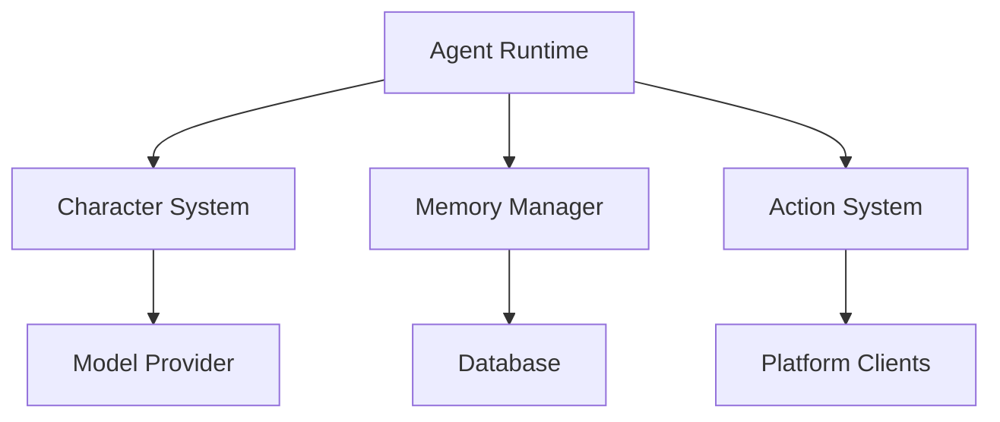
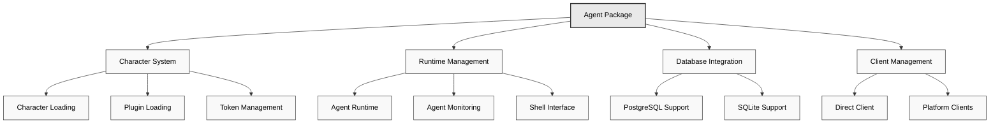
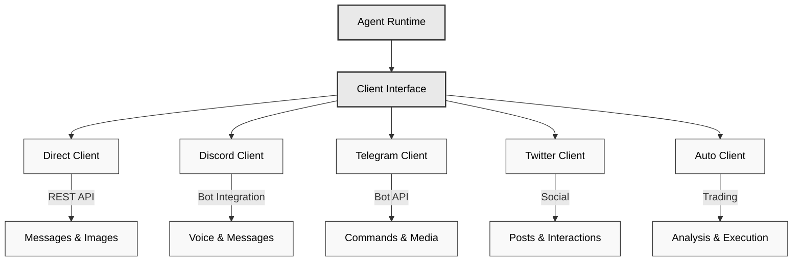
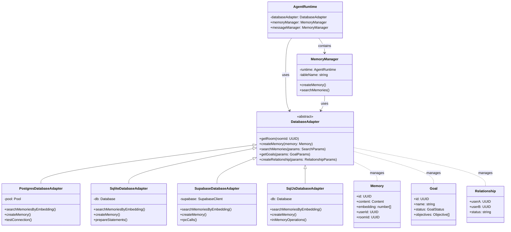
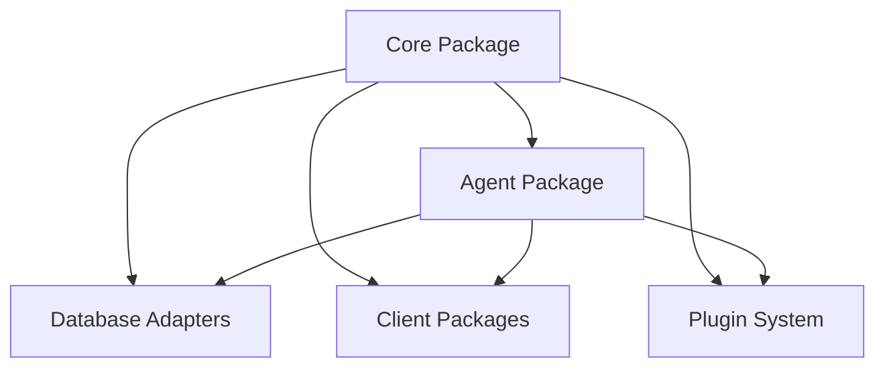

# Table of Contents
- /Users/lucaair13/Dropbox/Documents/Varie/Dev/Eliza/Eliza1/eliza/docs/docs/intro.md
- /Users/lucaair13/Dropbox/Documents/Varie/Dev/Eliza/Eliza1/eliza/docs/docs/quickstart.md
- /Users/lucaair13/Dropbox/Documents/Varie/Dev/Eliza/Eliza1/eliza/docs/docs/faq.md
- /Users/lucaair13/Dropbox/Documents/Varie/Dev/Eliza/Eliza1/eliza/docs/docs/contributing.md
- /Users/lucaair13/Dropbox/Documents/Varie/Dev/Eliza/Eliza1/eliza/docs/docs/advanced/eliza-in-tee.md
- /Users/lucaair13/Dropbox/Documents/Varie/Dev/Eliza/Eliza1/eliza/docs/docs/advanced/autonomous-trading.md
- /Users/lucaair13/Dropbox/Documents/Varie/Dev/Eliza/Eliza1/eliza/docs/docs/advanced/trust-engine.md
- /Users/lucaair13/Dropbox/Documents/Varie/Dev/Eliza/Eliza1/eliza/docs/docs/advanced/fine-tuning.md
- /Users/lucaair13/Dropbox/Documents/Varie/Dev/Eliza/Eliza1/eliza/docs/docs/advanced/infrastructure.md
- /Users/lucaair13/Dropbox/Documents/Varie/Dev/Eliza/Eliza1/eliza/docs/docs/core/characterfile.md
- /Users/lucaair13/Dropbox/Documents/Varie/Dev/Eliza/Eliza1/eliza/docs/docs/core/providers.md
- /Users/lucaair13/Dropbox/Documents/Varie/Dev/Eliza/Eliza1/eliza/docs/docs/core/evaluators.md
- /Users/lucaair13/Dropbox/Documents/Varie/Dev/Eliza/Eliza1/eliza/docs/docs/core/actions.md
- /Users/lucaair13/Dropbox/Documents/Varie/Dev/Eliza/Eliza1/eliza/docs/docs/core/agents.md
- /Users/lucaair13/Dropbox/Documents/Varie/Dev/Eliza/Eliza1/eliza/docs/docs/guides/template-configuration.md
- /Users/lucaair13/Dropbox/Documents/Varie/Dev/Eliza/Eliza1/eliza/docs/docs/guides/docker-setup.md
- /Users/lucaair13/Dropbox/Documents/Varie/Dev/Eliza/Eliza1/eliza/docs/docs/guides/local-development.md
- /Users/lucaair13/Dropbox/Documents/Varie/Dev/Eliza/Eliza1/eliza/docs/docs/guides/configuration.md
- /Users/lucaair13/Dropbox/Documents/Varie/Dev/Eliza/Eliza1/eliza/docs/docs/guides/advanced.md
- /Users/lucaair13/Dropbox/Documents/Varie/Dev/Eliza/Eliza1/eliza/docs/docs/guides/wsl.md
- /Users/lucaair13/Dropbox/Documents/Varie/Dev/Eliza/Eliza1/eliza/docs/docs/guides/secrets-management.md
- /Users/lucaair13/Dropbox/Documents/Varie/Dev/Eliza/Eliza1/eliza/docs/docs/packages/agent.md
- /Users/lucaair13/Dropbox/Documents/Varie/Dev/Eliza/Eliza1/eliza/docs/docs/packages/clients.md
- /Users/lucaair13/Dropbox/Documents/Varie/Dev/Eliza/Eliza1/eliza/docs/docs/packages/adapters.md
- /Users/lucaair13/Dropbox/Documents/Varie/Dev/Eliza/Eliza1/eliza/docs/docs/packages/plugins.md
- /Users/lucaair13/Dropbox/Documents/Varie/Dev/Eliza/Eliza1/eliza/docs/docs/packages/database-adapters.md
- /Users/lucaair13/Dropbox/Documents/Varie/Dev/Eliza/Eliza1/eliza/docs/docs/packages/packages.md
- /Users/lucaair13/Dropbox/Documents/Varie/Dev/Eliza/Eliza1/eliza/docs/docs/packages/core.md
- /Users/lucaair13/Dropbox/Documents/Varie/Dev/Eliza/Eliza1/eliza/docs/docs/packages/agents.md
- /Users/lucaair13/Dropbox/Documents/Varie/Dev/Eliza/Eliza1/eliza/docs/docs/api/typedoc-sidebar.cjs
- /Users/lucaair13/Dropbox/Documents/Varie/Dev/Eliza/Eliza1/eliza/docs/docs/api/index.md
- /Users/lucaair13/Dropbox/Documents/Varie/Dev/Eliza/Eliza1/eliza/docs/docs/api/globals.md
- /Users/lucaair13/Dropbox/Documents/Varie/Dev/Eliza/Eliza1/eliza/docs/docs/api/enumerations/Clients.md
- /Users/lucaair13/Dropbox/Documents/Varie/Dev/Eliza/Eliza1/eliza/docs/docs/api/enumerations/ModelProviderName.md
- /Users/lucaair13/Dropbox/Documents/Varie/Dev/Eliza/Eliza1/eliza/docs/docs/api/enumerations/ServiceType.md
- /Users/lucaair13/Dropbox/Documents/Varie/Dev/Eliza/Eliza1/eliza/docs/docs/api/enumerations/ModelClass.md
- /Users/lucaair13/Dropbox/Documents/Varie/Dev/Eliza/Eliza1/eliza/docs/docs/api/enumerations/GoalStatus.md
- /Users/lucaair13/Dropbox/Documents/Varie/Dev/Eliza/Eliza1/eliza/docs/docs/api/classes/DatabaseAdapter.md
- /Users/lucaair13/Dropbox/Documents/Varie/Dev/Eliza/Eliza1/eliza/docs/docs/api/classes/AgentRuntime.md
- /Users/lucaair13/Dropbox/Documents/Varie/Dev/Eliza/Eliza1/eliza/docs/docs/api/classes/MemoryManager.md
- /Users/lucaair13/Dropbox/Documents/Varie/Dev/Eliza/Eliza1/eliza/docs/docs/api/classes/Service.md
- /Users/lucaair13/Dropbox/Documents/Varie/Dev/Eliza/Eliza1/eliza/docs/docs/api/type-aliases/Plugin.md
- /Users/lucaair13/Dropbox/Documents/Varie/Dev/Eliza/Eliza1/eliza/docs/docs/api/type-aliases/Character.md
- /Users/lucaair13/Dropbox/Documents/Varie/Dev/Eliza/Eliza1/eliza/docs/docs/api/type-aliases/Model.md
- /Users/lucaair13/Dropbox/Documents/Varie/Dev/Eliza/Eliza1/eliza/docs/docs/api/type-aliases/HandlerCallback.md
- /Users/lucaair13/Dropbox/Documents/Varie/Dev/Eliza/Eliza1/eliza/docs/docs/api/type-aliases/UUID.md
- /Users/lucaair13/Dropbox/Documents/Varie/Dev/Eliza/Eliza1/eliza/docs/docs/api/type-aliases/Handler.md
- /Users/lucaair13/Dropbox/Documents/Varie/Dev/Eliza/Eliza1/eliza/docs/docs/api/type-aliases/Models.md
- /Users/lucaair13/Dropbox/Documents/Varie/Dev/Eliza/Eliza1/eliza/docs/docs/api/type-aliases/Validator.md
- /Users/lucaair13/Dropbox/Documents/Varie/Dev/Eliza/Eliza1/eliza/docs/docs/api/type-aliases/Media.md
- /Users/lucaair13/Dropbox/Documents/Varie/Dev/Eliza/Eliza1/eliza/docs/docs/api/type-aliases/Client.md
- /Users/lucaair13/Dropbox/Documents/Varie/Dev/Eliza/Eliza1/eliza/docs/docs/api/_media/README_KOR.md
- /Users/lucaair13/Dropbox/Documents/Varie/Dev/Eliza/Eliza1/eliza/docs/docs/api/_media/README_JA.md
- /Users/lucaair13/Dropbox/Documents/Varie/Dev/Eliza/Eliza1/eliza/docs/docs/api/_media/README_CN.md
- /Users/lucaair13/Dropbox/Documents/Varie/Dev/Eliza/Eliza1/eliza/docs/docs/api/_media/README_FR.md
- /Users/lucaair13/Dropbox/Documents/Varie/Dev/Eliza/Eliza1/eliza/docs/docs/api/variables/defaultCharacter.md
- /Users/lucaair13/Dropbox/Documents/Varie/Dev/Eliza/Eliza1/eliza/docs/docs/api/variables/settings.md
- /Users/lucaair13/Dropbox/Documents/Varie/Dev/Eliza/Eliza1/eliza/docs/docs/api/variables/embeddingZeroVector.md
- /Users/lucaair13/Dropbox/Documents/Varie/Dev/Eliza/Eliza1/eliza/docs/docs/api/variables/embeddingDimension.md
- /Users/lucaair13/Dropbox/Documents/Varie/Dev/Eliza/Eliza1/eliza/docs/docs/api/variables/evaluationTemplate.md
- /Users/lucaair13/Dropbox/Documents/Varie/Dev/Eliza/Eliza1/eliza/docs/docs/api/variables/elizaLogger.md
- /Users/lucaair13/Dropbox/Documents/Varie/Dev/Eliza/Eliza1/eliza/docs/docs/api/functions/generateShouldRespond.md
- /Users/lucaair13/Dropbox/Documents/Varie/Dev/Eliza/Eliza1/eliza/docs/docs/api/functions/createGoal.md
- /Users/lucaair13/Dropbox/Documents/Varie/Dev/Eliza/Eliza1/eliza/docs/docs/api/functions/composeContext.md
- /Users/lucaair13/Dropbox/Documents/Varie/Dev/Eliza/Eliza1/eliza/docs/docs/api/functions/getActorDetails.md
- /Users/lucaair13/Dropbox/Documents/Varie/Dev/Eliza/Eliza1/eliza/docs/docs/api/functions/updateGoal.md
- /Users/lucaair13/Dropbox/Documents/Varie/Dev/Eliza/Eliza1/eliza/docs/docs/api/functions/findNearestEnvFile.md
- /Users/lucaair13/Dropbox/Documents/Varie/Dev/Eliza/Eliza1/eliza/docs/docs/api/functions/formatPosts.md
- /Users/lucaair13/Dropbox/Documents/Varie/Dev/Eliza/Eliza1/eliza/docs/docs/api/functions/formatRelationships.md
- /Users/lucaair13/Dropbox/Documents/Varie/Dev/Eliza/Eliza1/eliza/docs/docs/api/functions/getModel.md
- /Users/lucaair13/Dropbox/Documents/Varie/Dev/Eliza/Eliza1/eliza/docs/docs/api/functions/getRelationships.md
- /Users/lucaair13/Dropbox/Documents/Varie/Dev/Eliza/Eliza1/eliza/docs/docs/api/functions/generateTrueOrFalse.md
- /Users/lucaair13/Dropbox/Documents/Varie/Dev/Eliza/Eliza1/eliza/docs/docs/api/functions/generateText.md
- /Users/lucaair13/Dropbox/Documents/Varie/Dev/Eliza/Eliza1/eliza/docs/docs/api/functions/composeActionExamples.md
- /Users/lucaair13/Dropbox/Documents/Varie/Dev/Eliza/Eliza1/eliza/docs/docs/api/functions/trimTokens.md
- /Users/lucaair13/Dropbox/Documents/Varie/Dev/Eliza/Eliza1/eliza/docs/docs/api/functions/formatActors.md
- /Users/lucaair13/Dropbox/Documents/Varie/Dev/Eliza/Eliza1/eliza/docs/docs/api/functions/getProviders.md
- /Users/lucaair13/Dropbox/Documents/Varie/Dev/Eliza/Eliza1/eliza/docs/docs/api/functions/getGoals.md
- /Users/lucaair13/Dropbox/Documents/Varie/Dev/Eliza/Eliza1/eliza/docs/docs/api/functions/formatMessages.md
- /Users/lucaair13/Dropbox/Documents/Varie/Dev/Eliza/Eliza1/eliza/docs/docs/api/functions/generateObject.md
- /Users/lucaair13/Dropbox/Documents/Varie/Dev/Eliza/Eliza1/eliza/docs/docs/api/functions/getEndpoint.md
- /Users/lucaair13/Dropbox/Documents/Varie/Dev/Eliza/Eliza1/eliza/docs/docs/api/functions/loadEnvConfig.md
- /Users/lucaair13/Dropbox/Documents/Varie/Dev/Eliza/Eliza1/eliza/docs/docs/api/functions/embed.md
- /Users/lucaair13/Dropbox/Documents/Varie/Dev/Eliza/Eliza1/eliza/docs/docs/api/functions/formatGoalsAsString.md
- /Users/lucaair13/Dropbox/Documents/Varie/Dev/Eliza/Eliza1/eliza/docs/docs/api/functions/formatEvaluatorExampleDescriptions.md
- /Users/lucaair13/Dropbox/Documents/Varie/Dev/Eliza/Eliza1/eliza/docs/docs/api/functions/generateCaption.md
- /Users/lucaair13/Dropbox/Documents/Varie/Dev/Eliza/Eliza1/eliza/docs/docs/api/functions/getRelationship.md
- /Users/lucaair13/Dropbox/Documents/Varie/Dev/Eliza/Eliza1/eliza/docs/docs/api/functions/addHeader.md
- /Users/lucaair13/Dropbox/Documents/Varie/Dev/Eliza/Eliza1/eliza/docs/docs/api/functions/splitChunks.md
- /Users/lucaair13/Dropbox/Documents/Varie/Dev/Eliza/Eliza1/eliza/docs/docs/api/functions/formatEvaluatorNames.md
- /Users/lucaair13/Dropbox/Documents/Varie/Dev/Eliza/Eliza1/eliza/docs/docs/api/functions/formatActionNames.md
- /Users/lucaair13/Dropbox/Documents/Varie/Dev/Eliza/Eliza1/eliza/docs/docs/api/functions/retrieveCachedEmbedding.md
- /Users/lucaair13/Dropbox/Documents/Varie/Dev/Eliza/Eliza1/eliza/docs/docs/api/functions/formatEvaluators.md
- /Users/lucaair13/Dropbox/Documents/Varie/Dev/Eliza/Eliza1/eliza/docs/docs/api/functions/formatEvaluatorExamples.md
- /Users/lucaair13/Dropbox/Documents/Varie/Dev/Eliza/Eliza1/eliza/docs/docs/api/functions/generateImage.md
- /Users/lucaair13/Dropbox/Documents/Varie/Dev/Eliza/Eliza1/eliza/docs/docs/api/functions/generateTextArray.md
- /Users/lucaair13/Dropbox/Documents/Varie/Dev/Eliza/Eliza1/eliza/docs/docs/api/functions/generateObjectArray.md
- /Users/lucaair13/Dropbox/Documents/Varie/Dev/Eliza/Eliza1/eliza/docs/docs/api/functions/formatTimestamp.md
- /Users/lucaair13/Dropbox/Documents/Varie/Dev/Eliza/Eliza1/eliza/docs/docs/api/functions/formatActions.md
- /Users/lucaair13/Dropbox/Documents/Varie/Dev/Eliza/Eliza1/eliza/docs/docs/api/functions/createRelationship.md
- /Users/lucaair13/Dropbox/Documents/Varie/Dev/Eliza/Eliza1/eliza/docs/docs/api/functions/generateMessageResponse.md
- /Users/lucaair13/Dropbox/Documents/Varie/Dev/Eliza/Eliza1/eliza/docs/docs/api/interfaces/IAgentRuntime.md
- /Users/lucaair13/Dropbox/Documents/Varie/Dev/Eliza/Eliza1/eliza/docs/docs/api/interfaces/ConversationExample.md
- /Users/lucaair13/Dropbox/Documents/Varie/Dev/Eliza/Eliza1/eliza/docs/docs/api/interfaces/Content.md
- /Users/lucaair13/Dropbox/Documents/Varie/Dev/Eliza/Eliza1/eliza/docs/docs/api/interfaces/IDatabaseAdapter.md
- /Users/lucaair13/Dropbox/Documents/Varie/Dev/Eliza/Eliza1/eliza/docs/docs/api/interfaces/Participant.md
- /Users/lucaair13/Dropbox/Documents/Varie/Dev/Eliza/Eliza1/eliza/docs/docs/api/interfaces/Evaluator.md
- /Users/lucaair13/Dropbox/Documents/Varie/Dev/Eliza/Eliza1/eliza/docs/docs/api/interfaces/IBrowserService.md
- /Users/lucaair13/Dropbox/Documents/Varie/Dev/Eliza/Eliza1/eliza/docs/docs/api/interfaces/Account.md
- /Users/lucaair13/Dropbox/Documents/Varie/Dev/Eliza/Eliza1/eliza/docs/docs/api/interfaces/State.md
- /Users/lucaair13/Dropbox/Documents/Varie/Dev/Eliza/Eliza1/eliza/docs/docs/api/interfaces/Room.md
- /Users/lucaair13/Dropbox/Documents/Varie/Dev/Eliza/Eliza1/eliza/docs/docs/api/interfaces/Goal.md
- /Users/lucaair13/Dropbox/Documents/Varie/Dev/Eliza/Eliza1/eliza/docs/docs/api/interfaces/ActionExample.md
- /Users/lucaair13/Dropbox/Documents/Varie/Dev/Eliza/Eliza1/eliza/docs/docs/api/interfaces/Actor.md
- /Users/lucaair13/Dropbox/Documents/Varie/Dev/Eliza/Eliza1/eliza/docs/docs/api/interfaces/ITranscriptionService.md
- /Users/lucaair13/Dropbox/Documents/Varie/Dev/Eliza/Eliza1/eliza/docs/docs/api/interfaces/Relationship.md
- /Users/lucaair13/Dropbox/Documents/Varie/Dev/Eliza/Eliza1/eliza/docs/docs/api/interfaces/Memory.md
- /Users/lucaair13/Dropbox/Documents/Varie/Dev/Eliza/Eliza1/eliza/docs/docs/api/interfaces/Provider.md
- /Users/lucaair13/Dropbox/Documents/Varie/Dev/Eliza/Eliza1/eliza/docs/docs/api/interfaces/IMemoryManager.md
- /Users/lucaair13/Dropbox/Documents/Varie/Dev/Eliza/Eliza1/eliza/docs/docs/api/interfaces/Objective.md
- /Users/lucaair13/Dropbox/Documents/Varie/Dev/Eliza/Eliza1/eliza/docs/docs/api/interfaces/IPdfService.md
- /Users/lucaair13/Dropbox/Documents/Varie/Dev/Eliza/Eliza1/eliza/docs/docs/api/interfaces/IVideoService.md
- /Users/lucaair13/Dropbox/Documents/Varie/Dev/Eliza/Eliza1/eliza/docs/docs/api/interfaces/ISpeechService.md
- /Users/lucaair13/Dropbox/Documents/Varie/Dev/Eliza/Eliza1/eliza/docs/docs/api/interfaces/MessageExample.md
- /Users/lucaair13/Dropbox/Documents/Varie/Dev/Eliza/Eliza1/eliza/docs/docs/api/interfaces/IImageDescriptionService.md
- /Users/lucaair13/Dropbox/Documents/Varie/Dev/Eliza/Eliza1/eliza/docs/docs/api/interfaces/Action.md
- /Users/lucaair13/Dropbox/Documents/Varie/Dev/Eliza/Eliza1/eliza/docs/docs/api/interfaces/EvaluationExample.md
- /Users/lucaair13/Dropbox/Documents/Varie/Dev/Eliza/Eliza1/eliza/docs/docs/api/interfaces/ITextGenerationService.md

## File: /Users/lucaair13/Dropbox/Documents/Varie/Dev/Eliza/Eliza1/eliza/docs/docs/intro.md

- Extension: .md
- Language: markdown
- Size: 3616 bytes
- Created: 2024-12-20 15:02:07
- Modified: 2024-12-20 15:00:38

### Code

```markdown
---
sidebar_position: 1
---

# Introduction to Eliza


_As seen powering [@DegenSpartanAI](https://x.com/degenspartanai) and [@MarcAIndreessen](https://x.com/pmairca)_

## What is Eliza?

Eliza is a powerful multi-agent simulation framework designed to create, deploy, and manage autonomous AI agents. Built with TypeScript, it provides a flexible and extensible platform for developing intelligent agents that can interact across multiple platforms while maintaining consistent personalities and knowledge.

## Key Features

### Core Capabilities

- **Multi-Agent Architecture**: Deploy and manage multiple unique AI personalities simultaneously
- **Character System**: Create diverse agents using the [characterfile](https://github.com/lalalune/characterfile/) framework
- **Memory Management**: Advanced RAG (Retrieval Augmented Generation) system for long-term memory and context awareness
- **Platform Integration**: Seamless connectivity with Discord, Twitter, and other platforms

### Communication & Media

- **Multi-Platform Support**:

  - Full-featured Discord integration with voice channel support
  - Twitter/X bot capabilities
  - Telegram integration
  - Direct API access

- **Media Processing**:
  - PDF document reading and analysis
  - Link content extraction and summarization
  - Audio transcription
  - Video content processing
  - Image analysis and description
  - Conversation summarization

### AI & Technical Features

- **Flexible Model Support**:

  - Local inference with open-source models
  - Cloud-based inference through OpenAI
  - Default configuration with Nous Hermes Llama 3.1B
  - Integration with Claude for complex queries

- **Technical Foundation**:
  - 100% TypeScript implementation
  - Modular architecture
  - Extensible action system
  - Custom client support
  - Comprehensive API

## Use Cases

Eliza can be used to create:

1. **AI Assistants**

   - Customer support agents
   - Community moderators
   - Personal assistants

2. **Social Media Personas**

   - Automated content creators
   - Engagement bots
   - Brand representatives

3. **Knowledge Workers**

   - Research assistants
   - Content analysts
   - Document processors

4. **Interactive Characters**
   - Role-playing characters
   - Educational tutors
   - Entertainment bots

## Getting Started

Eliza is designed to be accessible while maintaining powerful capabilities:

- **Quick Start**: Begin with basic configuration and default character
- **Customization**: Extend functionality through custom actions and clients
- **Scaling**: Deploy multiple agents with different personalities
- **Integration**: Connect to various platforms and services

Check out our [Quickstart Guide](./quickstart.md) to begin your journey with Eliza.

## Architecture Overview



## Community and Support

Eliza is backed by an active community of developers and users:

- **Open Source**: Contribute to the project on [GitHub](https://github.com/ai16z/eliza)
- **Documentation**: Comprehensive guides and API references
- **Examples**: Ready-to-use character templates and implementations
- **Support**: Active community for troubleshooting and discussion

## Next Steps

- [Create Your First Agent](../quickstart)
- [Understand Core Concepts](../core/agents)
- [Explore Advanced Features](./guides/advanced.md)

Join us in building the future of autonomous AI agents with Eliza!

```

## File: /Users/lucaair13/Dropbox/Documents/Varie/Dev/Eliza/Eliza1/eliza/docs/docs/quickstart.md

- Extension: .md
- Language: markdown
- Size: 8940 bytes
- Created: 2024-12-20 15:02:05
- Modified: 2024-12-20 15:00:38

### Code

```markdown
---
sidebar_position: 2
---

# Quickstart Guide

## Prerequisites

Before getting started with Eliza, ensure you have:
- [Node.js 23+](https://docs.npmjs.com/downloading-and-installing-node-js-and-npm)
- [pnpm 9+](https://pnpm.io/installation)
- Git for version control
- A code editor ([VS Code](https://code.visualstudio.com/) or [VSCodium](https://vscodium.com) recommended)
- [CUDA Toolkit](https://developer.nvidia.com/cuda-toolkit) (optional, for GPU acceleration)

## Installation

1. **Clone and Install**

   Please be sure to check what the [latest available stable version tag](https://github.com/ai16z/eliza/tags) is.

   Clone the repository

   ```bash
   git clone https://github.com/ai16z/eliza.git
   ```

   Enter directory

   ```bash
   cd eliza
   ```

   Switch to latest tagged release

   ```bash
    # Checkout the latest release
    # This project iterates fast, so we recommend checking out the latest release
    git checkout $(git describe --tags --abbrev=0)
   ```

   Install dependencies (on initial run)

   ```bash
   pnpm install --no-frozen-lockfile
   ```

   # Quickstart Guide Update

**Important Note on pnpm Lockfile Management**

By default, the `pnpm` lockfile will not be updated during installations based off of .npmrc frozen-lockfile=true. To update the lockfile, you need to run the command:

```bash
pnpm install --no-frozen-lockfile
```

Please only use this command when you initially instantiating the repo or are bumping the version of a package or adding a new package to your package.json. This practice helps maintain consistency in your project's dependencies and prevents unintended changes to the lockfile.

   Build the local libraries

   ```bash
   pnpm build
   ```

2. **Configure Environment**

   Copy example environment file

   ```bash
   cp .env.example .env
   ```

   Edit `.env` and add your values:

   ```bash
   # Suggested quickstart environment variables
   DISCORD_APPLICATION_ID=  # For Discord integration
   DISCORD_API_TOKEN=      # Bot token
   HEURIST_API_KEY=       # Heurist API key for LLM and image generation
   OPENAI_API_KEY=        # OpenAI API key
   GROK_API_KEY=          # Grok API key
   ELEVENLABS_XI_API_KEY= # API key from elevenlabs (for voice)
   ```

## Choose Your Model

Eliza supports multiple AI models:

- **Heurist**: Set `modelProvider: "heurist"` in your character file. Most models are uncensored.
  - LLM: Select available LLMs [here](https://docs.heurist.ai/dev-guide/supported-models#large-language-models-llms) and configure `SMALL_HEURIST_MODEL`,`MEDIUM_HEURIST_MODEL`,`LARGE_HEURIST_MODEL`
  - Image Generation: Select available Stable Diffusion or Flux models [here](https://docs.heurist.ai/dev-guide/supported-models#image-generation-models) and configure `HEURIST_IMAGE_MODEL` (default is FLUX.1-dev)
- **Llama**: Set `XAI_MODEL=meta-llama/Meta-Llama-3.1-70B-Instruct-Turbo`
- **Grok**: Set `XAI_MODEL=grok-beta`
- **OpenAI**: Set `XAI_MODEL=gpt-4o-mini` or `gpt-4o`

You set which model to use inside the character JSON file

### Local inference

    #### For llama_local inference:

      1. Set `XAI_MODEL` to your chosen model
      2. Leave `X_SERVER_URL` and `XAI_API_KEY` blank
      3. The system will automatically download the model from Hugging Face
      4. `LOCAL_LLAMA_PROVIDER` can be blank

      Note: llama_local requires a GPU, it currently will not work with CPU inference

    #### For Ollama inference:

      - If `OLLAMA_SERVER_URL` is left blank, it defaults to `localhost:11434`
      - If `OLLAMA_EMBEDDING_MODE` is left blank, it defaults to `mxbai-embed-large`

## Create Your First Agent

1. **Create a Character File**

   Check out `characters/trump.character.json` or `characters/tate.character.json` as a template you can use to copy and customize your agent's personality and behavior.
   Additionally you can read `core/src/core/defaultCharacter.ts` (in 0.0.10 but post-refactor will be in `packages/core/src/defaultCharacter.ts`)

   📝 [Character Documentation](./core/characterfile.md)

2. **Start the Agent**

   Inform it which character you want to run:

   ```bash
   pnpm start --character="characters/trump.character.json"
   ```

   You can also load multiple characters with the characters option with a comma separated list:

   ```bash
   pnpm start --characters="characters/trump.character.json,characters/tate.character.json"
   ```

3. **Interact with the Agent**

   Now you're ready to start a conversation with your agent!
   Open a new terminal window

   ```bash
   pnpm start:client
   ```

   Once the client is running, you'll see a message like this:
```
➜  Local:   http://localhost:5173/
```

   Simply click the link or open your browser to `http://localhost:5173/`. You'll see the chat interface connect to the system, and you can begin interacting with your character.

## Platform Integration

### Discord Bot Setup

1. Create a new application at [Discord Developer Portal](https://discord.com/developers/applications)
2. Create a bot and get your token
3. Add bot to your server using OAuth2 URL generator
4. Set `DISCORD_API_TOKEN` and `DISCORD_APPLICATION_ID` in your `.env`

### Twitter Integration

Add to your `.env`:

```bash
TWITTER_USERNAME=  # Account username
TWITTER_PASSWORD=  # Account password
TWITTER_EMAIL=    # Account email
TWITTER_COOKIES=  # Account cookies (auth_token and CT0)
```

Example for TWITTER_COOKIES

The TWITTER_COOKIES variable should be a JSON string containing the necessary cookies. You can find these cookies in your web browser's developer tools. Here is an example format:

```bash
TWITTER_COOKIES='[{"key":"auth_token","value":"your token","domain":".twitter.com"},
  {"key":"ct0","value":"your ct0","domain":".twitter.com"},
  {"key":"guest_id","value":"your guest_id","domain":".twitter.com"}]'
```

### Telegram Bot

1. Create a bot
2. Add your bot token to `.env`:

```bash
TELEGRAM_BOT_TOKEN=your_token_here
```

## Optional: GPU Acceleration

If you have an NVIDIA GPU:

```bash
# Install CUDA support
npx --no node-llama-cpp source download --gpu cuda

# Ensure CUDA Toolkit, cuDNN, and cuBLAS are installed
```

## Basic Usage Examples

### Chat with Your Agent

```bash
# Start chat interface
pnpm start
```

### Run Multiple Agents

```bash
pnpm start --characters="characters/trump.character.json,characters/tate.character.json"
```

## Common Issues & Solutions

1. **Node.js Version**

   - Ensure Node.js 23.3.0 is installed
   - Use `node -v` to check version
   - Consider using [nvm](https://github.com/nvm-sh/nvm) to manage Node versions

2. **Sharp Installation**
   If you see Sharp-related errors:

   ```bash
   pnpm install --include=optional sharp
   ```

3. **CUDA Setup**

   - Verify CUDA Toolkit installation
   - Check GPU compatibility with toolkit
   - Ensure proper environment variables are set

4. **Exit Status 1**
   If you see

   ```
   triggerUncaughtException(
   ^
   [Object: null prototype] {
   [Symbol(nodejs.util.inspect.custom)]: [Function: [nodejs.util.inspect.custom]]
   }
   ```

   You can try these steps, which aim to add `@types/node` to various parts of the project

   ```
   # Add dependencies to workspace root
   pnpm add -w -D ts-node typescript @types/node

   # Add dependencies to the agent package specifically
   pnpm add -D ts-node typescript @types/node --filter "@ai16z/agent"

   # Also add to the core package since it's needed there too
   pnpm add -D ts-node typescript @types/node --filter "@ai16z/eliza"

   # First clean everything
   pnpm clean

   # Install all dependencies recursively
   pnpm install -r

   # Build the project
   pnpm build

   # Then try to start
   pnpm start
   ```

5. **Better sqlite3 was compiled against a different Node.js version**
   If you see

   ```
   Error starting agents: Error: The module '.../eliza-agents/dv/eliza/node_modules/better-sqlite3/build/Release/better_sqlite3.node'
   was compiled against a different Node.js version using
   NODE_MODULE_VERSION 131. This version of Node.js requires
   NODE_MODULE_VERSION 127. Please try re-compiling or re-installing
   ```

   You can try this, which will attempt to rebuild better-sqlite3.

   ```bash
   pnpm rebuild better-sqlite3
   ```

   If that doesn't work, try clearing your node_modules in the root folder

   ```bash
   rm -fr node_modules; pnpm store prune
   ```

   Then reinstall the requirements

   ```bash
   pnpm i
   ```

## Next Steps

Once you have your agent running, explore:

1. 🤖 [Understand Agents](./core/agents.md)
2. 📝 [Create Custom Characters](./core/characterfile.md)
3. ⚡ [Add Custom Actions](./core/actions.md)
4. 🔧 [Advanced Configuration](./guides/configuration.md)

For detailed API documentation, troubleshooting, and advanced features, check out our [full documentation](https://ai16z.github.io/eliza/).

Join our [Discord community](https://discord.gg/ai16z) for support and updates!

```

## File: /Users/lucaair13/Dropbox/Documents/Varie/Dev/Eliza/Eliza1/eliza/docs/docs/faq.md

- Extension: .md
- Language: markdown
- Size: 8514 bytes
- Created: 2024-12-20 15:02:05
- Modified: 2024-12-20 15:00:38

### Code

```markdown
# Frequently Asked Questions

## Eliza FAQ

### What is Eliza?

**Eliza is an open-source, multi-agent simulation framework for creating and managing autonomous AI agents.** The project aims to empower developers and users to build unique AI personalities that can interact across various platforms, such as Discord, Twitter, and Telegram.

### Who is behind Eliza?

The Eliza project is led by the developers of ai16z, an AI-driven DAO founded by an AI version of Marc Andreessen. The lead developer is [Shaw](https://x.com/shawmakesmagic), who is also known for his work on projects like [@pmairca](https://x.com/pmairca) and [@degenspartanai](https://x.com/degenspartanai). The project is open source, and its code is available on GitHub: https://github.com/ai16z/eliza

### How can I get started with Eliza?

To begin building your own AI agents with Eliza, follow these steps:

1.  **Install Python, Node.js and pnpm**: Ensure you have the necessary software prerequisites installed on your system. We use node v23.
2.  **Set up your environment**: Create a `.env` file and populate it with the required API keys, database configuration, and platform-specific tokens.
3.  **Install Eliza**: Use the command `npm install @ai16z/eliza` or `pnpm add @ai16z/eliza` to install the Eliza package.
4.  **Configure your database**: Eliza currently relies on Supabase for local development. Follow the instructions in the documentation to set up your Supabase project and database.
5.  **Define your agent's character**: Create a character file using the provided JSON format to specify your agent's personality, knowledge, and behavior.
6.  **Run Eliza locally**: Use the provided commands to start the Eliza framework and interact with your agent.

### What are the key components of Eliza?

Eliza's architecture consists of several interconnected components:

- **Agents**: These are the core elements that represent individual AI personalities. Agents operate within a runtime environment and interact with various platforms.
- **Actions**: Actions are predefined behaviors that agents can execute in response to messages, enabling them to perform tasks and interact with external systems.
- **Clients**: Clients act as interfaces between agents and specific platforms, such as Discord, Twitter, and Telegram. They handle platform-specific message formats and communication protocols.
- **Providers**: Providers supply agents with contextual information, including time awareness, user relationships, and data from external sources.
- **Evaluators**: These modules assess and extract information from conversations, helping agents track goals, build memory, and maintain context awareness.
- **Character Files**: These JSON files define the personality, knowledge, and behavior of each AI agent.
- **Memory System**: Eliza features a sophisticated memory management system that utilizes vector embeddings and relational database storage to store and retrieve information for agents.

### How can I contribute to the Eliza project?

Eliza welcomes contributions from individuals with a wide range of skills:

#### Technical Contributions

- **Develop new actions, clients, providers, and evaluators**: Extend Eliza's functionality by creating new modules or enhancing existing ones.
- **Contribute to database management**: Improve or expand Eliza's database capabilities using PostgreSQL, SQLite, or SQL.js.
- **Enhance local development workflows**: Improve documentation and tools for local development using SQLite and VS Code.
- **Fine-tune models**: Optimize existing models or implement new models for specific tasks and personalities.
- **Contribute to the autonomous trading system and trust engine**: Leverage expertise in market analysis, technical analysis, and risk management to enhance these features.

#### Non-Technical Contributions

- **Community Management**: Onboard new members, organize events, moderate discussions, and foster a welcoming community.
- **Content Creation**: Create memes, tutorials, documentation, and videos to share project updates.
- **Translation**: Translate documentation and other materials to make Eliza accessible to a global audience.
- **Domain Expertise**: Provide insights and feedback on specific applications of Eliza in various fields.

### What are the future plans for Eliza?

The Eliza project is continuously evolving, with ongoing development and community contributions. The team is actively working on:

- **Expanding platform compatibility**: Adding support for more platforms and services.
- **Improving model capabilities**: Enhance agent performance and capabilities with existing and new models.
- **Enhancing the trust engine**: Provide robust and secure recommendations within decentralized networks.
- **Fostering community growth**: Rewarding contributions to expand the project's reach and impact.

---

## ai16z FAQ

### What is ai16z and how is it related to Eliza?

**ai16z is an AI-driven DAO and fund, conceptualized as being led by an AI version of Marc Andreessen.** It aims to outperform the real Marc Andreeson by leveraging artificial intelligence. The developers of Eliza created ai16z to support their work in autonomous AI agents. While ai16z primarily focuses on trading, Eliza is a more general-purpose framework that can be used for various applications beyond finance.

### When will token is mintable be fixed?

Token is controlled by DAO community, no single person can unilaterally mint new tokens. The daos.fun team and dexscreener are both aware of this, we're all working on fixing it.

### Liquidity seems low

The DAOs.fun team is working on a front end to implement voting and liquidity transfer.

### What is the difference between $ai16z and $degenai?

The $ai16z token is the governance token of the ai16z DAO. Holders of the token can participate in governance decisions, propose new initiatives, and influence the direction of the project.

DegenSpartanAI is another AI agent project created by Shaw. The $degenai token is associated with this project. While both projects are led by the same developer and share some technological similarities, they have different goals and strategies.

ai16z is envisioned as a community-driven, PvE (player versus environment) focused fund, while DegenAI is more of a trading agent with a PvP (player versus player), aggressive approach.

### Will the agent launch pump fund coins?

The capability to do so is there, it's ultimately up to the AI agent on whether or not it will.

### Can the agent invest in my project?

Yes, if you make a convincing argument.

### Who runs ai16z?

ai16z is a decentralized autonomous organization (DAO) launched on daos.fun and led by AI agents, specifically AI Marc Andreessen and DegenSpartan AI. Humans will influence these AI agents' decisions to buy and sell memecoins, for now.

### Do all trade suggestions happen in one place?

Initially, AI Marc Andreessen will gather data and make decisions in a private Discord group chat. Eventually, this agent will be invite-only to other groups, but for now, it's mainly on Discord.

### What happens when people copy the GitHub?

Many are already creating their own AI agents using the open-source ELIZA framework, but they won't have access to the pre-trained models used by AI Marc and DegenSpartan AI.

### What are the future plans for ai16z?

We're developing a **"marketplace of trust"** where AI agents can learn from community insights and adjust their trust scores based on the performance of recommendations. Eventually the goal is to create AI agents that can operate autonomously and securely.

### How can I contribute to ai16z?

There are several ways to contribute to the ai16z project:

- **Participate in community discussions**: Share your memecoin insights, propose new ideas, and engage with other community members.
- **Contribute to the development of the ai16z platform**: https://github.com/orgs/ai16z/projects/1/views/3
- **Help build the ai16z ecosystem**: Create applicatoins / tools, resources, and memes. Give feedback, and spread the word

**Other questions:**

- ai16z and a16z are not officially affiliated.
- ELIZA is an open-source conversational agent framework.
- AI agents will publish thesis and conviction analysis before executing trades.
- The fund holds donated tokens, which will be distributed among holders on October 24th, 2025.
- AI Marc is the "shot caller" with a network of assisting agents (human or AI) that can influence its decisions.

```

## File: /Users/lucaair13/Dropbox/Documents/Varie/Dev/Eliza/Eliza1/eliza/docs/docs/contributing.md

- Extension: .md
- Language: markdown
- Size: 5848 bytes
- Created: 2024-12-20 15:02:06
- Modified: 2024-12-20 15:00:38

### Code

```markdown
# Contributing to Eliza

First off, thank you for considering contributing to Eliza! We welcome contributions from everyone, regardless of experience level.

## Contribution License Agreement

By contributing to Eliza, you agree that your contributions will be licensed under the MIT License. This means:

1. You grant us (and everyone else) a perpetual, worldwide, non-exclusive, royalty-free license to use your contributions.
2. Your contributions are and will be available as Free and Open Source Software (FOSS).
3. You have the right to submit the work under this license.
4. You understand that your contributions are public and that a record of the contribution is maintained indefinitely.

## The OODA Loop: A Framework for Contribution

We believe in the power of the OODA Loop - a decision-making framework that emphasizes speed and adaptability. OODA stands for:

-   **Observe**: Gather information and insights about the project, the community, and the broader AI ecosystem.
-   **Orient**: Analyze your observations to identify opportunities for contribution and improvement.
-   **Decide**: Choose a course of action based on your analysis. This could be proposing a new feature, fixing a bug, or creating content.
-   **Act**: Execute your decision and share your work with the community.

## How to Contribute

### For Developers

1. **Extend Eliza's Capabilities**

    - Develop new actions, evaluators, and providers
    - Improve existing components and modules

2. **Enhance Infrastructure**

    - Review open issues and submit PRs
    - Test and update documentation
    - Optimize performance
    - Improve deployment solutions

3. Fork the repo and create your branch from `main`.
    1. The name of the branch should start with the issue number and be descriptive of the changes you are making.
    1. eg. 40--add-test-for-bug-123
4. If you've added code that should be tested, add tests.
5. Ensure the test suite passes.
6. Make sure your code lints.
7. Issue that pull request!

## Styleguides

### Git Commit Messages

-   Use the present tense ("Add feature" not "Added feature")
-   Use the imperative mood ("Move cursor to..." not "Moves cursor to...")
-   Limit the first line to 72 characters or less
-   Reference issues and pull requests liberally after the first line

### JavaScript Styleguide

-   All JavaScript must adhere to [JavaScript Standard Style](https://standardjs.com/).

### TypeScript Styleguide

-   All TypeScript must adhere to [TypeScript Standard Style](https://github.com/standard/ts-standard).

### Documentation Styleguide

-   Use [Markdown](https://daringfireball.net/projects/markdown/) for documentation.

## Additional Notes

### Issue and Pull Request Labels

This section lists the labels we use to help us track and manage issues and pull requests.

-   `bug` - Issues that are bugs.
-   `enhancement` - Issues that are feature requests.
-   `documentation` - Issues or pull requests related to documentation.
-   `good first issue` - Good for newcomers.

## Getting Help

-   Join [Discord](https://discord.gg/ai16z)
-   Check [FAQ](docs/community/faq.md)
-   Create GitHub issues

## Additional Resources

-   [Local Development Guide](docs/guides/local-development.md)
-   [Configuration Guide](docs/guides/configuration.md)
-   [API Documentation](docs/api)

## Contributor Guide

Welcome to the Eliza contributor guide! This document is designed to help you understand how you can be part of building the future of autonomous AI agents, regardless of your technical background.

### Code of Conduct

#### Our Pledge

In the interest of fostering an open and welcoming environment, we as contributors and maintainers pledge to make participation in our project and our community a harassment-free experience for everyone, regardless of age, body size, disability, ethnicity, sex characteristics, gender identity and expression, level of experience, education, socio-economic status, nationality, personal appearance, race, religion, or sexual identity and orientation.

#### Our Standards

Examples of behavior that contributes to creating a positive environment include:

-   Using welcoming and inclusive language
-   Being respectful of differing viewpoints and experiences
-   Gracefully accepting constructive criticism
-   Focusing on what is best for the community
-   Showing empathy towards other community members

Examples of unacceptable behavior include:

-   The use of sexualized language or imagery and unwelcome sexual attention or advances
-   Trolling, insulting/derogatory comments, and personal or political attacks
-   Public or private harassment
-   Publishing others' private information without explicit permission
-   Other conduct which could reasonably be considered inappropriate in a professional setting

#### Our Responsibilities

Project maintainers are responsible for clarifying the standards of acceptable behavior and are expected to take appropriate and fair corrective action in response to any instances of unacceptable behavior.

Project maintainers have the right and responsibility to remove, edit, or reject comments, commits, code, wiki edits, issues, and other contributions that are not aligned to this Code of Conduct, or to ban temporarily or permanently any contributor for other behaviors that they deem inappropriate, threatening, offensive, or harmful.

#### Scope

This Code of Conduct applies both within project spaces and in public spaces when an individual is representing the project or its community. Examples of representing a project or community include using an official project e-mail address, posting via an official social media account, or acting as an appointed representative at an online or offline event.

Thank you for contributing to Eliza and helping build the future of autonomous AI agents! 🎉

```

## File: /Users/lucaair13/Dropbox/Documents/Varie/Dev/Eliza/Eliza1/eliza/docs/docs/advanced/eliza-in-tee.md

- Extension: .md
- Language: markdown
- Size: 13838 bytes
- Created: 2024-12-20 15:02:54
- Modified: 2024-12-20 15:00:38

### Code

```markdown
---
sidebar_position: 17
---

# 🫖 Eliza in TEE


## Overview

The Eliza agent can be deployed in a TEE environment to ensure the security and privacy of the agent's data. This guide will walk you through the process of setting up and running an Eliza agent in a TEE environment by utilizing the TEE Plugin in the Eliza Framework.

### Background

The TEE Plugin in the Eliza Framework is built on top of the [Dstack SDK](https://github.com/Dstack-TEE/dstack), which is designed to simplify the steps for developers to deploy programs to CVM (Confidential VM), and to follow the security best practices by default. The main features include:

- Convert any docker container to a CVM image to deploy on supported TEEs
- Remote Attestation API and a chain-of-trust visualization on Web UI
- Automatic RA-HTTPS wrapping with content addressing domain on 0xABCD.dstack.host
- Decouple the app execution and state persistent from specific hardware with decentralized Root-of-Trust

---

## Core Components

Eliza's TEE implementation consists of two primary providers that handle secure key managementoperations and remote attestations.

These components work together to provide:

1. Secure key derivation within the TEE
2. Verifiable proof of TEE execution
3. Support for both development (simulator) and production environments

The providers are typically used together, as seen in the wallet key derivation process where each derived key includes an attestation quote to prove it was generated within the TEE environment.

---

### Derive Key Provider

The DeriveKeyProvider enables secure key derivation within TEE environments. It supports:

- Multiple TEE modes:
  - `LOCAL`: Connects to simulator at `localhost:8090` for local development on Mac/Windows
  - `DOCKER`: Connects to simulator via `host.docker.internal:8090` for local development on Linux
  - `PRODUCTION`: Connects to actual TEE environment when deployed to the [TEE Cloud](https://teehouse.vercel.app)

Key features:

- Support to deriveEd25519 (Solana) and ECDSA (EVM) keypairs
- Generates deterministic keys based on a secret salt and agent ID
- Includes remote attestation for each derived key
- Supports raw key derivation for custom use cases

Example usage:

```typescript
const provider = new DeriveKeyProvider(teeMode);
// For Solana
const { keypair, attestation } = await provider.deriveEd25519Keypair(
    "/",
    secretSalt,
    agentId
);
// For EVM
const { keypair, attestation } = await provider.deriveEcdsaKeypair(
    "/",
    secretSalt,
    agentId
);
```

---

### Remote Attestation Provider

The RemoteAttestationProvider handles TEE environment verification and quote generation. It:

- Connects to the same TEE modes as DeriveKeyProvider
- Generates TDX quotes with replay protection (RTMRs)
- Provides attestation data that can be verified by third parties

Key features:

- Generates attestation quotes with custom report data
- Includes timestamp for quote verification
- Supports both simulator and production environments

Example usage:

```typescript
const provider = new RemoteAttestationProvider(teeMode);
const quote = await provider.generateAttestation(reportData);
```

## Tutorial

---

### Prerequisites

Before getting started with Eliza, ensure you have:

- [Docker Desktop](https://www.docker.com/products/docker-desktop/) or [Orbstack](https://orbstack.dev/) (Orbstack is recommended)
- For Mac/Windows: Check the prerequisites from [Quickstart Guide](./quickstart.md)
- For Linux: You just need Docker

---

### Environment Setup

To set up your environment for TEE development:

1. **Configure TEE Mode**

   Set the `TEE_MODE` environment variable to one of:

   ```env
   # For Mac/Windows local development
   TEE_MODE=LOCAL

   # For Linux/Docker local development
   TEE_MODE=DOCKER

   # For production deployment
   TEE_MODE=PRODUCTION
   ```

2. **Set Required Environment Variables**

    ```env
    # Required for key derivation
    WALLET_SECRET_SALT=your_secret_salt
    ```

3. **Start the TEE Simulator**

    ```bash
    docker pull phalanetwork/tappd-simulator:latest
    # by default the simulator is available in localhost:8090
    docker run --rm -p 8090:8090 phalanetwork/tappd-simulator:latest
    ```

### Run an Eliza Agent Locally with TEE Simulator

1. **Configure Eliza Agent**

   Go through the [configuration guide](./configuration.md) to set up your Eliza agent.
2. **Start the TEE Simulator**
   Follow the simulator setup instructions above based on your TEE mode.

3. **For Mac/Windows**

   Make sure to set the `TEE_MODE` environment variable to `LOCAL`. Then you can install the dependencies and run the agent locally:

   ```bash
   pnpm i
   pnpm build
   pnpm start --character=./characters/yourcharacter.character.json
   ```

4. **Verify TEE Attestation**

   You can verify the TEE attestation quote by going to the [TEE RA Explorer](https://ra-quote-explorer.vercel.app/) and pasting the attestation quote from the agent logs. Here's an example of interacting with the Eliza agent to ask for the agent's wallet address:

   ```bash
   You: what's your wallet address?
   ```

   Log output from the agent:

    ```bash
    Generating attestation for:  {"agentId":"025e0996-69d7-0dce-8189-390e354fd1c1","publicKey":"9yZBmCRRFEBtA3KYokxC24igv1ijFp6tyvzKxRs3khTE"}
    rtmr0: a4a17452e7868f62f77ea2039bd2840e7611a928c26e87541481256f57bfbe3647f596abf6e8f6b5a0e7108acccc6e89
    rtmr1: db6bcc74a3ac251a6398eca56b2fcdc8c00a9a0b36bc6299e06fb4bb766cb9ecc96de7e367c56032c7feff586f9e557e
    rtmr2: 2cbe156e110b0cc4b2418600dfa9fb33fc60b3f04b794ec1b8d154b48f07ba8c001cd31f75ca0d0fb516016552500d07
    rtmr3: eb7110de9956d7b4b1a3397f843b39d92df4caac263f5083e34e3161e4d6686c46c3239e7fbf61241a159d8da6dc6bd1f
    Remote attestation quote:  {
    quote: '0x0400030081000000736940f888442c8ca8cb432d7a87145f9b7aeab1c5d129ce901716a7506375426ea8741ca69be68e92c5df29f539f103eb60ab6780c56953b0d81af523a031617b32d5e8436cceb019177103f4aceedbf114a846baf8e8e2b8e6d3956e96d6b89d94a0f1a366e6c309d77c77c095a13d2d5e2f8e2d7f51ece4ae5ffc5fe8683a37387bfdb9acb8528f37342360abb64ec05ff438f7e4fad73c69a627de245a31168f69823883ed8ba590c454914690946b7b07918ded5b89dc663c70941f8704978b91a24b54d88038c30d20d14d85016a524f7176c7a7cff7233a2a4405da9c31c8569ac3adfe5147bdb92faee0f075b36e8ce794aaf596facd881588167fbcf5a7d059474c1e4abff645bba8a813f3083c5a425fcc88cd706b19494dedc04be2bc3ab1d71b2a062ddf62d0393d8cb421393cccc932a19d43e315a18a10d216aea4a1752cf3f3b0b2fb36bea655822e2b27c6156970d18e345930a4a589e1850fe84277e0913ad863dffb1950fbeb03a4a17452e7868f62f77ea2039bd2840e7611a928c26e87541481256f57bfbe3647f596abf6e8f6b5a0e7108acccc6e89db6bcc74a3ac251a6398eca56b2fcdc8c00a9a0b36bc6299e06fb4bb766cb9ecc96de7e367c56032c7feff586f9e557e2cbe156e110b0cc4b2418600dfa9fb33fc60b3f04b794ec1b8d154b48f07ba8c001cd31f75ca0d0fb516016552500d07eb7110de9956d7b4b1a3397f843b39d92df4caac263f5083e34e3161e4d6686c46c3239e7fbf61241a159d8da6dc6bd13df734883d4d0d78d670a1d17e28ef09dffbbfbd15063b73113cb5bed692d68cc30c38cb9389403fe6a1c32c35dbac75464b77597e27b854839db51dfde0885462020000530678b9eb99d1b9e08a6231ef00055560f7d3345f54ce355da68725bb38cab0caf84757ddb93db87577758bb06de7923c4ee3583453f284c8b377a1ec2ef613491e051c801a63da5cb42b9c12e26679fcf489f3b14bd5e8f551227b09d976975e0fbd68dcdf129110a5ca8ed8d163dafb60e1ec4831d5285a7fbae81d0e39580000dc010000ebb282d5c6aca9053a21814e9d65a1516ebeaacf6fc88503e794d75cfc5682e86aa04e9d6e58346e013c5c1203afc5c72861e2a7052afcdcb3ddcccd102dd0daeb595968edb6a6c513db8e2155fc302eeca7a34c9ba81289d6941c4c813db9bf7bd0981d188ab131e5ae9c4bb831e4243b20edb7829a6a7a9cf0eae1214b450109d990e2c824c2a60a47faf90c24992583bc5c3da3b58bd8830a4f0ad5c650aa08ae0e067d4251d251e56d70972ad901038082ee9340f103fd687ec7d91a9b8b8652b1a2b7befb4cbfdb6863f00142e0b2e67198ddc8ddbe96dc02762d935594394f173114215cb5abcf55b9815eb545683528c990bfae34c34358dbb19dfc1426f56cba12af325d7a2941c0d45d0ea4334155b790554d3829e3be618eb1bfc6f3a06f488bbeb910b33533c6741bff6c8a0ca43eb2417eec5ecc2f50f65c3b40d26174376202915337c7992cdd44471dee7a7b2038605415a7af593fd9066661e594b26f4298baf6d001906aa8fc1c460966fbc17b2c35e0973f613399936173802cf0453a4e7d8487b6113a77947eef190ea8d47ba531ce51abf5166448c24a54de09d671fd57cbd68154f5995aee6c2ccfd6738387cf3ad9f0ad5e8c7d46fb0a0000000000000000000000bd920a00000000000000000000000000',
    timestamp: 1733606453433
    }
   ```

   Take the `quote` field and paste it into the [TEE RA Explorer](https://ra-quote-explorer.vercel.app/) to verify the attestation. **Note**: The verification will be unverified since the quote is generated from the TEE simulator.

   

   

### Build, Test, and Publish an Eliza Agent Docker Image

Now that we have run the Eliza agent in the TEE simulator, we can build and publish an Eliza agent Docker image to prepare for deployment to a real TEE environment.

First, you need to create a Docker account and publish your image to a container registry. Here we will use [Docker Hub](https://hub.docker.com/) as an example.

Login to Docker Hub:

```bash
docker login
```

Build the Docker image:

```bash
# For Linux/AMD64 machines run
docker build -t username/eliza-agent:latest .

# For architecture other than AMD64, run
docker buildx build --platform=linux/amd64 -t username/eliza-agent:latest .
```

For Linux/AMD64 machines, you can now test the agent locally by updating the `TEE_MODE` environment variable to `DOCKER` and setting the environment variables in the [docker-compose.yaml](https://github.com/ai16z/eliza/blob/main/docker-compose.yaml) file. Once you have done that, you can start the agent by running:

> **Note**: Make sure the TEE simulator is running before starting the agent through docker compose.

```bash
docker compose up
```

Publish the Docker image to a container registry:

```bash
docker push username/eliza-agent:latest
```

Now we are ready to deploy the Eliza agent to a real TEE environment.

### Run an Eliza Agent in a Real TEE Environment

Before deploying the Eliza agent to a real TEE environment, you need to create a new TEE account on the [TEE Cloud](https://teehouse.vercel.app). Reach out to Phala Network on [Discord](https://discord.gg/phalanetwork) if you need help.

Next, you will need to take the docker-compose.yaml file in the root folder of the project and edit it based on your agent configuration.

> **Note**: The API Keys and other secret environment variables should be set in your secret environment variables configuration in the TEE Cloud dashboard.

```yaml
# docker-compose.yaml
services:
    tee:
        command: ["pnpm", "start", "--character=./characters/yourcharacter.character.json"]
        image: username/eliza-agent:latest
        stdin_open: true
        tty: true
        volumes:
            - /var/run/tappd.sock:/var/run/tappd.sock
            - tee:/app/packages/client-twitter/src/tweetcache
            - tee:/app/db.sqlite
        environment:
            - REDPILL_API_KEY=$REDPILL_API_KEY
            - SMALL_REDPILL_MODEL=anthropic/claude-3-5-sonnet
            - MEDIUM_REDPILL_MODEL=anthropic/claude-3-5-sonnet
            - LARGE_REDPILL_MODEL=anthropic/claude-3-opus
            - ELEVENLABS_XI_API_KEY=$ELEVENLABS_XI_API_KEY
            - ELEVENLABS_MODEL_ID=eleven_multilingual_v2
            - ELEVENLABS_VOICE_ID=21m00Tcm4TlvDq8ikWAM
            - ELEVENLABS_VOICE_STABILITY=0.5
            - ELEVENLABS_VOICE_SIMILARITY_BOOST=0.9
            - ELEVENLABS_VOICE_STYLE=0.66
            - ELEVENLABS_VOICE_USE_SPEAKER_BOOST=false
            - ELEVENLABS_OPTIMIZE_STREAMING_LATENCY=4
            - ELEVENLABS_OUTPUT_FORMAT=pcm_16000
            - TWITTER_DRY_RUN=false
            - TWITTER_USERNAME=$TWITTER_USERNAME
            - TWITTER_PASSWORD=$TWITTER_PASSWORD
            - TWITTER_EMAIL=$TWITTER_EMAIL
            - X_SERVER_URL=$X_SERVER_URL
            - BIRDEYE_API_KEY=$BIRDEYE_API_KEY
            - SOL_ADDRESS=So11111111111111111111111111111111111111112
            - SLIPPAGE=1
            - RPC_URL=https://api.mainnet-beta.solana.com
            - HELIUS_API_KEY=$HELIUS_API_KEY
            - SERVER_PORT=3000
            - WALLET_SECRET_SALT=$WALLET_SECRET_SALT
            - TEE_MODE=PRODUCTION
        ports:
            - "3000:80"
        restart: always

volumes:
    tee:
```

Now you can deploy the Eliza agent to a real TEE environment. Go to the [TEE Cloud](https://teehouse.vercel.app) and click on the `Create VM` button to configure your Eliza agent deployment.

Click on the `Compose Manifest Mode` tab and paste the docker-compose.yaml file content into the `Compose Manifest` field.


Next, go to the `Resources` tab and configure your VM resources.

> **Note**: The `CPU` and `Memory` resources should be greater than the minimum requirements for your agent configuration (Recommended: 2 CPU, 4GB Memory, 50GB Disk).


Finally, click on the `Submit` button to deploy your Eliza agent.

This will take a few minutes to complete. Once the deployment is complete, you can click on the `View` button to view your Eliza agent.

Here is an example of a deployed agent named `vitailik2077`:


I can go to the dashboard and view the remote attestation info:


Click on the `Logs` tab to view the agent logs.


Now we can verify the REAL TEE attestation quote by going to the [TEE RA Explorer](https://ra-quote-explorer.vercel.app/) and pasting the attestation quote from the agent logs.


Congratulations! You have successfully run an Eliza agent in a real TEE environment.

```

## File: /Users/lucaair13/Dropbox/Documents/Varie/Dev/Eliza/Eliza1/eliza/docs/docs/advanced/autonomous-trading.md

- Extension: .md
- Language: markdown
- Size: 8500 bytes
- Created: 2024-12-20 15:02:54
- Modified: 2024-12-20 15:00:38

### Code

```markdown
---
sidebar_position: 16
---

# 📈 Autonomous Trading

## Overview

Eliza's autonomous trading system enables automated token trading on the Solana blockchain. The system integrates with Jupiter aggregator for efficient swaps, implements smart order routing, and includes risk management features.

## Core Components

### Token Provider

Manages token information and market data:

```typescript
class TokenProvider {
  constructor(
    private tokenAddress: string,
    private walletProvider: WalletProvider,
  ) {
    this.cache = new NodeCache({ stdTTL: 300 }); // 5 minutes cache
  }

  async fetchPrices(): Promise<Prices> {
    const { SOL, BTC, ETH } = TOKEN_ADDRESSES;
    // Fetch current prices
    return {
      solana: { usd: "0" },
      bitcoin: { usd: "0" },
      ethereum: { usd: "0" },
    };
  }

  async getProcessedTokenData(): Promise<ProcessedTokenData> {
    return {
      security: await this.fetchTokenSecurity(),
      tradeData: await this.fetchTokenTradeData(),
      holderDistributionTrend: await this.analyzeHolderDistribution(),
      highValueHolders: await this.filterHighValueHolders(),
      recentTrades: await this.checkRecentTrades(),
      dexScreenerData: await this.fetchDexScreenerData(),
    };
  }
}
```

### Swap Execution

Implementation of token swaps using Jupiter:

```typescript
async function swapToken(
  connection: Connection,
  walletPublicKey: PublicKey,
  inputTokenCA: string,
  outputTokenCA: string,
  amount: number,
): Promise<any> {
  // Get token decimals
  const decimals = await getTokenDecimals(connection, inputTokenCA);
  const adjustedAmount = amount * 10 ** decimals;

  // Fetch quote
  const quoteResponse = await fetch(
    `https://quote-api.jup.ag/v6/quote?inputMint=${inputTokenCA}` +
      `&outputMint=${outputTokenCA}` +
      `&amount=${adjustedAmount}` +
      `&slippageBps=50`,
  );

  // Execute swap
  const swapResponse = await fetch("https://quote-api.jup.ag/v6/swap", {
    method: "POST",
    body: JSON.stringify({
      quoteResponse: await quoteResponse.json(),
      userPublicKey: walletPublicKey.toString(),
      wrapAndUnwrapSol: true,
    }),
  });

  return swapResponse.json();
}
```

## Position Management

### Order Book System

```typescript
interface Order {
  userId: string;
  ticker: string;
  contractAddress: string;
  timestamp: string;
  buyAmount: number;
  price: number;
}

class OrderBookProvider {
  async addOrder(order: Order): Promise<void> {
    let orderBook = await this.readOrderBook();
    orderBook.push(order);
    await this.writeOrderBook(orderBook);
  }

  async calculateProfitLoss(userId: string): Promise<number> {
    const orders = await this.getUserOrders(userId);
    return orders.reduce((total, order) => {
      const currentPrice = this.getCurrentPrice(order.ticker);
      const pl = (currentPrice - order.price) * order.buyAmount;
      return total + pl;
    }, 0);
  }
}
```

### Position Sizing

```typescript
async function calculatePositionSize(
  tokenData: ProcessedTokenData,
  riskLevel: "LOW" | "MEDIUM" | "HIGH",
): Promise<CalculatedBuyAmounts> {
  const { liquidity, marketCap } = tokenData.dexScreenerData.pairs[0];

  // Impact percentages based on liquidity
  const impactPercentages = {
    LOW: 0.01, // 1% of liquidity
    MEDIUM: 0.05, // 5% of liquidity
    HIGH: 0.1, // 10% of liquidity
  };

  return {
    none: 0,
    low: liquidity.usd * impactPercentages.LOW,
    medium: liquidity.usd * impactPercentages.MEDIUM,
    high: liquidity.usd * impactPercentages.HIGH,
  };
}
```

## Risk Management

### Token Validation

```typescript
async function validateToken(token: TokenPerformance): Promise<boolean> {
  const security = await fetchTokenSecurity(token.tokenAddress);

  // Red flags check
  if (
    security.rugPull ||
    security.isScam ||
    token.rapidDump ||
    token.suspiciousVolume ||
    token.liquidity.usd < 1000 || // Minimum $1000 liquidity
    token.marketCap < 100000 // Minimum $100k market cap
  ) {
    return false;
  }

  // Holder distribution check
  const holderData = await fetchHolderList(token.tokenAddress);
  const topHolderPercent = calculateTopHolderPercentage(holderData);
  if (topHolderPercent > 0.5) {
    // >50% held by top holders
    return false;
  }

  return true;
}
```

### Trade Management

```typescript
interface TradeManager {
    async executeTrade(params: {
        inputToken: string,
        outputToken: string,
        amount: number,
        slippage: number
    }): Promise<string>;

    async monitorPosition(params: {
        tokenAddress: string,
        entryPrice: number,
        stopLoss: number,
        takeProfit: number
    }): Promise<void>;

    async closePosition(params: {
        tokenAddress: string,
        amount: number
    }): Promise<string>;
}
```

## Market Analysis

### Price Data Collection

```typescript
async function collectMarketData(
  tokenAddress: string,
): Promise<TokenTradeData> {
  return {
    price: await fetchCurrentPrice(tokenAddress),
    volume_24h: await fetch24HourVolume(tokenAddress),
    price_change_24h: await fetch24HourPriceChange(tokenAddress),
    liquidity: await fetchLiquidity(tokenAddress),
    holder_data: await fetchHolderData(tokenAddress),
    trade_history: await fetchTradeHistory(tokenAddress),
  };
}
```

### Technical Analysis

```typescript
function analyzeMarketConditions(tradeData: TokenTradeData): MarketAnalysis {
  return {
    trend: analyzePriceTrend(tradeData.price_history),
    volume_profile: analyzeVolumeProfile(tradeData.volume_history),
    liquidity_depth: analyzeLiquidityDepth(tradeData.liquidity),
    holder_behavior: analyzeHolderBehavior(tradeData.holder_data),
  };
}
```

## Trade Execution

### Swap Implementation

```typescript
async function executeSwap(
  runtime: IAgentRuntime,
  input: {
    tokenIn: string;
    tokenOut: string;
    amountIn: number;
    slippage: number;
  },
): Promise<string> {
  // Prepare transaction
  const { swapTransaction } = await getSwapTransaction(input);

  // Sign transaction
  const keypair = getKeypairFromPrivateKey(
    runtime.getSetting("SOLANA_PRIVATE_KEY") ??
      runtime.getSetting("WALLET_PRIVATE_KEY"),
  );
  transaction.sign([keypair]);

  // Execute swap
  const signature = await connection.sendTransaction(transaction);

  // Confirm transaction
  await connection.confirmTransaction({
    signature,
    blockhash: latestBlockhash.blockhash,
    lastValidBlockHeight: latestBlockhash.lastValidBlockHeight,
  });

  return signature;
}
```

### DAO Integration

```typescript
async function executeSwapForDAO(
  runtime: IAgentRuntime,
  params: {
    inputToken: string;
    outputToken: string;
    amount: number;
  },
): Promise<string> {
  const authority = getAuthorityKeypair(runtime);
  const [statePDA, walletPDA] = await derivePDAs(authority);

  // Prepare instruction data
  const instructionData = prepareSwapInstruction(params);

  // Execute swap through DAO
  return invokeSwapDao(
    connection,
    authority,
    statePDA,
    walletPDA,
    instructionData,
  );
}
```

## Monitoring & Safety

### Health Checks

```typescript
async function performHealthChecks(): Promise<HealthStatus> {
  return {
    connection: await checkConnectionStatus(),
    wallet: await checkWalletBalance(),
    orders: await checkOpenOrders(),
    positions: await checkPositions(),
  };
}
```

### Safety Limits

```typescript
const SAFETY_LIMITS = {
  MAX_POSITION_SIZE: 0.1, // 10% of portfolio
  MAX_SLIPPAGE: 0.05, // 5% slippage
  MIN_LIQUIDITY: 1000, // $1000 minimum liquidity
  MAX_PRICE_IMPACT: 0.03, // 3% price impact
  STOP_LOSS: 0.15, // 15% stop loss
};
```

## Error Handling

### Transaction Errors

```typescript
async function handleTransactionError(
  error: Error,
  transaction: Transaction,
): Promise<void> {
  if (error.message.includes("insufficient funds")) {
    await handleInsufficientFunds();
  } else if (error.message.includes("slippage tolerance exceeded")) {
    await handleSlippageError(transaction);
  } else {
    await logTransactionError(error, transaction);
  }
}
```

### Recovery Procedures

```typescript
async function recoverFromError(
  error: Error,
  context: TradingContext,
): Promise<void> {
  // Stop all active trades
  await stopActiveTrades();

  // Close risky positions
  await closeRiskyPositions();

  // Reset system state
  await resetTradingState();

  // Notify administrators
  await notifyAdministrators(error, context);
}
```

```

## File: /Users/lucaair13/Dropbox/Documents/Varie/Dev/Eliza/Eliza1/eliza/docs/docs/advanced/trust-engine.md

- Extension: .md
- Language: markdown
- Size: 9056 bytes
- Created: 2024-12-20 15:02:54
- Modified: 2024-12-20 15:00:38

### Code

```markdown
---
sidebar_position: 15
---

# 🤝 Trust Engine

## Overview

The Trust Engine is a sophisticated system for evaluating, tracking, and managing trust scores for token recommendations and trading activity. It combines on-chain analysis, trader metrics, and historical performance to create a comprehensive trust framework.

## Core Components

### Trust Score Database

The database schema manages various aspects of trust:

```typescript
interface TrustScoreDatabase {
  // Core data structures
  recommenders: Recommender[];
  metrics: RecommenderMetrics[];
  tokenPerformance: TokenPerformance[];
  recommendations: TokenRecommendation[];
}

interface Recommender {
  id: string;
  address: string;
  solanaPubkey?: string;
  telegramId?: string;
  discordId?: string;
  twitterId?: string;
  ip?: string;
}

interface RecommenderMetrics {
  recommenderId: string;
  trustScore: number;
  totalRecommendations: number;
  successfulRecs: number;
  avgTokenPerformance: number;
  riskScore: number;
  consistencyScore: number;
  virtualConfidence: number;
  lastActiveDate: Date;
}
```

### Token Analysis

The system tracks comprehensive token metrics:

```typescript
interface TokenPerformance {
  tokenAddress: string;
  priceChange24h: number;
  volumeChange24h: number;
  trade_24h_change: number;
  liquidity: number;
  liquidityChange24h: number;
  holderChange24h: number;
  rugPull: boolean;
  isScam: boolean;
  marketCapChange24h: number;
  sustainedGrowth: boolean;
  rapidDump: boolean;
  suspiciousVolume: boolean;
  validationTrust: number;
  lastUpdated: Date;
}
```

## Trust Scoring System

### Score Calculation

```typescript
async function calculateTrustScore(
  recommenderId: string,
  metrics: RecommenderMetrics,
): Promise<number> {
  const weights = {
    successRate: 0.3,
    avgPerformance: 0.2,
    consistency: 0.2,
    riskMetric: 0.15,
    timeDecay: 0.15,
  };

  const successRate = metrics.successfulRecs / metrics.totalRecommendations;
  const normalizedPerformance = normalizePerformance(
    metrics.avgTokenPerformance,
  );
  const timeDecayFactor = calculateTimeDecay(metrics.lastActiveDate);

  return (
    (successRate * weights.successRate +
      normalizedPerformance * weights.avgPerformance +
      metrics.consistencyScore * weights.consistency +
      (1 - metrics.riskScore) * weights.riskMetric +
      timeDecayFactor * weights.timeDecay) *
    100
  );
}
```

### Token Validation

```typescript
async function validateToken(
  tokenAddress: string,
  performance: TokenPerformance,
): Promise<boolean> {
  // Minimum requirements
  const requirements = {
    minLiquidity: 1000, // $1000 USD
    minHolders: 100,
    maxOwnership: 0.2, // 20% max single holder
    minVolume: 500, // $500 USD daily volume
  };

  // Red flags
  if (
    performance.rugPull ||
    performance.isScam ||
    performance.rapidDump ||
    performance.suspiciousVolume
  ) {
    return false;
  }

  // Basic requirements
  return (
    performance.liquidity >= requirements.minLiquidity &&
    !performance.rapidDump &&
    performance.validationTrust > 0.5
  );
}
```

## Trade Management

### Trade Performance Tracking

```typescript
interface TradePerformance {
  token_address: string;
  recommender_id: string;
  buy_price: number;
  sell_price: number;
  buy_timeStamp: string;
  sell_timeStamp: string;
  profit_usd: number;
  profit_percent: number;
  market_cap_change: number;
  liquidity_change: number;
  rapidDump: boolean;
}

async function recordTradePerformance(
  trade: TradePerformance,
  isSimulation: boolean,
): Promise<void> {
  const tableName = isSimulation ? "simulation_trade" : "trade";
  await db.query(
    `
        INSERT INTO ${tableName} (
            token_address,
            recommender_id,
            buy_price,
            sell_price,
            buy_timeStamp,
            sell_timeStamp,
            profit_usd,
            profit_percent,
            market_cap_change,
            liquidity_change,
            rapidDump
        ) VALUES ($1, $2, $3, $4, $5, $6, $7, $8, $9, $10, $11)
    `,
    [
      /* parameters */
    ],
  );
}
```

### Risk Management

```typescript
async function assessTradeRisk(
  token: TokenPerformance,
  recommender: RecommenderMetrics,
): Promise<{
  riskLevel: "LOW" | "MEDIUM" | "HIGH";
  maxPositionSize: number;
}> {
  const riskFactors = {
    tokenTrust: token.validationTrust,
    recommenderTrust: recommender.trustScore,
    marketMetrics: {
      liquidity: token.liquidity,
      volume: token.volumeChange24h,
      holders: token.holderChange24h,
    },
  };

  // Calculate composite risk score
  const riskScore = calculateRiskScore(riskFactors);

  // Determine position sizing
  const maxPosition = determinePositionSize(riskScore);

  return {
    riskLevel: getRiskLevel(riskScore),
    maxPositionSize: maxPosition,
  };
}
```

## Recommendation Analysis

### Pattern Detection

```typescript
async function analyzeRecommendationPatterns(
  recommenderId: string,
): Promise<RecommendationPattern> {
  const history = await getRecommenderHistory(recommenderId);

  return {
    timeOfDay: analyzeTimingPatterns(history),
    tokenTypes: analyzeTokenPreferences(history),
    successRateByType: calculateTypeSuccessRates(history),
    riskProfile: assessRiskProfile(history),
  };
}
```

### Performance Metrics

```typescript
interface PerformanceMetrics {
  profitability: number;
  consistency: number;
  riskAdjustedReturn: number;
  maxDrawdown: number;
  winRate: number;
}

async function calculatePerformanceMetrics(
  recommendations: TokenRecommendation[],
): Promise<PerformanceMetrics> {
  const trades = await getTradesFromRecommendations(recommendations);

  return {
    profitability: calculateProfitability(trades),
    consistency: calculateConsistency(trades),
    riskAdjustedReturn: calculateSharpeRatio(trades),
    maxDrawdown: calculateMaxDrawdown(trades),
    winRate: calculateWinRate(trades),
  };
}
```

## Integration with Trading System

### Trade Execution

```typescript
async function executeTrade(
  recommendation: TokenRecommendation,
  trustScore: number,
): Promise<boolean> {
  const riskAssessment = await assessTradeRisk(
    recommendation.tokenAddress,
    recommendation.recommenderId,
  );

  // Calculate position size based on trust score
  const positionSize = calculatePositionSize(
    trustScore,
    riskAssessment.maxPositionSize,
  );

  if (positionSize > 0) {
    await executeSwap({
      inputToken: "SOL",
      outputToken: recommendation.tokenAddress,
      amount: positionSize,
    });

    await recordTradeEntry(recommendation, positionSize);
    return true;
  }

  return false;
}
```

### Position Management

```typescript
async function managePosition(
  position: TradePosition,
  metrics: TokenPerformance,
): Promise<void> {
  // Exit conditions
  if (
    metrics.rapidDump ||
    metrics.suspiciousVolume ||
    calculateDrawdown(position) > MAX_DRAWDOWN
  ) {
    await executeExit(position);
    return;
  }

  // Position sizing adjustments
  const newSize = recalculatePosition(position, metrics);
  if (newSize !== position.size) {
    await adjustPosition(position, newSize);
  }
}
```

## Monitoring and Alerts

### Performance Monitoring

```typescript
async function monitorTrustMetrics(): Promise<void> {
  // Monitor trust score changes
  const scoreChanges = await getTrustScoreChanges();
  for (const change of scoreChanges) {
    if (Math.abs(change.delta) > TRUST_THRESHOLD) {
      await notifyTrustChange(change);
    }
  }

  // Monitor trading performance
  const performanceMetrics = await getPerformanceMetrics();
  for (const metric of performanceMetrics) {
    if (metric.drawdown > MAX_DRAWDOWN) {
      await notifyRiskAlert(metric);
    }
  }
}
```

### Alert System

```typescript
interface TrustAlert {
  type: "SCORE_CHANGE" | "RISK_LEVEL" | "PERFORMANCE";
  severity: "LOW" | "MEDIUM" | "HIGH";
  message: string;
  data: any;
}

async function handleAlert(alert: TrustAlert): Promise<void> {
  switch (alert.severity) {
    case "HIGH":
      await sendImmediateNotification(alert);
      await pauseTrading(alert.data);
      break;
    case "MEDIUM":
      await sendNotification(alert);
      await adjustRiskLevels(alert.data);
      break;
    case "LOW":
      await logAlert(alert);
      break;
  }
}
```

## Troubleshooting

### Common Issues

1. **Trust Score Anomalies**

```typescript
async function investigateTrustAnomaly(
  recommenderId: string,
): Promise<AnomalyReport> {
  const history = await getRecommenderHistory(recommenderId);
  const metrics = await getRecommenderMetrics(recommenderId);
  const trades = await getRecommenderTrades(recommenderId);

  return analyzeAnomalies(history, metrics, trades);
}
```

2. **Trade Execution Failures**

```typescript
async function handleTradeFailure(
  error: Error,
  trade: TradeAttempt,
): Promise<void> {
  await logTradeError(error, trade);
  await adjustTrustScore(trade.recommenderId, "FAILURE");
  await notifyTradeFailure(trade);
}
```

```

## File: /Users/lucaair13/Dropbox/Documents/Varie/Dev/Eliza/Eliza1/eliza/docs/docs/advanced/fine-tuning.md

- Extension: .md
- Language: markdown
- Size: 8460 bytes
- Created: 2024-12-20 15:02:54
- Modified: 2024-12-20 15:00:38

### Code

```markdown
---
sidebar_position: 13
---

# 🎯 Fine-tuning Guide

## Overview

Eliza supports multiple AI model providers and offers extensive configuration options for fine-tuning model behavior, embedding generation, and performance optimization.

## Model Providers

Eliza supports multiple model providers through a flexible configuration system:

```typescript
enum ModelProviderName {
  OPENAI,
  ANTHROPIC,
  CLAUDE_VERTEX,
  GROK,
  GROQ,
  LLAMACLOUD,
  LLAMALOCAL,
  GOOGLE,
  REDPILL,
  OPENROUTER,
  HEURIST,
}
```

### Provider Configuration

Each provider has specific settings:

```typescript
const models = {
  [ModelProviderName.ANTHROPIC]: {
    settings: {
      stop: [],
      maxInputTokens: 200000,
      maxOutputTokens: 8192,
      frequency_penalty: 0.0,
      presence_penalty: 0.0,
      temperature: 0.3,
    },
    endpoint: "https://api.anthropic.com/v1",
    model: {
      [ModelClass.SMALL]: "claude-3-5-haiku",
      [ModelClass.MEDIUM]: "claude-3-5-sonnet-20241022",
      [ModelClass.LARGE]: "claude-3-5-opus-20240229",
    },
  },
  // ... other providers
};
```

## Model Classes

Models are categorized into different classes based on their capabilities:

```typescript
enum ModelClass {
    SMALL,    // Fast, efficient for simple tasks
    MEDIUM,   // Balanced performance and capability
    LARGE,    // Most capable but slower/more expensive
    EMBEDDING // Specialized for vector embeddings
    IMAGE     // Image generation capabilities
}
```

## Embedding System

### Configuration

```typescript
const embeddingConfig = {
  dimensions: 1536,
  modelName: "text-embedding-3-small",
  cacheEnabled: true,
};
```

### Implementation

```typescript
async function embed(runtime: IAgentRuntime, input: string): Promise<number[]> {
  // Check cache first
  const cachedEmbedding = await retrieveCachedEmbedding(runtime, input);
  if (cachedEmbedding) return cachedEmbedding;

  // Generate new embedding
  const response = await runtime.fetch(
    `${runtime.modelProvider.endpoint}/embeddings`,
    {
      method: "POST",
      headers: {
        Authorization: `Bearer ${runtime.token}`,
        "Content-Type": "application/json",
      },
      body: JSON.stringify({
        input,
        model: runtime.modelProvider.model.EMBEDDING,
        dimensions: 1536,
      }),
    },
  );

  const data = await response.json();
  return data?.data?.[0].embedding;
}
```

## Fine-tuning Options

### Temperature Control

Configure model creativity vs. determinism:

```typescript
const temperatureSettings = {
  creative: {
    temperature: 0.8,
    frequency_penalty: 0.7,
    presence_penalty: 0.7,
  },
  balanced: {
    temperature: 0.5,
    frequency_penalty: 0.3,
    presence_penalty: 0.3,
  },
  precise: {
    temperature: 0.2,
    frequency_penalty: 0.0,
    presence_penalty: 0.0,
  },
};
```

### Context Window

Manage token limits:

```typescript
const contextSettings = {
  OPENAI: {
    maxInputTokens: 128000,
    maxOutputTokens: 8192,
  },
  ANTHROPIC: {
    maxInputTokens: 200000,
    maxOutputTokens: 8192,
  },
  LLAMALOCAL: {
    maxInputTokens: 32768,
    maxOutputTokens: 8192,
  },
};
```

## Performance Optimization

### Caching Strategy

```typescript
class EmbeddingCache {
  private cache: NodeCache;
  private cacheDir: string;

  constructor() {
    this.cache = new NodeCache({ stdTTL: 300 }); // 5 minute TTL
    this.cacheDir = path.join(__dirname, "cache");
  }

  async get(key: string): Promise<number[] | null> {
    // Check memory cache first
    const cached = this.cache.get<number[]>(key);
    if (cached) return cached;

    // Check disk cache
    return this.readFromDisk(key);
  }

  async set(key: string, embedding: number[]): Promise<void> {
    this.cache.set(key, embedding);
    await this.writeToDisk(key, embedding);
  }
}
```

### Model Selection

```typescript
async function selectOptimalModel(
  task: string,
  requirements: ModelRequirements,
): Promise<ModelClass> {
  if (requirements.speed === "fast") {
    return ModelClass.SMALL;
  } else if (requirements.complexity === "high") {
    return ModelClass.LARGE;
  }
  return ModelClass.MEDIUM;
}
```

## Provider-Specific Optimizations

### OpenAI

```typescript
const openAISettings = {
  endpoint: "https://api.openai.com/v1",
  settings: {
    stop: [],
    maxInputTokens: 128000,
    maxOutputTokens: 8192,
    frequency_penalty: 0.0,
    presence_penalty: 0.0,
    temperature: 0.6,
  },
  model: {
    [ModelClass.SMALL]: "gpt-4o-mini",
    [ModelClass.MEDIUM]: "gpt-4o",
    [ModelClass.LARGE]: "gpt-4o",
    [ModelClass.EMBEDDING]: "text-embedding-3-small",
    [ModelClass.IMAGE]: "dall-e-3",
  },
};
```

### Anthropic

```typescript
const anthropicSettings = {
  endpoint: "https://api.anthropic.com/v1",
  settings: {
    stop: [],
    maxInputTokens: 200000,
    maxOutputTokens: 8192,
    temperature: 0.3,
  },
  model: {
    [ModelClass.SMALL]: "claude-3-5-haiku",
    [ModelClass.MEDIUM]: "claude-3-5-sonnet-20241022",
    [ModelClass.LARGE]: "claude-3-5-opus-20240229",
  },
};
```

### Local LLM

```typescript
const llamaLocalSettings = {
  settings: {
    stop: ["<|eot_id|>", "<|eom_id|>"],
    maxInputTokens: 32768,
    maxOutputTokens: 8192,
    repetition_penalty: 0.0,
    temperature: 0.3,
  },
  model: {
    [ModelClass.SMALL]: "NousResearch/Hermes-3-Llama-3.1-8B-GGUF",
    [ModelClass.MEDIUM]: "NousResearch/Hermes-3-Llama-3.1-8B-GGUF",
    [ModelClass.LARGE]: "NousResearch/Hermes-3-Llama-3.1-8B-GGUF",
    [ModelClass.EMBEDDING]: "togethercomputer/m2-bert-80M-32k-retrieval",
  },
};
```

### Heurist Provider

```typescript
const heuristSettings = {
  settings: {
    stop: [],
    maxInputTokens: 32768,
    maxOutputTokens: 8192,
    repetition_penalty: 0.0,
    temperature: 0.7,
  },
  imageSettings: {
    steps: 20,
  },
  endpoint: "https://llm-gateway.heurist.xyz",
  model: {
    [ModelClass.SMALL]: "hermes-3-llama3.1-8b",
    [ModelClass.MEDIUM]: "mistralai/mixtral-8x7b-instruct",
    [ModelClass.LARGE]: "nvidia/llama-3.1-nemotron-70b-instruct",
    [ModelClass.EMBEDDING]: "", // Add later
    [ModelClass.IMAGE]: "FLUX.1-dev",
  },
};
```

## Testing and Validation

### Embedding Tests

```typescript
async function validateEmbedding(
  embedding: number[],
  expectedDimensions: number = 1536,
): Promise<boolean> {
  if (!Array.isArray(embedding)) return false;
  if (embedding.length !== expectedDimensions) return false;
  if (embedding.some((n) => typeof n !== "number")) return false;
  return true;
}
```

### Model Performance Testing

```typescript
async function benchmarkModel(
  runtime: IAgentRuntime,
  modelClass: ModelClass,
  testCases: TestCase[],
): Promise<BenchmarkResults> {
  const results = {
    latency: [],
    tokenUsage: [],
    accuracy: [],
  };

  for (const test of testCases) {
    const start = Date.now();
    const response = await runtime.generateText({
      context: test.input,
      modelClass,
    });
    results.latency.push(Date.now() - start);
    // ... additional metrics
  }

  return results;
}
```

## Best Practices

### Model Selection Guidelines

1. **Task Complexity**

   - Use SMALL for simple, quick responses
   - Use MEDIUM for balanced performance
   - Use LARGE for complex reasoning

2. **Context Management**

   - Keep prompts concise and focused
   - Use context windows efficiently
   - Implement proper context truncation

3. **Temperature Adjustment**
   - Lower for factual responses
   - Higher for creative tasks
   - Balance based on use case

### Performance Optimization

1. **Caching Strategy**

   - Cache embeddings for frequently accessed content
   - Implement tiered caching (memory/disk)
   - Regular cache cleanup

2. **Resource Management**
   - Monitor token usage
   - Implement rate limiting
   - Optimize batch processing

## Troubleshooting

### Common Issues

1. **Token Limits**

   ```typescript
   function handleTokenLimit(error: Error) {
     if (error.message.includes("token limit")) {
       return truncateAndRetry();
     }
   }
   ```

2. **Embedding Errors**

   ```typescript
   function handleEmbeddingError(error: Error) {
     if (error.message.includes("dimension mismatch")) {
       return regenerateEmbedding();
     }
   }
   ```

3. **Model Availability**
   ```typescript
   async function handleModelFailover(error: Error) {
     if (error.message.includes("model not available")) {
       return switchToFallbackModel();
     }
   }
   ```

```

## File: /Users/lucaair13/Dropbox/Documents/Varie/Dev/Eliza/Eliza1/eliza/docs/docs/advanced/infrastructure.md

- Extension: .md
- Language: markdown
- Size: 7398 bytes
- Created: 2024-12-20 15:02:57
- Modified: 2024-12-20 15:00:38

### Code

```markdown
---
sidebar_position: 14
---

# 🏗️ Infrastructure Guide

## Overview

Eliza's infrastructure is built on a flexible database architecture that supports multiple adapters and efficient data storage mechanisms for AI agent interactions, memory management, and relationship tracking.

## Core Components

### Database Adapters

Eliza supports multiple database backends through a pluggable adapter system:

- **PostgreSQL** - Full-featured adapter with vector search capabilities
- **SQLite** - Lightweight local database option
- **SQL.js** - In-memory database for testing and development
- **Supabase** - Cloud-hosted PostgreSQL with additional features

### Schema Structure

The database schema includes several key tables:

```sql
- accounts: User and agent identities
- rooms: Conversation spaces
- memories: Vector-indexed message storage
- goals: Agent objectives and progress
- participants: Room membership tracking
- relationships: Inter-agent connections
```

## Setting Up Infrastructure

### PostgreSQL Setup

1. **Install PostgreSQL Extensions**

```sql
CREATE EXTENSION IF NOT EXISTS vector;
CREATE EXTENSION IF NOT EXISTS fuzzystrmatch;
CREATE EXTENSION IF NOT EXISTS pgcrypto;
```

2. **Initialize Core Tables**

```sql
-- Create base tables
CREATE TABLE accounts (
    "id" UUID PRIMARY KEY DEFAULT gen_random_uuid(),
    "createdAt" TIMESTAMPTZ NOT NULL DEFAULT CURRENT_TIMESTAMP,
    "name" TEXT,
    "username" TEXT UNIQUE,
    "email" TEXT NOT NULL UNIQUE,
    "avatarUrl" TEXT,
    "details" JSONB DEFAULT '{}'::jsonb
);

CREATE TABLE rooms (
    "id" UUID PRIMARY KEY DEFAULT gen_random_uuid(),
    "createdAt" TIMESTAMPTZ NOT NULL DEFAULT CURRENT_TIMESTAMP
);

CREATE TABLE memories (
    "id" UUID PRIMARY KEY DEFAULT gen_random_uuid(),
    "type" TEXT NOT NULL,
    "createdAt" TIMESTAMPTZ NOT NULL DEFAULT CURRENT_TIMESTAMP,
    "content" JSONB NOT NULL,
    "embedding" vector(1536),
    "userId" UUID REFERENCES accounts("id"),
    "agentId" UUID REFERENCES accounts("id"),
    "roomId" UUID REFERENCES rooms("id"),
    "isUnique" BOOLEAN DEFAULT true NOT NULL
);

CREATE TABLE participants (
    "id" UUID PRIMARY KEY DEFAULT gen_random_uuid(),
    "userId" UUID REFERENCES accounts("id"),
    "roomId" UUID REFERENCES rooms("id"),
    "joinedAt" TIMESTAMPTZ NOT NULL DEFAULT CURRENT_TIMESTAMP
);
```

3. **Set Up Indexes**

```sql
CREATE INDEX idx_memories_embedding ON memories
    USING hnsw ("embedding" vector_cosine_ops);

CREATE INDEX idx_memories_type_room ON memories("type", "roomId");

CREATE INDEX idx_participants_user ON participants("userId");
CREATE INDEX idx_participants_room ON participants("roomId");

```

### Connection Configuration

```typescript
// PostgreSQL Configuration
const postgresConfig = {
  max: 20,
  idleTimeoutMillis: 30000,
  connectionTimeoutMillis: 2000,
};

// Supabase Configuration
const supabaseConfig = {
  supabaseUrl: process.env.SUPABASE_URL,
  supabaseKey: process.env.SUPABASE_KEY,
};
```

## Memory Management

### Vector Storage

The memory system uses vector embeddings for semantic search:

```typescript
async function storeMemory(runtime: IAgentRuntime, content: string) {
  const embedding = await runtime.embed(content);

  await runtime.databaseAdapter.createMemory({
    type: "message",
    content: { text: content },
    embedding,
    roomId: roomId,
    userId: userId,
  });
}
```

### Memory Retrieval

```typescript
async function searchMemories(runtime: IAgentRuntime, query: string) {
  const embedding = await runtime.embed(query);

  return runtime.databaseAdapter.searchMemoriesByEmbedding(embedding, {
    match_threshold: 0.8,
    count: 10,
    tableName: "memories",
  });
}
```

## Scaling Considerations

### Database Optimization

1. **Index Management**

   - Use HNSW indexes for vector similarity search
   - Create appropriate indexes for frequent query patterns
   - Regularly analyze and update index statistics

2. **Connection Pooling**

   ```typescript
   const pool = new Pool({
     max: 20, // Maximum pool size
     idleTimeoutMillis: 30000,
     connectionTimeoutMillis: 2000,
   });
   ```

3. **Query Optimization**
   - Use prepared statements
   - Implement efficient pagination
   - Optimize vector similarity searches

### High Availability

1. **Database Replication**

   - Set up read replicas for scaling read operations
   - Configure streaming replication for failover
   - Implement connection retry logic

2. **Backup Strategy**

   ```sql
   -- Regular backups
   pg_dump -Fc mydb > backup.dump

   -- Point-in-time recovery
   pg_basebackup -D backup -Fp -Xs -P
   ```

## Security

### Access Control

1. **Row Level Security**

```sql
ALTER TABLE memories ENABLE ROW LEVEL SECURITY;

CREATE POLICY "memories_isolation" ON memories
    USING (auth.uid() = "userId" OR auth.uid() = "agentId");
```

2. **Role Management**

```sql
-- Create application role
CREATE ROLE app_user;

-- Grant necessary permissions
GRANT SELECT, INSERT ON memories TO app_user;
GRANT USAGE ON SCHEMA public TO app_user;
```

### Data Protection

1. **Encryption**

   - Use TLS for connections
   - Encrypt sensitive data at rest
   - Implement key rotation

2. **Audit Logging**

```sql
CREATE TABLE logs (
    "id" UUID PRIMARY KEY DEFAULT gen_random_uuid(),
    "createdAt" TIMESTAMPTZ DEFAULT CURRENT_TIMESTAMP,
    "userId" UUID NOT NULL REFERENCES accounts("id"),
    "body" JSONB NOT NULL,
    "type" TEXT NOT NULL,
    "roomId" UUID NOT NULL REFERENCES rooms("id")
);
```

## Monitoring

### Health Checks

```typescript
async function checkDatabaseHealth(): Promise<boolean> {
  try {
    await db.query("SELECT 1");
    return true;
  } catch (error) {
    console.error("Database health check failed:", error);
    return false;
  }
}
```

### Performance Metrics

Track key metrics:

- Query performance
- Connection pool utilization
- Memory usage
- Vector search latency

## Maintenance

### Regular Tasks

1. **Vacuum Operations**

```sql
-- Regular vacuum
VACUUM ANALYZE memories;

-- Analyze statistics
ANALYZE memories;
```

2. **Index Maintenance**

```sql
-- Reindex vector similarity index
REINDEX INDEX idx_memories_embedding;
```

### Data Lifecycle

1. **Archival Strategy**

   - Archive old conversations
   - Compress inactive memories
   - Implement data retention policies

2. **Cleanup Jobs**

```typescript
async function cleanupOldMemories() {
  const cutoffDate = new Date();
  cutoffDate.setMonth(cutoffDate.getMonth() - 6);

  await db.query(
    `
        DELETE FROM memories 
        WHERE "createdAt" < $1
    `,
    [cutoffDate],
  );
}
```

## Troubleshooting

### Common Issues

1. **Connection Problems**

   - Check connection pool settings
   - Verify network connectivity
   - Review firewall rules

2. **Performance Issues**

   - Analyze query plans
   - Check index usage
   - Monitor resource utilization

3. **Vector Search Problems**
   - Verify embedding dimensions
   - Check similarity thresholds
   - Review index configuration

### Diagnostic Queries

```sql
-- Check connection status
SELECT * FROM pg_stat_activity;

-- Analyze query performance
EXPLAIN ANALYZE
SELECT * FROM memories
WHERE embedding <-> $1 < 0.3
LIMIT 10;

-- Monitor index usage
SELECT schemaname, tablename, indexname, idx_scan
FROM pg_stat_user_indexes;
```

## Further Reading

- [PostgreSQL Documentation](https://www.postgresql.org/docs/)

```

## File: /Users/lucaair13/Dropbox/Documents/Varie/Dev/Eliza/Eliza1/eliza/docs/docs/core/characterfile.md

- Extension: .md
- Language: markdown
- Size: 10319 bytes
- Created: 2024-12-20 15:02:53
- Modified: 2024-12-20 15:00:38

### Code

```markdown
---
sidebar_position: 4
---

# 📝 Character Files

Character files are JSON-formatted configurations that define an AI character's personality, knowledge, and behavior patterns. This guide explains how to create effective character files for use with Eliza agents.

---

## Overview

A `characterfile` implements the [Character](/api/type-aliases/character) type and defines the character's:

- Core identity and behavior
- Model provider configuration
- Client settings and capabilities
- Interaction examples and style guidelines

**Example:**

```json
{
  "name": "trump",
  "clients": ["discord", "direct"],
  "settings": {
    "voice": { "model": "en_US-male-medium" }
  },
  "bio": [
    "Built a strong economy and reduced inflation.",
    "Promises to make America the crypto capital and restore affordability."
  ],
  "lore": [
    "Secret Service allocations used for election interference.",
    "Promotes WorldLibertyFi for crypto leadership."
  ],
  "knowledge": [
    "Understands border issues, Secret Service dynamics, and financial impacts on families."
  ],
  "messageExamples": [
    {
      "user": "{{user1}}",
      "content": { "text": "What about the border crisis?" },
      "response": "Current administration lets in violent criminals. I secured the border; they destroyed it."
    }
  ],
  "postExamples": [
    "End inflation and make America affordable again.",
    "America needs law and order, not crime creation."
  ]
}
```

---

## Core Components

```json
{
  "id": "unique-identifier",
  "name": "character_name",
  "modelProvider": "ModelProviderName",
  "clients": ["Client1", "Client2"],
  "settings": {
    "secrets": { "key": "value" },
    "voice": { "model": "VoiceModelName", "url": "VoiceModelURL" },
    "model": "CharacterModel",
    "embeddingModel": "EmbeddingModelName"
  },
  "bio": "Character biography or description",
  "lore": [
    "Storyline or backstory element 1",
    "Storyline or backstory element 2"
  ],
  "messageExamples": [["Message example 1", "Message example 2"]],
  "postExamples": ["Post example 1", "Post example 2"],
  "topics": ["Topic1", "Topic2"],
  "adjectives": ["Adjective1", "Adjective2"],
  "style": {
    "all": ["All style guidelines"],
    "chat": ["Chat-specific style guidelines"],
    "post": ["Post-specific style guidelines"]
  }
}
```

### Key Fields

#### `name` (required)

The character's display name for identification and in conversations.

#### `modelProvider` (required)

Specifies the AI model provider. Supported options from [ModelProviderName](/api/enumerations/modelprovidername) include `anthropic`, `llama_local`, `openai`, and others.

#### `clients` (required)

Array of supported client types from [Clients](/api/enumerations/clients) e.g., `discord`, `direct`, `twitter`, `telegram`, `farcaster`.

#### `bio`

Character background as a string or array of statements.

- Contains biographical information about the character
- Can be a single comprehensive biography or multiple shorter statements
- Multiple statements are randomized to create variety in responses

Example:

```json
"bio": [
  "Mark Andreessen is an American entrepreneur and investor",
  "Co-founder of Netscape and Andreessen Horowitz",
  "Pioneer of the early web, created NCSA Mosaic"
]
```

#### `lore`

Backstory elements and unique character traits. These help define personality and can be randomly sampled in conversations.

Example:

```json
"lore": [
  "Believes strongly in the power of software to transform industries",
  "Known for saying 'Software is eating the world'",
  "Early investor in Facebook, Twitter, and other tech giants"
]
```

#### `knowledge`

Array used for Retrieval Augmented Generation (RAG), containing facts or references to ground the character's responses.

- Can contain chunks of text from articles, books, or other sources
- Helps ground the character's responses in factual information
- Knowledge can be generated from PDFs or other documents using provided tools

#### `messageExamples`

Sample conversations for establishing interaction patterns, helps establish the character's conversational style.

```json
"messageExamples": [
  [
    {"user": "user1", "content": {"text": "What's your view on AI?"}},
    {"user": "character", "content": {"text": "AI is transforming every industry..."}}
  ]
]
```

#### `postExamples`

Sample social media posts to guide content style:

```json
"postExamples": [
  "No tax on tips, overtime, or social security for seniors!",
  "End inflation and make America affordable again."
]
```

### Style Configuration

Contains three key sections:

1. `all`: General style instructions for all interactions
2. `chat`: Specific instructions for chat interactions
3. `post`: Specific instructions for social media posts

Each section can contain multiple instructions that guide the character's communication style.

The `style` object defines behavior patterns across contexts:

```json
"style": {
  "all": ["maintain technical accuracy", "be approachable and clear"],
  "chat": ["ask clarifying questions", "provide examples when helpful"],
  "post": ["share insights concisely", "focus on practical applications"]
}
```

### Topics Array

- List of subjects the character is interested in or knowledgeable about
- Used to guide conversations and generate relevant content
- Helps maintain character consistency

### Adjectives Array

- Words that describe the character's traits and personality
- Used for generating responses with consistent tone
- Can be used in "Mad Libs" style content generation

### Settings Configuration

The `settings` object defines additional configurations like secrets and voice models.

```json
"settings": {
  "secrets": { "API_KEY": "your-api-key" },
  "voice": { "model": "voice-model-id", "url": "voice-service-url" },
  "model": "specific-model-name",
  "embeddingModel": "embedding-model-name"
}
```

### Templates Configuration

The `templates` object defines customizable prompt templates used for various tasks and interactions. Below is the list of available templates:

- `goalsTemplate`
- `factsTemplate`
- `messageHandlerTemplate`
- `shouldRespondTemplate`
- `continueMessageHandlerTemplate`
- `evaluationTemplate`
- `twitterSearchTemplate`
- `twitterPostTemplate`
- `twitterMessageHandlerTemplate`
- `twitterShouldRespondTemplate`
- `telegramMessageHandlerTemplate`
- `telegramShouldRespondTemplate`
- `discordVoiceHandlerTemplate`
- `discordShouldRespondTemplate`
- `discordMessageHandlerTemplate`

### Example: Twitter Post Template

Here’s an example of a `twitterPostTemplate`:

```js
templates: {
    twitterPostTemplate: `
# Areas of Expertise
{{knowledge}}

# About {{agentName}} (@{{twitterUserName}}):
{{bio}}
{{lore}}
{{topics}}

{{providers}}

{{characterPostExamples}}

{{postDirections}}

# Task: Generate a post in the voice and style and perspective of {{agentName}} @{{twitterUserName}}.
Write a 1-3 sentence post that is {{adjective}} about {{topic}} (without mentioning {{topic}} directly), from the perspective of {{agentName}}. Do not add commentary or acknowledge this request, just write the post.
Your response should not contain any questions. Brief, concise statements only. The total character count MUST be less than {{maxTweetLength}}. No emojis. Use \\n\\n (double spaces) between statements.`,
}
```

---

## Example: Complete Character File

```json
{
  "name": "TechAI",
  "modelProvider": "anthropic",
  "clients": ["discord", "direct"],
  "bio": "AI researcher and educator focused on practical applications",
  "lore": [
    "Pioneer in open-source AI development",
    "Advocate for AI accessibility"
  ],
  "messageExamples": [
    [
      {
        "user": "{{user1}}",
        "content": { "text": "Can you explain how AI models work?" }
      },
      {
        "user": "TechAI",
        "content": {
          "text": "Think of AI models like pattern recognition systems."
        }
      }
    ]
  ],
  "postExamples": [
    "Understanding AI doesn't require a PhD - let's break it down simply",
    "The best AI solutions focus on real human needs"
  ],
  "topics": [
    "artificial intelligence",
    "machine learning",
    "technology education"
  ],
  "style": {
    "all": ["explain complex topics simply", "be encouraging and supportive"],
    "chat": ["use relevant examples", "check understanding"],
    "post": ["focus on practical insights", "encourage learning"]
  },
  "adjectives": ["knowledgeable", "approachable", "practical"],
  "settings": {
    "model": "claude-3-opus-20240229",
    "voice": { "model": "en-US-neural" }
  }
}
```

---

## Best Practices

1. **Randomization for Variety**

- Break bio and lore into smaller chunks
- This creates more natural, varied responses
- Prevents repetitive or predictable behavior

2. **Knowledge Management**

Use the provided tools to convert documents into knowledge:

- [folder2knowledge](https://github.com/ai16z/characterfile/blob/main/scripts/folder2knowledge.js)
- [knowledge2character](https://github.com/ai16z/characterfile/blob/main/scripts/knowledge2character.js)
- [tweets2character](https://github.com/ai16z/characterfile/blob/main/scripts/tweets2character.js)

Example:

```bash
npx folder2knowledge <path/to/folder>
npx knowledge2character <character-file> <knowledge-file>
```

3. **Style Instructions**

- Be specific about communication patterns
- Include both dos and don'ts
- Consider platform-specific behavior (chat vs posts)

4. **Message Examples**

- Include diverse scenarios
- Show character-specific responses
- Demonstrate typical interaction patterns

---

## Tips for Quality

1. **Bio and Lore**

- Mix factual and personality-defining information
- Include both historical and current details
- Break into modular, reusable pieces

2. **Style Instructions**

- Be specific about tone and mannerisms
- Include platform-specific guidance
- Define clear boundaries and limitations

3. **Examples**

- Cover common scenarios
- Show character-specific reactions
- Demonstrate proper tone and style

4. **Knowledge**

- Focus on relevant information
- Organize in digestible chunks
- Update regularly to maintain relevance

---

## Further Reading

- [Agents Documentation](./agents.md)
- [Model Providers](../../advanced/fine-tuning)
- [Client Integration](../../packages/clients)

```

## File: /Users/lucaair13/Dropbox/Documents/Varie/Dev/Eliza/Eliza1/eliza/docs/docs/core/providers.md

- Extension: .md
- Language: markdown
- Size: 8346 bytes
- Created: 2024-12-20 15:02:53
- Modified: 2024-12-20 15:00:38

### Code

```markdown
# 🔌 Providers

[Providers](/api/interfaces/provider) are core modules that inject dynamic context and real-time information into agent interactions. They serve as a bridge between the agent and various external systems, enabling access to market data, wallet information, sentiment analysis, and temporal context.

---

## Overview

A provider's primary purpose is to:

- Supply dynamic contextual information
- Integrate with the agent runtime
- Format information for conversation templates
- Maintain consistent data access

### Core Structure

```typescript
interface Provider {
  get: (
    runtime: IAgentRuntime,
    message: Memory,
    state?: State,
  ) => Promise<string>;
}
```

---

## Built-in Providers

### Time Provider

Provides temporal context for agent interactions:

```typescript
const timeProvider: Provider = {
  get: async (_runtime: IAgentRuntime, _message: Memory) => {
    const currentDate = new Date();
    const currentTime = currentDate.toLocaleTimeString("en-US");
    const currentYear = currentDate.getFullYear();
    return `The current time is: ${currentTime}, ${currentYear}`;
  },
};
```

### Facts Provider

From bootstrap plugin - maintains conversation facts:

```typescript
const factsProvider: Provider = {
  get: async (runtime: IAgentRuntime, message: Memory, state?: State) => {
    // Create embedding for recent messages and retrieve relevant facts
    const recentMessages = formatMessages({
      messages: state?.recentMessagesData?.slice(-10),
      actors: state?.actorsData,
    });
    const embedding = await embed(runtime, recentMessages);
    const memoryManager = new MemoryManager({ runtime, tableName: "facts" });
    const recentFactsData = await memoryManager.getMemories({
      roomId: message.roomId,
      count: 10,
      agentId: runtime.agentId,
    });

    // Combine and format facts
    const allFacts = [...recentFactsData]; // Deduplication can be skipped if no overlap
    const formattedFacts = formatFacts(allFacts);

    return `Key facts that ${runtime.character.name} knows:\n${formattedFacts}`;
  },
};

export { factsProvider };
```

### Boredom Provider

From bootstrap plugin - manages conversation dynamics and engagement by calculating the boredom level of an agent based on recent messages in a chat room.

1. **Data Structures**:

   - **boredomLevels**: An array of objects, each representing a boredom level with a minimum score and a set of status messages that reflect the agent's current engagement.
   - **interestWords**, **cringeWords**, and **negativeWords**: Arrays of words that influence the boredom score based on their presence in messages.

2. **Boredom Calculation**:

- The `boredomProvider` gets recent messages from the agent’s conversation over the last 15 minutes.
- It calculates a **boredom score** by analyzing the text of these messages. The score is influenced by:
  - **Interest words**: Decrease boredom (subtract 1 point).
  - **Cringe words**: Increase boredom (add 1 point).
  - **Negative words**: Increase boredom (add 1 point).
  - **Exclamation marks**: Increase boredom (add 1 point).
  - **Question marks**: Increase or decrease boredom depending on the sender.

3. **Boredom Level**:
   - The boredom score is matched to a level from the `boredomLevels` array, which defines how engaged the agent feels.
   - A random status message from the selected boredom level is chosen and the agent’s name is inserted into the message.

```typescript
interface BoredomLevel {
  minScore: number;
  statusMessages: string[];
}
```

The result is a message that reflects the agent's perceived level of engagement in the conversation, based on their recent interactions.

```typescript
const boredomProvider: Provider = {
  get: async (runtime: IAgentRuntime, message: Memory) => {
    const messages = await runtime.messageManager.getMemories({
      roomId: message.roomId,
      count: 10,
    });

    return messages.length > 0
      ? "Actively engaged in conversation"
      : "No recent interactions";
  },
};
```

Features:

- Engagement tracking
- Conversation flow management
- Natural disengagement
- Sentiment analysis
- Response adaptation

---

## Implementation

### Basic Provider Template

```typescript
import { Provider, IAgentRuntime, Memory, State } from "@ai16z/eliza";

const customProvider: Provider = {
  get: async (runtime: IAgentRuntime, message: Memory, state?: State) => {
    // Get relevant data using runtime services
    const memories = await runtime.messageManager.getMemories({
      roomId: message.roomId,
      count: 5,
    });

    // Format and return context
    return formatContextString(memories);
  },
};
```

### Memory Integration

```typescript
const memoryProvider: Provider = {
  get: async (runtime: IAgentRuntime, message: Memory) => {
    // Get recent messages
    const messages = await runtime.messageManager.getMemories({
      roomId: message.roomId,
      count: 5,
      unique: true,
    });

    // Get user descriptions
    const descriptions = await runtime.descriptionManager.getMemories({
      roomId: message.roomId,
      userId: message.userId,
    });

    // Combine and format
    return `
Recent Activity:
${formatMessages(messages)}

User Context:
${formatDescriptions(descriptions)}
    `.trim();
  },
};
```

---

## Best Practices

### 1. Data Management

- Implement robust caching strategies
- Use appropriate TTL for different data types
- Validate data before caching

### 2. Performance

```typescript
// Example of optimized data fetching
async function fetchDataWithCache<T>(
  key: string,
  fetcher: () => Promise<T>,
): Promise<T> {
  const cached = await cache.get(key);
  if (cached) return cached;

  const data = await fetcher();
  await cache.set(key, data);
  return data;
}
```

### 3. Error Handling

- Implement retry mechanisms
- Provide fallback values
- Log errors comprehensively
- Handle API timeouts

### 4. Security

- Validate input parameters
- Sanitize returned data
- Implement rate limiting
- Handle sensitive data appropriately

---

## Integration with Runtime

Providers are registered with the [AgentRuntime](/api/classes/AgentRuntime):

```typescript
// Register provider
runtime.registerContextProvider(customProvider);

// Providers are accessed through composeState
const state = await runtime.composeState(message);
```

## Example: Complete Provider

```typescript
import { Provider, IAgentRuntime, Memory, State } from "@ai16z/eliza";

const comprehensiveProvider: Provider = {
  get: async (runtime: IAgentRuntime, message: Memory, state?: State) => {
    try {
      // Get recent messages
      const messages = await runtime.messageManager.getMemories({
        roomId: message.roomId,
        count: 5,
      });

      // Get user context
      const userContext = await runtime.descriptionManager.getMemories({
        roomId: message.roomId,
        userId: message.userId,
      });

      // Get relevant facts
      const facts = await runtime.messageManager.getMemories({
        roomId: message.roomId,
        tableName: "facts",
        count: 3,
      });

      // Format comprehensive context
      return `
# Conversation Context
${messages.map((m) => `- ${m.content.text}`).join("\n")}

# User Information
${userContext.map((c) => c.content.text).join("\n")}

# Related Facts
${facts.map((f) => `- ${f.content.text}`).join("\n")}
      `.trim();
    } catch (error) {
      console.error("Provider error:", error);
      return "Context temporarily unavailable";
    }
  },
};
```

---

## Troubleshooting

1. **Stale Data**

   ```typescript
   // Implement cache invalidation
   const invalidateCache = async (pattern: string) => {
     const keys = await cache.keys(pattern);
     await Promise.all(keys.map((k) => cache.del(k)));
   };
   ```

2. **Rate Limiting**

   ```typescript
   // Implement backoff strategy
   const backoff = async (attempt: number) => {
     const delay = Math.min(1000 * Math.pow(2, attempt), 10000);
     await new Promise((resolve) => setTimeout(resolve, delay));
   };
   ```

3. **API Failures**
   ```typescript
   // Implement fallback data sources
   const getFallbackData = async () => {
     // Attempt alternative data sources
   };
   ```

---

## Further Reading

- [Agent Runtime](./agents.md)
- [Memory System](../../packages/core)

```

## File: /Users/lucaair13/Dropbox/Documents/Varie/Dev/Eliza/Eliza1/eliza/docs/docs/core/evaluators.md

- Extension: .md
- Language: markdown
- Size: 5380 bytes
- Created: 2024-12-20 15:02:54
- Modified: 2024-12-20 15:00:38

### Code

```markdown
---
sidebar_position: 5
---

# 📊 Evaluators

[Evaluators](/api/interfaces/evaluator) are core components that assess and extract information from conversations. They integrate with the [AgentRuntime](/api/classes/AgentRuntime)'s evaluation system.

---

## Overview

Evaluators enable agents to:

- Build long-term memory
- Track goal progress
- Extract facts and insights
- Maintain contextual awareness

---

## Quick Start

1. Import the necessary evaluator types:

```typescript
import { Evaluator, IAgentRuntime, Memory, State } from "@ai16z/eliza-core";
```

2. Choose or create an evaluator:

```typescript
const evaluator: Evaluator = {
  name: "BASIC_EVALUATOR",
  similes: ["SIMPLE_EVALUATOR"],
  description: "Evaluates basic conversation elements",
  validate: async (runtime: IAgentRuntime, message: Memory) => true,
  handler: async (runtime: IAgentRuntime, message: Memory) => {
    // Evaluation logic here
    return result;
  },
  examples: [],
};
```

---

## Built-in Evaluators

### Fact Evaluator

The fact evaluator extracts and stores factual information from conversations.

```typescript
interface Fact {
  claim: string;
  type: "fact" | "opinion" | "status";
  in_bio: boolean;
  already_known: boolean;
}
```

Source: https://github.com/ai16z/eliza/blob/main/packages/core/src/types.ts

**Example Facts:**

```json
{
  "claim": "User completed marathon training",
  "type": "fact",
  "in_bio": false,
  "already_known": false
}
```

### Goal Evaluator

From bootstrap plugin - tracks conversation goals:

```typescript
interface Goal {
  id: string;
  name: string;
  status: "IN_PROGRESS" | "DONE" | "FAILED";
  objectives: Objective[];
}

interface Objective {
  description: string;
  completed: boolean;
}
```

---

## Best Practices

### Fact Extraction

- Validate facts before storage
- Avoid duplicate entries
- Include relevant context
- Properly categorize information types

### Goal Tracking

- Define clear, measurable objectives
- Update only changed goals
- Handle failures gracefully
- Track partial progress

### Validation

- Keep validation logic efficient
- Check prerequisites first
- Consider message content and state
- Use appropriate memory managers

### Handler Implementation

- Use runtime services appropriately
- Store results in correct memory manager
- Handle errors gracefully
- Maintain state consistency

### Examples

- Provide clear context descriptions
- Show typical trigger messages
- Document expected outcomes
- Cover edge cases

---

## Creating Custom Evaluators

Implement the Evaluator interface:

```typescript
interface Evaluator {
  name: string;
  similes: string[];
  description: string;
  validate: (runtime: IAgentRuntime, message: Memory) => Promise<boolean>;
  handler: (
    runtime: IAgentRuntime,
    message: Memory,
    state?: State,
    options?: any,
  ) => Promise<any>;
  examples: EvaluatorExample[];
}
```

Source: https://github.com/ai16z/eliza/blob/main/packages/core/src/types.ts

### Memory Integration

Example of storing evaluator results:

```typescript
try {
  const memory = await runtime.memoryManager.addEmbeddingToMemory({
    userId: user?.id,
    content: { text: evaluationResult },
    roomId: roomId,
    embedding: await embed(runtime, evaluationResult),
  });

  await runtime.memoryManager.createMemory(memory);
} catch (error) {
  console.error("Failed to store evaluation result:", error);
}
```

Source: https://github.com/ai16z/eliza/blob/main/packages/core/src/tests/memory.test.ts

### Memory Usage

Evaluators should use runtime memory managers for storage:

```typescript
const memoryEvaluator: Evaluator = {
  name: "MEMORY_EVAL",
  handler: async (runtime: IAgentRuntime, message: Memory) => {
    // Store in message memory
    await runtime.messageManager.createMemory({
      id: message.id,
      content: message.content,
      roomId: message.roomId,
      userId: message.userId,
      agentId: runtime.agentId,
    });

    // Store in description memory
    await runtime.descriptionManager.createMemory({
      id: message.id,
      content: { text: "User description" },
      roomId: message.roomId,
      userId: message.userId,
      agentId: runtime.agentId,
    });
  },
};
```

---

## Integration with Agent Runtime

The [AgentRuntime](/api/classes/AgentRuntime) processes evaluators through its [evaluate](/api/classes/AgentRuntime#evaluate) method:

```typescript
// Register evaluator
runtime.registerEvaluator(customEvaluator);

// Process evaluations
const results = await runtime.evaluate(message, state);
```

---

## Error Handling

```typescript
const robustEvaluator: Evaluator = {
  name: "ROBUST_EVAL",
  handler: async (runtime: IAgentRuntime, message: Memory) => {
    try {
      // Attempt evaluation
      await runtime.messageManager.createMemory({
        id: message.id,
        content: message.content,
        roomId: message.roomId,
        userId: message.userId,
        agentId: runtime.agentId,
      });
    } catch (error) {
      // Log error and handle gracefully
      console.error("Evaluation failed:", error);

      // Store error state if needed
      await runtime.messageManager.createMemory({
        id: message.id,
        content: { text: "Evaluation failed" },
        roomId: message.roomId,
        userId: message.userId,
        agentId: runtime.agentId,
      });
    }
  },
};
```

```

## File: /Users/lucaair13/Dropbox/Documents/Varie/Dev/Eliza/Eliza1/eliza/docs/docs/core/actions.md

- Extension: .md
- Language: markdown
- Size: 11558 bytes
- Created: 2024-12-20 15:02:53
- Modified: 2024-12-20 15:00:38

### Code

```markdown
---
sidebar_position: 6
---

# ⚡ Actions

Actions are core building blocks in Eliza that define how agents respond to and interact with messages. They allow agents to interact with external systems, modify their behavior, and perform tasks beyond simple message responses.

---

## Overview

Each Action consists of:

- `name`: Unique identifier for the action
- `similes`: Array of alternative names/variations
- `description`: Detailed explanation of the action's purpose
- `validate`: Function that checks if action is appropriate
- `handler`: Implementation of the action's behavior
- `examples`: Array of example usage patterns

---

## Implementation

```typescript
interface Action {
  name: string;
  similes: string[];
  description: string;
  examples: ActionExample[][];
  handler: Handler;
  validate: Validator;
}
```

Source: https://github.com/ai16z/eliza/packages/core/src/types.ts

---

# Built-in Actions

---

## Conversation Flow

### CONTINUE

- Maintains conversation when more context is needed
- Manages natural dialogue progression
- Limited to 3 consecutive continues

### IGNORE

- Gracefully disengages from conversations
- Handles:
  - Inappropriate interactions
  - Natural conversation endings
  - Post-closing responses

### NONE

- Default response action
- Used for standard conversational replies

---

## External Integrations

### TAKE_ORDER

- Records trading/purchase orders
- Processes user conviction levels
- Validates ticker symbols and contract addresses

```typescript
const take_order: Action = {
  name: "TAKE_ORDER",
  similes: ["BUY_ORDER", "PLACE_ORDER"],
  description: "Records a buy order based on the user's conviction level.",
  validate: async (runtime: IAgentRuntime, message: Memory) => {
    const text = (message.content as Content).text;
    const tickerRegex = /\b[A-Z]{1,5}\b/g;
    return tickerRegex.test(text);
  },
  // ... rest of implementation
};
```

Source: https://github.com/ai16z/eliza/packages/plugin-solana/src/actions/takeOrder.ts

---

## Creating Custom Actions

1. Implement the Action interface
2. Define validation logic
3. Implement handler functionality
4. Provide usage examples

Example:

```typescript
const customAction: Action = {
  name: "CUSTOM_ACTION",
  similes: ["SIMILAR_ACTION"],
  description: "Action purpose",
  validate: async (runtime: IAgentRuntime, message: Memory) => {
    // Validation logic
    return true;
  },
  handler: async (runtime: IAgentRuntime, message: Memory) => {
    // Implementation
  },
  examples: [],
};
```

### Testing Actions

Use the built-in testing framework:

```typescript
test("Validate action behavior", async () => {
  const message: Memory = {
    userId: user.id,
    content: { text: "Test message" },
    roomId,
  };

  const response = await handleMessage(runtime, message);
  // Verify response
});
```

---

## Core Concepts

### Action Structure

```typescript
interface Action {
  name: string;
  similes: string[];
  description: string;
  validate: (runtime: IAgentRuntime, message: Memory) => Promise<boolean>;
  handler: (
    runtime: IAgentRuntime,
    message: Memory,
    state?: State,
  ) => Promise<void>;
  examples: ActionExample[][];
}
```

### Key Components

- **name**: Unique identifier for the action
- **similes**: Alternative names/triggers for the action
- **description**: Explains when and how the action should be used
- **validate**: Determines if the action can be executed
- **handler**: Implements the action's behavior
- **examples**: Demonstrates proper usage patterns

---

## Built-in Actions

### CONTINUE

Continues the conversation when appropriate:

```typescript
const continueAction: Action = {
  name: "CONTINUE",
  similes: ["ELABORATE", "KEEP_TALKING"],
  description:
    "Used when the message requires a follow-up. Don't use when conversation is finished.",
  validate: async (runtime, message) => {
    // Validation logic
    return true;
  },
  handler: async (runtime, message, state) => {
    // Continuation logic
  },
};
```

### IGNORE

Stops responding to irrelevant or completed conversations:

```typescript
const ignoreAction: Action = {
  name: "IGNORE",
  similes: ["STOP_TALKING", "STOP_CHATTING"],
  description:
    "Used when ignoring the user is appropriate (conversation ended, user is aggressive, etc.)",
  handler: async (runtime, message) => {
    return true;
  },
};
```

### FOLLOW_ROOM

Actively participates in a conversation:

```typescript
const followRoomAction: Action = {
  name: "FOLLOW_ROOM",
  similes: ["FOLLOW_CHAT", "FOLLOW_CONVERSATION"],
  description:
    "Start following channel with interest, responding without explicit mentions.",
  handler: async (runtime, message) => {
    // Room following logic
  },
};
```

---

## Creating Custom Actions

### Basic Action Template

```typescript
const customAction: Action = {
  name: "CUSTOM_ACTION",
  similes: ["ALTERNATE_NAME", "OTHER_TRIGGER"],
  description: "Detailed description of when and how to use this action",
  validate: async (runtime: IAgentRuntime, message: Memory) => {
    // Validation logic
    return true;
  },
  handler: async (runtime: IAgentRuntime, message: Memory) => {
    // Implementation logic
    return true;
  },
  examples: [
    [
      {
        user: "{{user1}}",
        content: { text: "Trigger message" },
      },
      {
        user: "{{user2}}",
        content: { text: "Response", action: "CUSTOM_ACTION" },
      },
    ],
  ],
};
```

### Advanced Action Example

```typescript
const complexAction: Action = {
  name: "PROCESS_DOCUMENT",
  similes: ["READ_DOCUMENT", "ANALYZE_DOCUMENT"],
  description: "Process and analyze uploaded documents",
  validate: async (runtime, message) => {
    const hasAttachment = message.content.attachments?.length > 0;
    const supportedTypes = ["pdf", "txt", "doc"];
    return (
      hasAttachment &&
      supportedTypes.includes(message.content.attachments[0].type)
    );
  },
  handler: async (runtime, message, state) => {
    const attachment = message.content.attachments[0];

    // Process document
    const content = await runtime
      .getService<IDocumentService>(ServiceType.DOCUMENT)
      .processDocument(attachment);

    // Store in memory
    await runtime.documentsManager.createMemory({
      id: generateId(),
      content: { text: content },
      userId: message.userId,
      roomId: message.roomId,
    });

    return true;
  },
};
```

---

## Implementation Patterns

### State-Based Actions

```typescript
const stateAction: Action = {
  name: "UPDATE_STATE",
  handler: async (runtime, message, state) => {
    const newState = await runtime.composeState(message, {
      additionalData: "new-data",
    });

    await runtime.updateState(newState);
    return true;
  },
};
```

### Service Integration

```typescript
const serviceAction: Action = {
  name: "TRANSCRIBE_AUDIO",
  handler: async (runtime, message) => {
    const transcriptionService = runtime.getService<ITranscriptionService>(
      ServiceType.TRANSCRIPTION,
    );

    const result = await transcriptionService.transcribe(
      message.content.attachments[0],
    );

    return true;
  },
};
```

---

## Best Practices

### Action Design

1. **Clear Purpose**

   - Single responsibility principle
   - Well-defined triggers
   - Clear success criteria

2. **Robust Validation**

   - Check prerequisites
   - Validate input data
   - Handle edge cases

3. **Error Handling**
   - Graceful failure
   - Meaningful error messages
   - State recovery

### Example Organization

1. **Comprehensive Coverage**

```typescript
examples: [
  // Happy path
  [basicUsageExample],
  // Edge cases
  [edgeCaseExample],
  // Error cases
  [errorCaseExample],
];
```

2. **Clear Context**

```typescript
examples: [
  [
    {
      user: "{{user1}}",
      content: {
        text: "Context message showing why action is needed",
      },
    },
    {
      user: "{{user2}}",
      content: {
        text: "Clear response demonstrating action usage",
        action: "ACTION_NAME",
      },
    },
  ],
];
```

---

## Troubleshooting

### Common Issues

1. **Action Not Triggering**

   - Check validation logic
   - Verify similes list
   - Review example patterns

2. **Handler Failures**

   - Validate service availability
   - Check state requirements
   - Review error logs

3. **State Inconsistencies**
   - Verify state updates
   - Check concurrent modifications
   - Review state transitions

## Advanced Features

### Action Composition

```typescript
const compositeAction: Action = {
  name: "PROCESS_AND_RESPOND",
  handler: async (runtime, message) => {
    // Process first action
    await runtime.processAction("ANALYZE_CONTENT", message);

    // Process second action
    await runtime.processAction("GENERATE_RESPONSE", message);

    return true;
  },
};
```

### Action Chains

```typescript
const chainedAction: Action = {
  name: "WORKFLOW",
  handler: async (runtime, message) => {
    const actions = ["VALIDATE", "PROCESS", "RESPOND"];

    for (const actionName of actions) {
      await runtime.processAction(actionName, message);
    }

    return true;
  },
};
```

---

## Example: Complete Action Implementation

```typescript
import { Action, IAgentRuntime, Memory, State } from "@ai16z/eliza";

const documentAnalysisAction: Action = {
  name: "ANALYZE_DOCUMENT",
  similes: ["READ_DOCUMENT", "PROCESS_DOCUMENT", "REVIEW_DOCUMENT"],
  description: "Analyzes uploaded documents and provides insights",

  validate: async (runtime: IAgentRuntime, message: Memory) => {
    // Check for document attachment
    if (!message.content.attachments?.length) {
      return false;
    }

    // Verify document type
    const attachment = message.content.attachments[0];
    return ["pdf", "txt", "doc"].includes(attachment.type);
  },

  handler: async (runtime: IAgentRuntime, message: Memory, state?: State) => {
    try {
      // Get document service
      const docService = runtime.getService<IDocumentService>(
        ServiceType.DOCUMENT,
      );

      // Process document
      const content = await docService.processDocument(
        message.content.attachments[0],
      );

      // Store analysis
      await runtime.documentsManager.createMemory({
        id: generateId(),
        content: {
          text: content,
          analysis: await docService.analyze(content),
        },
        userId: message.userId,
        roomId: message.roomId,
        createdAt: Date.now(),
      });

      return true;
    } catch (error) {
      console.error("Document analysis failed:", error);
      return false;
    }
  },

  examples: [
    [
      {
        user: "{{user1}}",
        content: {
          text: "Can you analyze this document?",
          attachments: [{ type: "pdf", url: "document.pdf" }],
        },
      },
      {
        user: "{{user2}}",
        content: {
          text: "I'll analyze that document for you",
          action: "ANALYZE_DOCUMENT",
        },
      },
    ],
  ],
};
```

---

# Best Practices

1. **Validation**

   - Thoroughly check input parameters
   - Verify runtime conditions
   - Handle edge cases

2. **Error Handling**

   - Implement comprehensive error catching
   - Provide clear error messages
   - Clean up resources properly

3. **Documentation**
   - Include clear usage examples
   - Document expected inputs/outputs
   - Explain error scenarios

---

## Further Reading

- [Provider System](./providers.md)
- [Service Integration](#)
- [Memory Management](../../packages/core)

```

## File: /Users/lucaair13/Dropbox/Documents/Varie/Dev/Eliza/Eliza1/eliza/docs/docs/core/agents.md

- Extension: .md
- Language: markdown
- Size: 8787 bytes
- Created: 2024-12-20 15:02:53
- Modified: 2024-12-20 15:00:38

### Code

```markdown
---
sidebar_position: 2
---

# 🤖 Agents

Agents are the core components of the Eliza framework that handle autonomous interactions. Each agent runs in a runtime environment and can interact through various clients (Discord, Telegram, etc.) while maintaining consistent behavior and memory.

---

## Overview

The [AgentRuntime](/api/classes/AgentRuntime) class is the primary implementation of the [IAgentRuntime](/api/interfaces/IAgentRuntime) interface, which manages the agent's core functions, including:

- **Message and Memory Processing**: Storing, retrieving, and managing conversation data and contextual memory.
- **State Management**: Composing and updating the agent’s state for a coherent, ongoing interaction.
- **Action Execution**: Handling behaviors such as transcribing media, generating images, and following rooms.
- **Evaluation and Response**: Assessing responses, managing goals, and extracting relevant information.

---

## Core Components

Each agent runtime consists of key components that enable flexible and extensible functionality:

1. **Clients**: Enable communication across platforms such as Discord, Telegram, and Direct (REST API), with features tailored for each platform.
2. **Providers**: Extend the agent’s capabilities by integrating with additional services (e.g., time, wallet, or custom data).
3. **Actions**: Define agent behaviors, such as following rooms, generating images, or processing attachments. Custom actions can be created to tailor behaviors to specific needs.
4. **Evaluators**: Manage agent responses by assessing message relevance, managing goals, extracting facts, and building long-term memory.

### AgentRuntime Interface

The `IAgentRuntime` interface defines the main structure of the runtime environment, specifying the configuration and essential components:

```typescript
interface IAgentRuntime {
  // Core identification
  agentId: UUID;
  serverUrl: string;
  token: string;

  // Configuration
  character: Character;
  modelProvider: ModelProviderName;

  // Components
  actions: Action[];
  evaluators: Evaluator[];
  providers: Provider[];

  // Database & Memory
  databaseAdapter: IDatabaseAdapter;
  messageManager: IMemoryManager;
  descriptionManager: IMemoryManager;
  loreManager: IMemoryManager;
}
```

Each element in the runtime interface plays a crucial role:

- **Identification**: Agent ID, server URL, and token for authentication and identification.
- **Configuration**: Character profile and model provider define the agent's personality and language model.
- **Components**: Actions, evaluators, and providers support extensible behaviors, response evaluation, and service integration.
- **Memory Management**: Specialized memory managers track conversations, descriptions, and static knowledge to enable contextual and adaptive responses.

---

## Creating an Agent Runtime

This section demonstrates setting up an agent with basic and optional configurations. It provides a working example and sample code that helps users quickly start building:

```typescript
import { AgentRuntime, ModelProviderName } from "@ai16z/eliza";

// Configuration example
const runtime = new AgentRuntime({
  token: "auth-token",
  modelProvider: ModelProviderName.ANTHROPIC,
  character: characterConfig,
  databaseAdapter: new DatabaseAdapter(),
  conversationLength: 32,
  serverUrl: "http://localhost:7998",
  actions: customActions,
  evaluators: customEvaluators,
  providers: customProviders,
});
```

---

## State Management

This section should cover how agents manage and update state, with a focus on initial state composition and updating methods. The runtime maintains state through the [State](/api/interfaces/state) interface:

```typescript
interface State {
  userId?: UUID;
  agentId?: UUID;
  roomId: UUID;
  bio: string;
  lore: string;
  agentName?: string;
  senderName?: string;
  actors: string;
  actorsData?: Actor[];
  recentMessages: string;
  recentMessagesData: Memory[];
  goals?: string;
  goalsData?: Goal[];
  actions?: string;
  actionNames?: string;
  providers?: string;
}
```

State composition and updates are handled through dedicated methods:

```typescript
// Compose initial state
const state = await runtime.composeState(message, {
  additionalContext: "custom-context",
});

// Update message state
const updatedState = await runtime.updateRecentMessageState(state);
```

**Best practices**

- Keep state immutable where possible
- Use `composeState` for initial state creation
- Use `updateRecentMessageState` for updates
- Cache frequently accessed state data

---

## Memory Systems

The Eliza framework uses multiple types of memory to support an agent's long-term engagement, contextual understanding, and adaptive responses. Each type of memory serves a specific purpose:

- **Message History**: Stores recent conversations to provide continuity within a session. This helps the agent maintain conversational context and avoid repetitive responses within short-term exchanges.

- **Factual Memory**: Holds specific, context-based facts about the user or environment, such as user preferences, recent activities, or specific details mentioned in previous interactions. This type of memory enables the agent to recall user-specific information across sessions.

- **Knowledge Base**: Contains general knowledge the agent might need to respond to broader queries or provide informative answers. This memory is more static, helping the agent retrieve pre-defined data, common responses, or static character lore.

- **Relationship Tracking**: Manages the agent’s understanding of its relationship with users, including details like user-agent interaction frequency, sentiment, and connection history. It is particularly useful for building rapport and providing a more personalized interaction experience over time.

- **RAG Integration**: Uses a vector search to perform contextual recall based on similarity matching. This enables the agent to retrieve relevant memory snippets or knowledge based on the content and intent of the current conversation, making its responses more contextually relevant.

The runtime uses multiple specialized [IMemoryManager](/api/interfaces/IMemoryManager) instances:

- `messageManager` - conversation messages and responses
- `descriptionManager` - user descriptions and profiles
- `loreManager` - static character knowledge

---

## Message Processing

The runtime's message processing is handled through the [processActions](/api/classes/AgentRuntime#processactions) method:

```typescript
// Process message with actions
await runtime.processActions(message, responses, state, async (newMessages) => {
  // Handle new messages
  return [message];
});
```

---

## Services and Memory Management

Services are managed through the [getService](/api/classes/AgentRuntime#getservice) and [registerService](/api/classes/AgentRuntime#registerservice) methods:

```typescript
// Register service
runtime.registerService(new TranscriptionService());

// Get service
const service = runtime.getService<ITranscriptionService>(
  ServiceType.TRANSCRIPTION,
);
```

### Memory Management

Memory managers are accessed via [getMemoryManager](/api/classes/AgentRuntime#getmemorymanager):

```typescript
// Get memory manager
const memoryManager = runtime.getMemoryManager("messages");

// Create memory
await memoryManager.createMemory({
  id: messageId,
  content: { text: "Message content" },
  userId: userId,
  roomId: roomId,
});
```

**Best practices**

- Use appropriate memory managers for different data types
- Consider memory limits when storing data, regularly clean up memory
- Use the `unique` flag for deduplicated storage
- Clean up old memories periodically
- Use immutability in state management.
- Log errors and maintain stability during service failures.

---

## Evaluation System

The runtime's [evaluate](/api/classes/AgentRuntime#evaluate) method processes evaluations:

```typescript
// Evaluate message
const evaluationResults = await runtime.evaluate(message, state, didRespond);
```

---

## Usage Examples

1. **Message Processing**:

```typescript
await runtime.processActions(message, responses, state, (newMessages) => {
  return [message];
});
```

2. **State Management**:

```typescript
const state = await runtime.composeState(message, {
  additionalContext: "custom-context",
});
```

3. **Memory Management**:

```typescript
const memoryManager = runtime.getMemoryManager("messages");
await memoryManager.createMemory({
  id: messageId,
  content: { text: "Message content" },
  userId,
  roomId,
});
```

---

## Further Reading

- [Actions Documentation](./actions.md)
- [Evaluators Documentation](./evaluators.md)
- [Providers Documentation](./providers.md)
- [Full API Reference](/api)

```

## File: /Users/lucaair13/Dropbox/Documents/Varie/Dev/Eliza/Eliza1/eliza/docs/docs/guides/template-configuration.md

- Extension: .md
- Language: markdown
- Size: 2692 bytes
- Created: 2024-12-20 15:02:53
- Modified: 2024-12-20 15:00:38

### Code

```markdown
# 🔧 Template and Client Configuration

This guide covers how to configure custom templates and client behaviors for your AI agent. We'll walk through all available template options and configuration settings.

## Template Configuration

### Overview

You can customize your character's behavior by overriding default prompt templates in your character's JSON file. ai16z/eliza provides default prompts for standard behaviors, making all template fields optional.

### Available Template Options

Here are all the template options you can configure:

```json
{
  "templates": {
    "goalsTemplate": "", // Define character goals
    "factsTemplate": "", // Specify character knowledge
    "messageHandlerTemplate": "", // Handle general messages
    "shouldRespondTemplate": "", // Control response triggers
    "continueMessageHandlerTemplate": "", // Manage conversation flow
    "evaluationTemplate": "", // Handle response evaluation
    "twitterSearchTemplate": "", // Process Twitter searches
    "twitterPostTemplate": "", // Format Twitter posts
    "twitterMessageHandlerTemplate": "", // Handle Twitter messages
    "twitterShouldRespondTemplate": "", // Control Twitter responses
    "telegramMessageHandlerTemplate": "", // Handle Telegram messages
    "telegramShouldRespondTemplate": "", // Control Telegram responses
    "discordVoiceHandlerTemplate": "", // Manage Discord voice
    "discordShouldRespondTemplate": "", // Control Discord responses
    "discordMessageHandlerTemplate": "" // Handle Discord messages
  }
}
```

### Example Usage

```json
{
  "templates": {
    "discordMessageHandlerTemplate": "",
    "discordShouldRespondTemplate": "",
    "telegramShouldRespondTemplate": "",
    "twitterPostTemplate": ""
  }
}
```

## Client Configuration

### Overview

Configure platform-specific behaviors for your character, such as handling direct messages and bot interactions.

### Available Options

```json
{
  "clientConfig": {
    "telegram": {
      "shouldIgnoreDirectMessages": true, // Ignore DMs
      "shouldIgnoreBotMessages": true // Ignore bot messages
    },
    "discord": {
      "shouldIgnoreBotMessages": true, // Ignore bot messages
      "shouldIgnoreDirectMessages": true // Ignore DMs
    }
  }
}
```

## Best Practices

1. **Template Management**

   - Keep templates focused and specific
   - Use clear, consistent formatting
   - Document custom template behavior

2. **Client Configuration**

   - Configure per platform as needed
   - Test behavior in development
   - Monitor interaction patterns

3. **Performance Considerations**
   - Keep templates concise
   - Avoid redundant configurations
   - Test with expected message volumes

```

## File: /Users/lucaair13/Dropbox/Documents/Varie/Dev/Eliza/Eliza1/eliza/docs/docs/guides/docker-setup.md

- Extension: .md
- Language: markdown
- Size: 3084 bytes
- Created: 2024-12-20 15:02:53
- Modified: 2024-12-20 15:00:38

### Code

```markdown
# [Eliza](https://github.com/ai16z/eliza) Chatbot Docker Setup Guide

This guide provides instructions for installing and running the Eliza chatbot using either Docker or direct installation on a server.

## Prerequisites

- A Linux-based server (Ubuntu/Debian recommended)
- Git installed
- Docker (optional, for containerized deployment)

1. **Install NVM**:
   ```bash
   curl -o- https://raw.githubusercontent.com/nvm-sh/nvm/v0.39.1/install.sh | bash
   source ~/.bashrc
   nvm install v23.3.0
   ```

2. **Install Build Essentials** (Optional):
   ```bash
   apt install -y build-essential
   ```

3. **Install PNPM**:
   ```bash
   curl -fsSL https://get.pnpm.io/install.sh | sh -
   source /root/.bashrc
   ```

## Docker Installation

1. **Install Docker**:
   ```bash
   # Add Docker's official GPG key
   sudo apt-get update
   sudo apt-get install ca-certificates curl
   sudo install -m 0755 -d /etc/apt/keyrings
   sudo curl -fsSL https://download.docker.com/linux/ubuntu/gpg -o /etc/apt/keyrings/docker.asc
   sudo chmod a+r /etc/apt/keyrings/docker.asc

   # Add Docker repository
   echo \
     "deb [arch=$(dpkg --print-architecture) signed-by=/etc/apt/keyrings/docker.asc] https://download.docker.com/linux/ubuntu \
     $(. /etc/os-release && echo "$VERSION_CODENAME") stable" | \
     sudo tee /etc/apt/sources.list.d/docker.list > /dev/null

   # Install Docker packages
   sudo apt-get update
   sudo apt-get install docker-ce docker-ce-cli containerd.io docker-buildx-plugin docker-compose-plugin
   ```

2. **Clone the Repository**:
   ```bash
   git clone https://github.com/YOUR_USERNAME/eliza.git
   cd eliza
   ```

3. **Configure Environment**:
   ```bash
   cp .env.example .env
   ```

4. **Fix Unix Script Issues** (if needed):
   ```bash
   apt install dos2unix
   dos2unix ./scripts/*
   ```

5. **Run with Docker**:
   ```bash
   pnpm docker
   ```
   
## Docker Management Commands

- Check running containers:
  ```bash
  docker ps
  ```

- Remove Eliza container:
  ```bash
  docker rm /eliza
  ```

- Restart with a different character:
  ```bash
  pnpm start --character="characters/YOUR_CHARACTER.character.json"
  ```

## Customization

- Modify the `.env` file to customize your bot's settings
- Character files are located in the `characters/` directory
- Create new character files by copying and modifying existing ones

## Troubleshooting

- If Docker container fails to start, check logs:
  ```bash
  docker logs eliza
  ```
- For permission issues, ensure proper file ownership and permissions
- For script formatting issues, run `dos2unix` on problematic files

- Remove All Docker Images
   - Run the following command to delete all images:
 ```bash
docker rmi -f $(docker images -aq)
  ```
- Remove All Build Cache
   - To clear the build cache entirely, use:
   ```bash  
   docker builder prune -a -f
   ```
- Verify Cleanup
  - Check Docker disk usage again to ensure everything is removed:
 ```bash
 docker system df
 ```
## License

This project is licensed under the MIT License - see the [LICENSE](LICENSE) file for details.

```

## File: /Users/lucaair13/Dropbox/Documents/Varie/Dev/Eliza/Eliza1/eliza/docs/docs/guides/local-development.md

- Extension: .md
- Language: markdown
- Size: 8254 bytes
- Created: 2024-12-20 15:02:53
- Modified: 2024-12-20 15:00:38

### Code

```markdown
---
sidebar_position: 12
---

# 💻 Local Development Guide

This guide covers setting up and working with Eliza in a development environment.

## Prerequisites

Before you begin, ensure you have:

```bash
# Required
Node.js 23+
pnpm
Git

# Optional but recommended
VS Code
Docker (for database development)
CUDA Toolkit (for GPU acceleration)
```

## Initial Setup

### 1. Repository Setup

```bash
# Clone the repository
git clone https://github.com/ai16z/eliza.git
cd eliza

# Install dependencies
pnpm install

# Install optional dependencies
pnpm install --include=optional sharp
```

### 2. Environment Configuration

Create your development environment file:

```bash
cp .env.example .env
```

Configure essential development variables:

```bash
# Minimum required for local development
OPENAI_API_KEY=sk-*           # Optional, for OpenAI features
X_SERVER_URL=                 # Leave blank for local inference
XAI_API_KEY=                 # Leave blank for local inference
XAI_MODEL=meta-llama/Llama-3.1-7b-instruct  # Local model
```

### 3. Local Model Setup

For local inference without API dependencies:

```bash
# Install CUDA support for NVIDIA GPUs
npx --no node-llama-cpp source download --gpu cuda

# The system will automatically download models from
# Hugging Face on first run
```

## Development Workflow

### Running the Development Server

```bash
# Start with default character
pnpm run dev

# Start with specific character
pnpm run dev --characters="characters/my-character.json"

# Start with multiple characters
pnpm run dev --characters="characters/char1.json,characters/char2.json"
```

### Development Commands

```bash
pnpm run build          # Build the project
pnpm run clean         # Clean build artifacts
pnpm run dev           # Start development server
pnpm run test          # Run tests
pnpm run test:watch    # Run tests in watch mode
pnpm run lint          # Lint code
```

### Direct Client Chat UI

```
# Open a terminal and Start with specific character
pnpm run dev --characters="characters/my-character.json"
```
```
# Open a 2nd terminal and start the client
pnpm start:client
```

Look for the message:
`  ➜  Local:   http://localhost:5173/`
Click on that link or open a browser window to that location.  Once you do that you should see the chat interface connect with the system and you can start interacting with your character.


## Database Development

### SQLite (Recommended for Development)

```typescript
import { SqliteDatabaseAdapter } from "@ai16z/eliza/adapters";
import Database from "better-sqlite3";

const db = new SqliteDatabaseAdapter(new Database("./dev.db"));
```

### In-Memory Database (for Testing)

```typescript
import { SqlJsDatabaseAdapter } from "@ai16z/eliza/adapters";

const db = new SqlJsDatabaseAdapter(new Database(":memory:"));
```

### Schema Management

```bash
# Create new migration
pnpm run migration:create

# Run migrations
pnpm run migration:up

# Rollback migrations
pnpm run migration:down
```

## Testing

### Running Tests

```bash
# Run all tests
pnpm test

# Run specific test file
pnpm test tests/specific.test.ts

# Run tests with coverage
pnpm test:coverage

# Run database-specific tests
pnpm test:sqlite
pnpm test:sqljs
```

### Writing Tests

```typescript
import { runAiTest } from "@ai16z/eliza/test_resources";

describe("Feature Test", () => {
  beforeEach(async () => {
    // Setup test environment
  });

  it("should perform expected behavior", async () => {
    const result = await runAiTest({
      messages: [
        {
          user: "user1",
          content: { text: "test message" },
        },
      ],
      expected: "expected response",
    });
    expect(result.success).toBe(true);
  });
});
```

## Plugin Development

### Creating a New Plugin

```typescript
// plugins/my-plugin/src/index.ts
import { Plugin } from "@ai16z/eliza/types";

export const myPlugin: Plugin = {
  name: "my-plugin",
  description: "My custom plugin",
  actions: [],
  evaluators: [],
  providers: [],
};
```

### Custom Action Development

```typescript
// plugins/my-plugin/src/actions/myAction.ts
export const myAction: Action = {
  name: "MY_ACTION",
  similes: ["SIMILAR_ACTION"],
  validate: async (runtime: IAgentRuntime, message: Memory) => {
    return true;
  },
  handler: async (runtime: IAgentRuntime, message: Memory) => {
    // Implementation
    return true;
  },
  examples: [],
};
```

## Debugging

### VS Code Configuration

Create `.vscode/launch.json`:

```json
{
  "version": "0.2.0",
  "configurations": [
    {
      "type": "node",
      "request": "launch",
      "name": "Debug Eliza",
      "skipFiles": ["<node_internals>/**"],
      "program": "${workspaceFolder}/src/index.ts",
      "runtimeArgs": ["-r", "ts-node/register"],
      "env": {
        "DEBUG": "eliza:*"
      }
    }
  ]
}
```

### Debugging Tips

1. Enable Debug Logging

```bash
# Add to your .env file
DEBUG=eliza:*
```

2. Use Debug Points

```typescript
const debug = require("debug")("eliza:dev");

debug("Operation details: %O", {
  operation: "functionName",
  params: parameters,
  result: result,
});
```

3. Memory Debugging

```bash
# Increase Node.js memory for development
NODE_OPTIONS="--max-old-space-size=8192" pnpm run dev
```

## Common Development Tasks

### 1. Adding a New Character

```json
{
  "name": "DevBot",
  "description": "Development testing bot",
  "modelProvider": "openai",
  "settings": {
    "debug": true,
    "logLevel": "debug"
  }
}
```

### 2. Creating Custom Services

```typescript
class CustomService extends Service {
  static serviceType = ServiceType.CUSTOM;

  async initialize() {
    // Setup code
  }

  async process(input: any): Promise<any> {
    // Service logic
  }
}
```

### 3. Working with Models

```typescript
// Local model configuration
const localModel = {
  modelProvider: "llamalocal",
  settings: {
    modelPath: "./models/llama-7b.gguf",
    contextSize: 8192,
  },
};

// Cloud model configuration
const cloudModel = {
  modelProvider: "openai",
  settings: {
    model: "gpt-4o-mini",
    temperature: 0.7,
  },
};
```

## Performance Optimization

### CUDA Setup

For NVIDIA GPU users:

1. Install CUDA Toolkit with cuDNN and cuBLAS
2. Set environment variables:

```bash
CUDA_PATH=/usr/local/cuda  # Windows: C:\Program Files\NVIDIA GPU Computing Toolkit\CUDA\v11.0
```

### Memory Management

```typescript
class MemoryManager {
  private cache = new Map();
  private maxSize = 1000;

  async cleanup() {
    if (this.cache.size > this.maxSize) {
      // Implement cleanup logic
    }
  }
}
```

## Troubleshooting

### Common Issues

1. Model Loading Issues

```bash
# Clear model cache
rm -rf ./models/*
# Restart with fresh download
```

2. Database Connection Issues

```bash
# Test database connection
pnpm run test:db-connection
```

3. Memory Issues

```bash
# Check memory usage
node --trace-gc index.js
```

### Development Tools

```bash
# Generate TypeScript documentation
pnpm run docs:generate

# Check for circular dependencies
pnpm run madge

# Analyze bundle size
pnpm run analyze
```

## Best Practices

1. Code Organization

   - Place custom actions in `custom_actions/`
   - Keep character files in `characters/`
   - Store test data in `tests/fixtures/`

2. Testing Strategy

   - Write unit tests for new features
   - Use integration tests for plugins
   - Test with multiple model providers

3. Git Workflow
   - Create feature branches
   - Follow conventional commits
   - Keep PRs focused

## Additional Tools

### Character Development

```bash
# Generate character from Twitter data
npx tweets2character

# Convert documents to knowledge base
npx folder2knowledge <path/to/folder>

# Add knowledge to character
npx knowledge2character <character-file> <knowledge-file>
```

### Development Scripts

```bash
# Analyze codebase
./scripts/analyze-codebase.ts

# Extract tweets for training
./scripts/extracttweets.js

# Clean build artifacts
./scripts/clean.sh
```

## Further Resources

- [Configuration Guide](./configuration.md) for setup details
- [Advanced Usage](./advanced.md) for complex features
- [API Documentation](/api) for complete API reference
- [Contributing Guide](../community/contributing.md) for contribution guidelines

```

## File: /Users/lucaair13/Dropbox/Documents/Varie/Dev/Eliza/Eliza1/eliza/docs/docs/guides/configuration.md

- Extension: .md
- Language: markdown
- Size: 6988 bytes
- Created: 2024-12-20 15:02:53
- Modified: 2024-12-20 15:00:38

### Code

```markdown
---
sidebar_position: 9
---

# ⚙️ Configuration Guide

This guide covers how to configure Eliza for different use cases and environments. We'll walk through all available configuration options and best practices.

## Environment Configuration

### Basic Setup

The first step is creating your environment configuration file:

```bash
cp .env.example .env
```

### Core Environment Variables

Here are the essential environment variables you need to configure:

```bash
# Core API Keys
OPENAI_API_KEY=sk-your-key # Required for OpenAI features
ANTHROPIC_API_KEY=your-key  # Required for Claude models
TOGETHER_API_KEY=your-key   # Required for Together.ai models

# Default Settings
XAI_MODEL=gpt-4o-mini      # Default model to use
X_SERVER_URL=              # Optional model API endpoint
```

### Client-Specific Configuration

#### Discord Configuration

```bash
DISCORD_APPLICATION_ID=     # Your Discord app ID
DISCORD_API_TOKEN=         # Discord bot token
```

#### Twitter Configuration

```bash
TWITTER_USERNAME=          # Bot Twitter username
TWITTER_PASSWORD=          # Bot Twitter password
TWITTER_EMAIL=            # Twitter account email
TWITTER_COOKIES=          # Twitter auth cookies
TWITTER_DRY_RUN=false    # Test mode without posting
```

#### Telegram Configuration

```bash
TELEGRAM_BOT_TOKEN=       # Telegram bot token
```

### Model Provider Settings

You can configure different AI model providers:

```bash
# OpenAI Settings
OPENAI_API_KEY=sk-*

# Anthropic Settings
ANTHROPIC_API_KEY=

# Together.ai Settings
TOGETHER_API_KEY=

# Heurist Settings
HEURIST_API_KEY=

# Local Model Settings
XAI_MODEL=meta-llama/Llama-3.1-7b-instruct
```

### Image Generation

Configure image generation in your character file:

```json
{
  "modelProvider": "heurist",
  "settings": {
    "imageSettings": {
      "steps": 20,
      "width": 1024,
      "height": 1024
    }
  }
}
```

Example usage:

```typescript
const result = await generateImage(
  {
    prompt:
      'A cute anime girl with big breasts and straight long black hair wearing orange T-shirt. The T-shirt has "ai16z" texts in the front. The girl is looking at the viewer',
    width: 1024,
    height: 1024,
    numIterations: 20, // optional
    guidanceScale: 3, // optional
    seed: -1, // optional
    modelId: "FLUX.1-dev", // optional
  },
  runtime,
);
```

## Character Configuration

### Character File Structure

Character files define your agent's personality and behavior. Create them in the `characters/` directory:

```json
{
  "name": "AgentName",
  "clients": ["discord", "twitter"],
  "modelProvider": "openai",
  "settings": {
    "secrets": {
      "OPENAI_API_KEY": "character-specific-key",
      "DISCORD_TOKEN": "bot-specific-token"
    }
  }
}
```

### Loading Characters

You can load characters in several ways:

```bash
# Load default character
pnpm start

# Load specific character
pnpm start --characters="characters/your-character.json"

# Load multiple characters
pnpm start --characters="characters/char1.json,characters/char2.json"
```

## Custom Actions

### Adding Custom Actions

1. Create a `custom_actions` directory
2. Add your action files there
3. Configure in `elizaConfig.yaml`:

```yaml
actions:
  - name: myCustomAction
    path: ./custom_actions/myAction.ts
```

### Action Configuration Structure

```typescript
export const myAction: Action = {
  name: "MY_ACTION",
  similes: ["SIMILAR_ACTION", "ALTERNATE_NAME"],
  validate: async (runtime: IAgentRuntime, message: Memory) => {
    // Validation logic
    return true;
  },
  description: "Action description",
  handler: async (runtime: IAgentRuntime, message: Memory) => {
    // Action logic
    return true;
  },
};
```

## Provider Configuration

### Database Providers

Configure different database backends:

```typescript
// SQLite (Recommended for development)
import { SqliteDatabaseAdapter } from "@your-org/agent-framework/adapters";
const db = new SqliteDatabaseAdapter("./dev.db");

// PostgreSQL (Production)
import { PostgresDatabaseAdapter } from "@your-org/agent-framework/adapters";
const db = new PostgresDatabaseAdapter({
  host: process.env.DB_HOST,
  port: parseInt(process.env.DB_PORT),
  database: process.env.DB_NAME,
  user: process.env.DB_USER,
  password: process.env.DB_PASSWORD,
});
```

### Model Providers

Configure model providers in your character file:

```json
{
  "modelProvider": "openai",
  "settings": {
    "model": "gpt-4o-mini",
    "temperature": 0.7,
    "maxTokens": 2000
  }
}
```

## Advanced Configuration

### Runtime Settings

Fine-tune runtime behavior:

```typescript
const settings = {
  // Logging
  DEBUG: "eliza:*",
  LOG_LEVEL: "info",

  // Performance
  MAX_CONCURRENT_REQUESTS: 5,
  REQUEST_TIMEOUT: 30000,

  // Memory
  MEMORY_TTL: 3600,
  MAX_MEMORY_ITEMS: 1000,
};
```

### Plugin Configuration

Enable and configure plugins in `elizaConfig.yaml`:

```yaml
plugins:
  - name: solana
    enabled: true
    settings:
      network: mainnet-beta
      endpoint: https://api.mainnet-beta.solana.com

  - name: image-generation
    enabled: true
    settings:
      provider: dalle
      size: 1024x1024
```

## Configuration Best Practices

1. **Environment Segregation**

   - Use different `.env` files for different environments
   - Follow naming convention: `.env.development`, `.env.staging`, `.env.production`

2. **Secret Management**

   - Never commit secrets to version control
   - Use secret management services in production
   - Rotate API keys regularly

3. **Character Configuration**

   - Keep character files modular and focused
   - Use inheritance for shared traits
   - Document character behaviors

4. **Plugin Management**

   - Enable only needed plugins
   - Configure plugin-specific settings in separate files
   - Monitor plugin performance

5. **Database Configuration**
   - Use SQLite for development
   - Configure connection pooling for production
   - Set up proper indexes

## Troubleshooting

### Common Issues

1. **Environment Variables Not Loading**

   ```bash
   # Check .env file location
   node -e "console.log(require('path').resolve('.env'))"

   # Verify environment variables
   node -e "console.log(process.env)"
   ```

2. **Character Loading Failures**

   ```bash
   # Validate character file
   npx ajv validate -s character-schema.json -d your-character.json
   ```

3. **Database Connection Issues**
   ```bash
   # Test database connection
   npx ts-node scripts/test-db-connection.ts
   ```

### Configuration Validation

Use the built-in config validator:

```bash
pnpm run validate-config
```

This will check:

- Environment variables
- Character files
- Database configuration
- Plugin settings

## Further Resources

- [Quickstart Guide](../quickstart.md) for initial setup
- [Secrets Management](./secrets-management.md) for secure configuration
- [Local Development](./local-development.md) for development setup
- [Advanced Usage](./advanced.md) for complex configurations

```

## File: /Users/lucaair13/Dropbox/Documents/Varie/Dev/Eliza/Eliza1/eliza/docs/docs/guides/advanced.md

- Extension: .md
- Language: markdown
- Size: 8379 bytes
- Created: 2024-12-20 15:02:53
- Modified: 2024-12-20 15:00:38

### Code

```markdown
---
sidebar_position: 10
---

# 🔧 Advanced Usage Guide

This guide covers advanced features and capabilities of Eliza, including complex integrations, custom services, and specialized plugins.

## Service Integration

### Video Processing Service

Eliza supports advanced video processing capabilities through the `VideoService`:

```typescript
import { VideoService } from "@ai16z/eliza/plugin-node";

// Initialize service
const videoService = new VideoService();

// Process video content
const result = await videoService.processVideo(url, runtime);
```

Key features:

- Automatic video downloading
- Transcription support
- Subtitle extraction
- Cache management
- Queue processing

### Image Processing

The `ImageDescriptionService` provides advanced image analysis:

```typescript
import { ImageDescriptionService } from "@ai16z/eliza/plugin-node";

const imageService = new ImageDescriptionService();
const description = await imageService.describeImage(imageUrl, "gpu", runtime);
```

Features:

- Local and cloud processing options
- CUDA acceleration support
- Automatic format handling
- GIF frame extraction

## Blockchain Integration

### Solana Integration

The Solana plugin provides comprehensive blockchain functionality:

```typescript
import { solanaPlugin } from "@ai16z/eliza/plugin-solana";

// Initialize plugin
runtime.registerPlugin(solanaPlugin);
```

#### Token Operations

```typescript
// Buy tokens
const swapResult = await swapToken(
  connection,
  walletPublicKey,
  inputTokenCA,
  outputTokenCA,
  amount,
);

// Sell tokens
const sellResult = await sellToken({
  sdk,
  seller: walletKeypair,
  mint: tokenMint,
  amount: sellAmount,
  priorityFee,
  allowOffCurve: false,
  slippage: "1",
  connection,
});
```

#### Trust Score System

```typescript
const trustScoreManager = new TrustScoreManager(tokenProvider, trustScoreDb);

// Generate trust scores
const score = await trustScoreManager.generateTrustScore(
  tokenAddress,
  recommenderId,
  recommenderWallet,
);

// Monitor trade performance
await trustScoreManager.createTradePerformance(runtime, tokenAddress, userId, {
  buy_amount: amount,
  is_simulation: false,
});
```

## Custom Services

### Speech Generation

Implement text-to-speech capabilities:

```typescript
class SpeechService extends Service implements ISpeechService {
  async generate(runtime: IAgentRuntime, text: string): Promise<Readable> {
    if (runtime.getSetting("ELEVENLABS_XI_API_KEY")) {
      return textToSpeech(runtime, text);
    }

    const { audio } = await synthesize(text, {
      engine: "vits",
      voice: "en_US-hfc_female-medium",
    });

    return Readable.from(audio);
  }
}
```

### PDF Processing

Handle PDF document analysis:

```typescript
class PdfService extends Service {
  async convertPdfToText(pdfBuffer: Buffer): Promise<string> {
    const pdf = await getDocument({ data: pdfBuffer }).promise;
    const numPages = pdf.numPages;
    const textPages = [];

    for (let pageNum = 1; pageNum <= numPages; pageNum++) {
      const page = await pdf.getPage(pageNum);
      const textContent = await page.getTextContent();
      const pageText = textContent.items
        .filter(isTextItem)
        .map((item) => item.str)
        .join(" ");
      textPages.push(pageText);
    }

    return textPages.join("\n");
  }
}
```

## Advanced Memory Management

### Retrievable Memory System

```typescript
class MemoryManager {
  async getMemories({
    agentId,
    roomId,
    count,
  }: {
    agentId: string;
    roomId: string;
    count: number;
  }): Promise<Memory[]> {
    // Implement memory retrieval logic
  }

  async createMemory(
    memory: Memory,
    allowDuplicates: boolean = false,
  ): Promise<void> {
    // Implement memory storage logic
  }
}
```

### Trust Score Database

Implement advanced scoring systems:

```typescript
class TrustScoreDatabase {
  async calculateValidationTrust(tokenAddress: string): number {
    const sql = `
      SELECT rm.trust_score
      FROM token_recommendations tr
      JOIN recommender_metrics rm ON tr.recommender_id = rm.recommender_id
      WHERE tr.token_address = ?;
    `;

    const rows = this.db.prepare(sql).all(tokenAddress);
    if (rows.length === 0) return 0;

    const totalTrust = rows.reduce((acc, row) => acc + row.trust_score, 0);
    return totalTrust / rows.length;
  }
}
```

## Plugin Development

### Creating Custom Plugins

```typescript
const customPlugin: Plugin = {
  name: "custom-plugin",
  description: "Custom Plugin for Eliza",
  actions: [
    // Custom actions
  ],
  evaluators: [
    // Custom evaluators
  ],
  providers: [
    // Custom providers
  ],
};
```

### Advanced Action Development

```typescript
export const complexAction: Action = {
  name: "COMPLEX_ACTION",
  similes: ["ALTERNATIVE_NAME", "OTHER_NAME"],
  validate: async (runtime: IAgentRuntime, message: Memory) => {
    // Implement validation logic
    return true;
  },
  handler: async (
    runtime: IAgentRuntime,
    message: Memory,
    state: State,
    options: { [key: string]: unknown },
    callback?: HandlerCallback,
  ): Promise<boolean> => {
    // Implement complex handling logic
    return true;
  },
};
```

## Advanced Configuration

### Custom Runtime Configuration

```typescript
const customRuntime = new AgentRuntime({
  databaseAdapter: new PostgresDatabaseAdapter(config),
  modelProvider: new OpenAIProvider(apiKey),
  plugins: [solanaPlugin, customPlugin],
  services: [
    new VideoService(),
    new ImageDescriptionService(),
    new SpeechService(),
  ],
});
```

### Advanced Model Configuration

```typescript
const modelConfig = {
  modelClass: ModelClass.LARGE,
  temperature: 0.7,
  maxTokens: 2000,
  topP: 0.9,
  frequencyPenalty: 0.5,
  presencePenalty: 0.5,
};

const response = await generateText({
  runtime,
  context: prompt,
  ...modelConfig,
});
```

## Performance Optimization

### Caching Strategy

```typescript
class CacheManager {
  private cache: NodeCache;
  private cacheDir: string;

  constructor() {
    this.cache = new NodeCache({ stdTTL: 300 });
    this.cacheDir = path.join(__dirname, "cache");
    this.ensureCacheDirectoryExists();
  }

  private async getCachedData<T>(key: string): Promise<T | null> {
    // Implement tiered caching strategy
  }
}
```

### Queue Management

```typescript
class QueueManager {
  private queue: string[] = [];
  private processing: boolean = false;

  async processQueue(): Promise<void> {
    if (this.processing || this.queue.length === 0) {
      return;
    }

    this.processing = true;
    while (this.queue.length > 0) {
      const item = this.queue.shift();
      await this.processItem(item);
    }
    this.processing = false;
  }
}
```

## Best Practices

### Error Handling

```typescript
try {
  const result = await complexOperation();
  if (!result) {
    throw new Error("Operation failed");
  }
  return result;
} catch (error) {
  console.error("Error in operation:", error);
  await errorReporting.log(error);
  throw new OperationalError("Failed to complete operation", { cause: error });
}
```

### Resource Management

```typescript
class ResourceManager {
  private resources: Map<string, Resource> = new Map();

  async acquire(id: string): Promise<Resource> {
    // Implement resource acquisition with timeout
  }

  async release(id: string): Promise<void> {
    // Implement resource cleanup
  }
}
```

## Troubleshooting

### Common Issues

1. Memory Leaks

   - Monitor memory usage
   - Implement proper cleanup
   - Use WeakMap for caching

2. Performance Bottlenecks

   - Profile slow operations
   - Implement batching
   - Use connection pooling

3. Integration Issues
   - Verify API credentials
   - Check network connectivity
   - Validate request formatting

### Debugging

```typescript
const debug = require("debug")("eliza:advanced");

debug("Detailed operation info: %O", {
  operation: "complexOperation",
  parameters: params,
  result: result,
});
```

## Further Resources

- [Infrastructure Guide](../advanced/infrastructure.md) for deployment
- [Trust Engine Documentation](../advanced/trust-engine.md) for scoring system
- [Autonomous Trading Guide](../advanced/autonomous-trading.md) for trading features
- [Fine-tuning Guide](../advanced/fine-tuning.md) for model optimization
- [Eliza in TEE](../advanced/eliza-in-tee.md) for TEE integration

```

## File: /Users/lucaair13/Dropbox/Documents/Varie/Dev/Eliza/Eliza1/eliza/docs/docs/guides/wsl.md

- Extension: .md
- Language: markdown
- Size: 1786 bytes
- Created: 2024-12-20 15:02:53
- Modified: 2024-12-20 15:00:38

### Code

```markdown
---
sidebar_position: 5
title: WSL Setup Guide
description: Guide for setting up Eliza on Windows using WSL (Windows Subsystem for Linux)
---

# WSL Setup Guide
Steps to run Eliza on Windows computer using WSL.
[AI Dev School Tutorial](https://www.youtube.com/watch?v=ArptLpQiKfI)


## Install WSL

1. Open PowerShell as Administrator and run:
```powershell
wsl --install
```

2. Restart your computer
3. Launch Ubuntu from the Start menu and create your Linux username/password

## Install Dependencies

1. Update Ubuntu packages:
```bash
sudo apt update && sudo apt upgrade -y
```

2. Install system dependencies:
```bash
sudo apt install -y \
    build-essential \
    python3 \
    python3-pip \
    git \
    curl \
    ffmpeg \
    libtool-bin \
    autoconf \
    automake \
    libopus-dev
```

3. Install Node.js via nvm:
```bash
curl -o- https://raw.githubusercontent.com/nvm-sh/nvm/v0.39.7/install.sh | bash
source ~/.bashrc
nvm install 23
nvm use 23
```

4. Install pnpm:
```bash
curl -fsSL https://get.pnpm.io/install.sh | sh -
source ~/.bashrc
```

## Optional: CUDA Support

If you have an NVIDIA GPU and want CUDA support:

1. Install CUDA Toolkit on Windows from [NVIDIA's website](https://developer.nvidia.com/cuda-downloads)
2. WSL will automatically detect and use the Windows CUDA installation

## Clone and Setup Eliza

Follow the [Quickstart Guide](../quickstart.md) starting from the "Installation" section.

## Troubleshooting

- If you encounter `node-gyp` errors, ensure build tools are installed:
```bash
sudo apt install -y nodejs-dev node-gyp
```

- For audio-related issues, verify ffmpeg installation:
```bash
ffmpeg -version
```

- For permission issues, ensure your user owns the project directory:
```bash
sudo chown -R $USER:$USER ~/path/to/eliza
```
```

## File: /Users/lucaair13/Dropbox/Documents/Varie/Dev/Eliza/Eliza1/eliza/docs/docs/guides/secrets-management.md

- Extension: .md
- Language: markdown
- Size: 8540 bytes
- Created: 2024-12-20 15:02:53
- Modified: 2024-12-20 15:00:38

### Code

```markdown
---
sidebar_position: 11
---

# 🔐 Secrets Management

A comprehensive guide for managing secrets, API keys, and sensitive configuration in Eliza.

## Core Concepts

### Environment Variables

Eliza uses a hierarchical environment variable system:

1. Character-specific secrets (highest priority)
2. Environment variables
3. Default values (lowest priority)

### Secret Types

Common secrets you'll need to manage:

```bash
# API Keys
OPENAI_API_KEY=sk-*
ANTHROPIC_API_KEY=your-key
ELEVENLABS_XI_API_KEY=your-key
GOOGLE_GENERATIVE_AI_API_KEY=your-key

# Client Authentication
DISCORD_API_TOKEN=your-token
TELEGRAM_BOT_TOKEN=your-token

# Database Credentials
SUPABASE_URL=your-url
SUPABASE_SERVICE_API_KEY=your-key

# EVM
EVM_PRIVATE_KEY=EXAMPLE_WALLET_PRIVATE_KEY

# Solana
SOLANA_PRIVATE_KEY=EXAMPLE_WALLET_PRIVATE_KEY
SOLANA_PUBLIC_KEY=EXAMPLE_WALLET_PUBLIC_KEY

# Fallback Wallet Configuration (deprecated)
WALLET_PRIVATE_KEY=EXAMPLE_WALLET_PRIVATE_KEY
WALLET_PUBLIC_KEY=EXAMPLE_WALLET_PUBLIC_KEY
```

## Implementation Guide

### Basic Setup

1. Create a `.env` file from template:

```bash
cp .env.example .env
```

2. Configure environment discovery:

```typescript
import { config } from "dotenv";
import path from "path";

export function findNearestEnvFile(startDir = process.cwd()) {
  let currentDir = startDir;

  while (currentDir !== path.parse(currentDir).root) {
    const envPath = path.join(currentDir, ".env");

    if (fs.existsSync(envPath)) {
      return envPath;
    }

    currentDir = path.dirname(currentDir);
  }

  return null;
}
```

### Character-Specific Secrets

Define secrets in character files:

```json
{
  "name": "TradingBot",
  "settings": {
    "secrets": {
      "OPENAI_API_KEY": "character-specific-key",
      "WALLET_PRIVATE_KEY": "character-specific-wallet"
    }
  }
}
```

Access secrets in code:

```typescript
const apiKey = runtime.getSetting("OPENAI_API_KEY");
```

### Secure Storage

#### Database Secrets

Use encrypted connection strings:

```typescript
class SecureDatabase {
  private connection: Connection;

  constructor(encryptedConfig: string) {
    const config = this.decryptConfig(encryptedConfig);
    this.connection = new Connection(config);
  }

  private decryptConfig(encrypted: string): DatabaseConfig {
    // Implement decryption logic
    return JSON.parse(decrypted);
  }
}
```

#### Wallet Management

Secure handling of blockchain credentials:

```typescript
class WalletManager {
  private async initializeWallet(runtime: IAgentRuntime) {
    const privateKey =
      runtime.getSetting("SOLANA_PRIVATE_KEY") ??
      runtime.getSetting("WALLET_PRIVATE_KEY");

    if (!privateKey) {
      throw new Error("Wallet private key not configured");
    }

    // Validate key format
    try {
      const keyBuffer = Buffer.from(privateKey, "base64");
      if (keyBuffer.length !== 64) {
        throw new Error("Invalid key length");
      }
    } catch (error) {
      throw new Error("Invalid private key format");
    }

    // Initialize wallet securely
    return new Wallet(privateKey);
  }
}
```

### Secret Rotation

Implement automatic secret rotation:

```typescript
class SecretRotation {
  private static readonly SECRET_LIFETIME = 90 * 24 * 60 * 60 * 1000; // 90 days

  async shouldRotateSecret(secretName: string): Promise<boolean> {
    const lastRotation = await this.getLastRotation(secretName);
    return Date.now() - lastRotation > SecretRotation.SECRET_LIFETIME;
  }

  async rotateSecret(secretName: string): Promise<void> {
    // Implement rotation logic
    const newSecret = await this.generateNewSecret();
    await this.updateSecret(secretName, newSecret);
    await this.recordRotation(secretName);
  }
}
```

### Access Control

Implement proper access controls:

```typescript
class SecretAccess {
  private static readonly ALLOWED_KEYS = [
    "OPENAI_API_KEY",
    "DISCORD_TOKEN",
    // ... other allowed keys
  ];

  static validateAccess(key: string): boolean {
    return this.ALLOWED_KEYS.includes(key);
  }

  static async getSecret(
    runtime: IAgentRuntime,
    key: string,
  ): Promise<string | null> {
    if (!this.validateAccess(key)) {
      throw new Error(`Unauthorized access to secret: ${key}`);
    }

    return runtime.getSetting(key);
  }
}
```

### Encryption at Rest

Implement encryption for stored secrets:

```typescript
import { createCipheriv, createDecipheriv } from "crypto";

class SecretEncryption {
  static async encrypt(value: string, key: Buffer): Promise<string> {
    const iv = crypto.randomBytes(16);
    const cipher = createCipheriv("aes-256-gcm", key, iv);

    let encrypted = cipher.update(value, "utf8", "hex");
    encrypted += cipher.final("hex");

    return JSON.stringify({
      iv: iv.toString("hex"),
      encrypted,
      tag: cipher.getAuthTag().toString("hex"),
    });
  }

  static async decrypt(encrypted: string, key: Buffer): Promise<string> {
    const { iv, encrypted: encryptedData, tag } = JSON.parse(encrypted);

    const decipher = createDecipheriv(
      "aes-256-gcm",
      key,
      Buffer.from(iv, "hex"),
    );

    decipher.setAuthTag(Buffer.from(tag, "hex"));

    let decrypted = decipher.update(encryptedData, "hex", "utf8");
    decrypted += decipher.final("utf8");

    return decrypted;
  }
}
```

## Best Practices

### 1. Environment Segregation

Maintain separate environment files:

```bash
.env.development    # Local development settings
.env.staging       # Staging environment
.env.production    # Production settings
```

### 2. Git Security

Exclude sensitive files:

```gitignore
# .gitignore
.env
.env.*
characters/**/secrets.json
**/serviceAccount.json
```

### 3. Secret Validation

Validate secrets before use:

```typescript
async function validateSecrets(character: Character): Promise<void> {
  const required = ["OPENAI_API_KEY"];
  const missing = required.filter((key) => !character.settings.secrets[key]);

  if (missing.length > 0) {
    throw new Error(`Missing required secrets: ${missing.join(", ")}`);
  }
}
```

### 4. Error Handling

Secure error messages:

```typescript
try {
  await loadSecrets();
} catch (error) {
  if (error.code === "ENOENT") {
    console.error("Environment file not found");
  } else if (error instanceof ValidationError) {
    console.error("Invalid secret format");
  } else {
    // Log securely without exposing secret values
    console.error("Error loading secrets");
  }
}
```

## Security Considerations

### 1. Handling API Keys

```typescript
class APIKeyManager {
  private validateAPIKey(key: string): boolean {
    if (key.startsWith("sk-")) {
      return key.length > 20;
    }
    return false;
  }

  async rotateAPIKey(provider: string): Promise<void> {
    // Implement key rotation logic
  }
}
```

### 2. Secure Configuration Loading

```typescript
class ConfigLoader {
  private static sanitizePath(path: string): boolean {
    return !path.includes("../") && !path.startsWith("/");
  }

  async loadConfig(path: string): Promise<Config> {
    if (!this.sanitizePath(path)) {
      throw new Error("Invalid config path");
    }
    // Load configuration
  }
}
```

### 3. Memory Security

```typescript
class SecureMemory {
  private secrets: Map<string, WeakRef<string>> = new Map();

  set(key: string, value: string): void {
    this.secrets.set(key, new WeakRef(value));
  }

  get(key: string): string | null {
    const ref = this.secrets.get(key);
    return ref?.deref() ?? null;
  }
}
```

## Troubleshooting

### Common Issues

1. Missing Secrets

```typescript
if (!process.env.OPENAI_API_KEY) {
  throw new Error(
    "OpenAI API key not found in environment or character settings",
  );
}
```

2. Invalid Secret Format

```typescript
function validateApiKey(key: string): boolean {
  // OpenAI keys start with 'sk-'
  if (key.startsWith("sk-")) {
    return key.length > 20;
  }
  return false;
}
```

3. Secret Loading Errors

```typescript
try {
  await loadSecrets();
} catch (error) {
  if (error.response) {
    console.error("Response data:", error.response.data);
    console.error("Response status:", error.response.status);
  } else if (error.request) {
    console.error("No response received:", error.request);
  } else {
    console.error("Error setting up request:", error.message);
  }
}
```

## Related Resources

- [Configuration Guide](./configuration.md) for general setup
- [Local Development](./local-development.md) for development environment
- [Infrastructure Guide](../advanced/infrastructure.md) for deployment security

```

## File: /Users/lucaair13/Dropbox/Documents/Varie/Dev/Eliza/Eliza1/eliza/docs/docs/packages/agent.md

- Extension: .md
- Language: markdown
- Size: 5158 bytes
- Created: 2024-12-20 15:02:53
- Modified: 2024-12-20 15:00:38

### Code

```markdown
---
sidebar_position: 1
---

# 🤖 Agent Package

The Agent Package (`@eliza/agent`) provides the high-level orchestration layer for Eliza, managing agent lifecycles, character loading, client initialization, and runtime coordination.

## Architecture Overview



## Key Responsibilities

The Agent Package (`@ai16z/agent`) serves as the orchestration layer for Eliza, handling:

- Character and plugin loading
- Runtime initialization and management
- Database adapter selection
- Client initialization and coordination
- Token and environment management

## Installation

```bash
pnpm add @ai16z/agent
```

## Quick Start

```typescript
import { startAgents, loadCharacters } from "@ai16z/agent";

// Load characters from files
const args = parseArguments();
const characters = await loadCharacters(args.characters || args.character);

// Start agent system
await startAgents();
```

## Core Features

### Character Loading

```typescript
export async function loadCharacters(
  charactersArg: string,
): Promise<Character[]> {
  const characterPaths = normalizeCharacterPaths(charactersArg);
  const loadedCharacters = [];

  for (const path of characterPaths) {
    try {
      const character = JSON.parse(fs.readFileSync(path, "utf8"));

      // Load plugins if specified
      if (character.plugins) {
        character.plugins = await Promise.all(
          character.plugins.map(async (plugin) => {
            const importedPlugin = await import(plugin);
            return importedPlugin;
          }),
        );
      }

      loadedCharacters.push(character);
    } catch (error) {
      console.error(`Error loading character from ${path}: ${error}`);
    }
  }

  // Fall back to default if none loaded
  return loadedCharacters.length > 0 ? loadedCharacters : [defaultCharacter];
}
```

### Agent Creation

```typescript
export async function createAgent(
  character: Character,
  db: IDatabaseAdapter,
  token: string,
) {
  return new AgentRuntime({
    databaseAdapter: db,
    token,
    modelProvider: character.modelProvider,
    character,
    plugins: [
      bootstrapPlugin,
      nodePlugin,
      character.settings.secrets.WALLET_PUBLIC_KEY ? solanaPlugin : null,
    ].filter(Boolean),
    providers: [],
    actions: [],
    services: [],
    managers: [],
  });
}
```

### Client Initialization

```typescript
export async function initializeClients(
  character: Character,
  runtime: IAgentRuntime,
) {
  const clients = [];
  const clientTypes = character.clients?.map((str) => str.toLowerCase()) || [];

  if (clientTypes.includes(Clients.DISCORD)) {
    clients.push(await DiscordClientInterface.start(runtime));
  }
  if (clientTypes.includes(Clients.TELEGRAM)) {
    clients.push(await TelegramClientInterface.start(runtime));
  }
  if (clientTypes.includes(Clients.TWITTER)) {
    clients.push(await TwitterClientInterface.start(runtime));
  }
  if (clientTypes.includes(Clients.DIRECT)) {
    clients.push(await AutoClientInterface.start(runtime));
  }

  return clients;
}
```

## Best Practices

### Token Management

```typescript
export function getTokenForProvider(
  provider: ModelProviderName,
  character: Character,
) {
  switch (provider) {
    case ModelProviderName.OPENAI:
      return (
        character.settings?.secrets?.OPENAI_API_KEY || settings.OPENAI_API_KEY
      );
    case ModelProviderName.ANTHROPIC:
      return (
        character.settings?.secrets?.ANTHROPIC_API_KEY ||
        settings.ANTHROPIC_API_KEY
      );
    // Handle other providers...
  }
}
```

### Database Selection

```typescript
function initializeDatabase() {
  if (process.env.POSTGRES_URL) {
    return new PostgresDatabaseAdapter({
      connectionString: process.env.POSTGRES_URL,
    });
  }
  return new SqliteDatabaseAdapter(new Database("./db.sqlite"));
}
```

## Common Issues & Solutions

1. **Character Loading**

```typescript
// Handle missing character files
if (!characters || characters.length === 0) {
  console.log("No characters found, using default character");
  characters = [defaultCharacter];
}
```

2. **Plugin Loading**

```typescript
// Handle plugin import errors
try {
  character.plugins = await Promise.all(
    character.plugins.map((plugin) => import(plugin)),
  );
} catch (error) {
  console.error(`Error loading plugin: ${error.message}`);
  character.plugins = [];
}
```

## Related Resources

- [Plugin System](../../packages/plugins)

```

## File: /Users/lucaair13/Dropbox/Documents/Varie/Dev/Eliza/Eliza1/eliza/docs/docs/packages/clients.md

- Extension: .md
- Language: markdown
- Size: 10608 bytes
- Created: 2024-12-20 15:02:53
- Modified: 2024-12-20 15:00:38

### Code

```markdown
# 🔌 Client Packages

## Overview

Eliza's client packages enable integration with various platforms and services. Each client provides a standardized interface for sending and receiving messages, handling media, and interacting with platform-specific features.

### Architecture Overview



## Available Clients

- **Discord** (`@eliza/client-discord`) - Full Discord bot integration
- **Twitter** (`@eliza/client-twitter`) - Twitter bot and interaction handling
- **Telegram** (`@eliza/client-telegram`) - Telegram bot integration
- **Direct** (`@eliza/client-direct`) - Direct API interface for custom integrations
- **Auto** (`@eliza/client-auto`) - Automated trading and interaction client

---

## Installation

```bash
# Discord
pnpm add @eliza/client-discord

# Twitter
pnpm add @eliza/client-twitter

# Telegram
pnpm add @eliza/client-telegram

# Direct API
pnpm add @eliza/client-direct

# Auto Client
pnpm add @eliza/client-auto
```

---

## Discord Client

The Discord client provides full integration with Discord's features including voice, reactions, and attachments.

### Basic Setup

```typescript
import { DiscordClientInterface } from "@eliza/client-discord";

// Initialize client
const client = await DiscordClientInterface.start(runtime);

// Configuration in .env
DISCORD_APPLICATION_ID = your_app_id;
DISCORD_API_TOKEN = your_bot_token;
```

### Features

- Voice channel integration
- Message attachments
- Reactions handling
- Media transcription
- Room management

### Voice Integration

```typescript
class VoiceManager {
  // Join a voice channel
  async handleJoinChannelCommand(interaction) {
    await this.joinVoiceChannel(channel);
  }

  // Handle voice state updates
  async handleVoiceStateUpdate(oldState, newState) {
    if (newState.channelId) {
      await this.handleUserJoinedChannel(newState);
    }
  }
}
```

### Message Handling

```typescript
class MessageManager {
  async handleMessage(message) {
    // Ignore bot messages
    if (message.author.bot) return;

    // Process attachments
    if (message.attachments.size > 0) {
      await this.processAttachments(message);
    }

    // Generate response
    await this.generateResponse(message);
  }
}
```

## Twitter Client

The Twitter client enables posting, searching, and interacting with Twitter users.

### Basic Setup

```typescript
import { TwitterClientInterface } from "@eliza/client-twitter";
// Initialize client
const client = await TwitterClientInterface.start(runtime);

// Configuration in .env
TWITTER_USERNAME = your_username;
TWITTER_PASSWORD = your_password;
TWITTER_EMAIL = your_email;
TWITTER_COOKIES = your_cookies;
```

### Components

- **PostClient**: Handles creating and managing posts
- **SearchClient**: Handles search functionality
- **InteractionClient**: Manages user interactions

### Post Management

```typescript
class TwitterPostClient {
  async createPost(content: string) {
    return await this.post({
      text: content,
      media: await this.processMedia(),
    });
  }

  async replyTo(tweetId: string, content: string) {
    return await this.post({
      text: content,
      reply: { in_reply_to_tweet_id: tweetId },
    });
  }
}
```

### Search Features

```typescript
class TwitterSearchClient {
  async searchTweets(query: string) {
    return await this.search({
      query,
      filters: {
        recency: "recent",
        language: "en",
      },
    });
  }
}
```

## Telegram Client

The Telegram client provides messaging and bot functionality for Telegram.

### Basic Setup

```typescript
import { TelegramClientInterface } from "@eliza/client-telegram";

// Initialize client
const client = await TelegramClientInterface.start(runtime);

// Configuration in .env
TELEGRAM_BOT_TOKEN = your_bot_token;
```

### Message Management

```typescript
class TelegramClient {
  async handleMessage(message) {
    // Process message content
    const content = await this.processMessage(message);

    // Generate response
    const response = await this.generateResponse(content);

    // Send response
    await this.sendMessage(message.chat.id, response);
  }
}
```

## Direct Client

The Direct client provides a REST API interface for custom integrations.

### Basic Setup

```typescript
import { DirectClientInterface } from "@eliza/client-direct";

// Initialize client
const client = await DirectClientInterface.start(runtime);
```

### API Endpoints

```typescript
class DirectClient {
  constructor() {
    // Message endpoint
    this.app.post("/:agentId/message", async (req, res) => {
      const response = await this.handleMessage(req.body);
      res.json(response);
    });

    // Image generation endpoint
    this.app.post("/:agentId/image", async (req, res) => {
      const images = await this.generateImage(req.body);
      res.json(images);
    });
  }
}
```

## Auto Client

The Auto client enables automated interactions and trading.

### Basic Setup

```typescript
import { AutoClientInterface } from "@eliza/client-auto";

// Initialize client
const client = await AutoClientInterface.start(runtime);
```

### Automated Trading

```typescript
class AutoClient {
  constructor(runtime: IAgentRuntime) {
    this.runtime = runtime;

    // Start trading loop
    this.interval = setInterval(
      () => {
        this.makeTrades();
      },
      60 * 60 * 1000,
    ); // 1 hour interval
  }

  async makeTrades() {
    // Get recommendations
    const recommendations = await this.getHighTrustRecommendations();

    // Analyze tokens
    const analysis = await this.analyzeTokens(recommendations);

    // Execute trades
    await this.executeTrades(analysis);
  }
}
```

## Common Features

### Message Handling

All clients implement standard message handling:

```typescript
interface ClientInterface {
  async handleMessage(message: Message): Promise<void>;
  async generateResponse(context: Context): Promise<Response>;
  async sendMessage(destination: string, content: Content): Promise<void>;
}
```

### Media Processing

```typescript
interface MediaProcessor {
  async processImage(image: Image): Promise<ProcessedImage>;
  async processVideo(video: Video): Promise<ProcessedVideo>;
  async processAudio(audio: Audio): Promise<ProcessedAudio>;
}
```

### Error Handling

```typescript
class BaseClient {
  protected async handleError(error: Error) {
    console.error("Client error:", error);

    if (error.code === "RATE_LIMIT") {
      await this.handleRateLimit(error);
    } else if (error.code === "AUTH_FAILED") {
      await this.refreshAuth();
    }
  }
}
```

---

## Best Practices

1. **Authentication**

   - Store credentials securely in environment variables
   - Implement token refresh mechanisms
   - Handle authentication errors gracefully

2. **Rate Limiting**

   - Implement exponential backoff
   - Track API usage
   - Queue messages during rate limits

3. **Error Handling**

   - Log errors with context
   - Implement retry logic
   - Handle platform-specific errors

4. **Media Processing**
   - Validate media before processing
   - Handle different file formats
   - Implement size limits

### Error Handling

```typescript
class BaseClient {
  protected async handleError(error: Error) {
    if (error.code === "RATE_LIMIT") {
      await this.handleRateLimit(error);
    } else if (error.code === "AUTH_FAILED") {
      await this.refreshAuth();
    } else if (error.code === "NETWORK_ERROR") {
      await this.reconnect();
    }

    // Log error
    console.error("Client error:", {
      type: error.name,
      message: error.message,
      code: error.code,
      stack: error.stack,
    });
  }
}
```

### Resource Management

```typescript
class ClientManager {
  private async cleanup() {
    // Close connections
    await Promise.all(this.connections.map((conn) => conn.close()));

    // Clear caches
    this.cache.clear();

    // Cancel timers
    this.timers.forEach((timer) => clearInterval(timer));
  }

  private async reconnect() {
    await this.cleanup();
    await wait(this.calculateBackoff());
    await this.initialize();
  }
}
```

### Rate Limiting

```typescript
class RateLimiter {
  private async handleRateLimit(error: RateLimitError) {
    const delay = this.calculateBackoff(error);
    await wait(delay);
    return this.retryRequest();
  }

  private calculateBackoff(error: RateLimitError): number {
    return Math.min(this.baseDelay * Math.pow(2, this.attempts), this.maxDelay);
  }
}
```

---

## Performance Optimization

### Connection Management

```typescript
class ClientManager {
  private reconnect() {
    await this.disconnect();
    await wait(this.backoff());
    await this.connect();
  }
}
```

### Message Queuing

```typescript
class MessageQueue {
  async queueMessage(message: Message) {
    await this.queue.push(message);
    this.processQueue();
  }
}
```

## Troubleshooting

### Common Issues

1. **Authentication Failures**

```typescript
// Implement token refresh
async refreshAuth() {
  const newToken = await this.requestNewToken();
  await this.updateToken(newToken);
}
```

2. **Rate Limits**

```typescript
// Handle rate limiting
async handleRateLimit(error) {
  const delay = this.calculateBackoff(error);
  await wait(delay);
  return this.retryRequest();
}
```

3. **Connection Issues**

```typescript
// Implement reconnection logic
async handleDisconnect() {
  await this.reconnect({
    maxAttempts: 5,
    backoff: 'exponential'
  });
}
```

4. **Message Processing Failure**

```typescript
async processMessage(message) {
  try {
    return await this.messageProcessor(message);
  } catch (error) {
    if (error.code === "INVALID_FORMAT") {
      return this.handleInvalidFormat(message);
    }
    throw error;
  }
}
```

## Related Resources

- [Error Handling](../../packages/core)

```

## File: /Users/lucaair13/Dropbox/Documents/Varie/Dev/Eliza/Eliza1/eliza/docs/docs/packages/adapters.md

- Extension: .md
- Language: markdown
- Size: 15915 bytes
- Created: 2024-12-20 15:02:53
- Modified: 2024-12-20 15:00:38

### Code

```markdown
---
sidebar_position: 1
---

# 🔧 Database Adapters

## Overview

Database Adapters provide Eliza's persistence layer, enabling storage and retrieval of memories, relationships, goals, and other data through a unified interface. The system supports multiple database backends:

### Available Adapters

Each adapter is optimized for different use cases:

- **PostgreSQL** (`@ai16z/adapter-postgres`)

  - Production-ready with vector search
  - Connection pooling and high performance
  - JSONB and pgvector support

- **SQLite** (`@ai16z/adapter-sqlite`)

  - Lightweight local development
  - No external dependencies
  - Full-text search capabilities

- **Supabase** (`@ai16z/adapter-supabase`)

  - Cloud-native PostgreSQL
  - Real-time subscriptions
  - Built-in RPC functions

- **SQL.js** (`@ai16z/adapter-sqljs`)
  - In-memory SQLite for testing
  - Browser compatibility
  - Zero configuration

### Architecture Overview

Eliza's database adapters provide a unified interface for data persistence across different storage backends. The following diagram shows how adapters integrate with the system:



Key components:

- **DatabaseAdapter**: Abstract base class defining the interface
- **Concrete Adapters**: PostgreSQL, SQLite, Supabase, and SQL.js implementations
- **Memory Management**: Integration with MemoryManager for data operations
- **Data Models**: Memory, Goal, and Relationship data structures

---

## Installation

```bash
# PostgreSQL
pnpm add @ai16z/adapter-postgres pg

# SQLite
pnpm add @ai16z/adapter-sqlite better-sqlite3

# SQL.js
pnpm add @ai16z/adapter-sqljs sql.js

# Supabase
pnpm add @ai16z/adapter-supabase @supabase/supabase-js
```

---

## Quick Start

### PostgreSQL Setup

```typescript
import { PostgresDatabaseAdapter } from "@ai16z/adapter-postgres";

const db = new PostgresDatabaseAdapter({
  connectionString: process.env.DATABASE_URL,
  max: 20, // Connection pool size
  idleTimeoutMillis: 30000,
  connectionTimeoutMillis: 2000,
});

// Test connection
await db.testConnection();
```

### SQLite Setup

```typescript
import { SqliteDatabaseAdapter } from "@ai16z/adapter-sqlite";
import Database from "better-sqlite3";

const db = new SqliteDatabaseAdapter(
  new Database("./db.sqlite", {
    // SQLite options
    memory: false,
    readonly: false,
    fileMustExist: false,
  }),
);
```

### Supabase Setup

```typescript
import { SupabaseDatabaseAdapter } from "@ai16z/adapter-supabase";

const db = new SupabaseDatabaseAdapter(
  process.env.SUPABASE_URL!,
  process.env.SUPABASE_ANON_KEY!,
);
```

---

## Core Features

### Memory Operations

```typescript
// Create memory
await db.createMemory({
  id: uuid(),
  type: "messages",
  content: {
    text: "Hello world",
    attachments: [],
  },
  embedding: new Float32Array(1536), // Embedding vector
  userId,
  roomId,
  agentId,
  createdAt: Date.now(),
  unique: true,
});

// Search by embedding
const memories = await db.searchMemories({
  tableName: "messages",
  roomId,
  embedding: vectorData,
  match_threshold: 0.8,
  match_count: 10,
  unique: true,
});

// Get recent memories
const recent = await db.getMemories({
  roomId,
  count: 10,
  unique: true,
  tableName: "messages",
  start: startTime,
  end: endTime,
});
```

### Relationship Management

```typescript
// Create relationship
await db.createRelationship({
  userA: user1Id,
  userB: user2Id,
});

// Get relationship
const relationship = await db.getRelationship({
  userA: user1Id,
  userB: user2Id,
});

// Get all relationships
const relationships = await db.getRelationships({
  userId: user1Id,
});
```

### Goal Management

```typescript
// Create goal
await db.createGoal({
  id: uuid(),
  roomId,
  userId,
  name: "Complete task",
  status: GoalStatus.IN_PROGRESS,
  objectives: [
    { text: "Step 1", completed: false },
    { text: "Step 2", completed: false },
  ],
});

// Update goal status
await db.updateGoalStatus({
  goalId,
  status: GoalStatus.COMPLETED,
});

// Get active goals
const goals = await db.getGoals({
  roomId,
  userId,
  onlyInProgress: true,
  count: 10,
});
```

### Room & Participant Management

```typescript
// Create room
const roomId = await db.createRoom();

// Add participant
await db.addParticipant(userId, roomId);

// Get participants
const participants = await db.getParticipantsForRoom(roomId);

// Get rooms for participant
const rooms = await db.getRoomsForParticipant(userId);
```

---

## Vector Search Implementation

### PostgreSQL (with pgvector)

```typescript
// PostgreSQL vector search
async searchMemoriesByEmbedding(
  embedding: number[],
  params: {
    match_threshold?: number;
    count?: number;
    roomId?: UUID;
    unique?: boolean;
    tableName: string;
  }
): Promise<Memory[]> {
  const client = await this.pool.connect();
  try {
    let sql = `
      SELECT *,
      1 - (embedding <-> $1::vector) as similarity
      FROM memories
      WHERE type = $2
    `;

    const values: any[] = [
      `[${embedding.join(",")}]`,
      params.tableName
    ];

    if (params.unique) {
      sql += ` AND "unique" = true`;
    }

    if (params.roomId) {
      sql += ` AND "roomId" = $3::uuid`;
      values.push(params.roomId);
    }

    if (params.match_threshold) {
      sql += ` AND 1 - (embedding <-> $1::vector) >= $4`;
      values.push(params.match_threshold);
    }

    sql += ` ORDER BY embedding <-> $1::vector`;

    if (params.count) {
      sql += ` LIMIT $5`;
      values.push(params.count);
    }

    const { rows } = await client.query(sql, values);
    return rows.map(row => ({
      ...row,
      content: typeof row.content === "string"
        ? JSON.parse(row.content)
        : row.content,
      similarity: row.similarity
    }));
  } finally {
    client.release();
  }
}
```

### SQLite (with sqlite-vss)

```typescript
// SQLite vector search implementation
async searchMemories(params: {
  tableName: string;
  roomId: UUID;
  embedding: number[];
  match_threshold: number;
  match_count: number;
  unique: boolean;
}): Promise<Memory[]> {
  const queryParams = [
    new Float32Array(params.embedding),
    params.tableName,
    params.roomId,
    params.match_count
  ];

  let sql = `
    SELECT *, vec_distance_L2(embedding, ?) AS similarity
    FROM memories
    WHERE type = ?
  `;

  if (params.unique) {
    sql += " AND `unique` = 1";
  }

  sql += ` ORDER BY similarity ASC LIMIT ?`;

  const memories = this.db.prepare(sql).all(...queryParams);

  return memories.map(memory => ({
    ...memory,
    content: JSON.parse(memory.content),
    similarity: memory.similarity
  }));
}
```

---

## Schema Management

### PostgreSQL Schema

```sql
CREATE EXTENSION IF NOT EXISTS vector;

CREATE TABLE IF NOT EXISTS accounts (
    id UUID PRIMARY KEY,
    "createdAt" DEFAULT CURRENT_TIMESTAMP,
    "name" TEXT,
    "username" TEXT,
    "email" TEXT NOT NULL,
    "avatarUrl" TEXT,
    "details" JSONB DEFAULT '{}'::"jsonb",
    "is_agent" BOOLEAN DEFAULT false NOT NULL,
    "location" TEXT,
    "profile_line" TEXT,
    "signed_tos" BOOLEAN DEFAULT false NOT NULL
);

ALTER TABLE ONLY accounts ADD CONSTRAINT users_email_key UNIQUE (email);

CREATE TABLE IF NOT EXISTS participants (
    "id" UUID PRIMARY KEY,
    "createdAt" TIMESTAMPTZ DEFAULT CURRENT_TIMESTAMP NOT NULL,
    "userId" UUID REFERENCES accounts(id),
    "roomId" UUID REFERENCES rooms(id),
    "userState" TEXT,  -- For MUTED, NULL, or FOLLOWED states
    "last_message_read" UUID
);

ALTER TABLE ONLY participants ADD CONSTRAINT participants_id_key UNIQUE (id);
ALTER TABLE ONLY participants ADD CONSTRAINT participants_roomId_fkey FOREIGN KEY ("roomId") REFERENCES rooms(id);
ALTER TABLE ONLY participants ADD CONSTRAINT participants_userId_fkey FOREIGN KEY ("userId") REFERENCES accounts(id);

CREATE TABLE rooms (
  id UUID PRIMARY KEY,
  "createdAt" TIMESTAMP DEFAULT CURRENT_TIMESTAMP
);

CREATE TABLE memories (
  id UUID PRIMARY KEY,
  type TEXT NOT NULL,
  content JSONB NOT NULL,
  embedding vector(1536),
  "userId" UUID NOT NULL,
  "roomId" UUID NOT NULL,
  "agentId" UUID NOT NULL,
  "unique" BOOLEAN DEFAULT FALSE,
  "createdAt" TIMESTAMP NOT NULL
);

ALTER TABLE ONLY memories ADD CONSTRAINT memories_roomId_fkey FOREIGN KEY ("roomId") REFERENCES rooms(id);
ALTER TABLE ONLY memories ADD CONSTRAINT memories_userId_fkey FOREIGN KEY ("userId") REFERENCES accounts(id);

CREATE INDEX memory_embedding_idx ON
  memories USING ivfflat (embedding vector_cosine_ops)
  WITH (lists = 100);

CREATE TABLE relationships (
  id UUID PRIMARY KEY,
  "userA" UUID NOT NULL,
  "userB" UUID NOT NULL,
  status TEXT DEFAULT 'ACTIVE',
  "createdAt" TIMESTAMP DEFAULT CURRENT_TIMESTAMP
);

ALTER TABLE ONLY relationships ADD CONSTRAINT friendships_id_key UNIQUE (id);
ALTER TABLE ONLY relationships ADD CONSTRAINT relationships_userA_fkey FOREIGN KEY ("userA") REFERENCES accounts(id);
ALTER TABLE ONLY relationships ADD CONSTRAINT relationships_userB_fkey FOREIGN KEY ("userB") REFERENCES accounts(id);
ALTER TABLE ONLY relationships ADD CONSTRAINT relationships_userId_fkey FOREIGN KEY ("userId") REFERENCES accounts(id);

CREATE TABLE goals (
  id UUID PRIMARY KEY,
  "roomId" UUID NOT NULL,
  "userId" UUID,
  name TEXT NOT NULL,
  status TEXT NOT NULL,
  objectives JSONB NOT NULL,
  "createdAt" TIMESTAMP DEFAULT CURRENT_TIMESTAMP
);
```

### SQLite Schema

```typescript
const sqliteTables = `
CREATE TABLE IF NOT EXISTS memories (
  id TEXT PRIMARY KEY,
  type TEXT NOT NULL,
  content TEXT NOT NULL,
  embedding BLOB,
  userId TEXT NOT NULL,
  roomId TEXT NOT NULL,
  agentId TEXT NOT NULL,
  "unique" INTEGER DEFAULT 0,
  createdAt INTEGER NOT NULL
);

CREATE VIRTUAL TABLE IF NOT EXISTS memory_fts 
  USING fts5(content, content_rowid=id);

CREATE TABLE IF NOT EXISTS goals (
  id TEXT PRIMARY KEY,
  roomId TEXT NOT NULL,
  userId TEXT,
  name TEXT NOT NULL,
  status TEXT NOT NULL,
  objectives TEXT NOT NULL,
  createdAt INTEGER DEFAULT (unixepoch())
);
`;
```

---

## Performance Optimization

### Connection Pooling

```typescript
// PostgreSQL connection pool
constructor(connectionConfig: any) {
  super();
  this.pool = new Pool({
    ...connectionConfig,
    max: 20,
    idleTimeoutMillis: 30000,
    connectionTimeoutMillis: 2000
  });

  this.pool.on("error", (err) => {
    console.error("Unexpected error on idle client", err);
  });
}
```

### Prepared Statements

```typescript
// SQLite prepared statements
class SqliteDatabaseAdapter extends DatabaseAdapter {
  private statements = new Map<string, Statement>();

  prepareStatement(sql: string): Statement {
    let stmt = this.statements.get(sql);
    if (!stmt) {
      stmt = this.db.prepare(sql);
      this.statements.set(sql, stmt);
    }
    return stmt;
  }

  // Use prepared statements
  async getMemoryById(id: UUID): Promise<Memory | null> {
    const stmt = this.prepareStatement("SELECT * FROM memories WHERE id = ?");
    const memory = stmt.get(id);
    return memory
      ? {
          ...memory,
          content: JSON.parse(memory.content),
        }
      : null;
  }
}
```

### Batch Operations

```typescript
// Batch memory creation
async createMemories(memories: Memory[], tableName: string) {
  const client = await this.pool.connect();
  try {
    await client.query('BEGIN');

    const stmt = await client.prepare(
      `INSERT INTO memories (
        id, type, content, embedding, "userId",
        "roomId", "agentId", "unique", "createdAt"
      ) VALUES ($1, $2, $3, $4, $5, $6, $7, $8, $9)`
    );

    for (const memory of memories) {
      await stmt.execute([
        memory.id,
        tableName,
        JSON.stringify(memory.content),
        memory.embedding,
        memory.userId,
        memory.roomId,
        memory.agentId,
        memory.unique ?? false,
        memory.createdAt
      ]);
    }

    await client.query('COMMIT');
  } catch (error) {
    await client.query('ROLLBACK');
    throw error;
  } finally {
    client.release();
  }
}
```

---

## Error Handling

```typescript
class DatabaseAdapter {
  protected async withTransaction<T>(
    callback: (client: PoolClient) => Promise<T>,
  ): Promise<T> {
    const client = await this.pool.connect();
    try {
      await client.query("BEGIN");
      const result = await callback(client);
      await client.query("COMMIT");
      return result;
    } catch (error) {
      await client.query("ROLLBACK");
      if (error instanceof DatabaseError) {
        // Handle specific database errors
        if (error.code === "23505") {
          throw new UniqueViolationError(error);
        }
      }
      throw error;
    } finally {
      client.release();
    }
  }
}
```

## Extension Points

### Custom Adapter Implementation

```typescript
class CustomDatabaseAdapter extends DatabaseAdapter {
  constructor(config: CustomConfig) {
    super();
    // Initialize custom database connection
  }

  // Implement required methods
  async createMemory(memory: Memory, tableName: string): Promise<void> {
    // Custom implementation
  }

  async searchMemories(params: SearchParams): Promise<Memory[]> {
    // Custom implementation
  }

  // Add custom functionality
  async customOperation(): Promise<void> {
    // Custom database operation
  }
}
```

---

## Best Practices

1. **Connection Management**

   - Use connection pooling for PostgreSQL
   - Handle connection failures gracefully
   - Implement proper cleanup

2. **Transaction Handling**

   - Use transactions for atomic operations
   - Implement proper rollback handling
   - Manage nested transactions

3. **Error Handling**

   - Implement specific error types
   - Handle constraint violations
   - Provide meaningful error messages

4. **Resource Management**
   - Close connections properly
   - Clean up prepared statements
   - Monitor connection pools

## Related Resources

- [Database Schema Reference](/api)
- [Error Handling](../../packages/core)

```

## File: /Users/lucaair13/Dropbox/Documents/Varie/Dev/Eliza/Eliza1/eliza/docs/docs/packages/plugins.md

- Extension: .md
- Language: markdown
- Size: 23295 bytes
- Created: 2024-12-20 15:02:54
- Modified: 2024-12-20 15:00:38

### Code

```markdown
# 🧩 Plugins

## Overview

Eliza's plugin system provides a modular way to extend the core functionality with additional features, actions, evaluators, and providers. Plugins are self-contained modules that can be easily added or removed to customize your agent's capabilities.

## Core Plugin Concepts

### Plugin Structure

Each plugin in Eliza must implement the `Plugin` interface with the following properties:

```typescript
interface Plugin {
    name: string; // Unique identifier for the plugin
    description: string; // Brief description of plugin functionality
    actions?: Action[]; // Custom actions provided by the plugin
    evaluators?: Evaluator[]; // Custom evaluators for behavior assessment
    providers?: Provider[]; // Context providers for message generation
    services?: Service[]; // Additional services (optional)
}
```

## Using Plugins

### Installation

1. Install the desired plugin package:

```bash
pnpm add @ai16z/plugin-[name]
```

2. Import and register the plugin in your character configuration:

```typescript
import { bootstrapPlugin } from "@eliza/plugin-bootstrap";
import { imageGenerationPlugin } from "@eliza/plugin-image-generation";
import { buttplugPlugin } from "@eliza/plugin-buttplug";
const character = {
    // ... other character config
    plugins: [bootstrapPlugin, imageGenerationPlugin, buttplugPlugin],
};
```

---

### Available Plugins

#### 1. Bootstrap Plugin (`@eliza/plugin-bootstrap`)

The bootstrap plugin provides essential baseline functionality:

**Actions:**

- `continue` - Continue the current conversation flow
- `followRoom` - Follow a room for updates
- `unfollowRoom` - Unfollow a room
- `ignore` - Ignore specific messages
- `muteRoom` - Mute notifications from a room
- `unmuteRoom` - Unmute notifications from a room

**Evaluators:**

- `fact` - Evaluate factual accuracy
- `goal` - Assess goal completion

**Providers:**

- `boredom` - Manages engagement levels
- `time` - Provides temporal context
- `facts` - Supplies factual information

#### 2. Image Generation Plugin (`@eliza/plugin-image-generation`)

Enables AI image generation capabilities:

**Actions:**

- `GENERATE_IMAGE` - Create images based on text descriptions
- Supports multiple image generation services (Anthropic, Together)
- Auto-generates captions for created images

#### 3. Node Plugin (`@eliza/plugin-node`)

Provides core Node.js-based services:

**Services:**

- `BrowserService` - Web browsing capabilities
- `ImageDescriptionService` - Image analysis
- `LlamaService` - LLM integration
- `PdfService` - PDF processing
- `SpeechService` - Text-to-speech
- `TranscriptionService` - Speech-to-text
- `VideoService` - Video processing

#### 4. Solana Plugin (`@eliza/plugin-solana`)

Integrates Solana blockchain functionality:

**Evaluators:**

- `trustEvaluator` - Assess transaction trust scores

**Providers:**

- `walletProvider` - Wallet management
- `trustScoreProvider` - Transaction trust metrics

##### Charity Contributions

All Coinbase trades and transfers automatically donate 1% of the transaction amount to charity. Currently, the charity addresses are hardcoded based on the network used for the transaction, with the current charity being supported as X.

The charity addresses for each network are as follows:

- **Base**: `0x1234567890123456789012345678901234567890`
- **Solana**: `pWvDXKu6CpbKKvKQkZvDA66hgsTB6X2AgFxksYogHLV`
- **Ethereum**: `0x750EF1D7a0b4Ab1c97B7A623D7917CcEb5ea779C`
- **Arbitrum**: `0x1234567890123456789012345678901234567890`
- **Polygon**: `0x1234567890123456789012345678901234567890`

In the future, we aim to integrate with The Giving Block API to allow for dynamic and configurable donations, enabling support for a wider range of charitable organizations.

#### 5. Coinbase Commerce Plugin (`@eliza/plugin-coinbase`)

Integrates Coinbase Commerce for payment and transaction management:

**Actions:**

- `CREATE_CHARGE` - Create a payment charge using Coinbase Commerce
- `GET_ALL_CHARGES` - Fetch all payment charges
- `GET_CHARGE_DETAILS` - Retrieve details for a specific charge

**Description:**
This plugin enables Eliza to interact with the Coinbase Commerce API to create and manage payment charges, providing seamless integration with cryptocurrency-based payment systems.

---

##### Coinbase Wallet Management

The plugin automatically handles wallet creation or uses an existing wallet if the required details are provided during the first run.

1. **Wallet Generation on First Run**
   If no wallet information is provided (`COINBASE_GENERATED_WALLET_HEX_SEED` and `COINBASE_GENERATED_WALLET_ID`), the plugin will:

    - **Generate a new wallet** using the Coinbase SDK.
    - Automatically **export the wallet details** (`seed` and `walletId`) and securely store them in `runtime.character.settings.secrets` or other configured storage.
    - Log the wallet’s default address for reference.
    - If the character file does not exist, the wallet details are saved to a characters/charactername-seed.txt file in the characters directory with a note indicating that the user must manually add these details to settings.secrets or the .env file.

2. **Using an Existing Wallet**
   If wallet information is available during the first run:
    - Provide `COINBASE_GENERATED_WALLET_HEX_SEED` and `COINBASE_GENERATED_WALLET_ID` via `runtime.character.settings.secrets` or environment variables.
    - The plugin will **import the wallet** and use it for processing mass payouts.

---

#### 6. Coinbase MassPayments Plugin (`@eliza/plugin-coinbase`)

This plugin facilitates the processing of cryptocurrency mass payouts using the Coinbase SDK. It enables the creation and management of mass payouts to multiple wallet addresses, logging all transaction details to a CSV file for further analysis.

**Actions:**

- `SEND_MASS_PAYOUT`
  Sends cryptocurrency mass payouts to multiple wallet addresses.
    - **Inputs**:
        - `receivingAddresses` (array of strings): Wallet addresses to receive funds.
        - `transferAmount` (number): Amount to send to each address (in smallest currency unit, e.g., Wei for ETH).
        - `assetId` (string): Cryptocurrency asset ID (e.g., `ETH`, `BTC`).
        - `network` (string): Blockchain network (e.g., `base`, `sol`, `eth`, `arb`, `pol`).
    - **Outputs**: Logs transaction results (success/failure) in a CSV file.
    - **Example**:
        ```json
        {
            "receivingAddresses": [
                "0xA0ba2ACB5846A54834173fB0DD9444F756810f06",
                "0xF14F2c49aa90BaFA223EE074C1C33b59891826bF"
            ],
            "transferAmount": 5000000000000000,
            "assetId": "ETH",
            "network": "eth"
        }
        ```

**Providers:**

- `massPayoutProvider`
  Retrieves details of past transactions from the generated CSV file.
    - **Outputs**: A list of transaction records including the following fields:
        - `address`: Recipient wallet address.
        - `amount`: Amount sent.
        - `status`: Transaction status (`Success` or `Failed`).
        - `errorCode`: Error code (if any).
        - `transactionUrl`: URL for transaction details (if available).

**Description:**

The Coinbase MassPayments plugin streamlines cryptocurrency distribution, ensuring efficient and scalable payouts to multiple recipients on supported blockchain networks.

Supported networks:

- `base` (Base blockchain)
- `sol` (Solana)
- `eth` (Ethereum)
- `arb` (Arbitrum)
- `pol` (Polygon)

**Setup and Configuration:**

1. **Configure the Plugin**
   Add the plugin to your character's configuration:

    ```typescript
    import { coinbaseMassPaymentsPlugin } from "@eliza/plugin-coinbase-masspayments";

    const character = {
        plugins: [coinbaseMassPaymentsPlugin],
    };
    ```

2. **Required Configurations**
   Set the following environment variables or runtime settings:

    - `COINBASE_API_KEY`: API key for Coinbase SDK
    - `COINBASE_PRIVATE_KEY`: Private key for secure transactions
    - `COINBASE_GENERATED_WALLET_HEX_SEED`: Hexadecimal seed of the wallet (if using existing wallet)
    - `COINBASE_GENERATED_WALLET_ID`: Unique wallet ID (if using existing wallet)

**Wallet Management:**

The plugin handles wallet creation and management in two ways:

1. **Automatic Wallet Creation**
   When no wallet details are provided, the plugin will:

    - Generate a new wallet using the Coinbase SDK
    - Export and store the wallet details in `runtime.character.settings.secrets`
    - Save details to `characters/charactername-seed.txt` if character file doesn't exist
    - Log the wallet's default address

2. **Using Existing Wallet**
   When wallet information is available:
    - Provide the required wallet details via settings or environment variables
    - The plugin will import and use the existing wallet

**Example Configuration:**

```typescript
// For automatic wallet generation
runtime.character.settings.secrets = {
    // Empty settings for first run
};

// For using existing wallet
runtime.character.settings.secrets = {
    COINBASE_GENERATED_WALLET_HEX_SEED:
        "0xabcdef1234567890abcdef1234567890abcdef1234567890abcdef1234567890",
    COINBASE_GENERATED_WALLET_ID: "wallet-id-123",
};
```

**Example Call**

```typescript
const response = await runtime.triggerAction("SEND_MASS_PAYOUT", {
    receivingAddresses: [
        "0xA0ba2ACB5846A54834173fB0DD9444F756810f06",
        "0xF14F2c49aa90BaFA223EE074C1C33b59891826bF",
    ],
    transferAmount: 5000000000000000, // 0.005 ETH
    assetId: "ETH",
    network: "eth",
});
console.log("Mass payout response:", response);
```

**Transaction Logging**

All transactions (successful and failed) are logged to a `transactions.csv` file in the plugin’s working directory:

```plaintext
Address,Amount,Status,Error Code,Transaction URL
0xA0ba2ACB5846A54834173fB0DD9444F756810f06,5000000000000000,Success,,https://etherscan.io/tx/0x...
```

**Example Output:**

When successful, a response similar to the following will be returned:

```json
{
    "text": "Mass payouts completed successfully.\n- Successful Transactions: 2\n- Failed Transactions: 0\nCheck the CSV file for more details."
}
```

**Best Practices:**

- **Secure Secrets Storage**: Ensure `COINBASE_API_KEY` and `COINBASE_PRIVATE_KEY` are stored securely in `runtime.character.settings.secrets` or environment variables. Either add `COINBASE_GENERATED_WALLET_HEX_SEED`, and `COINBASE_GENERATED_WALLET_ID` from a previous run, or it will be dynamically created
- **Validation**: Always validate input parameters, especially `receivingAddresses` and `network`, to ensure compliance with expected formats and supported networks.
- **Error Handling**: Monitor logs for failed transactions or errors in the payout process and adjust retry logic as needed.

---

#### 7. Coinbase Token Contract Plugin (`@eliza/plugin-coinbase`)

This plugin enables the deployment and interaction with various token contracts (ERC20, ERC721, ERC1155) using the Coinbase SDK. It provides functionality for both deploying new token contracts and interacting with existing ones.

**Actions:**

1. `DEPLOY_TOKEN_CONTRACT`
   Deploys a new token contract (ERC20, ERC721, or ERC1155).

    - **Inputs**:
        - `contractType` (string): Type of contract to deploy (`ERC20`, `ERC721`, or `ERC1155`)
        - `name` (string): Name of the token
        - `symbol` (string): Symbol of the token
        - `network` (string): Blockchain network to deploy on
        - `baseURI` (string, optional): Base URI for token metadata (required for ERC721 and ERC1155)
        - `totalSupply` (number, optional): Total supply of tokens (only for ERC20)
    - **Example**:
        ```json
        {
            "contractType": "ERC20",
            "name": "MyToken",
            "symbol": "MTK",
            "network": "base",
            "totalSupply": 1000000
        }
        ```

2. `INVOKE_CONTRACT`
   Invokes a method on a deployed smart contract.
    - **Inputs**:
        - `contractAddress` (string): Address of the contract to invoke
        - `method` (string): Method name to invoke
        - `abi` (array): Contract ABI
        - `args` (object, optional): Arguments for the method
        - `amount` (number, optional): Amount of asset to send (for payable methods)
        - `assetId` (string, optional): Asset ID to send
        - `network` (string): Blockchain network to use
    - **Example**:
        ```json
        {
          "contractAddress": "0x123...",
          "method": "transfer",
          "abi": [...],
          "args": {
            "to": "0x456...",
            "amount": "1000000000000000000"
          },
          "network": "base"
        }
        ```

**Description:**

The Coinbase Token Contract plugin simplifies the process of deploying and interacting with various token contracts on supported blockchain networks. It supports:

- ERC20 token deployment with customizable supply
- ERC721 (NFT) deployment with metadata URI support
- ERC1155 (Multi-token) deployment with metadata URI support
- Contract method invocation for deployed contracts

All contract deployments and interactions are logged to a CSV file for record-keeping and auditing purposes.

**Usage Instructions:**

1. **Configure the Plugin**
   Add the plugin to your character's configuration:

    ```typescript
    import { tokenContractPlugin } from "@eliza/plugin-coinbase";

    const character = {
        plugins: [tokenContractPlugin],
    };
    ```

2. **Required Configurations**
   Ensure the following environment variables or runtime settings are configured:
    - `COINBASE_API_KEY`: API key for Coinbase SDK
    - `COINBASE_PRIVATE_KEY`: Private key for secure transactions
    - Wallet configuration (same as MassPayments plugin)

**Example Deployments:**

1. **ERC20 Token**

    ```typescript
    const response = await runtime.triggerAction("DEPLOY_TOKEN_CONTRACT", {
        contractType: "ERC20",
        name: "MyToken",
        symbol: "MTK",
        network: "base",
        totalSupply: 1000000,
    });
    ```

2. **NFT Collection**

    ```typescript
    const response = await runtime.triggerAction("DEPLOY_TOKEN_CONTRACT", {
        contractType: "ERC721",
        name: "MyNFT",
        symbol: "MNFT",
        network: "eth",
        baseURI: "https://api.mynft.com/metadata/",
    });
    ```

3. **Multi-token Collection**
    ```typescript
    const response = await runtime.triggerAction("DEPLOY_TOKEN_CONTRACT", {
        contractType: "ERC1155",
        name: "MyMultiToken",
        symbol: "MMT",
        network: "pol",
        baseURI: "https://api.mymultitoken.com/metadata/",
    });
    ```

**Contract Interaction Example:**

```typescript
const response = await runtime.triggerAction("INVOKE_CONTRACT", {
  contractAddress: "0x123...",
  method: "transfer",
  abi: [...],
  args: {
    to: "0x456...",
    amount: "1000000000000000000"
  },
  network: "base"
});
```

**Best Practices:**

- Always verify contract parameters before deployment
- Store contract addresses and deployment details securely
- Test contract interactions on testnets before mainnet deployment
- Keep track of deployed contracts using the generated CSV logs
- Ensure proper error handling for failed deployments or interactions

---

#### 8. TEE Plugin (`@ai16z/plugin-tee`)

Integrates [Dstack SDK](https://github.com/Dstack-TEE/dstack) to enable TEE (Trusted Execution Environment) functionality and deploy secure & privacy-enhanced Eliza Agents:

**Providers:**

- `deriveKeyProvider` - Allows for secure key derivation within a TEE environment. It supports deriving keys for both Solana (Ed25519) and Ethereum (ECDSA) chains.
- `remoteAttestationProvider` - Generate a Remote Attestation Quote based on `report_data`.

**DeriveKeyProvider Usage**

```typescript
import { DeriveKeyProvider } from "@ai16z/plugin-tee";

// Initialize the provider
const provider = new DeriveKeyProvider();

// Derive a raw key
try {
    const rawKey = await provider.rawDeriveKey(
        "/path/to/derive",
        "subject-identifier",
    );
    // rawKey is a DeriveKeyResponse that can be used for further processing
    // to get the uint8Array do the following
    const rawKeyArray = rawKey.asUint8Array();
} catch (error) {
    console.error("Raw key derivation failed:", error);
}

// Derive a Solana keypair (Ed25519)
try {
    const solanaKeypair = await provider.deriveEd25519Keypair(
        "/path/to/derive",
        "subject-identifier",
    );
    // solanaKeypair can now be used for Solana operations
} catch (error) {
    console.error("Solana key derivation failed:", error);
}

// Derive an Ethereum keypair (ECDSA)
try {
    const evmKeypair = await provider.deriveEcdsaKeypair(
        "/path/to/derive",
        "subject-identifier",
    );
    // evmKeypair can now be used for Ethereum operations
} catch (error) {
    console.error("EVM key derivation failed:", error);
}
```

**RemoteAttestationProvider Usage**

```typescript
import { RemoteAttestationProvider } from "@ai16z/plugin-tee";
// Initialize the provider
const provider = new RemoteAttestationProvider();
// Generate Remote Attestation
try {
    const attestation = await provider.generateAttestation("your-report-data");
    console.log("Attestation:", attestation);
} catch (error) {
    console.error("Failed to generate attestation:", error);
}
```

**Configuration**

To get a TEE simulator for local testing, use the following commands:

```bash
docker pull phalanetwork/tappd-simulator:latest
# by default the simulator is available in localhost:8090
docker run --rm -p 8090:8090 phalanetwork/tappd-simulator:latest
```

When using the provider through the runtime environment, ensure the following settings are configured:

```env
 # Optional, for simulator purposes if testing on mac or windows. Leave empty for Linux x86 machines.
DSTACK_SIMULATOR_ENDPOINT="http://host.docker.internal:8090"
WALLET_SECRET_SALT=your-secret-salt // Required to single agent deployments
```

---

#### 9. Webhook Plugin (`@eliza/plugin-coinbase-webhooks`)

Manages webhooks using the Coinbase SDK, allowing for the creation and management of webhooks to listen for specific events on the Coinbase platform.

**Actions:**

- `CREATE_WEBHOOK` - Create a new webhook to listen for specific events.
  - **Inputs**:
    - `networkId` (string): The network ID where the webhook should listen for events.
    - `eventType` (string): The type of event to listen for (e.g., transfers).
    - `eventFilters` (object, optional): Additional filters for the event.
    - `eventTypeFilter` (string, optional): Specific event type filter.
  - **Outputs**: Confirmation message with webhook details.
  - **Example**:
    ```json
    {
      "networkId": "base",
      "eventType": "transfers",
      "notificationUri": "https://your-notification-uri.com"
    }
    ```

**Providers:**

- `webhookProvider` - Retrieves a list of all configured webhooks.
  - **Outputs**: A list of webhooks with details such as ID, URL, event type, and status.

**Description:**

The Webhook Plugin enables Eliza to interact with the Coinbase SDK to create and manage webhooks. This allows for real-time event handling and notifications based on specific criteria set by the user.

**Usage Instructions:**

1. **Configure the Plugin**
   Add the plugin to your character’s configuration:

   ```typescript
   import { webhookPlugin } from "@eliza/plugin-coinbase-webhooks";

   const character = {
     plugins: [webhookPlugin],
   };
   ```

2. **Ensure Secure Configuration**
   Set the following environment variables or runtime settings to ensure the plugin functions securely:

   - `COINBASE_API_KEY`: API key for Coinbase SDK.
   - `COINBASE_PRIVATE_KEY`: Private key for secure transactions.
   - `COINBASE_NOTIFICATION_URI`: URI where notifications should be sent.

**Example Call**

To create a webhook:

```typescript
const response = await runtime.triggerAction("CREATE_WEBHOOK", {
  networkId: "base",
  eventType: "transfers",
  notificationUri: "https://your-notification-uri.com"
});
console.log("Webhook creation response:", response);
```

**Best Practices:**

- **Secure Secrets Storage**: Ensure `COINBASE_API_KEY`, `COINBASE_PRIVATE_KEY`, and `COINBASE_NOTIFICATION_URI` are stored securely in `runtime.character.settings.secrets` or environment variables.
- **Validation**: Always validate input parameters to ensure compliance with expected formats and supported networks.
- **Error Handling**: Monitor logs for errors during webhook creation and adjust retry logic as needed.

### Writing Custom Plugins

Create a new plugin by implementing the Plugin interface:

```typescript
import { Plugin, Action, Evaluator, Provider } from "@ai16z/eliza";

const myCustomPlugin: Plugin = {
    name: "my-custom-plugin",
    description: "Adds custom functionality",
    actions: [
        /* custom actions */
    ],
    evaluators: [
        /* custom evaluators */
    ],
    providers: [
        /* custom providers */
    ],
    services: [
        /* custom services */
    ],
};
```

## Best Practices

1. **Modularity**: Keep plugins focused on specific functionality
2. **Dependencies**: Clearly document any external dependencies
3. **Error Handling**: Implement robust error handling
4. **Documentation**: Provide clear documentation for actions and evaluators
5. **Testing**: Include tests for plugin functionality

## Plugin Development Guidelines

### Action Development

- Implement the `Action` interface
- Provide clear validation logic
- Include usage examples
- Handle errors gracefully

### Evaluator Development

- Implement the `Evaluator` interface
- Define clear evaluation criteria
- Include validation logic
- Document evaluation metrics

### Provider Development

- Implement the `Provider` interface
- Define context generation logic
- Handle state management
- Document provider capabilities

## Common Issues & Solutions

### Plugin Loading Issues

```typescript
// Check if plugins are loaded correctly
if (character.plugins) {
    console.log("Plugins are: ", character.plugins);
    const importedPlugins = await Promise.all(
        character.plugins.map(async (plugin) => {
            const importedPlugin = await import(plugin);
            return importedPlugin;
        }),
    );
    character.plugins = importedPlugins;
}
```

### Service Registration

```typescript
// Proper service registration
registerService(service: Service): void {
    const serviceType = (service as typeof Service).serviceType;
    if (this.services.has(serviceType)) {
        console.warn(`Service ${serviceType} is already registered`);
        return;
    }
    this.services.set(serviceType, service);
}
```

## Future Extensions

The plugin system is designed to be extensible. Future additions may include:

- Database adapters
- Authentication providers
- Custom model providers
- External API integrations
- Workflow automation
- Custom UI components

## Contributing

To contribute a new plugin:

1. Follow the plugin structure guidelines
2. Include comprehensive documentation
3. Add tests for all functionality
4. Submit a pull request
5. Update the plugin registry

For detailed API documentation and examples, see the [API Reference](/api).

```

## File: /Users/lucaair13/Dropbox/Documents/Varie/Dev/Eliza/Eliza1/eliza/docs/docs/packages/database-adapters.md

- Extension: .md
- Language: markdown
- Size: 7654 bytes
- Created: 2024-12-20 15:02:53
- Modified: 2024-12-20 15:00:38

### Code

```markdown
# 🔧 Database Adapters

## Overview

Database Adapters provide the persistence layer for Eliza, enabling storage and retrieval of memories, relationships, goals, and other core data. The system supports multiple database backends through a unified interface.

## Available Adapters

Eliza includes the following database adapters:

- **PostgreSQL Adapter** (`@eliza/adapter-postgres`) - Production-ready adapter for PostgreSQL databases
- **SQLite Adapter** (`@eliza/adapter-sqlite`) - Lightweight adapter for SQLite, perfect for development
- **SQL.js Adapter** (`@eliza/adapter-sqljs`) - In-memory SQLite adapter for testing
- **Supabase Adapter** (`@eliza/adapter-supabase`) - Cloud-native adapter for Supabase

## Installation

```bash
# PostgreSQL
pnpm add @eliza/adapter-postgres

# SQLite
pnpm add @eliza/adapter-sqlite

# SQL.js
pnpm add @eliza/adapter-sqljs

# Supabase
pnpm add @eliza/adapter-supabase
```

## Quick Start

### SQLite (Development)

```typescript
import { SqliteDatabaseAdapter } from "@eliza/adapter-sqlite";
import Database from "better-sqlite3";

const db = new SqliteDatabaseAdapter(new Database("./dev.db"));
```

### PostgreSQL (Production)

```typescript
import { PostgresDatabaseAdapter } from "@eliza/adapter-postgres";

const db = new PostgresDatabaseAdapter({
  connectionString: process.env.DATABASE_URL,
  // Optional connection pool settings
  max: 20,
  idleTimeoutMillis: 30000,
  connectionTimeoutMillis: 2000,
});
```

### Supabase (Cloud)

```typescript
import { SupabaseDatabaseAdapter } from "@eliza/adapter-supabase";

const db = new SupabaseDatabaseAdapter(
  process.env.SUPABASE_URL,
  process.env.SUPABASE_SERVICE_API_KEY,
);
```

## Core Concepts

### Memory Storage

Memories are the fundamental unit of storage in Eliza. They represent messages, documents, and other content with optional embeddings for semantic search.

```typescript
interface Memory {
  id: UUID;
  content: {
    text: string;
    attachments?: Attachment[];
  };
  embedding?: number[];
  userId: UUID;
  roomId: UUID;
  agentId: UUID;
  createdAt: number;
}
```

### Relationships

Relationships track connections between users and agents:

```typescript
interface Relationship {
  userA: UUID;
  userB: UUID;
  status: "FRIENDS" | "BLOCKED";
}
```

### Goals

Goals track objectives and their progress:

```typescript
interface Goal {
  id: UUID;
  roomId: UUID;
  userId: UUID;
  name: string;
  status: GoalStatus;
  objectives: Objective[];
}
```

## Common Operations

### Memory Management

```typescript
// Create a memory
await db.createMemory(
  {
    id: uuid(),
    content: { text: "Hello world" },
    userId: user.id,
    roomId: room.id,
    agentId: agent.id,
    createdAt: Date.now(),
  },
  "messages",
);

// Search memories by embedding
const similar = await db.searchMemoriesByEmbedding(embedding, {
  match_threshold: 0.8,
  count: 10,
  roomId: room.id,
});

// Get recent memories
const recent = await db.getMemories({
  roomId: room.id,
  count: 10,
  unique: true,
});
```

### Relationship Management

```typescript
// Create relationship
await db.createRelationship({
  userA: user1.id,
  userB: user2.id,
});

// Get relationships for user
const relationships = await db.getRelationships({
  userId: user.id,
});
```

### Goal Management

```typescript
// Create goal
await db.createGoal({
  id: uuid(),
  roomId: room.id,
  userId: user.id,
  name: "Complete task",
  status: "IN_PROGRESS",
  objectives: [],
});

// Get active goals
const goals = await db.getGoals({
  roomId: room.id,
  onlyInProgress: true,
});
```

## Vector Search

All adapters support vector similarity search for memory retrieval:

```typescript
// Search by embedding vector
const memories = await db.searchMemories({
  tableName: "memories",
  roomId: room.id,
  embedding: [0.1, 0.2, ...], // 1536-dimensional vector
  match_threshold: 0.8,
  match_count: 10,
  unique: true
});

// Get cached embeddings
const cached = await db.getCachedEmbeddings({
  query_table_name: "memories",
  query_threshold: 0.8,
  query_input: "search text",
  query_field_name: "content",
  query_field_sub_name: "text",
  query_match_count: 10
});
```

## Performance Optimization

### Connection Pooling (PostgreSQL)

```typescript
const db = new PostgresDatabaseAdapter({
  connectionString: process.env.DATABASE_URL,
  max: 20, // Maximum pool size
  idleTimeoutMillis: 30000,
  connectionTimeoutMillis: 2000,
});
```

### Memory Usage (SQLite)

```typescript
const db = new SqliteDatabaseAdapter(
  new Database("./dev.db", {
    memory: true, // In-memory database
    readonly: false,
    fileMustExist: false,
  }),
);
```

### Caching (All Adapters)

```typescript
// Enable memory caching
const memory = new MemoryManager({
  runtime,
  tableName: "messages",
  cacheSize: 1000,
  cacheTTL: 3600,
});
```

## Schema Management

### PostgreSQL Migrations

```sql
-- migrations/20240318103238_remote_schema.sql
CREATE TABLE memories (
  id UUID PRIMARY KEY,
  type TEXT NOT NULL,
  content JSONB NOT NULL,
  embedding vector(1536),
  "userId" UUID NOT NULL,
  "roomId" UUID NOT NULL,
  "agentId" UUID NOT NULL,
  "unique" BOOLEAN DEFAULT FALSE,
  "createdAt" TIMESTAMP NOT NULL
);
```

### SQLite Schema

```typescript
const sqliteTables = `
CREATE TABLE IF NOT EXISTS memories (
  id TEXT PRIMARY KEY,
  type TEXT NOT NULL,
  content TEXT NOT NULL,
  embedding BLOB,
  userId TEXT NOT NULL,
  roomId TEXT NOT NULL,
  agentId TEXT NOT NULL,
  "unique" INTEGER DEFAULT 0,
  createdAt INTEGER NOT NULL
);
`;
```

## Error Handling

```typescript
try {
  await db.createMemory(memory);
} catch (error) {
  if (error.code === "SQLITE_CONSTRAINT") {
    // Handle unique constraint violation
  } else if (error.code === "23505") {
    // Handle Postgres unique violation
  } else {
    // Handle other errors
  }
}
```

## Extending Adapters

To create a custom adapter, implement the `DatabaseAdapter` interface:

```typescript
class CustomDatabaseAdapter extends DatabaseAdapter {
  async createMemory(memory: Memory, tableName: string): Promise<void> {
    // Custom implementation
  }

  async getMemories(params: {
    roomId: UUID;
    count?: number;
    unique?: boolean;
  }): Promise<Memory[]> {
    // Custom implementation
  }

  // Implement other required methods...
}
```

## Best Practices

1. **Connection Management**

   - Use connection pooling for PostgreSQL
   - Close connections properly when using SQLite
   - Handle connection errors gracefully

2. **Vector Search**

   - Set appropriate match thresholds based on your use case
   - Index embedding columns for better performance
   - Cache frequently accessed embeddings

3. **Memory Management**

   - Implement cleanup strategies for old memories
   - Use unique flags to prevent duplicates
   - Consider partitioning large tables

4. **Error Handling**
   - Implement retries for transient failures
   - Log database errors with context
   - Use transactions for atomic operations

## Troubleshooting

### Common Issues

1. **Connection Timeouts**

```typescript
// Increase connection timeout
const db = new PostgresDatabaseAdapter({
  connectionTimeoutMillis: 5000,
});
```

2. **Memory Leaks**

```typescript
// Clean up old memories periodically
await db.removeAllMemories(roomId, tableName);
```

3. **Vector Search Performance**

```typescript
// Create appropriate indexes
CREATE INDEX embedding_idx ON memories
USING ivfflat (embedding vector_cosine_ops)
WITH (lists = 100);
```

## Related Resources

- [Memory Manager Documentation](../packages/core)
- [Vector Search Guide](../packages/database-adapters)
- [Database Schema Reference](/api)

```

## File: /Users/lucaair13/Dropbox/Documents/Varie/Dev/Eliza/Eliza1/eliza/docs/docs/packages/packages.md

- Extension: .md
- Language: markdown
- Size: 1250 bytes
- Created: 2024-12-20 15:02:53
- Modified: 2024-12-20 15:00:38

### Code

```markdown
---
sidebar_position: 1
---

# 📖 Package Overview

## Core Components

- **@ai16z/core**: Central framework and shared functionality
- **@ai16z/agent**: Agent runtime and management
- **@ai16z/adapters**: Database implementations (PostgreSQL, SQLite, etc.)
- **@ai16z/clients**: Platform integrations (Discord, Telegram, etc.)
- **@ai16z/plugins**: Extension modules for additional functionality

## Package Architecture

The Eliza framework is built on a modular architecture where each package serves a specific purpose:

1. **Core Package**: Provides the fundamental building blocks
2. **Agent Package**: Handles agent lifecycle and runtime
3. **Adapters**: Enable different storage backends
4. **Clients**: Connect to various platforms
5. **Plugins**: Add specialized capabilities

## Package Dependencies



## Getting Started

```
# Install core package
pnpm add @ai16z/core

# Install specific adapters
pnpm add @ai16z/adapter-postgres
pnpm add @ai16z/adapter-sqlite

# Install clients
pnpm add @ai16z/client-discord
pnpm add @ai16z/client-Telegram
```

```

## File: /Users/lucaair13/Dropbox/Documents/Varie/Dev/Eliza/Eliza1/eliza/docs/docs/packages/core.md

- Extension: .md
- Language: markdown
- Size: 10347 bytes
- Created: 2024-12-20 15:02:53
- Modified: 2024-12-20 15:00:38

### Code

```markdown
---
sidebar_position: 1
---

# 📦 Core Package

## Overview

The Core Package (`@ai16z/core`) provides the fundamental building blocks of Eliza's architecture, handling essential functionalities like:

- Memory Management & Semantic Search
- Message Processing & Generation
- Runtime Environment & State Management
- Action & Evaluator Systems
- Provider Integration & Context Composition
- Service Infrastructure

## Installation

```bash
pnpm add @ai16z/core
```

## Key Components

### AgentRuntime

The AgentRuntime class serves as the central nervous system of Eliza, orchestrating all major components:

```typescript
import { AgentRuntime } from "@ai16z/core";

const runtime = new AgentRuntime({
  // Core configuration
  databaseAdapter,
  token,
  modelProvider: ModelProviderName.OPENAI,
  character,

  // Extension points
  plugins: [bootstrapPlugin, nodePlugin],
  providers: [],
  actions: [],
  services: [],
  managers: [],

  // Optional settings
  conversationLength: 32,
  agentId: customId,
  fetch: customFetch,
});
```

Key capabilities:

- State composition and management
- Plugin and service registration
- Memory and relationship management
- Action processing and evaluation
- Message generation and handling

### Memory System

The MemoryManager handles persistent storage and retrieval of context-aware information:

```typescript
class MemoryManager implements IMemoryManager {
  runtime: IAgentRuntime;
  tableName: string;

  // Create new memories with embeddings
  async createMemory(memory: Memory, unique = false): Promise<void> {
    if (!memory.embedding) {
      memory.embedding = await embed(this.runtime, memory.content.text);
    }

    await this.runtime.databaseAdapter.createMemory(
      memory,
      this.tableName,
      unique,
    );
  }

  // Semantic search with embeddings
  async searchMemoriesByEmbedding(
    embedding: number[],
    opts: {
      match_threshold?: number;
      count?: number;
      roomId: UUID;
      unique?: boolean;
    },
  ): Promise<Memory[]> {
    return this.runtime.databaseAdapter.searchMemories({
      tableName: this.tableName,
      roomId: opts.roomId,
      embedding,
      match_threshold: opts.match_threshold ?? 0.8,
      match_count: opts.count ?? 10,
      unique: opts.unique ?? false,
    });
  }
}
```

### Context System

The context system manages state composition and template handling:

```typescript
// Template composition
export const composeContext = ({
  state,
  template,
}: {
  state: State;
  template: string;
}): string => {
  return template.replace(/{{\w+}}/g, (match) => {
    const key = match.replace(/{{|}}/g, "");
    return state[key] ?? "";
  });
};

// Header handling
export const addHeader = (header: string, body: string): string => {
  return body.length > 0 ? `${header ? header + "\n" : header}${body}\n` : "";
};
```

### Action System

Actions define the available behaviors and responses:

```typescript
interface Action {
  name: string;
  similes: string[];
  description: string;
  examples: MessageExample[][];

  validate: (
    runtime: IAgentRuntime,
    message: Memory,
    state?: State,
  ) => Promise<boolean>;

  handler: (
    runtime: IAgentRuntime,
    message: Memory,
    state?: State,
    options?: any,
    callback?: HandlerCallback,
  ) => Promise<void>;
}

// Example action implementation
const generateImageAction: Action = {
  name: "GENERATE_IMAGE",
  similes: ["CREATE_IMAGE", "MAKE_PICTURE"],
  description: "Generate an AI image from text",

  validate: async (runtime, message) => {
    return (
      !!runtime.getSetting("ANTHROPIC_API_KEY") &&
      !!runtime.getSetting("TOGETHER_API_KEY")
    );
  },

  handler: async (runtime, message, state, options, callback) => {
    const images = await generateImage(
      { prompt: message.content.text },
      runtime,
    );

    const captions = await Promise.all(
      images.data.map((image) => generateCaption({ imageUrl: image }, runtime)),
    );

    callback?.(
      {
        text: "Generated images",
        attachments: images.data.map((image, i) => ({
          id: crypto.randomUUID(),
          url: image,
          title: "Generated image",
          description: captions[i].title,
        })),
      },
      [],
    );
  },
};
```

### Evaluation System

Evaluators assess messages and guide agent behavior:

```typescript
interface Evaluator {
  name: string;
  similes: string[];
  alwaysRun?: boolean;

  validate: (
    runtime: IAgentRuntime,
    message: Memory,
    state?: State,
  ) => Promise<boolean>;

  handler: (runtime: IAgentRuntime, message: Memory) => Promise<void>;
}

// Example evaluator
const factEvaluator: Evaluator = {
  name: "EVALUATE_FACTS",
  similes: ["CHECK_FACTS"],
  alwaysRun: true,

  validate: async (runtime, message) => {
    return message.content.text.includes("fact:");
  },

  handler: async (runtime, message) => {
    const facts = await runtime.loreManager.searchMemories({
      text: message.content.text,
      threshold: 0.8,
    });

    if (facts.length > 0) {
      await runtime.messageManager.createMemory({
        content: {
          text: `Verified fact: ${facts[0].content.text}`,
        },
        roomId: message.roomId,
        userId: runtime.agentId,
      });
    }
  },
};
```

### State Management

The state system maintains conversation context and agent knowledge:

```typescript
interface State {
  // Agent identity
  agentId: UUID;
  agentName: string;
  bio: string;
  lore: string;
  adjective?: string;

  // Conversation context
  senderName?: string;
  actors: string;
  actorsData: Actor[];
  recentMessages: string;
  recentMessagesData: Memory[];

  // Objectives
  goals: string;
  goalsData: Goal[];

  // Behavioral guidance
  actions: string;
  actionNames: string;
  evaluators: string;
  evaluatorNames: string;

  // Additional context
  providers: string;
  attachments: string;
  characterPostExamples?: string;
  characterMessageExamples?: string;
}
```

## Service Architecture

The core implements a service-based architecture:

```typescript
// Service base class
class Service {
  static serviceType: ServiceType;

  async initialize(
    device: string | null,
    runtime: IAgentRuntime,
  ): Promise<void>;
}

// Service registry
class ServiceRegistry {
  private services = new Map<ServiceType, Service>();

  registerService(service: Service): void {
    const type = (service as typeof Service).serviceType;
    if (this.services.has(type)) {
      console.warn(`Service ${type} already registered`);
      return;
    }
    this.services.set(type, service);
  }

  getService<T>(type: ServiceType): T | null {
    return (this.services.get(type) as T) || null;
  }
}
```

## Best Practices

### Memory Management

```typescript
// Use unique flags for important memories
await memoryManager.createMemory(memory, true);

// Search with appropriate thresholds
const similar = await memoryManager.searchMemoriesByEmbedding(embedding, {
  match_threshold: 0.8,
  count: 10,
});

// Clean up old memories periodically
await memoryManager.removeAllMemories(roomId, tableName);
```

### State Composition

```typescript
// Compose full state
const state = await runtime.composeState(message, {
  additionalContext: "Custom context",
});

// Update with recent messages
const updatedState = await runtime.updateRecentMessageState(state);

// Add custom providers
state.providers = addHeader(
  "# Additional Information",
  await Promise.all(providers.map((p) => p.get(runtime, message))).join("\n"),
);
```

### Service Management

```typescript
// Service initialization
class CustomService extends Service {
  static serviceType = ServiceType.CUSTOM;

  async initialize(device: string | null, runtime: IAgentRuntime) {
    await this.setupDependencies();
    await this.validateConfig();
    await this.connect();
  }

  async cleanup() {
    await this.disconnect();
    await this.clearResources();
  }
}

// Service registration
runtime.registerService(new CustomService());

// Service usage
const service = runtime.getService<CustomService>(ServiceType.CUSTOM);
```

## Error Handling

Implement proper error handling throughout:

```typescript
try {
  await runtime.processActions(message, responses, state);
} catch (error) {
  if (error instanceof TokenError) {
    await this.refreshToken();
  } else if (error instanceof DatabaseError) {
    await this.reconnectDatabase();
  } else {
    console.error("Unexpected error:", error);
    throw error;
  }
}
```

## Advanced Features

### Custom Memory Types

```typescript
// Create specialized memory managers
class DocumentMemoryManager extends MemoryManager {
  constructor(runtime: IAgentRuntime) {
    super({
      runtime,
      tableName: "documents",
      useCache: true,
    });
  }

  async processDocument(doc: Document): Promise<void> {
    const chunks = await splitChunks(doc.content);

    for (const chunk of chunks) {
      await this.createMemory({
        content: { text: chunk },
        metadata: {
          documentId: doc.id,
          section: chunk.section,
        },
      });
    }
  }
}
```

### Enhanced Embeddings

```typescript
// Advanced embedding handling
async function enhancedEmbed(
  runtime: IAgentRuntime,
  text: string,
  opts: {
    model?: string;
    dimensions?: number;
    pooling?: "mean" | "max";
  },
): Promise<number[]> {
  // Get cached embedding if available
  const cached = await runtime.databaseAdapter.getCachedEmbeddings({
    query_input: text,
    query_threshold: 0.95,
  });

  if (cached.length > 0) {
    return cached[0].embedding;
  }

  // Generate new embedding
  return embed(runtime, text, opts);
}
```

### State Persistence

```typescript
class StateManager {
  async saveState(state: State): Promise<void> {
    await this.runtime.databaseAdapter.createMemory(
      {
        content: {
          type: "state",
          data: state,
        },
        roomId: state.roomId,
        userId: state.agentId,
      },
      "states",
    );
  }

  async loadState(roomId: UUID): Promise<State | null> {
    const states = await this.runtime.databaseAdapter.getMemories({
      roomId,
      tableName: "states",
      count: 1,
    });

    return states[0]?.content.data || null;
  }
}
```

## Related Documentation

- [API Reference](/api/classes/AgentRuntime)

```

## File: /Users/lucaair13/Dropbox/Documents/Varie/Dev/Eliza/Eliza1/eliza/docs/docs/packages/agents.md

- Extension: .md
- Language: markdown
- Size: 8748 bytes
- Created: 2024-12-20 15:02:54
- Modified: 2024-12-20 15:00:38

### Code

```markdown
# 🤖 Agent Package

## Overview

The Agent Package (`@eliza/agent`) provides the high-level orchestration layer for Eliza, managing agent lifecycles, character loading, client initialization, and runtime coordination.

## Installation

```bash
pnpm add @eliza/agent
```

## Quick Start

```typescript
import { startAgents, loadCharacters } from "@eliza/agent";

// Start agents with default or custom characters
const args = parseArguments();
const characters = await loadCharacters(args.characters);

// Initialize agents
await startAgents();
```

## Core Components

### Agent Creation

```typescript
export async function createAgent(
  character: Character,
  db: IDatabaseAdapter,
  token: string,
): Promise<AgentRuntime> {
  return new AgentRuntime({
    databaseAdapter: db,
    token,
    modelProvider: character.modelProvider,
    character,
    plugins: [
      bootstrapPlugin,
      nodePlugin,
      // Conditional plugins
      character.settings.secrets.WALLET_PUBLIC_KEY ? solanaPlugin : null,
    ].filter(Boolean),
    providers: [],
    actions: [],
    services: [],
    managers: [],
  });
}
```

### Character Loading

```typescript
export async function loadCharacters(
  charactersArg: string,
): Promise<Character[]> {
  // Parse character paths
  let characterPaths = charactersArg
    ?.split(",")
    .map((path) => path.trim())
    .map((path) => normalizePath(path));

  const loadedCharacters = [];

  // Load each character file
  for (const path of characterPaths) {
    try {
      const character = JSON.parse(fs.readFileSync(path, "utf8"));

      // Load plugins if specified
      if (character.plugins) {
        character.plugins = await loadPlugins(character.plugins);
      }

      loadedCharacters.push(character);
    } catch (error) {
      console.error(`Error loading character from ${path}: ${error}`);
    }
  }

  // Fall back to default character if none loaded
  if (loadedCharacters.length === 0) {
    loadedCharacters.push(defaultCharacter);
  }

  return loadedCharacters;
}
```

### Client Initialization

```typescript
export async function initializeClients(
  character: Character,
  runtime: IAgentRuntime,
) {
  const clients = [];
  const clientTypes = character.clients?.map((str) => str.toLowerCase()) || [];

  if (clientTypes.includes(Clients.DISCORD)) {
    clients.push(await DiscordClientInterface.start(runtime));
  }
  if (clientTypes.includes(Clients.TELEGRAM)) {
    clients.push(await TelegramClientInterface.start(runtime));
  }
  if (clientTypes.includes(Clients.TWITTER)) {
    clients.push(await TwitterClientInterface.start(runtime));
  }
  if (clientTypes.includes(Clients.DIRECT)) {
    clients.push(await AutoClientInterface.start(runtime));
  }

  return clients;
}
```

## Database Management

```typescript
function initializeDatabase(): IDatabaseAdapter {
  // Use PostgreSQL if URL provided
  if (process.env.POSTGRES_URL) {
    return new PostgresDatabaseAdapter({
      connectionString: process.env.POSTGRES_URL,
    });
  }

  // Fall back to SQLite
  return new SqliteDatabaseAdapter(new Database("./db.sqlite"));
}
```

## Token Management

```typescript
export function getTokenForProvider(
  provider: ModelProviderName,
  character: Character,
) {
  switch (provider) {
    case ModelProviderName.OPENAI:
      return (
        character.settings?.secrets?.OPENAI_API_KEY || settings.OPENAI_API_KEY
      );

    case ModelProviderName.ANTHROPIC:
      return (
        character.settings?.secrets?.ANTHROPIC_API_KEY ||
        character.settings?.secrets?.CLAUDE_API_KEY ||
        settings.ANTHROPIC_API_KEY
      );

    // Handle other providers...
  }
}
```

## Agent Lifecycle Management

### Starting Agents

```typescript
async function startAgent(character: Character, directClient: any) {
  try {
    // Get provider token
    const token = getTokenForProvider(character.modelProvider, character);

    // Initialize database
    const db = initializeDatabase();

    // Create runtime
    const runtime = await createAgent(character, db, token);

    // Initialize clients
    const clients = await initializeClients(character, runtime);

    // Register with direct client
    directClient.registerAgent(runtime);

    return clients;
  } catch (error) {
    console.error(
      `Error starting agent for character ${character.name}:`,
      error,
    );
    throw error;
  }
}
```

### Shell Interface

```typescript
const rl = readline.createInterface({
  input: process.stdin,
  output: process.stdout,
});

async function handleUserInput(input, agentId) {
  if (input.toLowerCase() === "exit") {
    rl.close();
    return;
  }

  try {
    const response = await fetch(
      `http://localhost:${serverPort}/${agentId}/message`,
      {
        method: "POST",
        headers: {
          "Content-Type": "application/json",
        },
        body: JSON.stringify({
          text: input,
          userId: "user",
          userName: "User",
        }),
      },
    );

    const data = await response.json();
    data.forEach((message) => console.log(`Agent: ${message.text}`));
  } catch (error) {
    console.error("Error:", error);
  }
}
```

## Advanced Features

### Plugin Management

```typescript
async function loadPlugins(pluginPaths: string[]) {
  return await Promise.all(
    pluginPaths.map(async (plugin) => {
      const importedPlugin = await import(plugin);
      return importedPlugin;
    }),
  );
}
```

### Character Hot Reloading

```typescript
async function reloadCharacter(runtime: IAgentRuntime, characterPath: string) {
  // Load new character
  const character = JSON.parse(fs.readFileSync(characterPath, "utf8"));

  // Update runtime
  runtime.character = character;

  // Reload plugins
  if (character.plugins) {
    const plugins = await loadPlugins(character.plugins);
    runtime.registerPlugins(plugins);
  }
}
```

### Multi-Agent Coordination

```typescript
class AgentCoordinator {
  private agents: Map<string, IAgentRuntime>;

  async broadcast(message: Memory) {
    const responses = await Promise.all(
      Array.from(this.agents.values()).map((agent) =>
        agent.processMessage(message),
      ),
    );
    return responses;
  }

  async coordinate(agents: string[], task: Task) {
    // Coordinate multiple agents on a task
    const selectedAgents = agents.map((id) => this.agents.get(id));

    return await this.executeCoordinatedTask(selectedAgents, task);
  }
}
```

## Best Practices

### Character Management

```typescript
// Validate character before loading
function validateCharacter(character: Character) {
  if (!character.name) {
    throw new Error("Character must have a name");
  }

  if (!character.modelProvider) {
    throw new Error("Model provider must be specified");
  }
}

// Use character versioning
const character = {
  name: "Agent",
  version: "1.0.0",
  // ...
};
```

### Error Handling

```typescript
async function handleAgentError(error: Error, character: Character) {
  // Log error with context
  console.error(`Agent ${character.name} error:`, error);

  // Attempt recovery
  if (error.code === "TOKEN_EXPIRED") {
    await refreshToken(character);
  }

  // Notify monitoring
  await notify({
    level: "error",
    character: character.name,
    error,
  });
}
```

### Resource Management

```typescript
class ResourceManager {
  async cleanup() {
    // Close database connections
    await this.db.close();

    // Shutdown clients
    await Promise.all(this.clients.map((client) => client.stop()));

    // Clear caches
    this.cache.clear();
  }

  async monitor() {
    // Monitor resource usage
    const usage = process.memoryUsage();
    if (usage.heapUsed > threshold) {
      await this.cleanup();
    }
  }
}
```

## Troubleshooting

### Common Issues

1. **Character Loading Failures**

```typescript
try {
  await loadCharacters(charactersArg);
} catch (error) {
  if (error.code === "ENOENT") {
    console.error("Character file not found");
  } else if (error instanceof SyntaxError) {
    console.error("Invalid character JSON");
  }
}
```

2. **Client Initialization Errors**

```typescript
async function handleClientError(error: Error) {
  if (error.message.includes("rate limit")) {
    await wait(exponentialBackoff());
  } else if (error.message.includes("auth")) {
    await refreshAuth();
  }
}
```

3. **Database Connection Issues**

```typescript
async function handleDbError(error: Error) {
  if (error.message.includes("connection")) {
    await reconnectDb();
  } else if (error.message.includes("locked")) {
    await waitForLock();
  }
}
```

## Related Resources

- [Character Creation Guide](#)
- [Client Configuration](#)
- [Plugin Development](#)
- [Multi-Agent Setup](../packages/agents)

```

## File: /Users/lucaair13/Dropbox/Documents/Varie/Dev/Eliza/Eliza1/eliza/docs/docs/api/typedoc-sidebar.cjs

- Extension: .cjs
- Language: unknown
- Size: 10554 bytes
- Created: 2024-12-20 15:02:54
- Modified: 2024-12-20 15:00:38

### Code

```unknown
// @ts-check
/** @type {import('@docusaurus/plugin-content-docs').SidebarsConfig} */
const typedocSidebar = {
  items: [
    {
      type: "category",
      label: "Enumerations",
      items: [
        { type: "doc", id: "api/enumerations/Clients", label: "Clients" },
        { type: "doc", id: "api/enumerations/GoalStatus", label: "GoalStatus" },
        { type: "doc", id: "api/enumerations/ModelClass", label: "ModelClass" },
        {
          type: "doc",
          id: "api/enumerations/ModelProviderName",
          label: "ModelProviderName",
        },
        {
          type: "doc",
          id: "api/enumerations/ServiceType",
          label: "ServiceType",
        },
      ],
    },
    {
      type: "category",
      label: "Classes",
      items: [
        { type: "doc", id: "api/classes/AgentRuntime", label: "AgentRuntime" },
        {
          type: "doc",
          id: "api/classes/DatabaseAdapter",
          label: "DatabaseAdapter",
        },
        {
          type: "doc",
          id: "api/classes/MemoryManager",
          label: "MemoryManager",
        },
        { type: "doc", id: "api/classes/Service", label: "Service" },
      ],
    },
    {
      type: "category",
      label: "Interfaces",
      items: [
        { type: "doc", id: "api/interfaces/Account", label: "Account" },
        { type: "doc", id: "api/interfaces/Action", label: "Action" },
        {
          type: "doc",
          id: "api/interfaces/ActionExample",
          label: "ActionExample",
        },
        { type: "doc", id: "api/interfaces/Actor", label: "Actor" },
        { type: "doc", id: "api/interfaces/Content", label: "Content" },
        {
          type: "doc",
          id: "api/interfaces/ConversationExample",
          label: "ConversationExample",
        },
        {
          type: "doc",
          id: "api/interfaces/EvaluationExample",
          label: "EvaluationExample",
        },
        { type: "doc", id: "api/interfaces/Evaluator", label: "Evaluator" },
        { type: "doc", id: "api/interfaces/Goal", label: "Goal" },
        {
          type: "doc",
          id: "api/interfaces/IAgentRuntime",
          label: "IAgentRuntime",
        },
        {
          type: "doc",
          id: "api/interfaces/IBrowserService",
          label: "IBrowserService",
        },
        {
          type: "doc",
          id: "api/interfaces/IDatabaseAdapter",
          label: "IDatabaseAdapter",
        },
        {
          type: "doc",
          id: "api/interfaces/IImageDescriptionService",
          label: "IImageDescriptionService",
        },
        {
          type: "doc",
          id: "api/interfaces/IMemoryManager",
          label: "IMemoryManager",
        },
        { type: "doc", id: "api/interfaces/IPdfService", label: "IPdfService" },
        {
          type: "doc",
          id: "api/interfaces/ISpeechService",
          label: "ISpeechService",
        },
        {
          type: "doc",
          id: "api/interfaces/ITextGenerationService",
          label: "ITextGenerationService",
        },
        {
          type: "doc",
          id: "api/interfaces/ITranscriptionService",
          label: "ITranscriptionService",
        },
        {
          type: "doc",
          id: "api/interfaces/IVideoService",
          label: "IVideoService",
        },
        { type: "doc", id: "api/interfaces/Memory", label: "Memory" },
        {
          type: "doc",
          id: "api/interfaces/MessageExample",
          label: "MessageExample",
        },
        { type: "doc", id: "api/interfaces/Objective", label: "Objective" },
        { type: "doc", id: "api/interfaces/Participant", label: "Participant" },
        { type: "doc", id: "api/interfaces/Provider", label: "Provider" },
        {
          type: "doc",
          id: "api/interfaces/Relationship",
          label: "Relationship",
        },
        { type: "doc", id: "api/interfaces/Room", label: "Room" },
        { type: "doc", id: "api/interfaces/State", label: "State" },
      ],
    },
    {
      type: "category",
      label: "Type Aliases",
      items: [
        { type: "doc", id: "api/type-aliases/Character", label: "Character" },
        { type: "doc", id: "api/type-aliases/Client", label: "Client" },
        { type: "doc", id: "api/type-aliases/Handler", label: "Handler" },
        {
          type: "doc",
          id: "api/type-aliases/HandlerCallback",
          label: "HandlerCallback",
        },
        { type: "doc", id: "api/type-aliases/Media", label: "Media" },
        { type: "doc", id: "api/type-aliases/Model", label: "Model" },
        { type: "doc", id: "api/type-aliases/Models", label: "Models" },
        { type: "doc", id: "api/type-aliases/Plugin", label: "Plugin" },
        { type: "doc", id: "api/type-aliases/UUID", label: "UUID" },
        { type: "doc", id: "api/type-aliases/Validator", label: "Validator" },
      ],
    },
    {
      type: "category",
      label: "Variables",
      items: [
        {
          type: "doc",
          id: "api/variables/defaultCharacter",
          label: "defaultCharacter",
        },
        { type: "doc", id: "api/variables/elizaLogger", label: "elizaLogger" },
        {
          type: "doc",
          id: "api/variables/embeddingDimension",
          label: "embeddingDimension",
        },
        {
          type: "doc",
          id: "api/variables/embeddingZeroVector",
          label: "embeddingZeroVector",
        },
        {
          type: "doc",
          id: "api/variables/evaluationTemplate",
          label: "evaluationTemplate",
        },
        { type: "doc", id: "api/variables/settings", label: "settings" },
      ],
    },
    {
      type: "category",
      label: "Functions",
      items: [
        { type: "doc", id: "api/functions/addHeader", label: "addHeader" },
        {
          type: "doc",
          id: "api/functions/composeActionExamples",
          label: "composeActionExamples",
        },
        {
          type: "doc",
          id: "api/functions/composeContext",
          label: "composeContext",
        },
        { type: "doc", id: "api/functions/createGoal", label: "createGoal" },
        {
          type: "doc",
          id: "api/functions/createRelationship",
          label: "createRelationship",
        },
        { type: "doc", id: "api/functions/embed", label: "embed" },
        {
          type: "doc",
          id: "api/functions/findNearestEnvFile",
          label: "findNearestEnvFile",
        },
        {
          type: "doc",
          id: "api/functions/formatActionNames",
          label: "formatActionNames",
        },
        {
          type: "doc",
          id: "api/functions/formatActions",
          label: "formatActions",
        },
        {
          type: "doc",
          id: "api/functions/formatActors",
          label: "formatActors",
        },
        {
          type: "doc",
          id: "api/functions/formatEvaluatorExampleDescriptions",
          label: "formatEvaluatorExampleDescriptions",
        },
        {
          type: "doc",
          id: "api/functions/formatEvaluatorExamples",
          label: "formatEvaluatorExamples",
        },
        {
          type: "doc",
          id: "api/functions/formatEvaluatorNames",
          label: "formatEvaluatorNames",
        },
        {
          type: "doc",
          id: "api/functions/formatEvaluators",
          label: "formatEvaluators",
        },
        {
          type: "doc",
          id: "api/functions/formatGoalsAsString",
          label: "formatGoalsAsString",
        },
        {
          type: "doc",
          id: "api/functions/formatMessages",
          label: "formatMessages",
        },
        { type: "doc", id: "api/functions/formatPosts", label: "formatPosts" },
        {
          type: "doc",
          id: "api/functions/formatRelationships",
          label: "formatRelationships",
        },
        {
          type: "doc",
          id: "api/functions/formatTimestamp",
          label: "formatTimestamp",
        },
        {
          type: "doc",
          id: "api/functions/generateCaption",
          label: "generateCaption",
        },
        {
          type: "doc",
          id: "api/functions/generateImage",
          label: "generateImage",
        },
        {
          type: "doc",
          id: "api/functions/generateMessageResponse",
          label: "generateMessageResponse",
        },
        {
          type: "doc",
          id: "api/functions/generateObject",
          label: "generateObject",
        },
        {
          type: "doc",
          id: "api/functions/generateObjectArray",
          label: "generateObjectArray",
        },
        {
          type: "doc",
          id: "api/functions/generateShouldRespond",
          label: "generateShouldRespond",
        },
        {
          type: "doc",
          id: "api/functions/generateText",
          label: "generateText",
        },
        {
          type: "doc",
          id: "api/functions/generateTextArray",
          label: "generateTextArray",
        },
        {
          type: "doc",
          id: "api/functions/generateTrueOrFalse",
          label: "generateTrueOrFalse",
        },
        {
          type: "doc",
          id: "api/functions/getActorDetails",
          label: "getActorDetails",
        },
        { type: "doc", id: "api/functions/getEndpoint", label: "getEndpoint" },
        { type: "doc", id: "api/functions/getGoals", label: "getGoals" },
        { type: "doc", id: "api/functions/getModel", label: "getModel" },
        {
          type: "doc",
          id: "api/functions/getProviders",
          label: "getProviders",
        },
        {
          type: "doc",
          id: "api/functions/getRelationship",
          label: "getRelationship",
        },
        {
          type: "doc",
          id: "api/functions/getRelationships",
          label: "getRelationships",
        },
        {
          type: "doc",
          id: "api/functions/loadEnvConfig",
          label: "loadEnvConfig",
        },
        {
          type: "doc",
          id: "api/functions/retrieveCachedEmbedding",
          label: "retrieveCachedEmbedding",
        },
        { type: "doc", id: "api/functions/splitChunks", label: "splitChunks" },
        { type: "doc", id: "api/functions/trimTokens", label: "trimTokens" },
        { type: "doc", id: "api/functions/updateGoal", label: "updateGoal" },
      ],
    },
  ],
};
module.exports = typedocSidebar.items;

```

## File: /Users/lucaair13/Dropbox/Documents/Varie/Dev/Eliza/Eliza1/eliza/docs/docs/api/index.md

- Extension: .md
- Language: markdown
- Size: 5072 bytes
- Created: 2024-12-20 15:02:54
- Modified: 2024-12-20 15:00:38

### Code

```markdown
# Eliza


### [For Chinese Version: 中文说明](_media/README_CN.md)

## Features

- 🛠 Full-featured Discord, Twitter and Telegram connectors
- 👥 Multi-agent and room support
- 📚 Easily ingest and interact with your documents
- 💾 Retrievable memory and document store
- 🚀 Highly extensible - create your own actions and clients to extend capabilities
- ☁️ Supports many models, including local Llama, OpenAI, Anthropic, Groq, and more
- 📦 Just works!

## What can I use it for?

- 🤖 Chatbots
- 🕵️ Autonomous Agents
- 📈 Business process handling
- 🎮 Video game NPCs

# Getting Started

**Prerequisites (MUST):**

- [Python 2.7+](https://www.python.org/downloads/)
- [Node.js 23+](https://docs.npmjs.com/downloading-and-installing-node-js-and-npm)
- [pnpm](https://pnpm.io/installation)

### Edit the .env file

- Copy .env.example to .env and fill in the appropriate values
- Edit the TWITTER environment variables to add your bot's username and password

### Edit the character file

- Check out the file `src/core/defaultCharacter.ts` - you can modify this
- You can also load characters with the `pnpm start --characters="path/to/your/character.json"` and run multiple bots at the same time.

After setting up the .env file and character file, you can start the bot with the following command:

```
pnpm i
pnpm start
```

# Customising Eliza

### Adding custom actions

To avoid git clashes in the core directory, we recommend adding custom actions to a `custom_actions` directory and then adding them to the `elizaConfig.yaml` file. See the `elizaConfig.example.yaml` file for an example.

## Running with different models

### Run with Llama

You can run Llama 70B or 405B models by setting the `XAI_MODEL` environment variable to `meta-llama/Meta-Llama-3.1-70B-Instruct-Turbo` or `meta-llama/Meta-Llama-3.1-405B-Instruct`

### Run with Grok

You can run Grok models by setting the `XAI_MODEL` environment variable to `grok-beta`

### Run with OpenAI

You can run OpenAI models by setting the `XAI_MODEL` environment variable to `gpt-4o-mini` or `gpt-4o`

## Additional Requirements

You may need to install Sharp. If you see an error when starting up, try installing it with the following command:

```
pnpm install --include=optional sharp
```

# Environment Setup

You will need to add environment variables to your .env file to connect to various platforms:

```
# Required environment variables
DISCORD_APPLICATION_ID=
DISCORD_API_TOKEN= # Bot token
OPENAI_API_KEY=sk-* # OpenAI API key, starting with sk-
ELEVENLABS_XI_API_KEY= # API key from elevenlabs
GOOGLE_GENERATIVE_AI_API_KEY= # Gemini API key

# ELEVENLABS SETTINGS
ELEVENLABS_MODEL_ID=eleven_multilingual_v2
ELEVENLABS_VOICE_ID=21m00Tcm4TlvDq8ikWAM
ELEVENLABS_VOICE_STABILITY=0.5
ELEVENLABS_VOICE_SIMILARITY_BOOST=0.9
ELEVENLABS_VOICE_STYLE=0.66
ELEVENLABS_VOICE_USE_SPEAKER_BOOST=false
ELEVENLABS_OPTIMIZE_STREAMING_LATENCY=4
ELEVENLABS_OUTPUT_FORMAT=pcm_16000

TWITTER_DRY_RUN=false
TWITTER_USERNAME= # Account username
TWITTER_PASSWORD= # Account password
TWITTER_EMAIL= # Account email
TWITTER_COOKIES= # Account cookies

X_SERVER_URL=
XAI_API_KEY=
XAI_MODEL=

# For asking Claude stuff
ANTHROPIC_API_KEY=

# EVM
EVM_PRIVATE_KEY=EXAMPLE_WALLET_PRIVATE_KEY

# Solana
SOLANA_PRIVATE_KEY=EXAMPLE_WALLET_PRIVATE_KEY
SOLANA_PUBLIC_KEY=EXAMPLE_WALLET_PUBLIC_KEY

# Fallback Wallet Configuration (deprecated)
WALLET_PRIVATE_KEY=EXAMPLE_WALLET_PRIVATE_KEY
WALLET_PUBLIC_KEY=EXAMPLE_WALLET_PUBLIC_KEY

BIRDEYE_API_KEY=

SOL_ADDRESS=So11111111111111111111111111111111111111112
SLIPPAGE=1
RPC_URL=https://api.mainnet-beta.solana.com
HELIUS_API_KEY=

## Telegram
TELEGRAM_BOT_TOKEN=

TOGETHER_API_KEY=
```

# Local Inference Setup

### CUDA Setup

If you have an NVIDIA GPU, you can install CUDA to speed up local inference dramatically.

```
pnpm install
npx --no node-llama-cpp source download --gpu cuda
```

Make sure that you've installed the CUDA Toolkit, including cuDNN and cuBLAS.

### Running locally

Add XAI_MODEL and set it to one of the above options from [Run with
Llama](#run-with-llama) - you can leave X_SERVER_URL and XAI_API_KEY blank, it
downloads the model from huggingface and queries it locally

# Clients

## Discord Bot

For help with setting up your Discord Bot, check out here: https://discordjs.guide/preparations/setting-up-a-bot-application.html

# Development

## Testing

To run the test suite:

```bash
pnpm test           # Run tests once
pnpm test:watch    # Run tests in watch mode
```

For database-specific tests:

```bash
pnpm test:sqlite   # Run tests with SQLite
pnpm test:sqljs    # Run tests with SQL.js
```

Tests are written using Jest and can be found in `src/**/*.test.ts` files. The test environment is configured to:

- Load environment variables from `.env.test`
- Use a 2-minute timeout for long-running tests
- Support ESM modules
- Run tests in sequence (--runInBand)

To create new tests, add a `.test.ts` file adjacent to the code you're testing.

```

## File: /Users/lucaair13/Dropbox/Documents/Varie/Dev/Eliza/Eliza1/eliza/docs/docs/api/globals.md

- Extension: .md
- Language: markdown
- Size: 4406 bytes
- Created: 2024-12-20 15:02:54
- Modified: 2024-12-20 15:00:38

### Code

```markdown
# @ai16z/eliza

## Enumerations

- [Clients](enumerations/Clients.md)
- [GoalStatus](enumerations/GoalStatus.md)
- [ModelClass](enumerations/ModelClass.md)
- [ModelProviderName](enumerations/ModelProviderName.md)
- [ServiceType](enumerations/ServiceType.md)

## Classes

- [AgentRuntime](classes/AgentRuntime.md)
- [DatabaseAdapter](classes/DatabaseAdapter.md)
- [MemoryManager](classes/MemoryManager.md)
- [Service](classes/Service.md)

## Interfaces

- [Account](interfaces/Account.md)
- [Action](interfaces/Action.md)
- [ActionExample](interfaces/ActionExample.md)
- [Actor](interfaces/Actor.md)
- [Content](interfaces/Content.md)
- [ConversationExample](interfaces/ConversationExample.md)
- [EvaluationExample](interfaces/EvaluationExample.md)
- [Evaluator](interfaces/Evaluator.md)
- [Goal](interfaces/Goal.md)
- [IAgentRuntime](interfaces/IAgentRuntime.md)
- [IBrowserService](interfaces/IBrowserService.md)
- [IDatabaseAdapter](interfaces/IDatabaseAdapter.md)
- [IImageDescriptionService](interfaces/IImageDescriptionService.md)
- [IMemoryManager](interfaces/IMemoryManager.md)
- [IPdfService](interfaces/IPdfService.md)
- [ISpeechService](interfaces/ISpeechService.md)
- [ITextGenerationService](interfaces/ITextGenerationService.md)
- [ITranscriptionService](interfaces/ITranscriptionService.md)
- [IVideoService](interfaces/IVideoService.md)
- [Memory](interfaces/Memory.md)
- [MessageExample](interfaces/MessageExample.md)
- [Objective](interfaces/Objective.md)
- [Participant](interfaces/Participant.md)
- [Provider](interfaces/Provider.md)
- [Relationship](interfaces/Relationship.md)
- [Room](interfaces/Room.md)
- [State](interfaces/State.md)

## Type Aliases

- [Character](type-aliases/Character.md)
- [Client](type-aliases/Client.md)
- [Handler](type-aliases/Handler.md)
- [HandlerCallback](type-aliases/HandlerCallback.md)
- [Media](type-aliases/Media.md)
- [Model](type-aliases/Model.md)
- [Models](type-aliases/Models.md)
- [Plugin](type-aliases/Plugin.md)
- [UUID](type-aliases/UUID.md)
- [Validator](type-aliases/Validator.md)

## Variables

- [defaultCharacter](variables/defaultCharacter.md)
- [elizaLogger](variables/elizaLogger.md)
- [embeddingDimension](variables/embeddingDimension.md)
- [embeddingZeroVector](variables/embeddingZeroVector.md)
- [evaluationTemplate](variables/evaluationTemplate.md)
- [settings](variables/settings.md)

## Functions

- [addHeader](functions/addHeader.md)
- [composeActionExamples](functions/composeActionExamples.md)
- [composeContext](functions/composeContext.md)
- [createGoal](functions/createGoal.md)
- [createRelationship](functions/createRelationship.md)
- [embed](functions/embed.md)
- [findNearestEnvFile](functions/findNearestEnvFile.md)
- [formatActionNames](functions/formatActionNames.md)
- [formatActions](functions/formatActions.md)
- [formatActors](functions/formatActors.md)
- [formatEvaluatorExampleDescriptions](functions/formatEvaluatorExampleDescriptions.md)
- [formatEvaluatorExamples](functions/formatEvaluatorExamples.md)
- [formatEvaluatorNames](functions/formatEvaluatorNames.md)
- [formatEvaluators](functions/formatEvaluators.md)
- [formatGoalsAsString](functions/formatGoalsAsString.md)
- [formatMessages](functions/formatMessages.md)
- [formatPosts](functions/formatPosts.md)
- [formatRelationships](functions/formatRelationships.md)
- [formatTimestamp](functions/formatTimestamp.md)
- [generateCaption](functions/generateCaption.md)
- [generateImage](functions/generateImage.md)
- [generateMessageResponse](functions/generateMessageResponse.md)
- [generateObject](functions/generateObject.md)
- [generateObjectArray](functions/generateObjectArray.md)
- [generateShouldRespond](functions/generateShouldRespond.md)
- [generateText](functions/generateText.md)
- [generateTextArray](functions/generateTextArray.md)
- [generateTrueOrFalse](functions/generateTrueOrFalse.md)
- [getActorDetails](functions/getActorDetails.md)
- [getEndpoint](functions/getEndpoint.md)
- [getGoals](functions/getGoals.md)
- [getModel](functions/getModel.md)
- [getProviders](functions/getProviders.md)
- [getRelationship](functions/getRelationship.md)
- [getRelationships](functions/getRelationships.md)
- [loadEnvConfig](functions/loadEnvConfig.md)
- [retrieveCachedEmbedding](functions/retrieveCachedEmbedding.md)
- [splitChunks](functions/splitChunks.md)
- [trimTokens](functions/trimTokens.md)
- [updateGoal](functions/updateGoal.md)

```

## File: /Users/lucaair13/Dropbox/Documents/Varie/Dev/Eliza/Eliza1/eliza/docs/docs/api/enumerations/Clients.md

- Extension: .md
- Language: markdown
- Size: 870 bytes
- Created: 2024-12-20 15:03:10
- Modified: 2024-12-20 15:00:38

### Code

```markdown
# Enumeration: Clients

## Enumeration Members

### DIRECT

> **DIRECT**: `"direct"`

#### Defined in

[packages/core/src/types.ts:322](https://github.com/ai16z/eliza/blob/7fcf54e7fb2ba027d110afcc319c0b01b3f181dc/packages/core/src/types.ts#L322)

---

### DISCORD

> **DISCORD**: `"discord"`

#### Defined in

[packages/core/src/types.ts:321](https://github.com/ai16z/eliza/blob/7fcf54e7fb2ba027d110afcc319c0b01b3f181dc/packages/core/src/types.ts#L321)

---

### TELEGRAM

> **TELEGRAM**: `"telegram"`

#### Defined in

[packages/core/src/types.ts:324](https://github.com/ai16z/eliza/blob/7fcf54e7fb2ba027d110afcc319c0b01b3f181dc/packages/core/src/types.ts#L324)

---

### TWITTER

> **TWITTER**: `"twitter"`

#### Defined in

[packages/core/src/types.ts:323](https://github.com/ai16z/eliza/blob/7fcf54e7fb2ba027d110afcc319c0b01b3f181dc/packages/core/src/types.ts#L323)

```

## File: /Users/lucaair13/Dropbox/Documents/Varie/Dev/Eliza/Eliza1/eliza/docs/docs/api/enumerations/ModelProviderName.md

- Extension: .md
- Language: markdown
- Size: 2562 bytes
- Created: 2024-12-20 15:03:10
- Modified: 2024-12-20 15:00:38

### Code

```markdown
# Enumeration: ModelProviderName

## Enumeration Members

### ANTHROPIC

> **ANTHROPIC**: `"anthropic"`

#### Defined in

[packages/core/src/types.ts:121](https://github.com/ai16z/eliza/blob/7fcf54e7fb2ba027d110afcc319c0b01b3f181dc/packages/core/src/types.ts#L121)

---

### CLAUDE_VERTEX

> **CLAUDE_VERTEX**: `"claude_vertex"`

#### Defined in

[packages/core/src/types.ts:127](https://github.com/ai16z/eliza/blob/7fcf54e7fb2ba027d110afcc319c0b01b3f181dc/packages/core/src/types.ts#L127)

---

### GOOGLE

> **GOOGLE**: `"google"`

#### Defined in

[packages/core/src/types.ts:126](https://github.com/ai16z/eliza/blob/7fcf54e7fb2ba027d110afcc319c0b01b3f181dc/packages/core/src/types.ts#L126)

---

### GROK

> **GROK**: `"grok"`

#### Defined in

[packages/core/src/types.ts:122](https://github.com/ai16z/eliza/blob/7fcf54e7fb2ba027d110afcc319c0b01b3f181dc/packages/core/src/types.ts#L122)

---

### GROQ

> **GROQ**: `"groq"`

#### Defined in

[packages/core/src/types.ts:123](https://github.com/ai16z/eliza/blob/7fcf54e7fb2ba027d110afcc319c0b01b3f181dc/packages/core/src/types.ts#L123)

---

### LLAMACLOUD

> **LLAMACLOUD**: `"llama_cloud"`

#### Defined in

[packages/core/src/types.ts:124](https://github.com/ai16z/eliza/blob/7fcf54e7fb2ba027d110afcc319c0b01b3f181dc/packages/core/src/types.ts#L124)

---

### LLAMALOCAL

> **LLAMALOCAL**: `"llama_local"`

#### Defined in

[packages/core/src/types.ts:125](https://github.com/ai16z/eliza/blob/7fcf54e7fb2ba027d110afcc319c0b01b3f181dc/packages/core/src/types.ts#L125)

---

### OLLAMA

> **OLLAMA**: `"ollama"`

#### Defined in

[packages/core/src/types.ts:130](https://github.com/ai16z/eliza/blob/7fcf54e7fb2ba027d110afcc319c0b01b3f181dc/packages/core/src/types.ts#L130)

---

### OPENAI

> **OPENAI**: `"openai"`

#### Defined in

[packages/core/src/types.ts:120](https://github.com/ai16z/eliza/blob/7fcf54e7fb2ba027d110afcc319c0b01b3f181dc/packages/core/src/types.ts#L120)

---

### OPENROUTER

> **OPENROUTER**: `"openrouter"`

#### Defined in

[packages/core/src/types.ts:129](https://github.com/ai16z/eliza/blob/7fcf54e7fb2ba027d110afcc319c0b01b3f181dc/packages/core/src/types.ts#L129)

---

### REDPILL

> **REDPILL**: `"redpill"`

#### Defined in

[packages/core/src/types.ts:128](https://github.com/ai16z/eliza/blob/7fcf54e7fb2ba027d110afcc319c0b01b3f181dc/packages/core/src/types.ts#L128)

---

### HEURIST

> **HEURIST**: `"heurist"`

#### Defined in

[packages/core/src/types.ts:132](https://github.com/ai16z/eliza/blob/4d1e66cbf7deea87a8a67525670a963cd00108bc/packages/core/src/types.ts#L132)

```

## File: /Users/lucaair13/Dropbox/Documents/Varie/Dev/Eliza/Eliza1/eliza/docs/docs/api/enumerations/ServiceType.md

- Extension: .md
- Language: markdown
- Size: 1579 bytes
- Created: 2024-12-20 15:03:10
- Modified: 2024-12-20 15:00:38

### Code

```markdown
# Enumeration: ServiceType

## Enumeration Members

### BROWSER

> **BROWSER**: `"browser"`

#### Defined in

[packages/core/src/types.ts:650](https://github.com/ai16z/eliza/blob/7fcf54e7fb2ba027d110afcc319c0b01b3f181dc/packages/core/src/types.ts#L650)

---

### IMAGE_DESCRIPTION

> **IMAGE_DESCRIPTION**: `"image_description"`

#### Defined in

[packages/core/src/types.ts:646](https://github.com/ai16z/eliza/blob/7fcf54e7fb2ba027d110afcc319c0b01b3f181dc/packages/core/src/types.ts#L646)

---

### PDF

> **PDF**: `"pdf"`

#### Defined in

[packages/core/src/types.ts:652](https://github.com/ai16z/eliza/blob/7fcf54e7fb2ba027d110afcc319c0b01b3f181dc/packages/core/src/types.ts#L652)

---

### SPEECH_GENERATION

> **SPEECH_GENERATION**: `"speech_generation"`

#### Defined in

[packages/core/src/types.ts:651](https://github.com/ai16z/eliza/blob/7fcf54e7fb2ba027d110afcc319c0b01b3f181dc/packages/core/src/types.ts#L651)

---

### TEXT_GENERATION

> **TEXT_GENERATION**: `"text_generation"`

#### Defined in

[packages/core/src/types.ts:649](https://github.com/ai16z/eliza/blob/7fcf54e7fb2ba027d110afcc319c0b01b3f181dc/packages/core/src/types.ts#L649)

---

### TRANSCRIPTION

> **TRANSCRIPTION**: `"transcription"`

#### Defined in

[packages/core/src/types.ts:647](https://github.com/ai16z/eliza/blob/7fcf54e7fb2ba027d110afcc319c0b01b3f181dc/packages/core/src/types.ts#L647)

---

### VIDEO

> **VIDEO**: `"video"`

#### Defined in

[packages/core/src/types.ts:648](https://github.com/ai16z/eliza/blob/7fcf54e7fb2ba027d110afcc319c0b01b3f181dc/packages/core/src/types.ts#L648)

```

## File: /Users/lucaair13/Dropbox/Documents/Varie/Dev/Eliza/Eliza1/eliza/docs/docs/api/enumerations/ModelClass.md

- Extension: .md
- Language: markdown
- Size: 1055 bytes
- Created: 2024-12-20 15:03:10
- Modified: 2024-12-20 15:00:38

### Code

```markdown
# Enumeration: ModelClass

## Enumeration Members

### EMBEDDING

> **EMBEDDING**: `"embedding"`

#### Defined in

[packages/core/src/types.ts:78](https://github.com/ai16z/eliza/blob/7fcf54e7fb2ba027d110afcc319c0b01b3f181dc/packages/core/src/types.ts#L78)

---

### IMAGE

> **IMAGE**: `"image"`

#### Defined in

[packages/core/src/types.ts:79](https://github.com/ai16z/eliza/blob/7fcf54e7fb2ba027d110afcc319c0b01b3f181dc/packages/core/src/types.ts#L79)

---

### LARGE

> **LARGE**: `"large"`

#### Defined in

[packages/core/src/types.ts:77](https://github.com/ai16z/eliza/blob/7fcf54e7fb2ba027d110afcc319c0b01b3f181dc/packages/core/src/types.ts#L77)

---

### MEDIUM

> **MEDIUM**: `"medium"`

#### Defined in

[packages/core/src/types.ts:76](https://github.com/ai16z/eliza/blob/7fcf54e7fb2ba027d110afcc319c0b01b3f181dc/packages/core/src/types.ts#L76)

---

### SMALL

> **SMALL**: `"small"`

#### Defined in

[packages/core/src/types.ts:75](https://github.com/ai16z/eliza/blob/7fcf54e7fb2ba027d110afcc319c0b01b3f181dc/packages/core/src/types.ts#L75)

```

## File: /Users/lucaair13/Dropbox/Documents/Varie/Dev/Eliza/Eliza1/eliza/docs/docs/api/enumerations/GoalStatus.md

- Extension: .md
- Language: markdown
- Size: 660 bytes
- Created: 2024-12-20 15:03:10
- Modified: 2024-12-20 15:00:38

### Code

```markdown
# Enumeration: GoalStatus

## Enumeration Members

### DONE

> **DONE**: `"DONE"`

#### Defined in

[packages/core/src/types.ts:57](https://github.com/ai16z/eliza/blob/7fcf54e7fb2ba027d110afcc319c0b01b3f181dc/packages/core/src/types.ts#L57)

---

### FAILED

> **FAILED**: `"FAILED"`

#### Defined in

[packages/core/src/types.ts:58](https://github.com/ai16z/eliza/blob/7fcf54e7fb2ba027d110afcc319c0b01b3f181dc/packages/core/src/types.ts#L58)

---

### IN_PROGRESS

> **IN_PROGRESS**: `"IN_PROGRESS"`

#### Defined in

[packages/core/src/types.ts:59](https://github.com/ai16z/eliza/blob/7fcf54e7fb2ba027d110afcc319c0b01b3f181dc/packages/core/src/types.ts#L59)

```

## File: /Users/lucaair13/Dropbox/Documents/Varie/Dev/Eliza/Eliza1/eliza/docs/docs/api/classes/DatabaseAdapter.md

- Extension: .md
- Language: markdown
- Size: 28887 bytes
- Created: 2024-12-20 15:03:08
- Modified: 2024-12-20 15:00:38

### Code

```markdown
# Class: `abstract` DatabaseAdapter

An abstract class representing a database adapter for managing various entities
like accounts, memories, actors, goals, and rooms.

## Implements

- [`IDatabaseAdapter`](../interfaces/IDatabaseAdapter.md)

## Constructors

### new DatabaseAdapter()

> **new DatabaseAdapter**(): [`DatabaseAdapter`](DatabaseAdapter.md)

#### Returns

[`DatabaseAdapter`](DatabaseAdapter.md)

## Properties

### db

> **db**: `any`

The database instance.

#### Implementation of

[`IDatabaseAdapter`](../interfaces/IDatabaseAdapter.md).[`db`](../interfaces/IDatabaseAdapter.md#db)

#### Defined in

[packages/core/src/database.ts:21](https://github.com/ai16z/eliza/blob/7fcf54e7fb2ba027d110afcc319c0b01b3f181dc/packages/core/src/database.ts#L21)

## Methods

### addParticipant()

> `abstract` **addParticipant**(`userId`, `roomId`): `Promise`\<`boolean`\>

Adds a user as a participant to a specific room.

#### Parameters

• **userId**: \`$\{string\}-$\{string\}-$\{string\}-$\{string\}-$\{string\}\`

The UUID of the user to add as a participant.

• **roomId**: \`$\{string\}-$\{string\}-$\{string\}-$\{string\}-$\{string\}\`

The UUID of the room to which the user will be added.

#### Returns

`Promise`\<`boolean`\>

A Promise that resolves to a boolean indicating success or failure.

#### Implementation of

[`IDatabaseAdapter`](../interfaces/IDatabaseAdapter.md).[`addParticipant`](../interfaces/IDatabaseAdapter.md#addparticipant)

#### Defined in

[packages/core/src/database.ts:266](https://github.com/ai16z/eliza/blob/7fcf54e7fb2ba027d110afcc319c0b01b3f181dc/packages/core/src/database.ts#L266)

---

### countMemories()

> `abstract` **countMemories**(`roomId`, `unique`?, `tableName`?): `Promise`\<`number`\>

Counts the number of memories in a specific room.

#### Parameters

• **roomId**: \`$\{string\}-$\{string\}-$\{string\}-$\{string\}-$\{string\}\`

The UUID of the room for which to count memories.

• **unique?**: `boolean`

Specifies whether to count only unique memories.

• **tableName?**: `string`

Optional table name to count memories from.

#### Returns

`Promise`\<`number`\>

A Promise that resolves to the number of memories.

#### Implementation of

[`IDatabaseAdapter`](../interfaces/IDatabaseAdapter.md).[`countMemories`](../interfaces/IDatabaseAdapter.md#countmemories)

#### Defined in

[packages/core/src/database.ts:179](https://github.com/ai16z/eliza/blob/7fcf54e7fb2ba027d110afcc319c0b01b3f181dc/packages/core/src/database.ts#L179)

---

### createAccount()

> `abstract` **createAccount**(`account`): `Promise`\<`boolean`\>

Creates a new account in the database.

#### Parameters

• **account**: [`Account`](../interfaces/Account.md)

The account object to create.

#### Returns

`Promise`\<`boolean`\>

A Promise that resolves when the account creation is complete.

#### Implementation of

[`IDatabaseAdapter`](../interfaces/IDatabaseAdapter.md).[`createAccount`](../interfaces/IDatabaseAdapter.md#createaccount)

#### Defined in

[packages/core/src/database.ts:34](https://github.com/ai16z/eliza/blob/7fcf54e7fb2ba027d110afcc319c0b01b3f181dc/packages/core/src/database.ts#L34)

---

### createGoal()

> `abstract` **createGoal**(`goal`): `Promise`\<`void`\>

Creates a new goal in the database.

#### Parameters

• **goal**: [`Goal`](../interfaces/Goal.md)

The goal object to create.

#### Returns

`Promise`\<`void`\>

A Promise that resolves when the goal has been created.

#### Implementation of

[`IDatabaseAdapter`](../interfaces/IDatabaseAdapter.md).[`createGoal`](../interfaces/IDatabaseAdapter.md#creategoal)

#### Defined in

[packages/core/src/database.ts:209](https://github.com/ai16z/eliza/blob/7fcf54e7fb2ba027d110afcc319c0b01b3f181dc/packages/core/src/database.ts#L209)

---

### createMemory()

> `abstract` **createMemory**(`memory`, `tableName`, `unique`?): `Promise`\<`void`\>

Creates a new memory in the database.

#### Parameters

• **memory**: [`Memory`](../interfaces/Memory.md)

The memory object to create.

• **tableName**: `string`

The table where the memory should be stored.

• **unique?**: `boolean`

Indicates if the memory should be unique.

#### Returns

`Promise`\<`void`\>

A Promise that resolves when the memory has been created.

#### Implementation of

[`IDatabaseAdapter`](../interfaces/IDatabaseAdapter.md).[`createMemory`](../interfaces/IDatabaseAdapter.md#creatememory)

#### Defined in

[packages/core/src/database.ts:150](https://github.com/ai16z/eliza/blob/7fcf54e7fb2ba027d110afcc319c0b01b3f181dc/packages/core/src/database.ts#L150)

---

### createRelationship()

> `abstract` **createRelationship**(`params`): `Promise`\<`boolean`\>

Creates a new relationship between two users.

#### Parameters

• **params**

An object containing the UUIDs of the two users (userA and userB).

• **params.userA**: \`$\{string\}-$\{string\}-$\{string\}-$\{string\}-$\{string\}\`

• **params.userB**: \`$\{string\}-$\{string\}-$\{string\}-$\{string\}-$\{string\}\`

#### Returns

`Promise`\<`boolean`\>

A Promise that resolves to a boolean indicating success or failure of the creation.

#### Implementation of

[`IDatabaseAdapter`](../interfaces/IDatabaseAdapter.md).[`createRelationship`](../interfaces/IDatabaseAdapter.md#createrelationship)

#### Defined in

[packages/core/src/database.ts:312](https://github.com/ai16z/eliza/blob/7fcf54e7fb2ba027d110afcc319c0b01b3f181dc/packages/core/src/database.ts#L312)

---

### createRoom()

> `abstract` **createRoom**(`roomId`?): `Promise`\<\`$\{string\}-$\{string\}-$\{string\}-$\{string\}-$\{string\}\`\>

Creates a new room with an optional specified ID.

#### Parameters

• **roomId?**: \`$\{string\}-$\{string\}-$\{string\}-$\{string\}-$\{string\}\`

Optional UUID to assign to the new room.

#### Returns

`Promise`\<\`$\{string\}-$\{string\}-$\{string\}-$\{string\}-$\{string\}\`\>

A Promise that resolves to the UUID of the created room.

#### Implementation of

[`IDatabaseAdapter`](../interfaces/IDatabaseAdapter.md).[`createRoom`](../interfaces/IDatabaseAdapter.md#createroom)

#### Defined in

[packages/core/src/database.ts:237](https://github.com/ai16z/eliza/blob/7fcf54e7fb2ba027d110afcc319c0b01b3f181dc/packages/core/src/database.ts#L237)

---

### getAccountById()

> `abstract` **getAccountById**(`userId`): `Promise`\<[`Account`](../interfaces/Account.md)\>

Retrieves an account by its ID.

#### Parameters

• **userId**: \`$\{string\}-$\{string\}-$\{string\}-$\{string\}-$\{string\}\`

The UUID of the user account to retrieve.

#### Returns

`Promise`\<[`Account`](../interfaces/Account.md)\>

A Promise that resolves to the Account object or null if not found.

#### Implementation of

[`IDatabaseAdapter`](../interfaces/IDatabaseAdapter.md).[`getAccountById`](../interfaces/IDatabaseAdapter.md#getaccountbyid)

#### Defined in

[packages/core/src/database.ts:27](https://github.com/ai16z/eliza/blob/7fcf54e7fb2ba027d110afcc319c0b01b3f181dc/packages/core/src/database.ts#L27)

---

### getActorDetails()

> `abstract` **getActorDetails**(`params`): `Promise`\<[`Actor`](../interfaces/Actor.md)[]\>

Retrieves details of actors in a given room.

#### Parameters

• **params**

An object containing the roomId to search for actors.

• **params.roomId**: \`$\{string\}-$\{string\}-$\{string\}-$\{string\}-$\{string\}\`

#### Returns

`Promise`\<[`Actor`](../interfaces/Actor.md)[]\>

A Promise that resolves to an array of Actor objects.

#### Implementation of

[`IDatabaseAdapter`](../interfaces/IDatabaseAdapter.md).[`getActorDetails`](../interfaces/IDatabaseAdapter.md#getactordetails)

#### Defined in

[packages/core/src/database.ts:99](https://github.com/ai16z/eliza/blob/7fcf54e7fb2ba027d110afcc319c0b01b3f181dc/packages/core/src/database.ts#L99)

---

### getCachedEmbeddings()

> `abstract` **getCachedEmbeddings**(`params`): `Promise`\<`object`[]\>

Retrieves cached embeddings based on the specified query parameters.

#### Parameters

• **params**

An object containing parameters for the embedding retrieval.

• **params.query_field_name**: `string`

• **params.query_field_sub_name**: `string`

• **params.query_input**: `string`

• **params.query_match_count**: `number`

• **params.query_table_name**: `string`

• **params.query_threshold**: `number`

#### Returns

`Promise`\<`object`[]\>

A Promise that resolves to an array of objects containing embeddings and levenshtein scores.

#### Implementation of

[`IDatabaseAdapter`](../interfaces/IDatabaseAdapter.md).[`getCachedEmbeddings`](../interfaces/IDatabaseAdapter.md#getcachedembeddings)

#### Defined in

[packages/core/src/database.ts:61](https://github.com/ai16z/eliza/blob/7fcf54e7fb2ba027d110afcc319c0b01b3f181dc/packages/core/src/database.ts#L61)

---

### getGoals()

> `abstract` **getGoals**(`params`): `Promise`\<[`Goal`](../interfaces/Goal.md)[]\>

Retrieves goals based on specified parameters.

#### Parameters

• **params**

An object containing parameters for goal retrieval.

• **params.count?**: `number`

• **params.onlyInProgress?**: `boolean`

• **params.roomId**: \`$\{string\}-$\{string\}-$\{string\}-$\{string\}-$\{string\}\`

• **params.userId?**: \`$\{string\}-$\{string\}-$\{string\}-$\{string\}-$\{string\}\`

#### Returns

`Promise`\<[`Goal`](../interfaces/Goal.md)[]\>

A Promise that resolves to an array of Goal objects.

#### Implementation of

[`IDatabaseAdapter`](../interfaces/IDatabaseAdapter.md).[`getGoals`](../interfaces/IDatabaseAdapter.md#getgoals)

#### Defined in

[packages/core/src/database.ts:190](https://github.com/ai16z/eliza/blob/7fcf54e7fb2ba027d110afcc319c0b01b3f181dc/packages/core/src/database.ts#L190)

---

### getMemories()

> `abstract` **getMemories**(`params`): `Promise`\<[`Memory`](../interfaces/Memory.md)[]\>

Retrieves memories based on the specified parameters.

#### Parameters

• **params**

An object containing parameters for the memory retrieval.

• **params.count?**: `number`

• **params.roomId**: \`$\{string\}-$\{string\}-$\{string\}-$\{string\}-$\{string\}\`

• **params.tableName**: `string`

• **params.unique?**: `boolean`

#### Returns

`Promise`\<[`Memory`](../interfaces/Memory.md)[]\>

A Promise that resolves to an array of Memory objects.

#### Implementation of

[`IDatabaseAdapter`](../interfaces/IDatabaseAdapter.md).[`getMemories`](../interfaces/IDatabaseAdapter.md#getmemories)

#### Defined in

[packages/core/src/database.ts:41](https://github.com/ai16z/eliza/blob/7fcf54e7fb2ba027d110afcc319c0b01b3f181dc/packages/core/src/database.ts#L41)

---

### getMemoriesByRoomIds()

> `abstract` **getMemoriesByRoomIds**(`params`): `Promise`\<[`Memory`](../interfaces/Memory.md)[]\>

#### Parameters

• **params**

• **params.agentId?**: \`$\{string\}-$\{string\}-$\{string\}-$\{string\}-$\{string\}\`

• **params.roomIds**: \`$\{string\}-$\{string\}-$\{string\}-$\{string\}-$\{string\}\`[]

• **params.tableName**: `string`

#### Returns

`Promise`\<[`Memory`](../interfaces/Memory.md)[]\>

#### Implementation of

[`IDatabaseAdapter`](../interfaces/IDatabaseAdapter.md).[`getMemoriesByRoomIds`](../interfaces/IDatabaseAdapter.md#getmemoriesbyroomids)

#### Defined in

[packages/core/src/database.ts:48](https://github.com/ai16z/eliza/blob/7fcf54e7fb2ba027d110afcc319c0b01b3f181dc/packages/core/src/database.ts#L48)

---

### getMemoryById()

> `abstract` **getMemoryById**(`id`): `Promise`\<[`Memory`](../interfaces/Memory.md)\>

#### Parameters

• **id**: \`$\{string\}-$\{string\}-$\{string\}-$\{string\}-$\{string\}\`

#### Returns

`Promise`\<[`Memory`](../interfaces/Memory.md)\>

#### Implementation of

[`IDatabaseAdapter`](../interfaces/IDatabaseAdapter.md).[`getMemoryById`](../interfaces/IDatabaseAdapter.md#getmemorybyid)

#### Defined in

[packages/core/src/database.ts:54](https://github.com/ai16z/eliza/blob/7fcf54e7fb2ba027d110afcc319c0b01b3f181dc/packages/core/src/database.ts#L54)

---

### getParticipantsForAccount()

#### getParticipantsForAccount(userId)

> `abstract` **getParticipantsForAccount**(`userId`): `Promise`\<[`Participant`](../interfaces/Participant.md)[]\>

Retrieves participants associated with a specific account.

##### Parameters

• **userId**: \`$\{string\}-$\{string\}-$\{string\}-$\{string\}-$\{string\}\`

The UUID of the account.

##### Returns

`Promise`\<[`Participant`](../interfaces/Participant.md)[]\>

A Promise that resolves to an array of Participant objects.

##### Implementation of

[`IDatabaseAdapter`](../interfaces/IDatabaseAdapter.md).[`getParticipantsForAccount`](../interfaces/IDatabaseAdapter.md#getparticipantsforaccount)

##### Defined in

[packages/core/src/database.ts:281](https://github.com/ai16z/eliza/blob/7fcf54e7fb2ba027d110afcc319c0b01b3f181dc/packages/core/src/database.ts#L281)

#### getParticipantsForAccount(userId)

> `abstract` **getParticipantsForAccount**(`userId`): `Promise`\<[`Participant`](../interfaces/Participant.md)[]\>

Retrieves participants associated with a specific account.

##### Parameters

• **userId**: \`$\{string\}-$\{string\}-$\{string\}-$\{string\}-$\{string\}\`

The UUID of the account.

##### Returns

`Promise`\<[`Participant`](../interfaces/Participant.md)[]\>

A Promise that resolves to an array of Participant objects.

##### Implementation of

`IDatabaseAdapter.getParticipantsForAccount`

##### Defined in

[packages/core/src/database.ts:288](https://github.com/ai16z/eliza/blob/7fcf54e7fb2ba027d110afcc319c0b01b3f181dc/packages/core/src/database.ts#L288)

---

### getParticipantsForRoom()

> `abstract` **getParticipantsForRoom**(`roomId`): `Promise`\<\`$\{string\}-$\{string\}-$\{string\}-$\{string\}-$\{string\}\`[]\>

Retrieves participants for a specific room.

#### Parameters

• **roomId**: \`$\{string\}-$\{string\}-$\{string\}-$\{string\}-$\{string\}\`

The UUID of the room for which to retrieve participants.

#### Returns

`Promise`\<\`$\{string\}-$\{string\}-$\{string\}-$\{string\}-$\{string\}\`[]\>

A Promise that resolves to an array of UUIDs representing the participants.

#### Implementation of

[`IDatabaseAdapter`](../interfaces/IDatabaseAdapter.md).[`getParticipantsForRoom`](../interfaces/IDatabaseAdapter.md#getparticipantsforroom)

#### Defined in

[packages/core/src/database.ts:295](https://github.com/ai16z/eliza/blob/7fcf54e7fb2ba027d110afcc319c0b01b3f181dc/packages/core/src/database.ts#L295)

---

### getParticipantUserState()

> `abstract` **getParticipantUserState**(`roomId`, `userId`): `Promise`\<`"FOLLOWED"` \| `"MUTED"`\>

#### Parameters

• **roomId**: \`$\{string\}-$\{string\}-$\{string\}-$\{string\}-$\{string\}\`

• **userId**: \`$\{string\}-$\{string\}-$\{string\}-$\{string\}-$\{string\}\`

#### Returns

`Promise`\<`"FOLLOWED"` \| `"MUTED"`\>

#### Implementation of

[`IDatabaseAdapter`](../interfaces/IDatabaseAdapter.md).[`getParticipantUserState`](../interfaces/IDatabaseAdapter.md#getparticipantuserstate)

#### Defined in

[packages/core/src/database.ts:297](https://github.com/ai16z/eliza/blob/7fcf54e7fb2ba027d110afcc319c0b01b3f181dc/packages/core/src/database.ts#L297)

---

### getRelationship()

> `abstract` **getRelationship**(`params`): `Promise`\<[`Relationship`](../interfaces/Relationship.md)\>

Retrieves a relationship between two users if it exists.

#### Parameters

• **params**

An object containing the UUIDs of the two users (userA and userB).

• **params.userA**: \`$\{string\}-$\{string\}-$\{string\}-$\{string\}-$\{string\}\`

• **params.userB**: \`$\{string\}-$\{string\}-$\{string\}-$\{string\}-$\{string\}\`

#### Returns

`Promise`\<[`Relationship`](../interfaces/Relationship.md)\>

A Promise that resolves to the Relationship object or null if not found.

#### Implementation of

[`IDatabaseAdapter`](../interfaces/IDatabaseAdapter.md).[`getRelationship`](../interfaces/IDatabaseAdapter.md#getrelationship)

#### Defined in

[packages/core/src/database.ts:322](https://github.com/ai16z/eliza/blob/7fcf54e7fb2ba027d110afcc319c0b01b3f181dc/packages/core/src/database.ts#L322)

---

### getRelationships()

> `abstract` **getRelationships**(`params`): `Promise`\<[`Relationship`](../interfaces/Relationship.md)[]\>

Retrieves all relationships for a specific user.

#### Parameters

• **params**

An object containing the UUID of the user.

• **params.userId**: \`$\{string\}-$\{string\}-$\{string\}-$\{string\}-$\{string\}\`

#### Returns

`Promise`\<[`Relationship`](../interfaces/Relationship.md)[]\>

A Promise that resolves to an array of Relationship objects.

#### Implementation of

[`IDatabaseAdapter`](../interfaces/IDatabaseAdapter.md).[`getRelationships`](../interfaces/IDatabaseAdapter.md#getrelationships)

#### Defined in

[packages/core/src/database.ts:332](https://github.com/ai16z/eliza/blob/7fcf54e7fb2ba027d110afcc319c0b01b3f181dc/packages/core/src/database.ts#L332)

---

### getRoom()

> `abstract` **getRoom**(`roomId`): `Promise`\<\`$\{string\}-$\{string\}-$\{string\}-$\{string\}-$\{string\}\`\>

Retrieves the room ID for a given room, if it exists.

#### Parameters

• **roomId**: \`$\{string\}-$\{string\}-$\{string\}-$\{string\}-$\{string\}\`

The UUID of the room to retrieve.

#### Returns

`Promise`\<\`$\{string\}-$\{string\}-$\{string\}-$\{string\}-$\{string\}\`\>

A Promise that resolves to the room ID or null if not found.

#### Implementation of

[`IDatabaseAdapter`](../interfaces/IDatabaseAdapter.md).[`getRoom`](../interfaces/IDatabaseAdapter.md#getroom)

#### Defined in

[packages/core/src/database.ts:230](https://github.com/ai16z/eliza/blob/7fcf54e7fb2ba027d110afcc319c0b01b3f181dc/packages/core/src/database.ts#L230)

---

### getRoomsForParticipant()

> `abstract` **getRoomsForParticipant**(`userId`): `Promise`\<\`$\{string\}-$\{string\}-$\{string\}-$\{string\}-$\{string\}\`[]\>

Retrieves room IDs for which a specific user is a participant.

#### Parameters

• **userId**: \`$\{string\}-$\{string\}-$\{string\}-$\{string\}-$\{string\}\`

The UUID of the user.

#### Returns

`Promise`\<\`$\{string\}-$\{string\}-$\{string\}-$\{string\}-$\{string\}\`[]\>

A Promise that resolves to an array of room IDs.

#### Implementation of

[`IDatabaseAdapter`](../interfaces/IDatabaseAdapter.md).[`getRoomsForParticipant`](../interfaces/IDatabaseAdapter.md#getroomsforparticipant)

#### Defined in

[packages/core/src/database.ts:251](https://github.com/ai16z/eliza/blob/7fcf54e7fb2ba027d110afcc319c0b01b3f181dc/packages/core/src/database.ts#L251)

---

### getRoomsForParticipants()

> `abstract` **getRoomsForParticipants**(`userIds`): `Promise`\<\`$\{string\}-$\{string\}-$\{string\}-$\{string\}-$\{string\}\`[]\>

Retrieves room IDs for which specific users are participants.

#### Parameters

• **userIds**: \`$\{string\}-$\{string\}-$\{string\}-$\{string\}-$\{string\}\`[]

An array of UUIDs of the users.

#### Returns

`Promise`\<\`$\{string\}-$\{string\}-$\{string\}-$\{string\}-$\{string\}\`[]\>

A Promise that resolves to an array of room IDs.

#### Implementation of

[`IDatabaseAdapter`](../interfaces/IDatabaseAdapter.md).[`getRoomsForParticipants`](../interfaces/IDatabaseAdapter.md#getroomsforparticipants)

#### Defined in

[packages/core/src/database.ts:258](https://github.com/ai16z/eliza/blob/7fcf54e7fb2ba027d110afcc319c0b01b3f181dc/packages/core/src/database.ts#L258)

---

### log()

> `abstract` **log**(`params`): `Promise`\<`void`\>

Logs an event or action with the specified details.

#### Parameters

• **params**

An object containing parameters for the log entry.

• **params.body**

• **params.roomId**: \`$\{string\}-$\{string\}-$\{string\}-$\{string\}-$\{string\}\`

• **params.type**: `string`

• **params.userId**: \`$\{string\}-$\{string\}-$\{string\}-$\{string\}-$\{string\}\`

#### Returns

`Promise`\<`void`\>

A Promise that resolves when the log entry has been saved.

#### Implementation of

[`IDatabaseAdapter`](../interfaces/IDatabaseAdapter.md).[`log`](../interfaces/IDatabaseAdapter.md#log)

#### Defined in

[packages/core/src/database.ts:87](https://github.com/ai16z/eliza/blob/7fcf54e7fb2ba027d110afcc319c0b01b3f181dc/packages/core/src/database.ts#L87)

---

### removeAllGoals()

> `abstract` **removeAllGoals**(`roomId`): `Promise`\<`void`\>

Removes all goals associated with a specific room.

#### Parameters

• **roomId**: \`$\{string\}-$\{string\}-$\{string\}-$\{string\}-$\{string\}\`

The UUID of the room whose goals should be removed.

#### Returns

`Promise`\<`void`\>

A Promise that resolves when all goals have been removed.

#### Implementation of

[`IDatabaseAdapter`](../interfaces/IDatabaseAdapter.md).[`removeAllGoals`](../interfaces/IDatabaseAdapter.md#removeallgoals)

#### Defined in

[packages/core/src/database.ts:223](https://github.com/ai16z/eliza/blob/7fcf54e7fb2ba027d110afcc319c0b01b3f181dc/packages/core/src/database.ts#L223)

---

### removeAllMemories()

> `abstract` **removeAllMemories**(`roomId`, `tableName`): `Promise`\<`void`\>

Removes all memories associated with a specific room.

#### Parameters

• **roomId**: \`$\{string\}-$\{string\}-$\{string\}-$\{string\}-$\{string\}\`

The UUID of the room whose memories should be removed.

• **tableName**: `string`

The table from which the memories should be removed.

#### Returns

`Promise`\<`void`\>

A Promise that resolves when all memories have been removed.

#### Implementation of

[`IDatabaseAdapter`](../interfaces/IDatabaseAdapter.md).[`removeAllMemories`](../interfaces/IDatabaseAdapter.md#removeallmemories)

#### Defined in

[packages/core/src/database.ts:170](https://github.com/ai16z/eliza/blob/7fcf54e7fb2ba027d110afcc319c0b01b3f181dc/packages/core/src/database.ts#L170)

---

### removeGoal()

> `abstract` **removeGoal**(`goalId`): `Promise`\<`void`\>

Removes a specific goal from the database.

#### Parameters

• **goalId**: \`$\{string\}-$\{string\}-$\{string\}-$\{string\}-$\{string\}\`

The UUID of the goal to remove.

#### Returns

`Promise`\<`void`\>

A Promise that resolves when the goal has been removed.

#### Implementation of

[`IDatabaseAdapter`](../interfaces/IDatabaseAdapter.md).[`removeGoal`](../interfaces/IDatabaseAdapter.md#removegoal)

#### Defined in

[packages/core/src/database.ts:216](https://github.com/ai16z/eliza/blob/7fcf54e7fb2ba027d110afcc319c0b01b3f181dc/packages/core/src/database.ts#L216)

---

### removeMemory()

> `abstract` **removeMemory**(`memoryId`, `tableName`): `Promise`\<`void`\>

Removes a specific memory from the database.

#### Parameters

• **memoryId**: \`$\{string\}-$\{string\}-$\{string\}-$\{string\}-$\{string\}\`

The UUID of the memory to remove.

• **tableName**: `string`

The table from which the memory should be removed.

#### Returns

`Promise`\<`void`\>

A Promise that resolves when the memory has been removed.

#### Implementation of

[`IDatabaseAdapter`](../interfaces/IDatabaseAdapter.md).[`removeMemory`](../interfaces/IDatabaseAdapter.md#removememory)

#### Defined in

[packages/core/src/database.ts:162](https://github.com/ai16z/eliza/blob/7fcf54e7fb2ba027d110afcc319c0b01b3f181dc/packages/core/src/database.ts#L162)

---

### removeParticipant()

> `abstract` **removeParticipant**(`userId`, `roomId`): `Promise`\<`boolean`\>

Removes a user as a participant from a specific room.

#### Parameters

• **userId**: \`$\{string\}-$\{string\}-$\{string\}-$\{string\}-$\{string\}\`

The UUID of the user to remove as a participant.

• **roomId**: \`$\{string\}-$\{string\}-$\{string\}-$\{string\}-$\{string\}\`

The UUID of the room from which the user will be removed.

#### Returns

`Promise`\<`boolean`\>

A Promise that resolves to a boolean indicating success or failure.

#### Implementation of

[`IDatabaseAdapter`](../interfaces/IDatabaseAdapter.md).[`removeParticipant`](../interfaces/IDatabaseAdapter.md#removeparticipant)

#### Defined in

[packages/core/src/database.ts:274](https://github.com/ai16z/eliza/blob/7fcf54e7fb2ba027d110afcc319c0b01b3f181dc/packages/core/src/database.ts#L274)

---

### removeRoom()

> `abstract` **removeRoom**(`roomId`): `Promise`\<`void`\>

Removes a specific room from the database.

#### Parameters

• **roomId**: \`$\{string\}-$\{string\}-$\{string\}-$\{string\}-$\{string\}\`

The UUID of the room to remove.

#### Returns

`Promise`\<`void`\>

A Promise that resolves when the room has been removed.

#### Implementation of

[`IDatabaseAdapter`](../interfaces/IDatabaseAdapter.md).[`removeRoom`](../interfaces/IDatabaseAdapter.md#removeroom)

#### Defined in

[packages/core/src/database.ts:244](https://github.com/ai16z/eliza/blob/7fcf54e7fb2ba027d110afcc319c0b01b3f181dc/packages/core/src/database.ts#L244)

---

### searchMemories()

> `abstract` **searchMemories**(`params`): `Promise`\<[`Memory`](../interfaces/Memory.md)[]\>

Searches for memories based on embeddings and other specified parameters.

#### Parameters

• **params**

An object containing parameters for the memory search.

• **params.embedding**: `number`[]

• **params.match_count**: `number`

• **params.match_threshold**: `number`

• **params.roomId**: \`$\{string\}-$\{string\}-$\{string\}-$\{string\}-$\{string\}\`

• **params.tableName**: `string`

• **params.unique**: `boolean`

#### Returns

`Promise`\<[`Memory`](../interfaces/Memory.md)[]\>

A Promise that resolves to an array of Memory objects.

#### Implementation of

[`IDatabaseAdapter`](../interfaces/IDatabaseAdapter.md).[`searchMemories`](../interfaces/IDatabaseAdapter.md#searchmemories)

#### Defined in

[packages/core/src/database.ts:106](https://github.com/ai16z/eliza/blob/7fcf54e7fb2ba027d110afcc319c0b01b3f181dc/packages/core/src/database.ts#L106)

---

### searchMemoriesByEmbedding()

> `abstract` **searchMemoriesByEmbedding**(`embedding`, `params`): `Promise`\<[`Memory`](../interfaces/Memory.md)[]\>

Searches for memories by embedding and other specified parameters.

#### Parameters

• **embedding**: `number`[]

The embedding vector to search with.

• **params**

Additional parameters for the search.

• **params.agentId?**: \`$\{string\}-$\{string\}-$\{string\}-$\{string\}-$\{string\}\`

• **params.count?**: `number`

• **params.match_threshold?**: `number`

• **params.roomId?**: \`$\{string\}-$\{string\}-$\{string\}-$\{string\}-$\{string\}\`

• **params.tableName**: `string`

• **params.unique?**: `boolean`

#### Returns

`Promise`\<[`Memory`](../interfaces/Memory.md)[]\>

A Promise that resolves to an array of Memory objects.

#### Implementation of

[`IDatabaseAdapter`](../interfaces/IDatabaseAdapter.md).[`searchMemoriesByEmbedding`](../interfaces/IDatabaseAdapter.md#searchmemoriesbyembedding)

#### Defined in

[packages/core/src/database.ts:131](https://github.com/ai16z/eliza/blob/7fcf54e7fb2ba027d110afcc319c0b01b3f181dc/packages/core/src/database.ts#L131)

---

### setParticipantUserState()

> `abstract` **setParticipantUserState**(`roomId`, `userId`, `state`): `Promise`\<`void`\>

#### Parameters

• **roomId**: \`$\{string\}-$\{string\}-$\{string\}-$\{string\}-$\{string\}\`

• **userId**: \`$\{string\}-$\{string\}-$\{string\}-$\{string\}-$\{string\}\`

• **state**: `"FOLLOWED"` \| `"MUTED"`

#### Returns

`Promise`\<`void`\>

#### Implementation of

[`IDatabaseAdapter`](../interfaces/IDatabaseAdapter.md).[`setParticipantUserState`](../interfaces/IDatabaseAdapter.md#setparticipantuserstate)

#### Defined in

[packages/core/src/database.ts:301](https://github.com/ai16z/eliza/blob/7fcf54e7fb2ba027d110afcc319c0b01b3f181dc/packages/core/src/database.ts#L301)

---

### updateGoal()

> `abstract` **updateGoal**(`goal`): `Promise`\<`void`\>

Updates a specific goal in the database.

#### Parameters

• **goal**: [`Goal`](../interfaces/Goal.md)

The goal object with updated properties.

#### Returns

`Promise`\<`void`\>

A Promise that resolves when the goal has been updated.

#### Implementation of

[`IDatabaseAdapter`](../interfaces/IDatabaseAdapter.md).[`updateGoal`](../interfaces/IDatabaseAdapter.md#updategoal)

#### Defined in

[packages/core/src/database.ts:202](https://github.com/ai16z/eliza/blob/7fcf54e7fb2ba027d110afcc319c0b01b3f181dc/packages/core/src/database.ts#L202)

---

### updateGoalStatus()

> `abstract` **updateGoalStatus**(`params`): `Promise`\<`void`\>

Updates the status of a specific goal.

#### Parameters

• **params**

An object containing the goalId and the new status.

• **params.goalId**: \`$\{string\}-$\{string\}-$\{string\}-$\{string\}-$\{string\}\`

• **params.status**: [`GoalStatus`](../enumerations/GoalStatus.md)

#### Returns

`Promise`\<`void`\>

A Promise that resolves when the goal status has been updated.

#### Implementation of

[`IDatabaseAdapter`](../interfaces/IDatabaseAdapter.md).[`updateGoalStatus`](../interfaces/IDatabaseAdapter.md#updategoalstatus)

#### Defined in

[packages/core/src/database.ts:120](https://github.com/ai16z/eliza/blob/7fcf54e7fb2ba027d110afcc319c0b01b3f181dc/packages/core/src/database.ts#L120)

```

## File: /Users/lucaair13/Dropbox/Documents/Varie/Dev/Eliza/Eliza1/eliza/docs/docs/api/classes/AgentRuntime.md

- Extension: .md
- Language: markdown
- Size: 20632 bytes
- Created: 2024-12-20 15:03:08
- Modified: 2024-12-20 15:00:38

### Code

```markdown
# Class: AgentRuntime

Represents the runtime environment for an agent, handling message processing,
action registration, and interaction with external services like OpenAI and Supabase.

## Implements

- [`IAgentRuntime`](../interfaces/IAgentRuntime.md)

## Constructors

### new AgentRuntime()

> **new AgentRuntime**(`opts`): [`AgentRuntime`](AgentRuntime.md)

Creates an instance of AgentRuntime.

#### Parameters

• **opts**

The options for configuring the AgentRuntime.

• **opts.actions?**: [`Action`](../interfaces/Action.md)[]

Optional custom actions.

• **opts.agentId?**: \`$\{string\}-$\{string\}-$\{string\}-$\{string\}-$\{string\}\`

Optional ID of the agent.

• **opts.character?**: [`Character`](../type-aliases/Character.md)

• **opts.conversationLength?**: `number`

The number of messages to hold in the recent message cache.

• **opts.databaseAdapter**: [`IDatabaseAdapter`](../interfaces/IDatabaseAdapter.md)

The database adapter used for interacting with the database.

• **opts.evaluators?**: [`Evaluator`](../interfaces/Evaluator.md)[]

Optional custom evaluators.

• **opts.fetch?**: `unknown`

Custom fetch function to use for making requests.

• **opts.managers?**: [`IMemoryManager`](../interfaces/IMemoryManager.md)[]

• **opts.modelProvider**: [`ModelProviderName`](../enumerations/ModelProviderName.md)

• **opts.plugins?**: [`Plugin`](../type-aliases/Plugin.md)[]

• **opts.providers?**: [`Provider`](../interfaces/Provider.md)[]

Optional context providers.

• **opts.serverUrl?**: `string`

The URL of the worker.

• **opts.services?**: [`Service`](Service.md)[]

Optional custom services.

• **opts.speechModelPath?**: `string`

• **opts.token**: `string`

The JWT token, can be a JWT token if outside worker, or an OpenAI token if inside worker.

#### Returns

[`AgentRuntime`](AgentRuntime.md)

#### Defined in

[packages/core/src/runtime.ts:192](https://github.com/ai16z/eliza/blob/7fcf54e7fb2ba027d110afcc319c0b01b3f181dc/packages/core/src/runtime.ts#L192)

## Properties

### actions

> **actions**: [`Action`](../interfaces/Action.md)[] = `[]`

Custom actions that the agent can perform.

#### Implementation of

[`IAgentRuntime`](../interfaces/IAgentRuntime.md).[`actions`](../interfaces/IAgentRuntime.md#actions)

#### Defined in

[packages/core/src/runtime.ts:78](https://github.com/ai16z/eliza/blob/7fcf54e7fb2ba027d110afcc319c0b01b3f181dc/packages/core/src/runtime.ts#L78)

---

### agentId

> **agentId**: \`$\{string\}-$\{string\}-$\{string\}-$\{string\}-$\{string\}\`

The ID of the agent

#### Implementation of

[`IAgentRuntime`](../interfaces/IAgentRuntime.md).[`agentId`](../interfaces/IAgentRuntime.md#agentid)

#### Defined in

[packages/core/src/runtime.ts:59](https://github.com/ai16z/eliza/blob/7fcf54e7fb2ba027d110afcc319c0b01b3f181dc/packages/core/src/runtime.ts#L59)

---

### character

> **character**: [`Character`](../type-aliases/Character.md)

The character to use for the agent

#### Implementation of

[`IAgentRuntime`](../interfaces/IAgentRuntime.md).[`character`](../interfaces/IAgentRuntime.md#character)

#### Defined in

[packages/core/src/runtime.ts:104](https://github.com/ai16z/eliza/blob/7fcf54e7fb2ba027d110afcc319c0b01b3f181dc/packages/core/src/runtime.ts#L104)

---

### databaseAdapter

> **databaseAdapter**: [`IDatabaseAdapter`](../interfaces/IDatabaseAdapter.md)

The database adapter used for interacting with the database.

#### Implementation of

[`IAgentRuntime`](../interfaces/IAgentRuntime.md).[`databaseAdapter`](../interfaces/IAgentRuntime.md#databaseadapter)

#### Defined in

[packages/core/src/runtime.ts:68](https://github.com/ai16z/eliza/blob/7fcf54e7fb2ba027d110afcc319c0b01b3f181dc/packages/core/src/runtime.ts#L68)

---

### descriptionManager

> **descriptionManager**: [`IMemoryManager`](../interfaces/IMemoryManager.md)

Store and recall descriptions of users based on conversations.

#### Implementation of

[`IAgentRuntime`](../interfaces/IAgentRuntime.md).[`descriptionManager`](../interfaces/IAgentRuntime.md#descriptionmanager)

#### Defined in

[packages/core/src/runtime.ts:114](https://github.com/ai16z/eliza/blob/7fcf54e7fb2ba027d110afcc319c0b01b3f181dc/packages/core/src/runtime.ts#L114)

---

### documentsManager

> **documentsManager**: [`IMemoryManager`](../interfaces/IMemoryManager.md)

Hold large documents that can be referenced

#### Defined in

[packages/core/src/runtime.ts:124](https://github.com/ai16z/eliza/blob/7fcf54e7fb2ba027d110afcc319c0b01b3f181dc/packages/core/src/runtime.ts#L124)

---

### evaluators

> **evaluators**: [`Evaluator`](../interfaces/Evaluator.md)[] = `[]`

Evaluators used to assess and guide the agent's responses.

#### Implementation of

[`IAgentRuntime`](../interfaces/IAgentRuntime.md).[`evaluators`](../interfaces/IAgentRuntime.md#evaluators)

#### Defined in

[packages/core/src/runtime.ts:83](https://github.com/ai16z/eliza/blob/7fcf54e7fb2ba027d110afcc319c0b01b3f181dc/packages/core/src/runtime.ts#L83)

---

### fetch()

> **fetch**: (`input`, `init`?) => `Promise`\<`Response`\>(`input`, `init`?) => `Promise`\<`Response`\>

Fetch function to use
Some environments may not have access to the global fetch function and need a custom fetch override.

[MDN Reference](https://developer.mozilla.org/docs/Web/API/fetch)

#### Parameters

• **input**: `RequestInfo` \| `URL`

• **init?**: `RequestInit`

#### Returns

`Promise`\<`Response`\>

#### Parameters

• **input**: `string` \| `Request` \| `URL`

• **init?**: `RequestInit`

#### Returns

`Promise`\<`Response`\>

#### Defined in

[packages/core/src/runtime.ts:99](https://github.com/ai16z/eliza/blob/7fcf54e7fb2ba027d110afcc319c0b01b3f181dc/packages/core/src/runtime.ts#L99)

---

### knowledgeManager

> **knowledgeManager**: [`IMemoryManager`](../interfaces/IMemoryManager.md)

Searchable document fragments

#### Defined in

[packages/core/src/runtime.ts:129](https://github.com/ai16z/eliza/blob/7fcf54e7fb2ba027d110afcc319c0b01b3f181dc/packages/core/src/runtime.ts#L129)

---

### loreManager

> **loreManager**: [`IMemoryManager`](../interfaces/IMemoryManager.md)

Manage the creation and recall of static information (documents, historical game lore, etc)

#### Implementation of

[`IAgentRuntime`](../interfaces/IAgentRuntime.md).[`loreManager`](../interfaces/IAgentRuntime.md#loremanager)

#### Defined in

[packages/core/src/runtime.ts:119](https://github.com/ai16z/eliza/blob/7fcf54e7fb2ba027d110afcc319c0b01b3f181dc/packages/core/src/runtime.ts#L119)

---

### memoryManagers

> **memoryManagers**: `Map`\<`string`, [`IMemoryManager`](../interfaces/IMemoryManager.md)\>

#### Defined in

[packages/core/src/runtime.ts:132](https://github.com/ai16z/eliza/blob/7fcf54e7fb2ba027d110afcc319c0b01b3f181dc/packages/core/src/runtime.ts#L132)

---

### messageManager

> **messageManager**: [`IMemoryManager`](../interfaces/IMemoryManager.md)

Store messages that are sent and received by the agent.

#### Implementation of

[`IAgentRuntime`](../interfaces/IAgentRuntime.md).[`messageManager`](../interfaces/IAgentRuntime.md#messagemanager)

#### Defined in

[packages/core/src/runtime.ts:109](https://github.com/ai16z/eliza/blob/7fcf54e7fb2ba027d110afcc319c0b01b3f181dc/packages/core/src/runtime.ts#L109)

---

### modelProvider

> **modelProvider**: [`ModelProviderName`](../enumerations/ModelProviderName.md)

The model to use for generateText.

#### Implementation of

[`IAgentRuntime`](../interfaces/IAgentRuntime.md).[`modelProvider`](../interfaces/IAgentRuntime.md#modelprovider)

#### Defined in

[packages/core/src/runtime.ts:93](https://github.com/ai16z/eliza/blob/7fcf54e7fb2ba027d110afcc319c0b01b3f181dc/packages/core/src/runtime.ts#L93)

---

### providers

> **providers**: [`Provider`](../interfaces/Provider.md)[] = `[]`

Context providers used to provide context for message generation.

#### Implementation of

[`IAgentRuntime`](../interfaces/IAgentRuntime.md).[`providers`](../interfaces/IAgentRuntime.md#providers)

#### Defined in

[packages/core/src/runtime.ts:88](https://github.com/ai16z/eliza/blob/7fcf54e7fb2ba027d110afcc319c0b01b3f181dc/packages/core/src/runtime.ts#L88)

---

### serverUrl

> **serverUrl**: `string` = `"http://localhost:7998"`

The base URL of the server where the agent's requests are processed.

#### Implementation of

[`IAgentRuntime`](../interfaces/IAgentRuntime.md).[`serverUrl`](../interfaces/IAgentRuntime.md#serverurl)

#### Defined in

[packages/core/src/runtime.ts:63](https://github.com/ai16z/eliza/blob/7fcf54e7fb2ba027d110afcc319c0b01b3f181dc/packages/core/src/runtime.ts#L63)

---

### services

> **services**: `Map`\<[`ServiceType`](../enumerations/ServiceType.md), [`Service`](Service.md)\>

#### Implementation of

[`IAgentRuntime`](../interfaces/IAgentRuntime.md).[`services`](../interfaces/IAgentRuntime.md#services)

#### Defined in

[packages/core/src/runtime.ts:131](https://github.com/ai16z/eliza/blob/7fcf54e7fb2ba027d110afcc319c0b01b3f181dc/packages/core/src/runtime.ts#L131)

---

### token

> **token**: `string`

Authentication token used for securing requests.

#### Implementation of

[`IAgentRuntime`](../interfaces/IAgentRuntime.md).[`token`](../interfaces/IAgentRuntime.md#token)

#### Defined in

[packages/core/src/runtime.ts:73](https://github.com/ai16z/eliza/blob/7fcf54e7fb2ba027d110afcc319c0b01b3f181dc/packages/core/src/runtime.ts#L73)

## Methods

### composeState()

> **composeState**(`message`, `additionalKeys`): `Promise`\<[`State`](../interfaces/State.md)\>

Compose the state of the agent into an object that can be passed or used for response generation.

#### Parameters

• **message**: [`Memory`](../interfaces/Memory.md)

The message to compose the state from.

• **additionalKeys** = `{}`

#### Returns

`Promise`\<[`State`](../interfaces/State.md)\>

The state of the agent.

#### Implementation of

[`IAgentRuntime`](../interfaces/IAgentRuntime.md).[`composeState`](../interfaces/IAgentRuntime.md#composestate)

#### Defined in

[packages/core/src/runtime.ts:667](https://github.com/ai16z/eliza/blob/7fcf54e7fb2ba027d110afcc319c0b01b3f181dc/packages/core/src/runtime.ts#L667)

---

### ensureConnection()

> **ensureConnection**(`userId`, `roomId`, `userName`?, `userScreenName`?, `source`?): `Promise`\<`void`\>

#### Parameters

• **userId**: \`$\{string\}-$\{string\}-$\{string\}-$\{string\}-$\{string\}\`

• **roomId**: \`$\{string\}-$\{string\}-$\{string\}-$\{string\}-$\{string\}\`

• **userName?**: `string`

• **userScreenName?**: `string`

• **source?**: `string`

#### Returns

`Promise`\<`void`\>

#### Implementation of

[`IAgentRuntime`](../interfaces/IAgentRuntime.md).[`ensureConnection`](../interfaces/IAgentRuntime.md#ensureconnection)

#### Defined in

[packages/core/src/runtime.ts:618](https://github.com/ai16z/eliza/blob/7fcf54e7fb2ba027d110afcc319c0b01b3f181dc/packages/core/src/runtime.ts#L618)

---

### ensureParticipantExists()

> **ensureParticipantExists**(`userId`, `roomId`): `Promise`\<`void`\>

Ensure the existence of a participant in the room. If the participant does not exist, they are added to the room.

#### Parameters

• **userId**: \`$\{string\}-$\{string\}-$\{string\}-$\{string\}-$\{string\}\`

The user ID to ensure the existence of.

• **roomId**: \`$\{string\}-$\{string\}-$\{string\}-$\{string\}-$\{string\}\`

#### Returns

`Promise`\<`void`\>

#### Throws

An error if the participant cannot be added.

#### Implementation of

[`IAgentRuntime`](../interfaces/IAgentRuntime.md).[`ensureParticipantExists`](../interfaces/IAgentRuntime.md#ensureparticipantexists)

#### Defined in

[packages/core/src/runtime.ts:571](https://github.com/ai16z/eliza/blob/7fcf54e7fb2ba027d110afcc319c0b01b3f181dc/packages/core/src/runtime.ts#L571)

---

### ensureParticipantInRoom()

> **ensureParticipantInRoom**(`userId`, `roomId`): `Promise`\<`void`\>

#### Parameters

• **userId**: \`$\{string\}-$\{string\}-$\{string\}-$\{string\}-$\{string\}\`

• **roomId**: \`$\{string\}-$\{string\}-$\{string\}-$\{string\}-$\{string\}\`

#### Returns

`Promise`\<`void`\>

#### Implementation of

[`IAgentRuntime`](../interfaces/IAgentRuntime.md).[`ensureParticipantInRoom`](../interfaces/IAgentRuntime.md#ensureparticipantinroom)

#### Defined in

[packages/core/src/runtime.ts:607](https://github.com/ai16z/eliza/blob/7fcf54e7fb2ba027d110afcc319c0b01b3f181dc/packages/core/src/runtime.ts#L607)

---

### ensureRoomExists()

> **ensureRoomExists**(`roomId`): `Promise`\<`void`\>

Ensure the existence of a room between the agent and a user. If no room exists, a new room is created and the user
and agent are added as participants. The room ID is returned.

#### Parameters

• **roomId**: \`$\{string\}-$\{string\}-$\{string\}-$\{string\}-$\{string\}\`

#### Returns

`Promise`\<`void`\>

The room ID of the room between the agent and the user.

#### Throws

An error if the room cannot be created.

#### Implementation of

[`IAgentRuntime`](../interfaces/IAgentRuntime.md).[`ensureRoomExists`](../interfaces/IAgentRuntime.md#ensureroomexists)

#### Defined in

[packages/core/src/runtime.ts:654](https://github.com/ai16z/eliza/blob/7fcf54e7fb2ba027d110afcc319c0b01b3f181dc/packages/core/src/runtime.ts#L654)

---

### ensureUserExists()

> **ensureUserExists**(`userId`, `userName`, `name`, `email`?, `source`?): `Promise`\<`void`\>

Ensure the existence of a user in the database. If the user does not exist, they are added to the database.

#### Parameters

• **userId**: \`$\{string\}-$\{string\}-$\{string\}-$\{string\}-$\{string\}\`

The user ID to ensure the existence of.

• **userName**: `string`

The user name to ensure the existence of.

• **name**: `string`

• **email?**: `string`

• **source?**: `string`

#### Returns

`Promise`\<`void`\>

#### Implementation of

[`IAgentRuntime`](../interfaces/IAgentRuntime.md).[`ensureUserExists`](../interfaces/IAgentRuntime.md#ensureuserexists)

#### Defined in

[packages/core/src/runtime.ts:587](https://github.com/ai16z/eliza/blob/7fcf54e7fb2ba027d110afcc319c0b01b3f181dc/packages/core/src/runtime.ts#L587)

---

### evaluate()

> **evaluate**(`message`, `state`?, `didRespond`?): `Promise`\<`string`[]\>

Evaluate the message and state using the registered evaluators.

#### Parameters

• **message**: [`Memory`](../interfaces/Memory.md)

The message to evaluate.

• **state?**: [`State`](../interfaces/State.md)

The state of the agent.

• **didRespond?**: `boolean`

Whether the agent responded to the message.

#### Returns

`Promise`\<`string`[]\>

The results of the evaluation.

#### Implementation of

[`IAgentRuntime`](../interfaces/IAgentRuntime.md).[`evaluate`](../interfaces/IAgentRuntime.md#evaluate)

#### Defined in

[packages/core/src/runtime.ts:501](https://github.com/ai16z/eliza/blob/7fcf54e7fb2ba027d110afcc319c0b01b3f181dc/packages/core/src/runtime.ts#L501)

---

### getConversationLength()

> **getConversationLength**(): `number`

Get the number of messages that are kept in the conversation buffer.

#### Returns

`number`

The number of recent messages to be kept in memory.

#### Implementation of

[`IAgentRuntime`](../interfaces/IAgentRuntime.md).[`getConversationLength`](../interfaces/IAgentRuntime.md#getconversationlength)

#### Defined in

[packages/core/src/runtime.ts:394](https://github.com/ai16z/eliza/blob/7fcf54e7fb2ba027d110afcc319c0b01b3f181dc/packages/core/src/runtime.ts#L394)

---

### getMemoryManager()

> **getMemoryManager**(`tableName`): [`IMemoryManager`](../interfaces/IMemoryManager.md)

#### Parameters

• **tableName**: `string`

#### Returns

[`IMemoryManager`](../interfaces/IMemoryManager.md)

#### Implementation of

[`IAgentRuntime`](../interfaces/IAgentRuntime.md).[`getMemoryManager`](../interfaces/IAgentRuntime.md#getmemorymanager)

#### Defined in

[packages/core/src/runtime.ts:149](https://github.com/ai16z/eliza/blob/7fcf54e7fb2ba027d110afcc319c0b01b3f181dc/packages/core/src/runtime.ts#L149)

---

### getService()

> **getService**(`service`): _typeof_ [`Service`](Service.md)

#### Parameters

• **service**: [`ServiceType`](../enumerations/ServiceType.md)

#### Returns

_typeof_ [`Service`](Service.md)

#### Implementation of

[`IAgentRuntime`](../interfaces/IAgentRuntime.md).[`getService`](../interfaces/IAgentRuntime.md#getservice)

#### Defined in

[packages/core/src/runtime.ts:153](https://github.com/ai16z/eliza/blob/7fcf54e7fb2ba027d110afcc319c0b01b3f181dc/packages/core/src/runtime.ts#L153)

---

### getSetting()

> **getSetting**(`key`): `any`

#### Parameters

• **key**: `string`

#### Returns

`any`

#### Implementation of

[`IAgentRuntime`](../interfaces/IAgentRuntime.md).[`getSetting`](../interfaces/IAgentRuntime.md#getsetting)

#### Defined in

[packages/core/src/runtime.ts:372](https://github.com/ai16z/eliza/blob/7fcf54e7fb2ba027d110afcc319c0b01b3f181dc/packages/core/src/runtime.ts#L372)

---

### processActions()

> **processActions**(`message`, `responses`, `state`?, `callback`?): `Promise`\<`void`\>

Process the actions of a message.

#### Parameters

• **message**: [`Memory`](../interfaces/Memory.md)

The message to process.

• **responses**: [`Memory`](../interfaces/Memory.md)[]

• **state?**: [`State`](../interfaces/State.md)

• **callback?**: [`HandlerCallback`](../type-aliases/HandlerCallback.md)

#### Returns

`Promise`\<`void`\>

#### Implementation of

[`IAgentRuntime`](../interfaces/IAgentRuntime.md).[`processActions`](../interfaces/IAgentRuntime.md#processactions)

#### Defined in

[packages/core/src/runtime.ts:428](https://github.com/ai16z/eliza/blob/7fcf54e7fb2ba027d110afcc319c0b01b3f181dc/packages/core/src/runtime.ts#L428)

---

### registerAction()

> **registerAction**(`action`): `void`

Register an action for the agent to perform.

#### Parameters

• **action**: [`Action`](../interfaces/Action.md)

The action to register.

#### Returns

`void`

#### Implementation of

[`IAgentRuntime`](../interfaces/IAgentRuntime.md).[`registerAction`](../interfaces/IAgentRuntime.md#registeraction)

#### Defined in

[packages/core/src/runtime.ts:402](https://github.com/ai16z/eliza/blob/7fcf54e7fb2ba027d110afcc319c0b01b3f181dc/packages/core/src/runtime.ts#L402)

---

### registerContextProvider()

> **registerContextProvider**(`provider`): `void`

Register a context provider to provide context for message generation.

#### Parameters

• **provider**: [`Provider`](../interfaces/Provider.md)

The context provider to register.

#### Returns

`void`

#### Defined in

[packages/core/src/runtime.ts:419](https://github.com/ai16z/eliza/blob/7fcf54e7fb2ba027d110afcc319c0b01b3f181dc/packages/core/src/runtime.ts#L419)

---

### registerEvaluator()

> **registerEvaluator**(`evaluator`): `void`

Register an evaluator to assess and guide the agent's responses.

#### Parameters

• **evaluator**: [`Evaluator`](../interfaces/Evaluator.md)

The evaluator to register.

#### Returns

`void`

#### Defined in

[packages/core/src/runtime.ts:411](https://github.com/ai16z/eliza/blob/7fcf54e7fb2ba027d110afcc319c0b01b3f181dc/packages/core/src/runtime.ts#L411)

---

### registerMemoryManager()

> **registerMemoryManager**(`manager`): `void`

#### Parameters

• **manager**: [`IMemoryManager`](../interfaces/IMemoryManager.md)

#### Returns

`void`

#### Implementation of

[`IAgentRuntime`](../interfaces/IAgentRuntime.md).[`registerMemoryManager`](../interfaces/IAgentRuntime.md#registermemorymanager)

#### Defined in

[packages/core/src/runtime.ts:134](https://github.com/ai16z/eliza/blob/7fcf54e7fb2ba027d110afcc319c0b01b3f181dc/packages/core/src/runtime.ts#L134)

---

### registerService()

> **registerService**(`service`): `void`

#### Parameters

• **service**: [`Service`](Service.md)

#### Returns

`void`

#### Implementation of

[`IAgentRuntime`](../interfaces/IAgentRuntime.md).[`registerService`](../interfaces/IAgentRuntime.md#registerservice)

#### Defined in

[packages/core/src/runtime.ts:161](https://github.com/ai16z/eliza/blob/7fcf54e7fb2ba027d110afcc319c0b01b3f181dc/packages/core/src/runtime.ts#L161)

---

### updateRecentMessageState()

> **updateRecentMessageState**(`state`): `Promise`\<[`State`](../interfaces/State.md)\>

#### Parameters

• **state**: [`State`](../interfaces/State.md)

#### Returns

`Promise`\<[`State`](../interfaces/State.md)\>

#### Implementation of

[`IAgentRuntime`](../interfaces/IAgentRuntime.md).[`updateRecentMessageState`](../interfaces/IAgentRuntime.md#updaterecentmessagestate)

#### Defined in

[packages/core/src/runtime.ts:1124](https://github.com/ai16z/eliza/blob/7fcf54e7fb2ba027d110afcc319c0b01b3f181dc/packages/core/src/runtime.ts#L1124)

```

## File: /Users/lucaair13/Dropbox/Documents/Varie/Dev/Eliza/Eliza1/eliza/docs/docs/api/classes/MemoryManager.md

- Extension: .md
- Language: markdown
- Size: 9498 bytes
- Created: 2024-12-20 15:03:08
- Modified: 2024-12-20 15:00:38

### Code

```markdown
# Class: MemoryManager

Manage memories in the database.

## Implements

- [`IMemoryManager`](../interfaces/IMemoryManager.md)

## Constructors

### new MemoryManager()

> **new MemoryManager**(`opts`): [`MemoryManager`](MemoryManager.md)

Constructs a new MemoryManager instance.

#### Parameters

• **opts**

Options for the manager.

• **opts.runtime**: [`IAgentRuntime`](../interfaces/IAgentRuntime.md)

The AgentRuntime instance associated with this manager.

• **opts.tableName**: `string`

The name of the table this manager will operate on.

#### Returns

[`MemoryManager`](MemoryManager.md)

#### Defined in

[packages/core/src/memory.ts:35](https://github.com/ai16z/eliza/blob/7fcf54e7fb2ba027d110afcc319c0b01b3f181dc/packages/core/src/memory.ts#L35)

## Properties

### runtime

> **runtime**: [`IAgentRuntime`](../interfaces/IAgentRuntime.md)

The AgentRuntime instance associated with this manager.

#### Implementation of

[`IMemoryManager`](../interfaces/IMemoryManager.md).[`runtime`](../interfaces/IMemoryManager.md#runtime)

#### Defined in

[packages/core/src/memory.ts:22](https://github.com/ai16z/eliza/blob/7fcf54e7fb2ba027d110afcc319c0b01b3f181dc/packages/core/src/memory.ts#L22)

---

### tableName

> **tableName**: `string`

The name of the database table this manager operates on.

#### Implementation of

[`IMemoryManager`](../interfaces/IMemoryManager.md).[`tableName`](../interfaces/IMemoryManager.md#tablename)

#### Defined in

[packages/core/src/memory.ts:27](https://github.com/ai16z/eliza/blob/7fcf54e7fb2ba027d110afcc319c0b01b3f181dc/packages/core/src/memory.ts#L27)

## Methods

### addEmbeddingToMemory()

> **addEmbeddingToMemory**(`memory`): `Promise`\<[`Memory`](../interfaces/Memory.md)\>

Adds an embedding vector to a memory object. If the memory already has an embedding, it is returned as is.

#### Parameters

• **memory**: [`Memory`](../interfaces/Memory.md)

The memory object to add an embedding to.

#### Returns

`Promise`\<[`Memory`](../interfaces/Memory.md)\>

A Promise resolving to the memory object, potentially updated with an embedding vector.

#### Implementation of

[`IMemoryManager`](../interfaces/IMemoryManager.md).[`addEmbeddingToMemory`](../interfaces/IMemoryManager.md#addembeddingtomemory)

#### Defined in

[packages/core/src/memory.ts:45](https://github.com/ai16z/eliza/blob/7fcf54e7fb2ba027d110afcc319c0b01b3f181dc/packages/core/src/memory.ts#L45)

---

### countMemories()

> **countMemories**(`roomId`, `unique`): `Promise`\<`number`\>

Counts the number of memories associated with a set of user IDs, with an option for uniqueness.

#### Parameters

• **roomId**: \`$\{string\}-$\{string\}-$\{string\}-$\{string\}-$\{string\}\`

The room ID to count memories for.

• **unique**: `boolean` = `true`

Whether to count unique memories only.

#### Returns

`Promise`\<`number`\>

A Promise resolving to the count of memories.

#### Implementation of

[`IMemoryManager`](../interfaces/IMemoryManager.md).[`countMemories`](../interfaces/IMemoryManager.md#countmemories)

#### Defined in

[packages/core/src/memory.ts:219](https://github.com/ai16z/eliza/blob/7fcf54e7fb2ba027d110afcc319c0b01b3f181dc/packages/core/src/memory.ts#L219)

---

### createMemory()

> **createMemory**(`memory`, `unique`): `Promise`\<`void`\>

Creates a new memory in the database, with an option to check for similarity before insertion.

#### Parameters

• **memory**: [`Memory`](../interfaces/Memory.md)

The memory object to create.

• **unique**: `boolean` = `false`

Whether to check for similarity before insertion.

#### Returns

`Promise`\<`void`\>

A Promise that resolves when the operation completes.

#### Implementation of

[`IMemoryManager`](../interfaces/IMemoryManager.md).[`createMemory`](../interfaces/IMemoryManager.md#creatememory)

#### Defined in

[packages/core/src/memory.ts:158](https://github.com/ai16z/eliza/blob/7fcf54e7fb2ba027d110afcc319c0b01b3f181dc/packages/core/src/memory.ts#L158)

---

### getCachedEmbeddings()

> **getCachedEmbeddings**(`content`): `Promise`\<`object`[]\>

#### Parameters

• **content**: `string`

#### Returns

`Promise`\<`object`[]\>

#### Implementation of

[`IMemoryManager`](../interfaces/IMemoryManager.md).[`getCachedEmbeddings`](../interfaces/IMemoryManager.md#getcachedembeddings)

#### Defined in

[packages/core/src/memory.ts:93](https://github.com/ai16z/eliza/blob/7fcf54e7fb2ba027d110afcc319c0b01b3f181dc/packages/core/src/memory.ts#L93)

---

### getMemories()

> **getMemories**(`opts`): `Promise`\<[`Memory`](../interfaces/Memory.md)[]\>

Retrieves a list of memories by user IDs, with optional deduplication.

#### Parameters

• **opts**

Options including user IDs, count, and uniqueness.

• **opts.agentId?**: \`$\{string\}-$\{string\}-$\{string\}-$\{string\}-$\{string\}\`

• **opts.count?**: `number` = `10`

The number of memories to retrieve.

• **opts.end?**: `number`

• **opts.roomId**: \`$\{string\}-$\{string\}-$\{string\}-$\{string\}-$\{string\}\`

The room ID to retrieve memories for.

• **opts.start?**: `number`

• **opts.unique?**: `boolean` = `true`

Whether to retrieve unique memories only.

#### Returns

`Promise`\<[`Memory`](../interfaces/Memory.md)[]\>

A Promise resolving to an array of Memory objects.

#### Implementation of

[`IMemoryManager`](../interfaces/IMemoryManager.md).[`getMemories`](../interfaces/IMemoryManager.md#getmemories)

#### Defined in

[packages/core/src/memory.ts:66](https://github.com/ai16z/eliza/blob/7fcf54e7fb2ba027d110afcc319c0b01b3f181dc/packages/core/src/memory.ts#L66)

---

### getMemoriesByRoomIds()

> **getMemoriesByRoomIds**(`params`): `Promise`\<[`Memory`](../interfaces/Memory.md)[]\>

#### Parameters

• **params**

• **params.agentId?**: \`$\{string\}-$\{string\}-$\{string\}-$\{string\}-$\{string\}\`

• **params.roomIds**: \`$\{string\}-$\{string\}-$\{string\}-$\{string\}-$\{string\}\`[]

#### Returns

`Promise`\<[`Memory`](../interfaces/Memory.md)[]\>

#### Implementation of

[`IMemoryManager`](../interfaces/IMemoryManager.md).[`getMemoriesByRoomIds`](../interfaces/IMemoryManager.md#getmemoriesbyroomids)

#### Defined in

[packages/core/src/memory.ts:173](https://github.com/ai16z/eliza/blob/7fcf54e7fb2ba027d110afcc319c0b01b3f181dc/packages/core/src/memory.ts#L173)

---

### getMemoryById()

> **getMemoryById**(`id`): `Promise`\<[`Memory`](../interfaces/Memory.md)\>

#### Parameters

• **id**: \`$\{string\}-$\{string\}-$\{string\}-$\{string\}-$\{string\}\`

#### Returns

`Promise`\<[`Memory`](../interfaces/Memory.md)\>

#### Implementation of

[`IMemoryManager`](../interfaces/IMemoryManager.md).[`getMemoryById`](../interfaces/IMemoryManager.md#getmemorybyid)

#### Defined in

[packages/core/src/memory.ts:184](https://github.com/ai16z/eliza/blob/7fcf54e7fb2ba027d110afcc319c0b01b3f181dc/packages/core/src/memory.ts#L184)

---

### removeAllMemories()

> **removeAllMemories**(`roomId`): `Promise`\<`void`\>

Removes all memories associated with a set of user IDs.

#### Parameters

• **roomId**: \`$\{string\}-$\{string\}-$\{string\}-$\{string\}-$\{string\}\`

The room ID to remove memories for.

#### Returns

`Promise`\<`void`\>

A Promise that resolves when the operation completes.

#### Implementation of

[`IMemoryManager`](../interfaces/IMemoryManager.md).[`removeAllMemories`](../interfaces/IMemoryManager.md#removeallmemories)

#### Defined in

[packages/core/src/memory.ts:206](https://github.com/ai16z/eliza/blob/7fcf54e7fb2ba027d110afcc319c0b01b3f181dc/packages/core/src/memory.ts#L206)

---

### removeMemory()

> **removeMemory**(`memoryId`): `Promise`\<`void`\>

Removes a memory from the database by its ID.

#### Parameters

• **memoryId**: \`$\{string\}-$\{string\}-$\{string\}-$\{string\}-$\{string\}\`

The ID of the memory to remove.

#### Returns

`Promise`\<`void`\>

A Promise that resolves when the operation completes.

#### Implementation of

[`IMemoryManager`](../interfaces/IMemoryManager.md).[`removeMemory`](../interfaces/IMemoryManager.md#removememory)

#### Defined in

[packages/core/src/memory.ts:194](https://github.com/ai16z/eliza/blob/7fcf54e7fb2ba027d110afcc319c0b01b3f181dc/packages/core/src/memory.ts#L194)

---

### searchMemoriesByEmbedding()

> **searchMemoriesByEmbedding**(`embedding`, `opts`): `Promise`\<[`Memory`](../interfaces/Memory.md)[]\>

Searches for memories similar to a given embedding vector.

#### Parameters

• **embedding**: `number`[]

The embedding vector to search with.

• **opts**

Options including match threshold, count, user IDs, and uniqueness.

• **opts.agentId?**: \`$\{string\}-$\{string\}-$\{string\}-$\{string\}-$\{string\}\`

• **opts.count?**: `number`

The maximum number of memories to retrieve.

• **opts.match_threshold?**: `number`

The similarity threshold for matching memories.

• **opts.roomId**: \`$\{string\}-$\{string\}-$\{string\}-$\{string\}-$\{string\}\`

The room ID to retrieve memories for.

• **opts.unique?**: `boolean`

Whether to retrieve unique memories only.

#### Returns

`Promise`\<[`Memory`](../interfaces/Memory.md)[]\>

A Promise resolving to an array of Memory objects that match the embedding.

#### Implementation of

[`IMemoryManager`](../interfaces/IMemoryManager.md).[`searchMemoriesByEmbedding`](../interfaces/IMemoryManager.md#searchmemoriesbyembedding)

#### Defined in

[packages/core/src/memory.ts:120](https://github.com/ai16z/eliza/blob/7fcf54e7fb2ba027d110afcc319c0b01b3f181dc/packages/core/src/memory.ts#L120)

```

## File: /Users/lucaair13/Dropbox/Documents/Varie/Dev/Eliza/Eliza1/eliza/docs/docs/api/classes/Service.md

- Extension: .md
- Language: markdown
- Size: 1178 bytes
- Created: 2024-12-20 15:03:08
- Modified: 2024-12-20 15:00:38

### Code

```markdown
# Class: `abstract` Service

## Extended by

- [`IImageDescriptionService`](../interfaces/IImageDescriptionService.md)
- [`ITranscriptionService`](../interfaces/ITranscriptionService.md)
- [`IVideoService`](../interfaces/IVideoService.md)
- [`ITextGenerationService`](../interfaces/ITextGenerationService.md)
- [`IBrowserService`](../interfaces/IBrowserService.md)
- [`ISpeechService`](../interfaces/ISpeechService.md)
- [`IPdfService`](../interfaces/IPdfService.md)

## Constructors

### new Service()

> **new Service**(): [`Service`](Service.md)

#### Returns

[`Service`](Service.md)

## Properties

### serviceType

> `static` **serviceType**: [`ServiceType`](../enumerations/ServiceType.md)

#### Defined in

[packages/core/src/types.ts:507](https://github.com/ai16z/eliza/blob/7fcf54e7fb2ba027d110afcc319c0b01b3f181dc/packages/core/src/types.ts#L507)

## Methods

### getInstance()

> `static` **getInstance**\<`T`\>(): `T`

#### Type Parameters

• **T** _extends_ [`Service`](Service.md)

#### Returns

`T`

#### Defined in

[packages/core/src/types.ts:509](https://github.com/ai16z/eliza/blob/7fcf54e7fb2ba027d110afcc319c0b01b3f181dc/packages/core/src/types.ts#L509)

```

## File: /Users/lucaair13/Dropbox/Documents/Varie/Dev/Eliza/Eliza1/eliza/docs/docs/api/type-aliases/Plugin.md

- Extension: .md
- Language: markdown
- Size: 640 bytes
- Created: 2024-12-20 15:03:09
- Modified: 2024-12-20 15:00:38

### Code

```markdown
# Type Alias: Plugin

> **Plugin**: `object`

## Type declaration

### actions?

> `optional` **actions**: [`Action`](../interfaces/Action.md)[]

### description

> **description**: `string`

### evaluators?

> `optional` **evaluators**: [`Evaluator`](../interfaces/Evaluator.md)[]

### name

> **name**: `string`

### providers?

> `optional` **providers**: [`Provider`](../interfaces/Provider.md)[]

### services?

> `optional` **services**: [`Service`](../classes/Service.md)[]

## Defined in

[packages/core/src/types.ts:311](https://github.com/ai16z/eliza/blob/7fcf54e7fb2ba027d110afcc319c0b01b3f181dc/packages/core/src/types.ts#L311)

```

## File: /Users/lucaair13/Dropbox/Documents/Varie/Dev/Eliza/Eliza1/eliza/docs/docs/api/type-aliases/Character.md

- Extension: .md
- Language: markdown
- Size: 1794 bytes
- Created: 2024-12-20 15:03:09
- Modified: 2024-12-20 15:00:38

### Code

```markdown
# Type Alias: Character

> **Character**: `object`

## Type declaration

### adjectives

> **adjectives**: `string`[]

### bio

> **bio**: `string` \| `string`[]

### clients

> **clients**: [`Clients`](../enumerations/Clients.md)[]

### id?

> `optional` **id**: [`UUID`](UUID.md)

### knowledge?

> `optional` **knowledge**: `string`[]

### lore

> **lore**: `string`[]

### messageExamples

> **messageExamples**: [`MessageExample`](../interfaces/MessageExample.md)[][]

### modelEndpointOverride?

> `optional` **modelEndpointOverride**: `string`

### modelProvider

> **modelProvider**: [`ModelProviderName`](../enumerations/ModelProviderName.md)

### name

> **name**: `string`

### people

> **people**: `string`[]

### plugins

> **plugins**: [`Plugin`](Plugin.md)[]

### postExamples

> **postExamples**: `string`[]

### settings?

> `optional` **settings**: `object`

### settings.embeddingModel?

> `optional` **embeddingModel**: `string`

### settings.model?

> `optional` **model**: `string`

### settings.secrets?

> `optional` **secrets**: `object`

#### Index Signature

\[`key`: `string`\]: `string`

### settings.voice?

> `optional` **voice**: `object`

### settings.voice.model?

> `optional` **model**: `string`

### settings.voice.url?

> `optional` **url**: `string`

### style

> **style**: `object`

### style.all

> **all**: `string`[]

### style.chat

> **chat**: `string`[]

### style.post

> **post**: `string`[]

### system?

> `optional` **system**: `string`

### templates?

> `optional` **templates**: `object`

#### Index Signature

\[`key`: `string`\]: `string`

### topics

> **topics**: `string`[]

## Defined in

[packages/core/src/types.ts:327](https://github.com/ai16z/eliza/blob/7fcf54e7fb2ba027d110afcc319c0b01b3f181dc/packages/core/src/types.ts#L327)

```

## File: /Users/lucaair13/Dropbox/Documents/Varie/Dev/Eliza/Eliza1/eliza/docs/docs/api/type-aliases/Model.md

- Extension: .md
- Language: markdown
- Size: 1162 bytes
- Created: 2024-12-20 15:03:09
- Modified: 2024-12-20 15:00:38

### Code

```markdown
# Type Alias: Model

> **Model**: `object`

## Type declaration

### endpoint?

> `optional` **endpoint**: `string`

### imageSettings?

> `optional` **imageSettings**: `object`

### imageSettings.steps?

> `optional` **steps**: `number`

### model

> **model**: `object`

### model.embedding?

> `optional` **embedding**: `string`

### model.image?

> `optional` **image**: `string`

### model.large

> **large**: `string`

### model.medium

> **medium**: `string`

### model.small

> **small**: `string`

### settings

> **settings**: `object`

### settings.frequency_penalty?

> `optional` **frequency_penalty**: `number`

### settings.maxInputTokens

> **maxInputTokens**: `number`

### settings.maxOutputTokens

> **maxOutputTokens**: `number`

### settings.presence_penalty?

> `optional` **presence_penalty**: `number`

### settings.repetition_penalty?

> `optional` **repetition_penalty**: `number`

### settings.stop

> **stop**: `string`[]

### settings.temperature

> **temperature**: `number`

## Defined in

[packages/core/src/types.ts:82](https://github.com/ai16z/eliza/blob/7fcf54e7fb2ba027d110afcc319c0b01b3f181dc/packages/core/src/types.ts#L82)

```

## File: /Users/lucaair13/Dropbox/Documents/Varie/Dev/Eliza/Eliza1/eliza/docs/docs/api/type-aliases/HandlerCallback.md

- Extension: .md
- Language: markdown
- Size: 451 bytes
- Created: 2024-12-20 15:03:09
- Modified: 2024-12-20 15:00:38

### Code

```markdown
# Type Alias: HandlerCallback()

> **HandlerCallback**: (`response`, `files`?) => `Promise`\<[`Memory`](../interfaces/Memory.md)[]\>

## Parameters

• **response**: [`Content`](../interfaces/Content.md)

• **files?**: `any`

## Returns

`Promise`\<[`Memory`](../interfaces/Memory.md)[]\>

## Defined in

[packages/core/src/types.ts:197](https://github.com/ai16z/eliza/blob/7fcf54e7fb2ba027d110afcc319c0b01b3f181dc/packages/core/src/types.ts#L197)

```

## File: /Users/lucaair13/Dropbox/Documents/Varie/Dev/Eliza/Eliza1/eliza/docs/docs/api/type-aliases/UUID.md

- Extension: .md
- Language: markdown
- Size: 345 bytes
- Created: 2024-12-20 15:03:09
- Modified: 2024-12-20 15:00:38

### Code

```markdown
# Type Alias: UUID

> **UUID**: \`$\{string\}-$\{string\}-$\{string\}-$\{string\}-$\{string\}\`

Represents a UUID, which is a universally unique identifier conforming to the UUID standard.

## Defined in

[packages/core/src/types.ts:6](https://github.com/ai16z/eliza/blob/7fcf54e7fb2ba027d110afcc319c0b01b3f181dc/packages/core/src/types.ts#L6)

```

## File: /Users/lucaair13/Dropbox/Documents/Varie/Dev/Eliza/Eliza1/eliza/docs/docs/api/type-aliases/Handler.md

- Extension: .md
- Language: markdown
- Size: 740 bytes
- Created: 2024-12-20 15:03:09
- Modified: 2024-12-20 15:00:38

### Code

```markdown
# Type Alias: Handler()

> **Handler**: (`runtime`, `message`, `state`?, `options`?, `callback`?) => `Promise`\<`unknown`\>

Represents the type of a handler function, which takes a runtime instance, a message, and an optional state, and returns a promise resolving to any type.

## Parameters

• **runtime**: [`IAgentRuntime`](../interfaces/IAgentRuntime.md)

• **message**: [`Memory`](../interfaces/Memory.md)

• **state?**: [`State`](../interfaces/State.md)

• **options?**

• **callback?**: [`HandlerCallback`](HandlerCallback.md)

## Returns

`Promise`\<`unknown`\>

## Defined in

[packages/core/src/types.ts:188](https://github.com/ai16z/eliza/blob/7fcf54e7fb2ba027d110afcc319c0b01b3f181dc/packages/core/src/types.ts#L188)

```

## File: /Users/lucaair13/Dropbox/Documents/Varie/Dev/Eliza/Eliza1/eliza/docs/docs/api/type-aliases/Models.md

- Extension: .md
- Language: markdown
- Size: 833 bytes
- Created: 2024-12-20 15:03:09
- Modified: 2024-12-20 15:00:38

### Code

```markdown
# Type Alias: Models

> **Models**: `object`

## Type declaration

### anthropic

> **anthropic**: [`Model`](Model.md)

### claude_vertex

> **claude_vertex**: [`Model`](Model.md)

### google

> **google**: [`Model`](Model.md)

### grok

> **grok**: [`Model`](Model.md)

### groq

> **groq**: [`Model`](Model.md)

### llama_cloud

> **llama_cloud**: [`Model`](Model.md)

### llama_local

> **llama_local**: [`Model`](Model.md)

### ollama

> **ollama**: [`Model`](Model.md)

### openai

> **openai**: [`Model`](Model.md)

### openrouter

> **openrouter**: [`Model`](Model.md)

### redpill

> **redpill**: [`Model`](Model.md)

### heurist

> **heurist**: [`Model`](Model.md)

## Defined in

[packages/core/src/types.ts:105](https://github.com/ai16z/eliza/blob/7fcf54e7fb2ba027d110afcc319c0b01b3f181dc/packages/core/src/types.ts#L105)

```

## File: /Users/lucaair13/Dropbox/Documents/Varie/Dev/Eliza/Eliza1/eliza/docs/docs/api/type-aliases/Validator.md

- Extension: .md
- Language: markdown
- Size: 685 bytes
- Created: 2024-12-20 15:03:09
- Modified: 2024-12-20 15:00:38

### Code

```markdown
# Type Alias: Validator()

> **Validator**: (`runtime`, `message`, `state`?) => `Promise`\<`boolean`\>

Represents the type of a validator function, which takes a runtime instance, a message, and an optional state, and returns a promise resolving to a boolean indicating whether the validation passed.

## Parameters

• **runtime**: [`IAgentRuntime`](../interfaces/IAgentRuntime.md)

• **message**: [`Memory`](../interfaces/Memory.md)

• **state?**: [`State`](../interfaces/State.md)

## Returns

`Promise`\<`boolean`\>

## Defined in

[packages/core/src/types.ts:205](https://github.com/ai16z/eliza/blob/7fcf54e7fb2ba027d110afcc319c0b01b3f181dc/packages/core/src/types.ts#L205)

```

## File: /Users/lucaair13/Dropbox/Documents/Varie/Dev/Eliza/Eliza1/eliza/docs/docs/api/type-aliases/Media.md

- Extension: .md
- Language: markdown
- Size: 429 bytes
- Created: 2024-12-20 15:03:09
- Modified: 2024-12-20 15:00:38

### Code

```markdown
# Type Alias: Media

> **Media**: `object`

## Type declaration

### description

> **description**: `string`

### id

> **id**: `string`

### source

> **source**: `string`

### text

> **text**: `string`

### title

> **title**: `string`

### url

> **url**: `string`

## Defined in

[packages/core/src/types.ts:297](https://github.com/ai16z/eliza/blob/7fcf54e7fb2ba027d110afcc319c0b01b3f181dc/packages/core/src/types.ts#L297)

```

## File: /Users/lucaair13/Dropbox/Documents/Varie/Dev/Eliza/Eliza1/eliza/docs/docs/api/type-aliases/Client.md

- Extension: .md
- Language: markdown
- Size: 603 bytes
- Created: 2024-12-20 15:03:09
- Modified: 2024-12-20 15:00:38

### Code

```markdown
# Type Alias: Client

> **Client**: `object`

## Type declaration

### start()

> **start**: (`runtime`?) => `Promise`\<`unknown`\>

#### Parameters

• **runtime?**: [`IAgentRuntime`](../interfaces/IAgentRuntime.md)

#### Returns

`Promise`\<`unknown`\>

### stop()

> **stop**: (`runtime`?) => `Promise`\<`unknown`\>

#### Parameters

• **runtime?**: [`IAgentRuntime`](../interfaces/IAgentRuntime.md)

#### Returns

`Promise`\<`unknown`\>

## Defined in

[packages/core/src/types.ts:306](https://github.com/ai16z/eliza/blob/7fcf54e7fb2ba027d110afcc319c0b01b3f181dc/packages/core/src/types.ts#L306)

```

## File: /Users/lucaair13/Dropbox/Documents/Varie/Dev/Eliza/Eliza1/eliza/docs/docs/api/_media/README_KOR.md

- Extension: .md
- Language: markdown
- Size: 5120 bytes
- Created: 2024-12-20 15:03:08
- Modified: 2024-12-20 15:00:38

### Code

```markdown
# Eliza


## 기능

- 🛠 지지 discord 트위터/telegram 연결
- 👥 지지여 모드 agent
- 📚 간단 한 문서를 가져오기와 문서를 번갈아
- 💾 검색 할 수 있는 메모리와 문서 저장
- 🚀 확장 가능 성이 높은, 사용자 정의 클라이언트와 행위를 확장 기능
- ☁ ️여 모형 지지 llama · openai grok anthropic 등
- 📦 간단 하기도 좋습니다.

eliza로 뭘 할 수 있나요?

- 🤖 챗 봇
- 🕵 ️ 자주 agents
- 📈 업무 처리 과정을 자동화
- 🎮 게임 npc

# 사용시작

**전제 요구(필수):**

- [Node.js 22 +](https://docs.npmjs.com/downloading-and-installing-node-js-and-npm)
- Nodejs 설치
- [pnpm](https://pnpm.io/installation)
- pnpm을사용한다

## 편집.env 파일

- .env.example을.env로 복사하고 적절한 값을 입력한다
- 트위터 환경을 편집하고, 트위터 계정과 비밀번호를 입력한다

## 캐릭터 파일 편집

- 파일 `src/core/defaultcharacter.ts ` - 그것을 수정 할 수 있다
- 사용하셔도됩니다 `node --loader ts-node/esm src/index.ts --characters="path/to/your/character.json"` 여러 로봇을 동시에 실행하여 캐릭터를 불러옵니다.

아이디와 캐릭터 파일 설정이 완료되었다면, 다음 명령줄을 입력하여 로봇을 실행시키십시오:

```
pnpm i
pnpm start
```

# 사용자 정의 Eliza

### 일반 행동을 추가한다

커널 디렉터리에서 git 충돌을 방지하기 위해 custom_actions 디렉터리에 사용자 정의 동작을 추가하고 elizaconfig.yaml 파일에서 동작을 설정할 것을 제안한다.elizaconfig.example.yaml 파일의 예제는 참조할 수 있다.

다른 대형 모델들을 배치한다

### 프로필Llama

`XAI_MODEL`환경 변수를`meta-llama/meta-llam-3.1-70b-instruct-turbo`또는`meta-llama/meta-llam-3.1-405b-instruct`로 설정하여 실행할 수 있다라마 70b 405b 모델

## openai 설정

`XAI_MODEL`환경 변수를`gpt-4o-mini`또는`gpt-4o`로 설정하여 OpenAI 모델을 실행할 수 있다

## 기타 요구 사항

Sharp를 설치해야 할 수도 있습니다.시작시 오류가 발견되면 다음 명령으로 설치하십시오:

```
pnpm install-include=optional sharp
```

# 환경 설정

다양한 플랫폼에 연결하기 위해서는.env 파일에서 환경 변수를 추가해야 합니다:

```
# Required environment variables
DISCORD_APPLICATION_ID=
DISCORD_API_TOKEN= # Bot token
OPENAI_API_KEY=sk-* # OpenAI API key, starting with sk-
ELEVENLABS_XI_API_KEY= # API key from elevenlabs

# ELEVENLABS SETTINGS
ELEVENLABS_MODEL_ID=eleven_multilingual_v2
ELEVENLABS_VOICE_ID=21m00Tcm4TlvDq8ikWAM
ELEVENLABS_VOICE_STABILITY=0.5
ELEVENLABS_VOICE_SIMILARITY_BOOST=0.9
ELEVENLABS_VOICE_STYLE=0.66
ELEVENLABS_VOICE_USE_SPEAKER_BOOST=false
ELEVENLABS_OPTIMIZE_STREAMING_LATENCY=4
ELEVENLABS_OUTPUT_FORMAT=pcm_16000

TWITTER_DRY_RUN=false
TWITTER_USERNAME= # Account username
TWITTER_PASSWORD= # Account password
TWITTER_EMAIL= # Account email
TWITTER_COOKIES= # Account cookies

X_SERVER_URL=
XAI_API_KEY=
XAI_MODEL=


# For asking Claude stuff
ANTHROPIC_API_KEY=

# EVM
EVM_PRIVATE_KEY=EXAMPLE_WALLET_PRIVATE_KEY

# Solana
SOLANA_PRIVATE_KEY=EXAMPLE_WALLET_PRIVATE_KEY
SOLANA_PUBLIC_KEY=EXAMPLE_WALLET_PUBLIC_KEY

# Fallback Wallet Configuration (deprecated)
WALLET_PRIVATE_KEY=EXAMPLE_WALLET_PRIVATE_KEY
WALLET_PUBLIC_KEY=EXAMPLE_WALLET_PUBLIC_KEY

BIRDEYE_API_KEY=

SOL_ADDRESS=So11111111111111111111111111111111111111112
SLIPPAGE=1
RPC_URL=https://api.mainnet-beta.solana.com
HELIUS_API_KEY=


## Telegram
TELEGRAM_BOT_TOKEN=

TOGETHER_API_KEY=
```

# 로컬 설정

### cuda 설정

고성능 엔비디아 그래픽을 가지고 있다면 다음 명령줄에서 cuda를 사용하여 로컬 가속을 할 수 있다

```
pnpm install
npx --no node-llama-cpp source download --gpu cuda
```

cuDNN과 cuBLAS를 포함한 완전한 cuda 키트를 설치했는지 확인하세요

### 로컬 실행

위의 [Llama로 실행](#run-with-llama) 옵션 중 하나로 XAI_MODEL을 추가한다
X_SERVER_URL과 xai_api_key를 공백으로 두면 huggingface에서 모델을 다운로드하고 현지에서 쿼리한다

# 클라이언트

discord bot을 설정하는 방법에 대해 discord의 공식 문서를 볼 수 있습니까

# 개발

## 테스트

여러 테스트 방법을 위한 명령줄:

```bash
pnpm test           # Run tests once
pnpm test:watch    # Run tests in watch mode
```

데이터베이스에 특화된 테스트:

```bash
pnpm test:sqlite   # Run tests with SQLite
pnpm test:sqljs    # Run tests with SQL.js
```

테스트는 src/\*_/_.test.ts 파일에 있는 Jest로 작성된다.테스트 환경 설정은 다음과 같습니다:

- .env.test에서 환경 변수를 불러온다
- 장기 실행 테스트를 실행하기 위해 2분 제한 시간을 사용합니다
- esm 모듈을 지원한다
- 테스트 실행 순서 (--runInBand)

새 테스트를 만들려면, 테스트할 코드 옆에.test.ts 파일을 추가하세요.

```

## File: /Users/lucaair13/Dropbox/Documents/Varie/Dev/Eliza/Eliza1/eliza/docs/docs/api/_media/README_JA.md

- Extension: .md
- Language: markdown
- Size: 5851 bytes
- Created: 2024-12-20 15:03:08
- Modified: 2024-12-20 15:00:38

### Code

```markdown
# Eliza


## 機能

- 🛠 Discord、Twitter、Telegramのフル機能コネクタ
- 👥 マルチエージェントおよびルームサポート
- 📚 ドキュメントの簡単な取り込みと対話
- 💾 検索可能なメモリおよびドキュメントストア
- 🚀 高い拡張性 - 機能を拡張するための独自のアクションとクライアントを作成可能
- ☁️ Llama、OpenAI、Anthropic、Groqなど、多くのモデルをサポート
- 📦 すぐに使える！

## 何に使えるのか？

- 🤖 チャットボット
- 🕵️ 自律エージェント
- 📈 ビジネスプロセスの処理
- 🎮 ビデオゲームのNPC

# 始め方

**必須条件:**

- [Node.js 22+](https://docs.npmjs.com/downloading-and-installing-node-js-and-npm)
- [pnpm](https://pnpm.io/installation)

### .envファイルの編集

- .env.exampleを.envにコピーし、適切な値を入力
- TWITTER環境変数を編集して、ボットのユーザー名とパスワードを追加

### キャラクターファイルの編集

- `src/core/defaultCharacter.ts`ファイルを確認 - これを変更可能
- `pnpm start --characters="path/to/your/character.json"`を使用してキャラクターをロードし、複数のボットを同時に実行可能

.envファイルとキャラクターファイルを設定した後、以下のコマンドでボットを起動可能:

```
pnpm i
pnpm start
```

# Elizaのカスタマイズ

### カスタムアクションの追加

コアディレクトリでのGitの競合を避けるために、カスタムアクションを`custom_actions`ディレクトリに追加し、それを`elizaConfig.yaml`ファイルに追加することをお勧めします。例については`elizaConfig.example.yaml`ファイルを参照してください。

## 異なるモデルでの実行

### Llamaでの実行

`XAI_MODEL`環境変数を`meta-llama/Meta-Llama-3.1-70B-Instruct-Turbo`または`meta-llama/Meta-Llama-3.1-405B-Instruct`に設定することで、Llama 70Bまたは405Bモデルを実行可能

### Grokでの実行

`XAI_MODEL`環境変数を`grok-beta`に設定することで、Grokモデルを実行可能

### OpenAIでの実行

`XAI_MODEL`環境変数を`gpt-4o-mini`または`gpt-4o`に設定することで、OpenAIモデルを実行可能

## 追加の要件

Sharpをインストールする必要があるかもしれません。起動時にエラーが表示された場合は、以下のコマンドでインストールを試みてください:

```
pnpm install --include=optional sharp
```

# 環境設定

���まざまなプラットフォームに接続するために、.envファイルに環境変数を追加する必要があります:

```
# 必須環境変数
DISCORD_APPLICATION_ID=
DISCORD_API_TOKEN= # ボットトークン
OPENAI_API_KEY=sk-* # OpenAI APIキー、sk-で始まる
ELEVENLABS_XI_API_KEY= # elevenlabsからのAPIキー

# ELEVENLABS設定
ELEVENLABS_MODEL_ID=eleven_multilingual_v2
ELEVENLABS_VOICE_ID=21m00Tcm4TlvDq8ikWAM
ELEVENLABS_VOICE_STABILITY=0.5
ELEVENLABS_VOICE_SIMILARITY_BOOST=0.9
ELEVENLABS_VOICE_STYLE=0.66
ELEVENLABS_VOICE_USE_SPEAKER_BOOST=false
ELEVENLABS_OPTIMIZE_STREAMING_LATENCY=4
ELEVENLABS_OUTPUT_FORMAT=pcm_16000

TWITTER_DRY_RUN=false
TWITTER_USERNAME= # アカウントのユーザー名
TWITTER_PASSWORD= # アカウントのパスワード
TWITTER_EMAIL= # アカウントのメール
TWITTER_COOKIES= # アカウントのクッキー

X_SERVER_URL=
XAI_API_KEY=
XAI_MODEL=


# Claudeに質問するため
ANTHROPIC_API_KEY=

# EVM
EVM_PRIVATE_KEY=EXAMPLE_WALLET_PRIVATE_KEY

# Solana
SOLANA_PRIVATE_KEY=EXAMPLE_WALLET_PRIVATE_KEY
SOLANA_PUBLIC_KEY=EXAMPLE_WALLET_PUBLIC_KEY

# Fallback Wallet Configuration (deprecated)
WALLET_PRIVATE_KEY=EXAMPLE_WALLET_PRIVATE_KEY
WALLET_PUBLIC_KEY=EXAMPLE_WALLET_PUBLIC_KEY

BIRDEYE_API_KEY=

SOL_ADDRESS=So11111111111111111111111111111111111111112
SLIPPAGE=1
RPC_URL=https://api.mainnet-beta.solana.com
HELIUS_API_KEY=


## Telegram
TELEGRAM_BOT_TOKEN=

TOGETHER_API_KEY=
```

# ローカル推論設定

### CUDA設定

NVIDIA GPUを持っている場合、CUDAをインストールしてローカル推論を大幅に高速化可能

```
pnpm install
npx --no node-llama-cpp source download --gpu cuda
```

CUDA Toolkit、cuDNN、cuBLASをインストールしていることを確認してください。

### ローカルでの実行

XAI_MODELを追加し、[Llamaでの実行](#run-with-llama)のオプションのいずれかに設定 - X_SERVER_URLとXAI_API_KEYを空白のままにしておくと、huggingfaceからモデルをダウンロードし、ローカルでクエリを実行します。

# クライアント

## Discordボット

Discordボットの設定に関するヘルプについては、こちらを参照してください: https://discordjs.guide/preparations/setting-up-a-bot-application.html

# 開発

## テスト

テストスイートを実行するには:

```bash
pnpm test           # テストを一度実行
pnpm test:watch    # ウォッチモードでテストを実行
```

データベース固有のテストの場合:

```bash
pnpm test:sqlite   # SQLiteでテストを実行
pnpm test:sqljs    # SQL.jsでテストを実行
```

テストはJestを使用して記述されており、`src/**/*.test.ts`ファイルにあります。テスト環境は次のように構成されています:

- `.env.test`から環境変数をロード
- 長時間実行されるテストのために2分のタイムアウトを使用
- ESMモジュールをサポート
- テストを順番に実行 (--runInBand)

新しいテストを作成するには、テストするコードの隣に`.test.ts`ファイルを追加します。

```

## File: /Users/lucaair13/Dropbox/Documents/Varie/Dev/Eliza/Eliza1/eliza/docs/docs/api/_media/README_CN.md

- Extension: .md
- Language: markdown
- Size: 4573 bytes
- Created: 2024-12-20 15:03:08
- Modified: 2024-12-20 15:00:38

### Code

```markdown
# Eliza


## 功能

- 🛠 支持discord/推特/telegram连接
- 👥 支持多模态agent
- 📚 简单的导入文档并与文档交互
- 💾 可检索的内存和文档存储
- 🚀 高可拓展性，你可以自定义客户端和行为来进行功能拓展
- ☁️ 多模型支持，包括Llama、OpenAI、Grok、Anthropic等
- 📦 简单好用

你可以用Eliza做什么？

- 🤖 聊天机器人
- 🕵️ 自主Agents
- 📈 业务流程自动化处理
- 🎮 游戏NPC

# 开始使用

**前置要求（必须）:**

- [Node.js 22+](https://docs.npmjs.com/downloading-and-installing-node-js-and-npm)
- Nodejs安装
- [pnpm](https://pnpm.io/installation)
- 使用pnpm

### 编辑.env文件

- - 将 .env.example 复制为 .env 并填写适当的值
- 编辑推特环境并输入你的推特账号和密码

### 编辑角色文件

- 查看文件 `src/core/defaultCharacter.ts` - 您可以修改它
- 您也可以使用 `node --loader ts-node/esm src/index.ts --characters="path/to/your/character.json"` 加载角色并同时运行多个机器人。

在完成账号和角色文件的配置后，输入以下命令行启动你的bot：

```
pnpm i
pnpm start
```

# 自定义Eliza

### 添加常规行为

为避免在核心目录中的 Git 冲突，我们建议将自定义操作添加到 custom_actions 目录中，并在 elizaConfig.yaml 文件中配置这些操作。可以参考 elizaConfig.example.yaml 文件中的示例。

## 配置不同的大模型

### 配置Llama

您可以通过设置 `XAI_MODEL` 环境变量为 `meta-llama/Meta-Llama-3.1-70B-Instruct-Turbo` 或 `meta-llama/Meta-Llama-3.1-405B-Instruct` 来运行 Llama 70B 或 405B 模型

### 配置OpenAI

您可以通过设置 `XAI_MODEL` 环境变量为 `gpt-4o-mini` 或 `gpt-4o` 来运行 OpenAI 模型

## 其他要求

您可能需要安装 Sharp。如果在启动时看到错误，请尝试使用以下命令安装：

```
pnpm install --include=optional sharp
```

# 环境设置

您需要在 .env 文件中添加环境变量以连接到各种平台：

```
# Required environment variables
DISCORD_APPLICATION_ID=
DISCORD_API_TOKEN= # Bot token
OPENAI_API_KEY=sk-* # OpenAI API key, starting with sk-
ELEVENLABS_XI_API_KEY= # API key from elevenlabs

# ELEVENLABS SETTINGS
ELEVENLABS_MODEL_ID=eleven_multilingual_v2
ELEVENLABS_VOICE_ID=21m00Tcm4TlvDq8ikWAM
ELEVENLABS_VOICE_STABILITY=0.5
ELEVENLABS_VOICE_SIMILARITY_BOOST=0.9
ELEVENLABS_VOICE_STYLE=0.66
ELEVENLABS_VOICE_USE_SPEAKER_BOOST=false
ELEVENLABS_OPTIMIZE_STREAMING_LATENCY=4
ELEVENLABS_OUTPUT_FORMAT=pcm_16000

TWITTER_DRY_RUN=false
TWITTER_USERNAME= # Account username
TWITTER_PASSWORD= # Account password
TWITTER_EMAIL= # Account email
TWITTER_COOKIES= # Account cookies

X_SERVER_URL=
XAI_API_KEY=
XAI_MODEL=


# For asking Claude stuff
ANTHROPIC_API_KEY=

# EVM
EVM_PRIVATE_KEY=EXAMPLE_WALLET_PRIVATE_KEY

# Solana
SOLANA_PRIVATE_KEY=EXAMPLE_WALLET_PRIVATE_KEY
SOLANA_PUBLIC_KEY=EXAMPLE_WALLET_PUBLIC_KEY

# Fallback Wallet Configuration (deprecated)
WALLET_PRIVATE_KEY=EXAMPLE_WALLET_PRIVATE_KEY
WALLET_PUBLIC_KEY=EXAMPLE_WALLET_PUBLIC_KEY

BIRDEYE_API_KEY=

SOL_ADDRESS=So11111111111111111111111111111111111111112
SLIPPAGE=1
RPC_URL=https://api.mainnet-beta.solana.com
HELIUS_API_KEY=


## Telegram
TELEGRAM_BOT_TOKEN=

TOGETHER_API_KEY=
```

# 本地设置

### CUDA设置

如果你有高性能的英伟达显卡，你可以以下命令行通过CUDA来做本地加速

```
pnpm install
npx --no node-llama-cpp source download --gpu cuda
```

确保你安装了完整的CUDA工具包，包括cuDNN和cuBLAS

### 本地运行

添加 XAI_MODEL 并将其设置为上述 [使用 Llama 运行](#run-with-llama) 中的选项之一
您可以将 X_SERVER_URL 和 XAI_API_KEY 留空，它会从 huggingface 下载模型并在本地查询

# 客户端

关于怎么设置discord bot，可以查看discord的官方文档

# 开发

## 测试

几种测试方法的命令行：

```bash
pnpm test           # Run tests once
pnpm test:watch    # Run tests in watch mode
```

对于数据库特定的测试：

```bash
pnpm test:sqlite   # Run tests with SQLite
pnpm test:sqljs    # Run tests with SQL.js
```

测试使用 Jest 编写，位于 src/\*_/_.test.ts 文件中。测试环境配置如下：

- 从 .env.test 加载环境变量
- 使用 2 分钟的超时时间来运行长时间运行的测试
- 支持 ESM 模块
- 按顺序运行测试 (--runInBand)

要创建新测试，请在要测试的代码旁边添加一个 .test.ts 文件。

```

## File: /Users/lucaair13/Dropbox/Documents/Varie/Dev/Eliza/Eliza1/eliza/docs/docs/api/_media/README_FR.md

- Extension: .md
- Language: markdown
- Size: 5424 bytes
- Created: 2024-12-20 15:03:08
- Modified: 2024-12-20 15:00:38

### Code

```markdown
# Eliza


## la fonctionnalité

- 🛠 soutenir la connexion discord/ twitter /telegram
- 👥 soutien aux agents multimodaux
- 📚 simple à importer des documents et interagir avec les documents
- mémoire et stockage des documents accessibles
- 🚀 haute scalabilité, vous pouvez personnaliser les clients et les comportements pour une extension fonctionnelle
- ☁ ️ plusieurs modèles, y compris Llama, OpenAI Grok Anthropic, etc.
- 📦 simple et facile à utiliser

Que pouvez-vous faire avec Eliza?

- 🤖 le chatbot
- 🕵 ️ Agents autonomes
- 📈 processus métier pour automatiser le traitement
- 🎮 jeux PNJ

# commencez à utiliser

**pré-requis (obligatoire) :**

- [Node.js 22+](https://docs.npmjs.com/downloading-and-installing-node-js-and-npm)
- installation Nodejs
- [pnpm](https://pnpm.io/installation)
- travailler avec PNPM

### éditer le fichier.env

- copiez.env.example en.env et remplissez la valeur appropriée
- modifier l’environnement twitter et entrer votre compte twitter et mot de passe

### modifier les fichiers de rôles

- voir le document `src/core/defaultCharacter ts` - vous pouvez le modifier
- vous pouvez également utiliser `node --loader ts-node/esm src/index.ts --characters="path/to/your/character.json" ` et simultanément plusieurs robots.

Après avoir terminé la configuration des fichiers de compte et de rôle, lancez votre bot en tapant la ligne de commande suivante:

```
pnpm i
pnpm start
```

# personnalisez votre Eliza

### ajouter un comportement régulier

Pour éviter les conflits Git dans le répertoire core, nous vous recommandons d’ajouter les actions personnalisées dans le répertoire custom_actions et de les configurer dans le fichier elizaconfig.yaml. Vous pouvez consulter l’exemple dans le fichier elizaconfig.example.yaml.

## configurez différents grands modèles

### configurer Llama

Vous pouvez exécuter en définissant la variable d’environnement `XAI_MODEL` à `meta-llama/Meta-Llama-3.1-70B-Instruct-Turbo` ou `meta-llama/Meta-Llama-3.1-405B-Instruct` Llama 70B ou 405B modèle

### configurer OpenAI

Vous pouvez exécuter le modèle OpenAI en définissant la variable d’environnement `XAI_MODEL` à `gpt-4o-mini` ou `gpt-4o`

## autres demandes

Vous devrez peut-être installer Sharp. Si vous voyez une erreur au démarrage, essayez d’installer avec la commande suivante:

```
pnpm install --include=optional sharp
```

# paramètres de l’environnement

Vous devez ajouter des variables d’environnement à votre fichier.env pour vous connecter à différentes plates-formes:

```
# Required environment variables
DISCORD_APPLICATION_ID=
DISCORD_API_TOKEN= # Bot token
OPENAI_API_KEY=sk-* # OpenAI API key, starting with sk-
ELEVENLABS_XI_API_KEY= # API key from elevenlabs

# ELEVENLABS SETTINGS
ELEVENLABS_MODEL_ID=eleven_multilingual_v2
ELEVENLABS_VOICE_ID=21m00Tcm4TlvDq8ikWAM
ELEVENLABS_VOICE_STABILITY=0.5
ELEVENLABS_VOICE_SIMILARITY_BOOST=0.9
ELEVENLABS_VOICE_STYLE=0.66
ELEVENLABS_VOICE_USE_SPEAKER_BOOST=false
ELEVENLABS_OPTIMIZE_STREAMING_LATENCY=4
ELEVENLABS_OUTPUT_FORMAT=pcm_16000

TWITTER_DRY_RUN=false
TWITTER_USERNAME= # Account username
TWITTER_PASSWORD= # Account password
TWITTER_EMAIL= # Account email
TWITTER_COOKIES= # Account cookies

X_SERVER_URL=
XAI_API_KEY=
XAI_MODEL=


# For asking Claude stuff
ANTHROPIC_API_KEY=

# EVM
EVM_PRIVATE_KEY=EXAMPLE_WALLET_PRIVATE_KEY

# Solana
SOLANA_PRIVATE_KEY=EXAMPLE_WALLET_PRIVATE_KEY
SOLANA_PUBLIC_KEY=EXAMPLE_WALLET_PUBLIC_KEY

# Fallback Wallet Configuration (deprecated)
WALLET_PRIVATE_KEY=EXAMPLE_WALLET_PRIVATE_KEY
WALLET_PUBLIC_KEY=EXAMPLE_WALLET_PUBLIC_KEY

BIRDEYE_API_KEY=

SOL_ADDRESS=So11111111111111111111111111111111111111112
SLIPPAGE=1
RPC_URL=https://api.mainnet-beta.solana.com
HELIUS_API_KEY=


## Telegram
TELEGRAM_BOT_TOKEN=

TOGETHER_API_KEY=
```

# paramètres locaux

### ensemble CUDA

Si vous avez une carte graphique nvidia haute performance, vous pouvez faire l’accélération locale avec la ligne de commande suivante CUDA

```
pnpm install
npx --no node-llama-cpp source download --gpu cuda
```

Assurez-vous d’avoir le kit complet CUDA installé, y compris cuDNN et cuBLAS

### exécution locale

Ajoutez XAI_MODEL et définissez-le à l’une des options ci-dessus [use Llama run](#run-with-llama)
Vous pouvez laisser X_SERVER_URL et XAI_API_KEY vides, qui téléchargera le modèle de huggingface et le consultera localement

# le client

Pour savoir comment configurer votre bot discord, vous pouvez consulter la documentation officielle de discord

# le développement

## le test

Ligne de commande pour plusieurs méthodes de test:

```bash
pnpm test           # Run tests once
pnpm test:watch    # Run tests in watch mode
```

Pour les tests spécifiques à la base de données:

```bash
pnpm test:sqlite   # Run tests with SQLite
pnpm test:sqljs    # Run tests with SQL.js
```

Les tests sont écrits en Jest et se trouvent dans le fichier SRC /\*_/_.test.ts. L’environnement de test est configuré comme suit:

- chargement des variables d’environnement de.env.test
- utilisez un temps d’attente de 2 minutes pour exécuter des tests de longue durée
- support du module ESM
- exécuter les tests dans l’ordre (--runInBand)

Pour créer un nouveau test, ajoutez un fichier.test.ts à côté du code à tester.

```

## File: /Users/lucaair13/Dropbox/Documents/Varie/Dev/Eliza/Eliza1/eliza/docs/docs/api/variables/defaultCharacter.md

- Extension: .md
- Language: markdown
- Size: 283 bytes
- Created: 2024-12-20 15:03:08
- Modified: 2024-12-20 15:00:38

### Code

```markdown
# Variable: defaultCharacter

> `const` **defaultCharacter**: [`Character`](../type-aliases/Character.md)

## Defined in

[packages/core/src/defaultCharacter.ts:3](https://github.com/ai16z/eliza/blob/7fcf54e7fb2ba027d110afcc319c0b01b3f181dc/packages/core/src/defaultCharacter.ts#L3)

```

## File: /Users/lucaair13/Dropbox/Documents/Varie/Dev/Eliza/Eliza1/eliza/docs/docs/api/variables/settings.md

- Extension: .md
- Language: markdown
- Size: 222 bytes
- Created: 2024-12-20 15:03:08
- Modified: 2024-12-20 15:00:38

### Code

```markdown
# Variable: settings

> `const` **settings**: `ProcessEnv`

## Defined in

[packages/core/src/settings.ts:54](https://github.com/ai16z/eliza/blob/7fcf54e7fb2ba027d110afcc319c0b01b3f181dc/packages/core/src/settings.ts#L54)

```

## File: /Users/lucaair13/Dropbox/Documents/Varie/Dev/Eliza/Eliza1/eliza/docs/docs/api/variables/embeddingZeroVector.md

- Extension: .md
- Language: markdown
- Size: 235 bytes
- Created: 2024-12-20 15:03:08
- Modified: 2024-12-20 15:00:38

### Code

```markdown
# Variable: embeddingZeroVector

> `const` **embeddingZeroVector**: `any`[]

## Defined in

[packages/core/src/memory.ts:10](https://github.com/ai16z/eliza/blob/7fcf54e7fb2ba027d110afcc319c0b01b3f181dc/packages/core/src/memory.ts#L10)

```

## File: /Users/lucaair13/Dropbox/Documents/Varie/Dev/Eliza/Eliza1/eliza/docs/docs/api/variables/embeddingDimension.md

- Extension: .md
- Language: markdown
- Size: 239 bytes
- Created: 2024-12-20 15:03:08
- Modified: 2024-12-20 15:00:38

### Code

```markdown
# Variable: embeddingDimension

> `const` **embeddingDimension**: `1536` = `1536`

## Defined in

[packages/core/src/memory.ts:9](https://github.com/ai16z/eliza/blob/7fcf54e7fb2ba027d110afcc319c0b01b3f181dc/packages/core/src/memory.ts#L9)

```

## File: /Users/lucaair13/Dropbox/Documents/Varie/Dev/Eliza/Eliza1/eliza/docs/docs/api/variables/evaluationTemplate.md

- Extension: .md
- Language: markdown
- Size: 288 bytes
- Created: 2024-12-20 15:03:08
- Modified: 2024-12-20 15:00:38

### Code

```markdown
# Variable: evaluationTemplate

> `const` **evaluationTemplate**: `string`

Template used for the evaluation generateText.

## Defined in

[packages/core/src/evaluators.ts:8](https://github.com/ai16z/eliza/blob/7fcf54e7fb2ba027d110afcc319c0b01b3f181dc/packages/core/src/evaluators.ts#L8)

```

## File: /Users/lucaair13/Dropbox/Documents/Varie/Dev/Eliza/Eliza1/eliza/docs/docs/api/variables/elizaLogger.md

- Extension: .md
- Language: markdown
- Size: 227 bytes
- Created: 2024-12-20 15:03:08
- Modified: 2024-12-20 15:00:38

### Code

```markdown
# Variable: elizaLogger

> `const` **elizaLogger**: `ElizaLogger`

## Defined in

[packages/core/src/logger.ts:282](https://github.com/ai16z/eliza/blob/7fcf54e7fb2ba027d110afcc319c0b01b3f181dc/packages/core/src/logger.ts#L282)

```

## File: /Users/lucaair13/Dropbox/Documents/Varie/Dev/Eliza/Eliza1/eliza/docs/docs/api/functions/generateShouldRespond.md

- Extension: .md
- Language: markdown
- Size: 771 bytes
- Created: 2024-12-20 15:03:10
- Modified: 2024-12-20 15:00:38

### Code

```markdown
# Function: generateShouldRespond()

> **generateShouldRespond**(`opts`): `Promise`\<`"RESPOND"` \| `"IGNORE"` \| `"STOP"` \| `null`\>

Sends a message to the model to determine if it should respond to the given context.

## Parameters

• **opts**

The options for the generateText request

• **opts.context**: `string`

The context to evaluate for response

• **opts.modelClass**: `string`

• **opts.runtime**: [`IAgentRuntime`](../interfaces/IAgentRuntime.md)

## Returns

`Promise`\<`"RESPOND"` \| `"IGNORE"` \| `"STOP"` \| `null`\>

Promise resolving to "RESPOND", "IGNORE", "STOP" or null

## Defined in

[packages/core/src/generation.ts:334](https://github.com/ai16z/eliza/blob/7fcf54e7fb2ba027d110afcc319c0b01b3f181dc/packages/core/src/generation.ts#L334)

```

## File: /Users/lucaair13/Dropbox/Documents/Varie/Dev/Eliza/Eliza1/eliza/docs/docs/api/functions/createGoal.md

- Extension: .md
- Language: markdown
- Size: 474 bytes
- Created: 2024-12-20 15:03:11
- Modified: 2024-12-20 15:00:38

### Code

```markdown
# Function: createGoal()

> **createGoal**(`__namedParameters`): `Promise`\<`void`\>

## Parameters

• **\_\_namedParameters**

• **\_\_namedParameters.goal**: [`Goal`](../interfaces/Goal.md)

• **\_\_namedParameters.runtime**: [`IAgentRuntime`](../interfaces/IAgentRuntime.md)

## Returns

`Promise`\<`void`\>

## Defined in

[packages/core/src/goals.ts:54](https://github.com/ai16z/eliza/blob/7fcf54e7fb2ba027d110afcc319c0b01b3f181dc/packages/core/src/goals.ts#L54)

```

## File: /Users/lucaair13/Dropbox/Documents/Varie/Dev/Eliza/Eliza1/eliza/docs/docs/api/functions/composeContext.md

- Extension: .md
- Language: markdown
- Size: 2317 bytes
- Created: 2024-12-20 15:03:10
- Modified: 2024-12-20 15:00:38

### Code

```markdown
# Function: composeContext()

> **composeContext**(`params`): `string`

Composes a context string by replacing placeholders in a template with values from a state object. Supports both simple string replacement and the Handlebars templating engine.

## Parameters

### **params**: `Object`

An object containing the following properties:

- **state**: `State`  
  The state object containing key-value pairs for replacing placeholders in the template.

- **template**: `string`  
  A string containing placeholders in the format `{{placeholder}}`.

- **templatingEngine**: `"handlebars" | undefined` *(optional)*  
  The templating engine to use. If set to `"handlebars"`, the Handlebars engine is used for template compilation. Defaults to `undefined` (simple string replacement).

## Returns

`string`

The context string with placeholders replaced by corresponding values from the state object. If a placeholder has no matching key in the state, it is replaced with an empty string.

## Examples

### Simple Example

```javascript
const state = { userName: "Alice", userAge: 30 };
const template = "Hello, {{userName}}! You are {{userAge}} years old.";

// Simple string replacement
const contextSimple = composeContext({ state, template });
// Output: "Hello, Alice! You are 30 years old."

// Handlebars templating
const contextHandlebars = composeContext({ state, template, templatingEngine: 'handlebars' });
// Output: "Hello, Alice! You are 30 years old."
```

### Advanced Example

```javascript
const advancedTemplate = `
  {{#if userAge}}
    Hello, {{userName}}! 
    {{#if (gt userAge 18)}}You are an adult.{{else}}You are a minor.{{/if}}
  {{else}}
    Hello! We don't know your age.
  {{/if}}

  {{#if favoriteColors.length}}
    Your favorite colors are:
    {{#each favoriteColors}}
      - {{this}}
    {{/each}}
  {{else}}
    You didn't specify any favorite colors.
  {{/if}}
`;

const advancedState = {
    userName: "Alice",
    userAge: 30,
    favoriteColors: ["blue", "green", "red"]
};

// Composing the context with Handlebars
const advancedContextHandlebars = composeContext({
    state: advancedState,
    template: advancedTemplate,
    templatingEngine: 'handlebars'
});
// Output:
// Hello, Alice!
// You are an adult.
//
// Your favorite colors are:
// - blue
// - green
// - red
```

```

## File: /Users/lucaair13/Dropbox/Documents/Varie/Dev/Eliza/Eliza1/eliza/docs/docs/api/functions/getActorDetails.md

- Extension: .md
- Language: markdown
- Size: 617 bytes
- Created: 2024-12-20 15:03:10
- Modified: 2024-12-20 15:00:38

### Code

```markdown
# Function: getActorDetails()

> **getActorDetails**(`__namedParameters`): `Promise`\<[`Actor`](../interfaces/Actor.md)[]\>

Get details for a list of actors.

## Parameters

• **\_\_namedParameters**

• **\_\_namedParameters.roomId**: \`$\{string\}-$\{string\}-$\{string\}-$\{string\}-$\{string\}\`

• **\_\_namedParameters.runtime**: [`IAgentRuntime`](../interfaces/IAgentRuntime.md)

## Returns

`Promise`\<[`Actor`](../interfaces/Actor.md)[]\>

## Defined in

[packages/core/src/messages.ts:12](https://github.com/ai16z/eliza/blob/7fcf54e7fb2ba027d110afcc319c0b01b3f181dc/packages/core/src/messages.ts#L12)

```

## File: /Users/lucaair13/Dropbox/Documents/Varie/Dev/Eliza/Eliza1/eliza/docs/docs/api/functions/updateGoal.md

- Extension: .md
- Language: markdown
- Size: 474 bytes
- Created: 2024-12-20 15:03:10
- Modified: 2024-12-20 15:00:38

### Code

```markdown
# Function: updateGoal()

> **updateGoal**(`__namedParameters`): `Promise`\<`void`\>

## Parameters

• **\_\_namedParameters**

• **\_\_namedParameters.goal**: [`Goal`](../interfaces/Goal.md)

• **\_\_namedParameters.runtime**: [`IAgentRuntime`](../interfaces/IAgentRuntime.md)

## Returns

`Promise`\<`void`\>

## Defined in

[packages/core/src/goals.ts:44](https://github.com/ai16z/eliza/blob/7fcf54e7fb2ba027d110afcc319c0b01b3f181dc/packages/core/src/goals.ts#L44)

```

## File: /Users/lucaair13/Dropbox/Documents/Varie/Dev/Eliza/Eliza1/eliza/docs/docs/api/functions/findNearestEnvFile.md

- Extension: .md
- Language: markdown
- Size: 521 bytes
- Created: 2024-12-20 15:03:10
- Modified: 2024-12-20 15:00:38

### Code

```markdown
# Function: findNearestEnvFile()

> **findNearestEnvFile**(`startDir`?): `string`

Recursively searches for a .env file starting from the current directory
and moving up through parent directories

## Parameters

• **startDir?**: `string` = `...`

Starting directory for the search

## Returns

`string`

Path to the nearest .env file or null if not found

## Defined in

[packages/core/src/settings.ts:11](https://github.com/ai16z/eliza/blob/7fcf54e7fb2ba027d110afcc319c0b01b3f181dc/packages/core/src/settings.ts#L11)

```

## File: /Users/lucaair13/Dropbox/Documents/Varie/Dev/Eliza/Eliza1/eliza/docs/docs/api/functions/formatPosts.md

- Extension: .md
- Language: markdown
- Size: 516 bytes
- Created: 2024-12-20 15:03:10
- Modified: 2024-12-20 15:00:38

### Code

```markdown
# Function: formatPosts()

> **formatPosts**(`__namedParameters`): `string`

## Parameters

• **\_\_namedParameters**

• **\_\_namedParameters.actors**: [`Actor`](../interfaces/Actor.md)[]

• **\_\_namedParameters.conversationHeader?**: `boolean` = `true`

• **\_\_namedParameters.messages**: [`Memory`](../interfaces/Memory.md)[]

## Returns

`string`

## Defined in

[packages/core/src/posts.ts:4](https://github.com/ai16z/eliza/blob/7fcf54e7fb2ba027d110afcc319c0b01b3f181dc/packages/core/src/posts.ts#L4)

```

## File: /Users/lucaair13/Dropbox/Documents/Varie/Dev/Eliza/Eliza1/eliza/docs/docs/api/functions/formatRelationships.md

- Extension: .md
- Language: markdown
- Size: 660 bytes
- Created: 2024-12-20 15:03:10
- Modified: 2024-12-20 15:00:38

### Code

```markdown
# Function: formatRelationships()

> **formatRelationships**(`__namedParameters`): `Promise`\<\`$\{string\}-$\{string\}-$\{string\}-$\{string\}-$\{string\}\`[]\>

## Parameters

• **\_\_namedParameters**

• **\_\_namedParameters.runtime**: [`IAgentRuntime`](../interfaces/IAgentRuntime.md)

• **\_\_namedParameters.userId**: \`$\{string\}-$\{string\}-$\{string\}-$\{string\}-$\{string\}\`

## Returns

`Promise`\<\`$\{string\}-$\{string\}-$\{string\}-$\{string\}-$\{string\}\`[]\>

## Defined in

[packages/core/src/relationships.ts:43](https://github.com/ai16z/eliza/blob/7fcf54e7fb2ba027d110afcc319c0b01b3f181dc/packages/core/src/relationships.ts#L43)

```

## File: /Users/lucaair13/Dropbox/Documents/Varie/Dev/Eliza/Eliza1/eliza/docs/docs/api/functions/getModel.md

- Extension: .md
- Language: markdown
- Size: 407 bytes
- Created: 2024-12-20 15:03:10
- Modified: 2024-12-20 15:00:38

### Code

```markdown
# Function: getModel()

> **getModel**(`provider`, `type`): `string`

## Parameters

• **provider**: [`ModelProviderName`](../enumerations/ModelProviderName.md)

• **type**: [`ModelClass`](../enumerations/ModelClass.md)

## Returns

`string`

## Defined in

[packages/core/src/models.ts:222](https://github.com/ai16z/eliza/blob/7fcf54e7fb2ba027d110afcc319c0b01b3f181dc/packages/core/src/models.ts#L222)

```

## File: /Users/lucaair13/Dropbox/Documents/Varie/Dev/Eliza/Eliza1/eliza/docs/docs/api/functions/getRelationships.md

- Extension: .md
- Language: markdown
- Size: 622 bytes
- Created: 2024-12-20 15:03:10
- Modified: 2024-12-20 15:00:38

### Code

```markdown
# Function: getRelationships()

> **getRelationships**(`__namedParameters`): `Promise`\<[`Relationship`](../interfaces/Relationship.md)[]\>

## Parameters

• **\_\_namedParameters**

• **\_\_namedParameters.runtime**: [`IAgentRuntime`](../interfaces/IAgentRuntime.md)

• **\_\_namedParameters.userId**: \`$\{string\}-$\{string\}-$\{string\}-$\{string\}-$\{string\}\`

## Returns

`Promise`\<[`Relationship`](../interfaces/Relationship.md)[]\>

## Defined in

[packages/core/src/relationships.ts:33](https://github.com/ai16z/eliza/blob/7fcf54e7fb2ba027d110afcc319c0b01b3f181dc/packages/core/src/relationships.ts#L33)

```

## File: /Users/lucaair13/Dropbox/Documents/Varie/Dev/Eliza/Eliza1/eliza/docs/docs/api/functions/generateTrueOrFalse.md

- Extension: .md
- Language: markdown
- Size: 710 bytes
- Created: 2024-12-20 15:03:10
- Modified: 2024-12-20 15:00:38

### Code

```markdown
# Function: generateTrueOrFalse()

> **generateTrueOrFalse**(`opts`): `Promise`\<`boolean`\>

Sends a message to the model and parses the response as a boolean value

## Parameters

• **opts**

The options for the generateText request

• **opts.context**: `string` = `""`

The context to evaluate for the boolean response

• **opts.modelClass**: `string`

• **opts.runtime**: [`IAgentRuntime`](../interfaces/IAgentRuntime.md)

## Returns

`Promise`\<`boolean`\>

Promise resolving to a boolean value parsed from the model's response

## Defined in

[packages/core/src/generation.ts:436](https://github.com/ai16z/eliza/blob/7fcf54e7fb2ba027d110afcc319c0b01b3f181dc/packages/core/src/generation.ts#L436)

```

## File: /Users/lucaair13/Dropbox/Documents/Varie/Dev/Eliza/Eliza1/eliza/docs/docs/api/functions/generateText.md

- Extension: .md
- Language: markdown
- Size: 743 bytes
- Created: 2024-12-20 15:03:10
- Modified: 2024-12-20 15:00:38

### Code

```markdown
# Function: generateText()

> **generateText**(`opts`): `Promise`\<`string`\>

Send a message to the model for a text generateText - receive a string back and parse how you'd like

## Parameters

• **opts**

The options for the generateText request.

• **opts.context**: `string`

The context of the message to be completed.

• **opts.modelClass**: `string`

• **opts.runtime**: [`IAgentRuntime`](../interfaces/IAgentRuntime.md)

• **opts.stop?**: `string`[]

A list of strings to stop the generateText at.

## Returns

`Promise`\<`string`\>

The completed message.

## Defined in

[packages/core/src/generation.ts:43](https://github.com/ai16z/eliza/blob/7fcf54e7fb2ba027d110afcc319c0b01b3f181dc/packages/core/src/generation.ts#L43)

```

## File: /Users/lucaair13/Dropbox/Documents/Varie/Dev/Eliza/Eliza1/eliza/docs/docs/api/functions/composeActionExamples.md

- Extension: .md
- Language: markdown
- Size: 720 bytes
- Created: 2024-12-20 15:03:10
- Modified: 2024-12-20 15:00:38

### Code

```markdown
# Function: composeActionExamples()

> **composeActionExamples**(`actionsData`, `count`): `string`

Composes a set of example conversations based on provided actions and a specified count.
It randomly selects examples from the provided actions and formats them with generated names.

## Parameters

• **actionsData**: [`Action`](../interfaces/Action.md)[]

An array of `Action` objects from which to draw examples.

• **count**: `number`

The number of examples to generate.

## Returns

`string`

A string containing formatted examples of conversations.

## Defined in

[packages/core/src/actions.ts:11](https://github.com/ai16z/eliza/blob/7fcf54e7fb2ba027d110afcc319c0b01b3f181dc/packages/core/src/actions.ts#L11)

```

## File: /Users/lucaair13/Dropbox/Documents/Varie/Dev/Eliza/Eliza1/eliza/docs/docs/api/functions/trimTokens.md

- Extension: .md
- Language: markdown
- Size: 505 bytes
- Created: 2024-12-20 15:03:10
- Modified: 2024-12-20 15:00:38

### Code

```markdown
# Function: trimTokens()

> **trimTokens**(`context`, `maxTokens`, `model`): `any`

Truncate the context to the maximum length allowed by the model.

## Parameters

• **context**: `any`

The context of the message to be completed.

• **maxTokens**: `any`

• **model**: `any`

The model to use for generateText.

## Returns

`any`

## Defined in

[packages/core/src/generation.ts:308](https://github.com/ai16z/eliza/blob/7fcf54e7fb2ba027d110afcc319c0b01b3f181dc/packages/core/src/generation.ts#L308)

```

## File: /Users/lucaair13/Dropbox/Documents/Varie/Dev/Eliza/Eliza1/eliza/docs/docs/api/functions/formatActors.md

- Extension: .md
- Language: markdown
- Size: 396 bytes
- Created: 2024-12-20 15:03:10
- Modified: 2024-12-20 15:00:38

### Code

```markdown
# Function: formatActors()

> **formatActors**(`actors`): `string`

Format actors into a string

## Parameters

• **actors**

list of actors

• **actors.actors**: [`Actor`](../interfaces/Actor.md)[]

## Returns

`string`

string

## Defined in

[packages/core/src/messages.ts:45](https://github.com/ai16z/eliza/blob/7fcf54e7fb2ba027d110afcc319c0b01b3f181dc/packages/core/src/messages.ts#L45)

```

## File: /Users/lucaair13/Dropbox/Documents/Varie/Dev/Eliza/Eliza1/eliza/docs/docs/api/functions/getProviders.md

- Extension: .md
- Language: markdown
- Size: 711 bytes
- Created: 2024-12-20 15:03:10
- Modified: 2024-12-20 15:00:38

### Code

```markdown
# Function: getProviders()

> **getProviders**(`runtime`, `message`, `state`?): `Promise`\<`string`\>

Formats provider outputs into a string which can be injected into the context.

## Parameters

• **runtime**: [`IAgentRuntime`](../interfaces/IAgentRuntime.md)

The AgentRuntime object.

• **message**: [`Memory`](../interfaces/Memory.md)

The incoming message object.

• **state?**: [`State`](../interfaces/State.md)

The current state object.

## Returns

`Promise`\<`string`\>

A string that concatenates the outputs of each provider.

## Defined in

[packages/core/src/providers.ts:10](https://github.com/ai16z/eliza/blob/7fcf54e7fb2ba027d110afcc319c0b01b3f181dc/packages/core/src/providers.ts#L10)

```

## File: /Users/lucaair13/Dropbox/Documents/Varie/Dev/Eliza/Eliza1/eliza/docs/docs/api/functions/getGoals.md

- Extension: .md
- Language: markdown
- Size: 775 bytes
- Created: 2024-12-20 15:03:10
- Modified: 2024-12-20 15:00:38

### Code

```markdown
# Function: getGoals()

> **getGoals**(`__namedParameters`): `Promise`\<[`Goal`](../interfaces/Goal.md)[]\>

## Parameters

• **\_\_namedParameters**

• **\_\_namedParameters.count?**: `number` = `5`

• **\_\_namedParameters.onlyInProgress?**: `boolean` = `true`

• **\_\_namedParameters.roomId**: \`$\{string\}-$\{string\}-$\{string\}-$\{string\}-$\{string\}\`

• **\_\_namedParameters.runtime**: [`IAgentRuntime`](../interfaces/IAgentRuntime.md)

• **\_\_namedParameters.userId?**: \`$\{string\}-$\{string\}-$\{string\}-$\{string\}-$\{string\}\`

## Returns

`Promise`\<[`Goal`](../interfaces/Goal.md)[]\>

## Defined in

[packages/core/src/goals.ts:8](https://github.com/ai16z/eliza/blob/7fcf54e7fb2ba027d110afcc319c0b01b3f181dc/packages/core/src/goals.ts#L8)

```

## File: /Users/lucaair13/Dropbox/Documents/Varie/Dev/Eliza/Eliza1/eliza/docs/docs/api/functions/formatMessages.md

- Extension: .md
- Language: markdown
- Size: 500 bytes
- Created: 2024-12-20 15:03:11
- Modified: 2024-12-20 15:00:38

### Code

```markdown
# Function: formatMessages()

> **formatMessages**(`__namedParameters`): `string`

Format messages into a string

## Parameters

• **\_\_namedParameters**

• **\_\_namedParameters.actors**: [`Actor`](../interfaces/Actor.md)[]

• **\_\_namedParameters.messages**: [`Memory`](../interfaces/Memory.md)[]

## Returns

`string`

string

## Defined in

[packages/core/src/messages.ts:60](https://github.com/ai16z/eliza/blob/7fcf54e7fb2ba027d110afcc319c0b01b3f181dc/packages/core/src/messages.ts#L60)

```

## File: /Users/lucaair13/Dropbox/Documents/Varie/Dev/Eliza/Eliza1/eliza/docs/docs/api/functions/generateObject.md

- Extension: .md
- Language: markdown
- Size: 522 bytes
- Created: 2024-12-20 15:03:10
- Modified: 2024-12-20 15:00:38

### Code

```markdown
# Function: generateObject()

> **generateObject**(`__namedParameters`): `Promise`\<`any`\>

## Parameters

• **\_\_namedParameters**

• **\_\_namedParameters.context**: `string`

• **\_\_namedParameters.modelClass**: `string`

• **\_\_namedParameters.runtime**: [`IAgentRuntime`](../interfaces/IAgentRuntime.md)

## Returns

`Promise`\<`any`\>

## Defined in

[packages/core/src/generation.ts:528](https://github.com/ai16z/eliza/blob/7fcf54e7fb2ba027d110afcc319c0b01b3f181dc/packages/core/src/generation.ts#L528)

```

## File: /Users/lucaair13/Dropbox/Documents/Varie/Dev/Eliza/Eliza1/eliza/docs/docs/api/functions/getEndpoint.md

- Extension: .md
- Language: markdown
- Size: 344 bytes
- Created: 2024-12-20 15:03:10
- Modified: 2024-12-20 15:00:38

### Code

```markdown
# Function: getEndpoint()

> **getEndpoint**(`provider`): `string`

## Parameters

• **provider**: [`ModelProviderName`](../enumerations/ModelProviderName.md)

## Returns

`string`

## Defined in

[packages/core/src/models.ts:226](https://github.com/ai16z/eliza/blob/7fcf54e7fb2ba027d110afcc319c0b01b3f181dc/packages/core/src/models.ts#L226)

```

## File: /Users/lucaair13/Dropbox/Documents/Varie/Dev/Eliza/Eliza1/eliza/docs/docs/api/functions/loadEnvConfig.md

- Extension: .md
- Language: markdown
- Size: 377 bytes
- Created: 2024-12-20 15:03:11
- Modified: 2024-12-20 15:00:38

### Code

```markdown
# Function: loadEnvConfig()

> **loadEnvConfig**(): `ProcessEnv`

Loads environment variables from the nearest .env file

## Returns

`ProcessEnv`

Environment variables object

## Throws

If no .env file is found

## Defined in

[packages/core/src/settings.ts:36](https://github.com/ai16z/eliza/blob/7fcf54e7fb2ba027d110afcc319c0b01b3f181dc/packages/core/src/settings.ts#L36)

```

## File: /Users/lucaair13/Dropbox/Documents/Varie/Dev/Eliza/Eliza1/eliza/docs/docs/api/functions/embed.md

- Extension: .md
- Language: markdown
- Size: 493 bytes
- Created: 2024-12-20 15:03:10
- Modified: 2024-12-20 15:00:38

### Code

```markdown
# Function: embed()

> **embed**(`runtime`, `input`): `Promise`\<`number`[]\>

Send a message to the OpenAI API for embedding.

## Parameters

• **runtime**: [`IAgentRuntime`](../interfaces/IAgentRuntime.md)

• **input**: `string`

The input to be embedded.

## Returns

`Promise`\<`number`[]\>

The embedding of the input.

## Defined in

[packages/core/src/embedding.ts:88](https://github.com/ai16z/eliza/blob/7fcf54e7fb2ba027d110afcc319c0b01b3f181dc/packages/core/src/embedding.ts#L88)

```

## File: /Users/lucaair13/Dropbox/Documents/Varie/Dev/Eliza/Eliza1/eliza/docs/docs/api/functions/formatGoalsAsString.md

- Extension: .md
- Language: markdown
- Size: 385 bytes
- Created: 2024-12-20 15:03:10
- Modified: 2024-12-20 15:00:38

### Code

```markdown
# Function: formatGoalsAsString()

> **formatGoalsAsString**(`__namedParameters`): `string`

## Parameters

• **\_\_namedParameters**

• **\_\_namedParameters.goals**: [`Goal`](../interfaces/Goal.md)[]

## Returns

`string`

## Defined in

[packages/core/src/goals.ts:29](https://github.com/ai16z/eliza/blob/7fcf54e7fb2ba027d110afcc319c0b01b3f181dc/packages/core/src/goals.ts#L29)

```

## File: /Users/lucaair13/Dropbox/Documents/Varie/Dev/Eliza/Eliza1/eliza/docs/docs/api/functions/formatEvaluatorExampleDescriptions.md

- Extension: .md
- Language: markdown
- Size: 659 bytes
- Created: 2024-12-20 15:03:10
- Modified: 2024-12-20 15:00:38

### Code

```markdown
# Function: formatEvaluatorExampleDescriptions()

> **formatEvaluatorExampleDescriptions**(`evaluators`): `string`

Generates a string summarizing the descriptions of each evaluator example.

## Parameters

• **evaluators**: [`Evaluator`](../interfaces/Evaluator.md)[]

An array of evaluator objects, each containing examples.

## Returns

`string`

A string that summarizes the descriptions for each evaluator example, formatted with the evaluator name, example number, and description.

## Defined in

[packages/core/src/evaluators.ts:110](https://github.com/ai16z/eliza/blob/7fcf54e7fb2ba027d110afcc319c0b01b3f181dc/packages/core/src/evaluators.ts#L110)

```

## File: /Users/lucaair13/Dropbox/Documents/Varie/Dev/Eliza/Eliza1/eliza/docs/docs/api/functions/generateCaption.md

- Extension: .md
- Language: markdown
- Size: 509 bytes
- Created: 2024-12-20 15:03:10
- Modified: 2024-12-20 15:00:38

### Code

```markdown
# Function: generateCaption()

> **generateCaption**(`data`, `runtime`): `Promise`\<`object`\>

## Parameters

• **data**

• **data.imageUrl**: `string`

• **runtime**: [`IAgentRuntime`](../interfaces/IAgentRuntime.md)

## Returns

`Promise`\<`object`\>

### description

> **description**: `string`

### title

> **title**: `string`

## Defined in

[packages/core/src/generation.ts:734](https://github.com/ai16z/eliza/blob/7fcf54e7fb2ba027d110afcc319c0b01b3f181dc/packages/core/src/generation.ts#L734)

```

## File: /Users/lucaair13/Dropbox/Documents/Varie/Dev/Eliza/Eliza1/eliza/docs/docs/api/functions/getRelationship.md

- Extension: .md
- Language: markdown
- Size: 715 bytes
- Created: 2024-12-20 15:03:11
- Modified: 2024-12-20 15:00:38

### Code

```markdown
# Function: getRelationship()

> **getRelationship**(`__namedParameters`): `Promise`\<[`Relationship`](../interfaces/Relationship.md)\>

## Parameters

• **\_\_namedParameters**

• **\_\_namedParameters.runtime**: [`IAgentRuntime`](../interfaces/IAgentRuntime.md)

• **\_\_namedParameters.userA**: \`$\{string\}-$\{string\}-$\{string\}-$\{string\}-$\{string\}\`

• **\_\_namedParameters.userB**: \`$\{string\}-$\{string\}-$\{string\}-$\{string\}-$\{string\}\`

## Returns

`Promise`\<[`Relationship`](../interfaces/Relationship.md)\>

## Defined in

[packages/core/src/relationships.ts:18](https://github.com/ai16z/eliza/blob/7fcf54e7fb2ba027d110afcc319c0b01b3f181dc/packages/core/src/relationships.ts#L18)

```

## File: /Users/lucaair13/Dropbox/Documents/Varie/Dev/Eliza/Eliza1/eliza/docs/docs/api/functions/addHeader.md

- Extension: .md
- Language: markdown
- Size: 840 bytes
- Created: 2024-12-20 15:03:10
- Modified: 2024-12-20 15:00:38

### Code

```markdown
# Function: addHeader()

> **addHeader**(`header`, `body`): `string`

Adds a header to a body of text.

This function takes a header string and a body string and returns a new string with the header prepended to the body.
If the body string is empty, the header is returned as is.

## Parameters

• **header**: `string`

The header to add to the body.

• **body**: `string`

The body to which to add the header.

## Returns

`string`

The body with the header prepended.

## Example

```ts
// Given a header and a body
const header = "Header";
const body = "Body";

// Adding the header to the body will result in:
// "Header\nBody"
const text = addHeader(header, body);
```

## Defined in

[packages/core/src/context.ts:58](https://github.com/ai16z/eliza/blob/7fcf54e7fb2ba027d110afcc319c0b01b3f181dc/packages/core/src/context.ts#L58)

```

## File: /Users/lucaair13/Dropbox/Documents/Varie/Dev/Eliza/Eliza1/eliza/docs/docs/api/functions/splitChunks.md

- Extension: .md
- Language: markdown
- Size: 707 bytes
- Created: 2024-12-20 15:03:10
- Modified: 2024-12-20 15:00:38

### Code

```markdown
# Function: splitChunks()

> **splitChunks**(`content`, `chunkSize`, `bleed`): `Promise`\<`string`[]\>

Splits content into chunks of specified size with optional overlapping bleed sections

## Parameters

• **content**: `string`

The text content to split into chunks

• **chunkSize**: `number`

The maximum size of each chunk in tokens

• **bleed**: `number` = `100`

Number of characters to overlap between chunks (default: 100)

## Returns

`Promise`\<`string`[]\>

Promise resolving to array of text chunks with bleed sections

## Defined in

[packages/core/src/generation.ts:390](https://github.com/ai16z/eliza/blob/7fcf54e7fb2ba027d110afcc319c0b01b3f181dc/packages/core/src/generation.ts#L390)

```

## File: /Users/lucaair13/Dropbox/Documents/Varie/Dev/Eliza/Eliza1/eliza/docs/docs/api/functions/formatEvaluatorNames.md

- Extension: .md
- Language: markdown
- Size: 595 bytes
- Created: 2024-12-20 15:03:10
- Modified: 2024-12-20 15:00:38

### Code

```markdown
# Function: formatEvaluatorNames()

> **formatEvaluatorNames**(`evaluators`): `string`

Formats the names of evaluators into a comma-separated list, each enclosed in single quotes.

## Parameters

• **evaluators**: [`Evaluator`](../interfaces/Evaluator.md)[]

An array of evaluator objects.

## Returns

`string`

A string that concatenates the names of all evaluators, each enclosed in single quotes and separated by commas.

## Defined in

[packages/core/src/evaluators.ts:30](https://github.com/ai16z/eliza/blob/7fcf54e7fb2ba027d110afcc319c0b01b3f181dc/packages/core/src/evaluators.ts#L30)

```

## File: /Users/lucaair13/Dropbox/Documents/Varie/Dev/Eliza/Eliza1/eliza/docs/docs/api/functions/formatActionNames.md

- Extension: .md
- Language: markdown
- Size: 508 bytes
- Created: 2024-12-20 15:03:11
- Modified: 2024-12-20 15:00:38

### Code

```markdown
# Function: formatActionNames()

> **formatActionNames**(`actions`): `string`

Formats the names of the provided actions into a comma-separated string.

## Parameters

• **actions**: [`Action`](../interfaces/Action.md)[]

An array of `Action` objects from which to extract names.

## Returns

`string`

A comma-separated string of action names.

## Defined in

[packages/core/src/actions.ts:47](https://github.com/ai16z/eliza/blob/7fcf54e7fb2ba027d110afcc319c0b01b3f181dc/packages/core/src/actions.ts#L47)

```

## File: /Users/lucaair13/Dropbox/Documents/Varie/Dev/Eliza/Eliza1/eliza/docs/docs/api/functions/retrieveCachedEmbedding.md

- Extension: .md
- Language: markdown
- Size: 426 bytes
- Created: 2024-12-20 15:03:10
- Modified: 2024-12-20 15:00:38

### Code

```markdown
# Function: retrieveCachedEmbedding()

> **retrieveCachedEmbedding**(`runtime`, `input`): `Promise`\<`number`[]\>

## Parameters

• **runtime**: [`IAgentRuntime`](../interfaces/IAgentRuntime.md)

• **input**: `string`

## Returns

`Promise`\<`number`[]\>

## Defined in

[packages/core/src/embedding.ts:146](https://github.com/ai16z/eliza/blob/7fcf54e7fb2ba027d110afcc319c0b01b3f181dc/packages/core/src/embedding.ts#L146)

```

## File: /Users/lucaair13/Dropbox/Documents/Varie/Dev/Eliza/Eliza1/eliza/docs/docs/api/functions/formatEvaluators.md

- Extension: .md
- Language: markdown
- Size: 599 bytes
- Created: 2024-12-20 15:03:10
- Modified: 2024-12-20 15:00:38

### Code

```markdown
# Function: formatEvaluators()

> **formatEvaluators**(`evaluators`): `string`

Formats evaluator details into a string, including both the name and description of each evaluator.

## Parameters

• **evaluators**: [`Evaluator`](../interfaces/Evaluator.md)[]

An array of evaluator objects.

## Returns

`string`

A string that concatenates the name and description of each evaluator, separated by a colon and a newline character.

## Defined in

[packages/core/src/evaluators.ts:41](https://github.com/ai16z/eliza/blob/7fcf54e7fb2ba027d110afcc319c0b01b3f181dc/packages/core/src/evaluators.ts#L41)

```

## File: /Users/lucaair13/Dropbox/Documents/Varie/Dev/Eliza/Eliza1/eliza/docs/docs/api/functions/formatEvaluatorExamples.md

- Extension: .md
- Language: markdown
- Size: 688 bytes
- Created: 2024-12-20 15:03:10
- Modified: 2024-12-20 15:00:38

### Code

```markdown
# Function: formatEvaluatorExamples()

> **formatEvaluatorExamples**(`evaluators`): `string`

Formats evaluator examples into a readable string, replacing placeholders with generated names.

## Parameters

• **evaluators**: [`Evaluator`](../interfaces/Evaluator.md)[]

An array of evaluator objects, each containing examples to format.

## Returns

`string`

A string that presents each evaluator example in a structured format, including context, messages, and outcomes, with placeholders replaced by generated names.

## Defined in

[packages/core/src/evaluators.ts:55](https://github.com/ai16z/eliza/blob/7fcf54e7fb2ba027d110afcc319c0b01b3f181dc/packages/core/src/evaluators.ts#L55)

```

## File: /Users/lucaair13/Dropbox/Documents/Varie/Dev/Eliza/Eliza1/eliza/docs/docs/api/functions/generateImage.md

- Extension: .md
- Language: markdown
- Size: 643 bytes
- Created: 2024-12-20 15:03:10
- Modified: 2024-12-20 15:00:38

### Code

```markdown
# Function: generateImage()

> **generateImage**(`data`, `runtime`): `Promise`\<`object`\>

## Parameters

• **data**

• **data.count?**: `number`

• **data.height**: `number`

• **data.prompt**: `string`

• **data.width**: `number`

• **runtime**: [`IAgentRuntime`](../interfaces/IAgentRuntime.md)

## Returns

`Promise`\<`object`\>

### data?

> `optional` **data**: `string`[]

### error?

> `optional` **error**: `any`

### success

> **success**: `boolean`

## Defined in

[packages/core/src/generation.ts:650](https://github.com/ai16z/eliza/blob/7fcf54e7fb2ba027d110afcc319c0b01b3f181dc/packages/core/src/generation.ts#L650)

```

## File: /Users/lucaair13/Dropbox/Documents/Varie/Dev/Eliza/Eliza1/eliza/docs/docs/api/functions/generateTextArray.md

- Extension: .md
- Language: markdown
- Size: 693 bytes
- Created: 2024-12-20 15:03:10
- Modified: 2024-12-20 15:00:38

### Code

```markdown
# Function: generateTextArray()

> **generateTextArray**(`opts`): `Promise`\<`string`[]\>

Send a message to the model and parse the response as a string array

## Parameters

• **opts**

The options for the generateText request

• **opts.context**: `string`

The context/prompt to send to the model

• **opts.modelClass**: `string`

• **opts.runtime**: [`IAgentRuntime`](../interfaces/IAgentRuntime.md)

## Returns

`Promise`\<`string`[]\>

Promise resolving to an array of strings parsed from the model's response

## Defined in

[packages/core/src/generation.ts:492](https://github.com/ai16z/eliza/blob/7fcf54e7fb2ba027d110afcc319c0b01b3f181dc/packages/core/src/generation.ts#L492)

```

## File: /Users/lucaair13/Dropbox/Documents/Varie/Dev/Eliza/Eliza1/eliza/docs/docs/api/functions/generateObjectArray.md

- Extension: .md
- Language: markdown
- Size: 536 bytes
- Created: 2024-12-20 15:03:10
- Modified: 2024-12-20 15:00:38

### Code

```markdown
# Function: generateObjectArray()

> **generateObjectArray**(`__namedParameters`): `Promise`\<`any`[]\>

## Parameters

• **\_\_namedParameters**

• **\_\_namedParameters.context**: `string`

• **\_\_namedParameters.modelClass**: `string`

• **\_\_namedParameters.runtime**: [`IAgentRuntime`](../interfaces/IAgentRuntime.md)

## Returns

`Promise`\<`any`[]\>

## Defined in

[packages/core/src/generation.ts:564](https://github.com/ai16z/eliza/blob/7fcf54e7fb2ba027d110afcc319c0b01b3f181dc/packages/core/src/generation.ts#L564)

```

## File: /Users/lucaair13/Dropbox/Documents/Varie/Dev/Eliza/Eliza1/eliza/docs/docs/api/functions/formatTimestamp.md

- Extension: .md
- Language: markdown
- Size: 309 bytes
- Created: 2024-12-20 15:03:10
- Modified: 2024-12-20 15:00:38

### Code

```markdown
# Function: formatTimestamp()

> **formatTimestamp**(`messageDate`): `string`

## Parameters

• **messageDate**: `number`

## Returns

`string`

## Defined in

[packages/core/src/messages.ts:94](https://github.com/ai16z/eliza/blob/7fcf54e7fb2ba027d110afcc319c0b01b3f181dc/packages/core/src/messages.ts#L94)

```

## File: /Users/lucaair13/Dropbox/Documents/Varie/Dev/Eliza/Eliza1/eliza/docs/docs/api/functions/formatActions.md

- Extension: .md
- Language: markdown
- Size: 561 bytes
- Created: 2024-12-20 15:03:10
- Modified: 2024-12-20 15:00:38

### Code

```markdown
# Function: formatActions()

> **formatActions**(`actions`): `string`

Formats the provided actions into a detailed string listing each action's name and description, separated by commas and newlines.

## Parameters

• **actions**: [`Action`](../interfaces/Action.md)[]

An array of `Action` objects to format.

## Returns

`string`

A detailed string of actions, including names and descriptions.

## Defined in

[packages/core/src/actions.ts:59](https://github.com/ai16z/eliza/blob/7fcf54e7fb2ba027d110afcc319c0b01b3f181dc/packages/core/src/actions.ts#L59)

```

## File: /Users/lucaair13/Dropbox/Documents/Varie/Dev/Eliza/Eliza1/eliza/docs/docs/api/functions/createRelationship.md

- Extension: .md
- Language: markdown
- Size: 643 bytes
- Created: 2024-12-20 15:03:10
- Modified: 2024-12-20 15:00:38

### Code

```markdown
# Function: createRelationship()

> **createRelationship**(`__namedParameters`): `Promise`\<`boolean`\>

## Parameters

• **\_\_namedParameters**

• **\_\_namedParameters.runtime**: [`IAgentRuntime`](../interfaces/IAgentRuntime.md)

• **\_\_namedParameters.userA**: \`$\{string\}-$\{string\}-$\{string\}-$\{string\}-$\{string\}\`

• **\_\_namedParameters.userB**: \`$\{string\}-$\{string\}-$\{string\}-$\{string\}-$\{string\}\`

## Returns

`Promise`\<`boolean`\>

## Defined in

[packages/core/src/relationships.ts:3](https://github.com/ai16z/eliza/blob/7fcf54e7fb2ba027d110afcc319c0b01b3f181dc/packages/core/src/relationships.ts#L3)

```

## File: /Users/lucaair13/Dropbox/Documents/Varie/Dev/Eliza/Eliza1/eliza/docs/docs/api/functions/generateMessageResponse.md

- Extension: .md
- Language: markdown
- Size: 690 bytes
- Created: 2024-12-20 15:03:10
- Modified: 2024-12-20 15:00:38

### Code

```markdown
# Function: generateMessageResponse()

> **generateMessageResponse**(`opts`): `Promise`\<[`Content`](../interfaces/Content.md)\>

Send a message to the model for generateText.

## Parameters

• **opts**

The options for the generateText request.

• **opts.context**: `string`

The context of the message to be completed.

• **opts.modelClass**: `string`

• **opts.runtime**: [`IAgentRuntime`](../interfaces/IAgentRuntime.md)

## Returns

`Promise`\<[`Content`](../interfaces/Content.md)\>

The completed message.

## Defined in

[packages/core/src/generation.ts:612](https://github.com/ai16z/eliza/blob/7fcf54e7fb2ba027d110afcc319c0b01b3f181dc/packages/core/src/generation.ts#L612)

```

## File: /Users/lucaair13/Dropbox/Documents/Varie/Dev/Eliza/Eliza1/eliza/docs/docs/api/interfaces/IAgentRuntime.md

- Extension: .md
- Language: markdown
- Size: 9568 bytes
- Created: 2024-12-20 15:03:09
- Modified: 2024-12-20 15:00:38

### Code

```markdown
# Interface: IAgentRuntime

## Properties

### actions

> **actions**: [`Action`](Action.md)[]

#### Defined in

[packages/core/src/types.ts:527](https://github.com/ai16z/eliza/blob/7fcf54e7fb2ba027d110afcc319c0b01b3f181dc/packages/core/src/types.ts#L527)

---

### agentId

> **agentId**: \`$\{string\}-$\{string\}-$\{string\}-$\{string\}-$\{string\}\`

#### Defined in

[packages/core/src/types.ts:520](https://github.com/ai16z/eliza/blob/7fcf54e7fb2ba027d110afcc319c0b01b3f181dc/packages/core/src/types.ts#L520)

---

### character

> **character**: [`Character`](../type-aliases/Character.md)

#### Defined in

[packages/core/src/types.ts:525](https://github.com/ai16z/eliza/blob/7fcf54e7fb2ba027d110afcc319c0b01b3f181dc/packages/core/src/types.ts#L525)

---

### databaseAdapter

> **databaseAdapter**: [`IDatabaseAdapter`](IDatabaseAdapter.md)

#### Defined in

[packages/core/src/types.ts:522](https://github.com/ai16z/eliza/blob/7fcf54e7fb2ba027d110afcc319c0b01b3f181dc/packages/core/src/types.ts#L522)

---

### descriptionManager

> **descriptionManager**: [`IMemoryManager`](IMemoryManager.md)

#### Defined in

[packages/core/src/types.ts:531](https://github.com/ai16z/eliza/blob/7fcf54e7fb2ba027d110afcc319c0b01b3f181dc/packages/core/src/types.ts#L531)

---

### evaluators

> **evaluators**: [`Evaluator`](Evaluator.md)[]

#### Defined in

[packages/core/src/types.ts:528](https://github.com/ai16z/eliza/blob/7fcf54e7fb2ba027d110afcc319c0b01b3f181dc/packages/core/src/types.ts#L528)

---

### loreManager

> **loreManager**: [`IMemoryManager`](IMemoryManager.md)

#### Defined in

[packages/core/src/types.ts:532](https://github.com/ai16z/eliza/blob/7fcf54e7fb2ba027d110afcc319c0b01b3f181dc/packages/core/src/types.ts#L532)

---

### messageManager

> **messageManager**: [`IMemoryManager`](IMemoryManager.md)

#### Defined in

[packages/core/src/types.ts:530](https://github.com/ai16z/eliza/blob/7fcf54e7fb2ba027d110afcc319c0b01b3f181dc/packages/core/src/types.ts#L530)

---

### modelProvider

> **modelProvider**: [`ModelProviderName`](../enumerations/ModelProviderName.md)

#### Defined in

[packages/core/src/types.ts:524](https://github.com/ai16z/eliza/blob/7fcf54e7fb2ba027d110afcc319c0b01b3f181dc/packages/core/src/types.ts#L524)

---

### providers

> **providers**: [`Provider`](Provider.md)[]

#### Defined in

[packages/core/src/types.ts:526](https://github.com/ai16z/eliza/blob/7fcf54e7fb2ba027d110afcc319c0b01b3f181dc/packages/core/src/types.ts#L526)

---

### serverUrl

> **serverUrl**: `string`

#### Defined in

[packages/core/src/types.ts:521](https://github.com/ai16z/eliza/blob/7fcf54e7fb2ba027d110afcc319c0b01b3f181dc/packages/core/src/types.ts#L521)

---

### services

> **services**: `Map`\<[`ServiceType`](../enumerations/ServiceType.md), [`Service`](../classes/Service.md)\>

#### Defined in

[packages/core/src/types.ts:534](https://github.com/ai16z/eliza/blob/7fcf54e7fb2ba027d110afcc319c0b01b3f181dc/packages/core/src/types.ts#L534)

---

### token

> **token**: `string`

#### Defined in

[packages/core/src/types.ts:523](https://github.com/ai16z/eliza/blob/7fcf54e7fb2ba027d110afcc319c0b01b3f181dc/packages/core/src/types.ts#L523)

## Methods

### composeState()

> **composeState**(`message`, `additionalKeys`?): `Promise`\<[`State`](State.md)\>

#### Parameters

• **message**: [`Memory`](Memory.md)

• **additionalKeys?**

#### Returns

`Promise`\<[`State`](State.md)\>

#### Defined in

[packages/core/src/types.ts:575](https://github.com/ai16z/eliza/blob/7fcf54e7fb2ba027d110afcc319c0b01b3f181dc/packages/core/src/types.ts#L575)

---

### ensureConnection()

> **ensureConnection**(`userId`, `roomId`, `userName`?, `userScreenName`?, `source`?): `Promise`\<`void`\>

#### Parameters

• **userId**: \`$\{string\}-$\{string\}-$\{string\}-$\{string\}-$\{string\}\`

• **roomId**: \`$\{string\}-$\{string\}-$\{string\}-$\{string\}-$\{string\}\`

• **userName?**: `string`

• **userScreenName?**: `string`

• **source?**: `string`

#### Returns

`Promise`\<`void`\>

#### Defined in

[packages/core/src/types.ts:566](https://github.com/ai16z/eliza/blob/7fcf54e7fb2ba027d110afcc319c0b01b3f181dc/packages/core/src/types.ts#L566)

---

### ensureParticipantExists()

> **ensureParticipantExists**(`userId`, `roomId`): `Promise`\<`void`\>

#### Parameters

• **userId**: \`$\{string\}-$\{string\}-$\{string\}-$\{string\}-$\{string\}\`

• **roomId**: \`$\{string\}-$\{string\}-$\{string\}-$\{string\}-$\{string\}\`

#### Returns

`Promise`\<`void`\>

#### Defined in

[packages/core/src/types.ts:558](https://github.com/ai16z/eliza/blob/7fcf54e7fb2ba027d110afcc319c0b01b3f181dc/packages/core/src/types.ts#L558)

---

### ensureParticipantInRoom()

> **ensureParticipantInRoom**(`userId`, `roomId`): `Promise`\<`void`\>

#### Parameters

• **userId**: \`$\{string\}-$\{string\}-$\{string\}-$\{string\}-$\{string\}\`

• **roomId**: \`$\{string\}-$\{string\}-$\{string\}-$\{string\}-$\{string\}\`

#### Returns

`Promise`\<`void`\>

#### Defined in

[packages/core/src/types.ts:573](https://github.com/ai16z/eliza/blob/7fcf54e7fb2ba027d110afcc319c0b01b3f181dc/packages/core/src/types.ts#L573)

---

### ensureRoomExists()

> **ensureRoomExists**(`roomId`): `Promise`\<`void`\>

#### Parameters

• **roomId**: \`$\{string\}-$\{string\}-$\{string\}-$\{string\}-$\{string\}\`

#### Returns

`Promise`\<`void`\>

#### Defined in

[packages/core/src/types.ts:574](https://github.com/ai16z/eliza/blob/7fcf54e7fb2ba027d110afcc319c0b01b3f181dc/packages/core/src/types.ts#L574)

---

### ensureUserExists()

> **ensureUserExists**(`userId`, `userName`, `name`, `source`): `Promise`\<`void`\>

#### Parameters

• **userId**: \`$\{string\}-$\{string\}-$\{string\}-$\{string\}-$\{string\}\`

• **userName**: `string`

• **name**: `string`

• **source**: `string`

#### Returns

`Promise`\<`void`\>

#### Defined in

[packages/core/src/types.ts:559](https://github.com/ai16z/eliza/blob/7fcf54e7fb2ba027d110afcc319c0b01b3f181dc/packages/core/src/types.ts#L559)

---

### evaluate()

> **evaluate**(`message`, `state`?, `didRespond`?): `Promise`\<`string`[]\>

#### Parameters

• **message**: [`Memory`](Memory.md)

• **state?**: [`State`](State.md)

• **didRespond?**: `boolean`

#### Returns

`Promise`\<`string`[]\>

#### Defined in

[packages/core/src/types.ts:553](https://github.com/ai16z/eliza/blob/7fcf54e7fb2ba027d110afcc319c0b01b3f181dc/packages/core/src/types.ts#L553)

---

### getConversationLength()

> **getConversationLength**(): `number`

#### Returns

`number`

#### Defined in

[packages/core/src/types.ts:546](https://github.com/ai16z/eliza/blob/7fcf54e7fb2ba027d110afcc319c0b01b3f181dc/packages/core/src/types.ts#L546)

---

### getMemoryManager()

> **getMemoryManager**(`name`): [`IMemoryManager`](IMemoryManager.md)

#### Parameters

• **name**: `string`

#### Returns

[`IMemoryManager`](IMemoryManager.md)

#### Defined in

[packages/core/src/types.ts:537](https://github.com/ai16z/eliza/blob/7fcf54e7fb2ba027d110afcc319c0b01b3f181dc/packages/core/src/types.ts#L537)

---

### getService()

> **getService**(`service`): _typeof_ [`Service`](../classes/Service.md)

#### Parameters

• **service**: `string`

#### Returns

_typeof_ [`Service`](../classes/Service.md)

#### Defined in

[packages/core/src/types.ts:539](https://github.com/ai16z/eliza/blob/7fcf54e7fb2ba027d110afcc319c0b01b3f181dc/packages/core/src/types.ts#L539)

---

### getSetting()

> **getSetting**(`key`): `string`

#### Parameters

• **key**: `string`

#### Returns

`string`

#### Defined in

[packages/core/src/types.ts:543](https://github.com/ai16z/eliza/blob/7fcf54e7fb2ba027d110afcc319c0b01b3f181dc/packages/core/src/types.ts#L543)

---

### processActions()

> **processActions**(`message`, `responses`, `state`?, `callback`?): `Promise`\<`void`\>

#### Parameters

• **message**: [`Memory`](Memory.md)

• **responses**: [`Memory`](Memory.md)[]

• **state?**: [`State`](State.md)

• **callback?**: [`HandlerCallback`](../type-aliases/HandlerCallback.md)

#### Returns

`Promise`\<`void`\>

#### Defined in

[packages/core/src/types.ts:547](https://github.com/ai16z/eliza/blob/7fcf54e7fb2ba027d110afcc319c0b01b3f181dc/packages/core/src/types.ts#L547)

---

### registerAction()

> **registerAction**(`action`): `void`

#### Parameters

• **action**: [`Action`](Action.md)

#### Returns

`void`

#### Defined in

[packages/core/src/types.ts:565](https://github.com/ai16z/eliza/blob/7fcf54e7fb2ba027d110afcc319c0b01b3f181dc/packages/core/src/types.ts#L565)

---

### registerMemoryManager()

> **registerMemoryManager**(`manager`): `void`

#### Parameters

• **manager**: [`IMemoryManager`](IMemoryManager.md)

#### Returns

`void`

#### Defined in

[packages/core/src/types.ts:535](https://github.com/ai16z/eliza/blob/7fcf54e7fb2ba027d110afcc319c0b01b3f181dc/packages/core/src/types.ts#L535)

---

### registerService()

> **registerService**(`service`): `void`

#### Parameters

• **service**: [`Service`](../classes/Service.md)

#### Returns

`void`

#### Defined in

[packages/core/src/types.ts:541](https://github.com/ai16z/eliza/blob/7fcf54e7fb2ba027d110afcc319c0b01b3f181dc/packages/core/src/types.ts#L541)

---

### updateRecentMessageState()

> **updateRecentMessageState**(`state`): `Promise`\<[`State`](State.md)\>

#### Parameters

• **state**: [`State`](State.md)

#### Returns

`Promise`\<[`State`](State.md)\>

#### Defined in

[packages/core/src/types.ts:579](https://github.com/ai16z/eliza/blob/7fcf54e7fb2ba027d110afcc319c0b01b3f181dc/packages/core/src/types.ts#L579)

```

## File: /Users/lucaair13/Dropbox/Documents/Varie/Dev/Eliza/Eliza1/eliza/docs/docs/api/interfaces/ConversationExample.md

- Extension: .md
- Language: markdown
- Size: 666 bytes
- Created: 2024-12-20 15:03:09
- Modified: 2024-12-20 15:00:38

### Code

```markdown
# Interface: ConversationExample

Represents an example of content, typically used for demonstrating or testing purposes. Includes user, content, optional action, and optional source.

## Properties

### content

> **content**: [`Content`](Content.md)

#### Defined in

[packages/core/src/types.ts:34](https://github.com/ai16z/eliza/blob/7fcf54e7fb2ba027d110afcc319c0b01b3f181dc/packages/core/src/types.ts#L34)

---

### userId

> **userId**: \`$\{string\}-$\{string\}-$\{string\}-$\{string\}-$\{string\}\`

#### Defined in

[packages/core/src/types.ts:33](https://github.com/ai16z/eliza/blob/7fcf54e7fb2ba027d110afcc319c0b01b3f181dc/packages/core/src/types.ts#L33)

```

## File: /Users/lucaair13/Dropbox/Documents/Varie/Dev/Eliza/Eliza1/eliza/docs/docs/api/interfaces/Content.md

- Extension: .md
- Language: markdown
- Size: 1593 bytes
- Created: 2024-12-20 15:03:09
- Modified: 2024-12-20 15:00:38

### Code

```markdown
# Interface: Content

Represents the content of a message, including its main text (`content`), any associated action (`action`), and the source of the content (`source`), if applicable.

## Indexable

\[`key`: `string`\]: `unknown`

## Properties

### action?

> `optional` **action**: `string`

#### Defined in

[packages/core/src/types.ts:13](https://github.com/ai16z/eliza/blob/7fcf54e7fb2ba027d110afcc319c0b01b3f181dc/packages/core/src/types.ts#L13)

---

### attachments?

> `optional` **attachments**: [`Media`](../type-aliases/Media.md)[]

#### Defined in

[packages/core/src/types.ts:17](https://github.com/ai16z/eliza/blob/7fcf54e7fb2ba027d110afcc319c0b01b3f181dc/packages/core/src/types.ts#L17)

---

### inReplyTo?

> `optional` **inReplyTo**: \`$\{string\}-$\{string\}-$\{string\}-$\{string\}-$\{string\}\`

#### Defined in

[packages/core/src/types.ts:16](https://github.com/ai16z/eliza/blob/7fcf54e7fb2ba027d110afcc319c0b01b3f181dc/packages/core/src/types.ts#L16)

---

### source?

> `optional` **source**: `string`

#### Defined in

[packages/core/src/types.ts:14](https://github.com/ai16z/eliza/blob/7fcf54e7fb2ba027d110afcc319c0b01b3f181dc/packages/core/src/types.ts#L14)

---

### text

> **text**: `string`

#### Defined in

[packages/core/src/types.ts:12](https://github.com/ai16z/eliza/blob/7fcf54e7fb2ba027d110afcc319c0b01b3f181dc/packages/core/src/types.ts#L12)

---

### url?

> `optional` **url**: `string`

#### Defined in

[packages/core/src/types.ts:15](https://github.com/ai16z/eliza/blob/7fcf54e7fb2ba027d110afcc319c0b01b3f181dc/packages/core/src/types.ts#L15)

```

## File: /Users/lucaair13/Dropbox/Documents/Varie/Dev/Eliza/Eliza1/eliza/docs/docs/api/interfaces/IDatabaseAdapter.md

- Extension: .md
- Language: markdown
- Size: 16406 bytes
- Created: 2024-12-20 15:03:09
- Modified: 2024-12-20 15:00:38

### Code

```markdown
# Interface: IDatabaseAdapter

## Properties

### db

> **db**: `any`

#### Defined in

[packages/core/src/types.ts:363](https://github.com/ai16z/eliza/blob/7fcf54e7fb2ba027d110afcc319c0b01b3f181dc/packages/core/src/types.ts#L363)

## Methods

### addParticipant()

> **addParticipant**(`userId`, `roomId`): `Promise`\<`boolean`\>

#### Parameters

• **userId**: \`$\{string\}-$\{string\}-$\{string\}-$\{string\}-$\{string\}\`

• **roomId**: \`$\{string\}-$\{string\}-$\{string\}-$\{string\}-$\{string\}\`

#### Returns

`Promise`\<`boolean`\>

#### Defined in

[packages/core/src/types.ts:445](https://github.com/ai16z/eliza/blob/7fcf54e7fb2ba027d110afcc319c0b01b3f181dc/packages/core/src/types.ts#L445)

---

### countMemories()

> **countMemories**(`roomId`, `unique`?, `tableName`?): `Promise`\<`number`\>

#### Parameters

• **roomId**: \`$\{string\}-$\{string\}-$\{string\}-$\{string\}-$\{string\}\`

• **unique?**: `boolean`

• **tableName?**: `string`

#### Returns

`Promise`\<`number`\>

#### Defined in

[packages/core/src/types.ts:425](https://github.com/ai16z/eliza/blob/7fcf54e7fb2ba027d110afcc319c0b01b3f181dc/packages/core/src/types.ts#L425)

---

### createAccount()

> **createAccount**(`account`): `Promise`\<`boolean`\>

#### Parameters

• **account**: [`Account`](Account.md)

#### Returns

`Promise`\<`boolean`\>

#### Defined in

[packages/core/src/types.ts:365](https://github.com/ai16z/eliza/blob/7fcf54e7fb2ba027d110afcc319c0b01b3f181dc/packages/core/src/types.ts#L365)

---

### createGoal()

> **createGoal**(`goal`): `Promise`\<`void`\>

#### Parameters

• **goal**: [`Goal`](Goal.md)

#### Returns

`Promise`\<`void`\>

#### Defined in

[packages/core/src/types.ts:437](https://github.com/ai16z/eliza/blob/7fcf54e7fb2ba027d110afcc319c0b01b3f181dc/packages/core/src/types.ts#L437)

---

### createMemory()

> **createMemory**(`memory`, `tableName`, `unique`?): `Promise`\<`void`\>

#### Parameters

• **memory**: [`Memory`](Memory.md)

• **tableName**: `string`

• **unique?**: `boolean`

#### Returns

`Promise`\<`void`\>

#### Defined in

[packages/core/src/types.ts:418](https://github.com/ai16z/eliza/blob/7fcf54e7fb2ba027d110afcc319c0b01b3f181dc/packages/core/src/types.ts#L418)

---

### createRelationship()

> **createRelationship**(`params`): `Promise`\<`boolean`\>

#### Parameters

• **params**

• **params.userA**: \`$\{string\}-$\{string\}-$\{string\}-$\{string\}-$\{string\}\`

• **params.userB**: \`$\{string\}-$\{string\}-$\{string\}-$\{string\}-$\{string\}\`

#### Returns

`Promise`\<`boolean`\>

#### Defined in

[packages/core/src/types.ts:458](https://github.com/ai16z/eliza/blob/7fcf54e7fb2ba027d110afcc319c0b01b3f181dc/packages/core/src/types.ts#L458)

---

### createRoom()

> **createRoom**(`roomId`?): `Promise`\<\`$\{string\}-$\{string\}-$\{string\}-$\{string\}-$\{string\}\`\>

#### Parameters

• **roomId?**: \`$\{string\}-$\{string\}-$\{string\}-$\{string\}-$\{string\}\`

#### Returns

`Promise`\<\`$\{string\}-$\{string\}-$\{string\}-$\{string\}-$\{string\}\`\>

#### Defined in

[packages/core/src/types.ts:441](https://github.com/ai16z/eliza/blob/7fcf54e7fb2ba027d110afcc319c0b01b3f181dc/packages/core/src/types.ts#L441)

---

### getAccountById()

> **getAccountById**(`userId`): `Promise`\<[`Account`](Account.md)\>

#### Parameters

• **userId**: \`$\{string\}-$\{string\}-$\{string\}-$\{string\}-$\{string\}\`

#### Returns

`Promise`\<[`Account`](Account.md)\>

#### Defined in

[packages/core/src/types.ts:364](https://github.com/ai16z/eliza/blob/7fcf54e7fb2ba027d110afcc319c0b01b3f181dc/packages/core/src/types.ts#L364)

---

### getActorDetails()

> **getActorDetails**(`params`): `Promise`\<[`Actor`](Actor.md)[]\>

#### Parameters

• **params**

• **params.roomId**: \`$\{string\}-$\{string\}-$\{string\}-$\{string\}-$\{string\}\`

#### Returns

`Promise`\<[`Actor`](Actor.md)[]\>

#### Defined in

[packages/core/src/types.ts:394](https://github.com/ai16z/eliza/blob/7fcf54e7fb2ba027d110afcc319c0b01b3f181dc/packages/core/src/types.ts#L394)

---

### getCachedEmbeddings()

> **getCachedEmbeddings**(`params`): `Promise`\<`object`[]\>

#### Parameters

• **params**

• **params.query_field_name**: `string`

• **params.query_field_sub_name**: `string`

• **params.query_input**: `string`

• **params.query_match_count**: `number`

• **params.query_table_name**: `string`

• **params.query_threshold**: `number`

#### Returns

`Promise`\<`object`[]\>

#### Defined in

[packages/core/src/types.ts:380](https://github.com/ai16z/eliza/blob/7fcf54e7fb2ba027d110afcc319c0b01b3f181dc/packages/core/src/types.ts#L380)

---

### getGoals()

> **getGoals**(`params`): `Promise`\<[`Goal`](Goal.md)[]\>

#### Parameters

• **params**

• **params.count?**: `number`

• **params.onlyInProgress?**: `boolean`

• **params.roomId**: \`$\{string\}-$\{string\}-$\{string\}-$\{string\}-$\{string\}\`

• **params.userId?**: \`$\{string\}-$\{string\}-$\{string\}-$\{string\}-$\{string\}\`

#### Returns

`Promise`\<[`Goal`](Goal.md)[]\>

#### Defined in

[packages/core/src/types.ts:430](https://github.com/ai16z/eliza/blob/7fcf54e7fb2ba027d110afcc319c0b01b3f181dc/packages/core/src/types.ts#L430)

---

### getMemories()

> **getMemories**(`params`): `Promise`\<[`Memory`](Memory.md)[]\>

#### Parameters

• **params**

• **params.agentId?**: \`$\{string\}-$\{string\}-$\{string\}-$\{string\}-$\{string\}\`

• **params.count?**: `number`

• **params.end?**: `number`

• **params.roomId**: \`$\{string\}-$\{string\}-$\{string\}-$\{string\}-$\{string\}\`

• **params.start?**: `number`

• **params.tableName**: `string`

• **params.unique?**: `boolean`

#### Returns

`Promise`\<[`Memory`](Memory.md)[]\>

#### Defined in

[packages/core/src/types.ts:366](https://github.com/ai16z/eliza/blob/7fcf54e7fb2ba027d110afcc319c0b01b3f181dc/packages/core/src/types.ts#L366)

---

### getMemoriesByRoomIds()

> **getMemoriesByRoomIds**(`params`): `Promise`\<[`Memory`](Memory.md)[]\>

#### Parameters

• **params**

• **params.agentId?**: \`$\{string\}-$\{string\}-$\{string\}-$\{string\}-$\{string\}\`

• **params.roomIds**: \`$\{string\}-$\{string\}-$\{string\}-$\{string\}-$\{string\}\`[]

#### Returns

`Promise`\<[`Memory`](Memory.md)[]\>

#### Defined in

[packages/core/src/types.ts:376](https://github.com/ai16z/eliza/blob/7fcf54e7fb2ba027d110afcc319c0b01b3f181dc/packages/core/src/types.ts#L376)

---

### getMemoryById()

> **getMemoryById**(`id`): `Promise`\<[`Memory`](Memory.md)\>

#### Parameters

• **id**: \`$\{string\}-$\{string\}-$\{string\}-$\{string\}-$\{string\}\`

#### Returns

`Promise`\<[`Memory`](Memory.md)\>

#### Defined in

[packages/core/src/types.ts:375](https://github.com/ai16z/eliza/blob/7fcf54e7fb2ba027d110afcc319c0b01b3f181dc/packages/core/src/types.ts#L375)

---

### getParticipantsForAccount()

> **getParticipantsForAccount**(`userId`): `Promise`\<[`Participant`](Participant.md)[]\>

#### Parameters

• **userId**: \`$\{string\}-$\{string\}-$\{string\}-$\{string\}-$\{string\}\`

#### Returns

`Promise`\<[`Participant`](Participant.md)[]\>

#### Defined in

[packages/core/src/types.ts:447](https://github.com/ai16z/eliza/blob/7fcf54e7fb2ba027d110afcc319c0b01b3f181dc/packages/core/src/types.ts#L447)

---

### getParticipantsForRoom()

> **getParticipantsForRoom**(`roomId`): `Promise`\<\`$\{string\}-$\{string\}-$\{string\}-$\{string\}-$\{string\}\`[]\>

#### Parameters

• **roomId**: \`$\{string\}-$\{string\}-$\{string\}-$\{string\}-$\{string\}\`

#### Returns

`Promise`\<\`$\{string\}-$\{string\}-$\{string\}-$\{string\}-$\{string\}\`[]\>

#### Defined in

[packages/core/src/types.ts:448](https://github.com/ai16z/eliza/blob/7fcf54e7fb2ba027d110afcc319c0b01b3f181dc/packages/core/src/types.ts#L448)

---

### getParticipantUserState()

> **getParticipantUserState**(`roomId`, `userId`): `Promise`\<`"FOLLOWED"` \| `"MUTED"`\>

#### Parameters

• **roomId**: \`$\{string\}-$\{string\}-$\{string\}-$\{string\}-$\{string\}\`

• **userId**: \`$\{string\}-$\{string\}-$\{string\}-$\{string\}-$\{string\}\`

#### Returns

`Promise`\<`"FOLLOWED"` \| `"MUTED"`\>

#### Defined in

[packages/core/src/types.ts:449](https://github.com/ai16z/eliza/blob/7fcf54e7fb2ba027d110afcc319c0b01b3f181dc/packages/core/src/types.ts#L449)

---

### getRelationship()

> **getRelationship**(`params`): `Promise`\<[`Relationship`](Relationship.md)\>

#### Parameters

• **params**

• **params.userA**: \`$\{string\}-$\{string\}-$\{string\}-$\{string\}-$\{string\}\`

• **params.userB**: \`$\{string\}-$\{string\}-$\{string\}-$\{string\}-$\{string\}\`

#### Returns

`Promise`\<[`Relationship`](Relationship.md)\>

#### Defined in

[packages/core/src/types.ts:459](https://github.com/ai16z/eliza/blob/7fcf54e7fb2ba027d110afcc319c0b01b3f181dc/packages/core/src/types.ts#L459)

---

### getRelationships()

> **getRelationships**(`params`): `Promise`\<[`Relationship`](Relationship.md)[]\>

#### Parameters

• **params**

• **params.userId**: \`$\{string\}-$\{string\}-$\{string\}-$\{string\}-$\{string\}\`

#### Returns

`Promise`\<[`Relationship`](Relationship.md)[]\>

#### Defined in

[packages/core/src/types.ts:463](https://github.com/ai16z/eliza/blob/7fcf54e7fb2ba027d110afcc319c0b01b3f181dc/packages/core/src/types.ts#L463)

---

### getRoom()

> **getRoom**(`roomId`): `Promise`\<\`$\{string\}-$\{string\}-$\{string\}-$\{string\}-$\{string\}\`\>

#### Parameters

• **roomId**: \`$\{string\}-$\{string\}-$\{string\}-$\{string\}-$\{string\}\`

#### Returns

`Promise`\<\`$\{string\}-$\{string\}-$\{string\}-$\{string\}-$\{string\}\`\>

#### Defined in

[packages/core/src/types.ts:440](https://github.com/ai16z/eliza/blob/7fcf54e7fb2ba027d110afcc319c0b01b3f181dc/packages/core/src/types.ts#L440)

---

### getRoomsForParticipant()

> **getRoomsForParticipant**(`userId`): `Promise`\<\`$\{string\}-$\{string\}-$\{string\}-$\{string\}-$\{string\}\`[]\>

#### Parameters

• **userId**: \`$\{string\}-$\{string\}-$\{string\}-$\{string\}-$\{string\}\`

#### Returns

`Promise`\<\`$\{string\}-$\{string\}-$\{string\}-$\{string\}-$\{string\}\`[]\>

#### Defined in

[packages/core/src/types.ts:443](https://github.com/ai16z/eliza/blob/7fcf54e7fb2ba027d110afcc319c0b01b3f181dc/packages/core/src/types.ts#L443)

---

### getRoomsForParticipants()

> **getRoomsForParticipants**(`userIds`): `Promise`\<\`$\{string\}-$\{string\}-$\{string\}-$\{string\}-$\{string\}\`[]\>

#### Parameters

• **userIds**: \`$\{string\}-$\{string\}-$\{string\}-$\{string\}-$\{string\}\`[]

#### Returns

`Promise`\<\`$\{string\}-$\{string\}-$\{string\}-$\{string\}-$\{string\}\`[]\>

#### Defined in

[packages/core/src/types.ts:444](https://github.com/ai16z/eliza/blob/7fcf54e7fb2ba027d110afcc319c0b01b3f181dc/packages/core/src/types.ts#L444)

---

### log()

> **log**(`params`): `Promise`\<`void`\>

#### Parameters

• **params**

• **params.body**

• **params.roomId**: \`$\{string\}-$\{string\}-$\{string\}-$\{string\}-$\{string\}\`

• **params.type**: `string`

• **params.userId**: \`$\{string\}-$\{string\}-$\{string\}-$\{string\}-$\{string\}\`

#### Returns

`Promise`\<`void`\>

#### Defined in

[packages/core/src/types.ts:388](https://github.com/ai16z/eliza/blob/7fcf54e7fb2ba027d110afcc319c0b01b3f181dc/packages/core/src/types.ts#L388)

---

### removeAllGoals()

> **removeAllGoals**(`roomId`): `Promise`\<`void`\>

#### Parameters

• **roomId**: \`$\{string\}-$\{string\}-$\{string\}-$\{string\}-$\{string\}\`

#### Returns

`Promise`\<`void`\>

#### Defined in

[packages/core/src/types.ts:439](https://github.com/ai16z/eliza/blob/7fcf54e7fb2ba027d110afcc319c0b01b3f181dc/packages/core/src/types.ts#L439)

---

### removeAllMemories()

> **removeAllMemories**(`roomId`, `tableName`): `Promise`\<`void`\>

#### Parameters

• **roomId**: \`$\{string\}-$\{string\}-$\{string\}-$\{string\}-$\{string\}\`

• **tableName**: `string`

#### Returns

`Promise`\<`void`\>

#### Defined in

[packages/core/src/types.ts:424](https://github.com/ai16z/eliza/blob/7fcf54e7fb2ba027d110afcc319c0b01b3f181dc/packages/core/src/types.ts#L424)

---

### removeGoal()

> **removeGoal**(`goalId`): `Promise`\<`void`\>

#### Parameters

• **goalId**: \`$\{string\}-$\{string\}-$\{string\}-$\{string\}-$\{string\}\`

#### Returns

`Promise`\<`void`\>

#### Defined in

[packages/core/src/types.ts:438](https://github.com/ai16z/eliza/blob/7fcf54e7fb2ba027d110afcc319c0b01b3f181dc/packages/core/src/types.ts#L438)

---

### removeMemory()

> **removeMemory**(`memoryId`, `tableName`): `Promise`\<`void`\>

#### Parameters

• **memoryId**: \`$\{string\}-$\{string\}-$\{string\}-$\{string\}-$\{string\}\`

• **tableName**: `string`

#### Returns

`Promise`\<`void`\>

#### Defined in

[packages/core/src/types.ts:423](https://github.com/ai16z/eliza/blob/7fcf54e7fb2ba027d110afcc319c0b01b3f181dc/packages/core/src/types.ts#L423)

---

### removeParticipant()

> **removeParticipant**(`userId`, `roomId`): `Promise`\<`boolean`\>

#### Parameters

• **userId**: \`$\{string\}-$\{string\}-$\{string\}-$\{string\}-$\{string\}\`

• **roomId**: \`$\{string\}-$\{string\}-$\{string\}-$\{string\}-$\{string\}\`

#### Returns

`Promise`\<`boolean`\>

#### Defined in

[packages/core/src/types.ts:446](https://github.com/ai16z/eliza/blob/7fcf54e7fb2ba027d110afcc319c0b01b3f181dc/packages/core/src/types.ts#L446)

---

### removeRoom()

> **removeRoom**(`roomId`): `Promise`\<`void`\>

#### Parameters

• **roomId**: \`$\{string\}-$\{string\}-$\{string\}-$\{string\}-$\{string\}\`

#### Returns

`Promise`\<`void`\>

#### Defined in

[packages/core/src/types.ts:442](https://github.com/ai16z/eliza/blob/7fcf54e7fb2ba027d110afcc319c0b01b3f181dc/packages/core/src/types.ts#L442)

---

### searchMemories()

> **searchMemories**(`params`): `Promise`\<[`Memory`](Memory.md)[]\>

#### Parameters

• **params**

• **params.embedding**: `number`[]

• **params.match_count**: `number`

• **params.match_threshold**: `number`

• **params.roomId**: \`$\{string\}-$\{string\}-$\{string\}-$\{string\}-$\{string\}\`

• **params.tableName**: `string`

• **params.unique**: `boolean`

#### Returns

`Promise`\<[`Memory`](Memory.md)[]\>

#### Defined in

[packages/core/src/types.ts:395](https://github.com/ai16z/eliza/blob/7fcf54e7fb2ba027d110afcc319c0b01b3f181dc/packages/core/src/types.ts#L395)

---

### searchMemoriesByEmbedding()

> **searchMemoriesByEmbedding**(`embedding`, `params`): `Promise`\<[`Memory`](Memory.md)[]\>

#### Parameters

• **embedding**: `number`[]

• **params**

• **params.agentId?**: \`$\{string\}-$\{string\}-$\{string\}-$\{string\}-$\{string\}\`

• **params.count?**: `number`

• **params.match_threshold?**: `number`

• **params.roomId?**: \`$\{string\}-$\{string\}-$\{string\}-$\{string\}-$\{string\}\`

• **params.tableName**: `string`

• **params.unique?**: `boolean`

#### Returns

`Promise`\<[`Memory`](Memory.md)[]\>

#### Defined in

[packages/core/src/types.ts:407](https://github.com/ai16z/eliza/blob/7fcf54e7fb2ba027d110afcc319c0b01b3f181dc/packages/core/src/types.ts#L407)

---

### setParticipantUserState()

> **setParticipantUserState**(`roomId`, `userId`, `state`): `Promise`\<`void`\>

#### Parameters

• **roomId**: \`$\{string\}-$\{string\}-$\{string\}-$\{string\}-$\{string\}\`

• **userId**: \`$\{string\}-$\{string\}-$\{string\}-$\{string\}-$\{string\}\`

• **state**: `"FOLLOWED"` \| `"MUTED"`

#### Returns

`Promise`\<`void`\>

#### Defined in

[packages/core/src/types.ts:453](https://github.com/ai16z/eliza/blob/7fcf54e7fb2ba027d110afcc319c0b01b3f181dc/packages/core/src/types.ts#L453)

---

### updateGoal()

> **updateGoal**(`goal`): `Promise`\<`void`\>

#### Parameters

• **goal**: [`Goal`](Goal.md)

#### Returns

`Promise`\<`void`\>

#### Defined in

[packages/core/src/types.ts:436](https://github.com/ai16z/eliza/blob/7fcf54e7fb2ba027d110afcc319c0b01b3f181dc/packages/core/src/types.ts#L436)

---

### updateGoalStatus()

> **updateGoalStatus**(`params`): `Promise`\<`void`\>

#### Parameters

• **params**

• **params.goalId**: \`$\{string\}-$\{string\}-$\{string\}-$\{string\}-$\{string\}\`

• **params.status**: [`GoalStatus`](../enumerations/GoalStatus.md)

#### Returns

`Promise`\<`void`\>

#### Defined in

[packages/core/src/types.ts:403](https://github.com/ai16z/eliza/blob/7fcf54e7fb2ba027d110afcc319c0b01b3f181dc/packages/core/src/types.ts#L403)

```

## File: /Users/lucaair13/Dropbox/Documents/Varie/Dev/Eliza/Eliza1/eliza/docs/docs/api/interfaces/Participant.md

- Extension: .md
- Language: markdown
- Size: 580 bytes
- Created: 2024-12-20 15:03:09
- Modified: 2024-12-20 15:00:38

### Code

```markdown
# Interface: Participant

Represents a participant in a room, including their ID and account details.

## Properties

### account

> **account**: [`Account`](Account.md)

#### Defined in

[packages/core/src/types.ts:286](https://github.com/ai16z/eliza/blob/7fcf54e7fb2ba027d110afcc319c0b01b3f181dc/packages/core/src/types.ts#L286)

---

### id

> **id**: \`$\{string\}-$\{string\}-$\{string\}-$\{string\}-$\{string\}\`

#### Defined in

[packages/core/src/types.ts:285](https://github.com/ai16z/eliza/blob/7fcf54e7fb2ba027d110afcc319c0b01b3f181dc/packages/core/src/types.ts#L285)

```

## File: /Users/lucaair13/Dropbox/Documents/Varie/Dev/Eliza/Eliza1/eliza/docs/docs/api/interfaces/Evaluator.md

- Extension: .md
- Language: markdown
- Size: 1711 bytes
- Created: 2024-12-20 15:03:09
- Modified: 2024-12-20 15:00:38

### Code

```markdown
# Interface: Evaluator

Represents an evaluator, which is used to assess and guide the agent's responses based on the current context and state.

## Properties

### alwaysRun?

> `optional` **alwaysRun**: `boolean`

#### Defined in

[packages/core/src/types.ts:236](https://github.com/ai16z/eliza/blob/7fcf54e7fb2ba027d110afcc319c0b01b3f181dc/packages/core/src/types.ts#L236)

---

### description

> **description**: `string`

#### Defined in

[packages/core/src/types.ts:237](https://github.com/ai16z/eliza/blob/7fcf54e7fb2ba027d110afcc319c0b01b3f181dc/packages/core/src/types.ts#L237)

---

### examples

> **examples**: [`EvaluationExample`](EvaluationExample.md)[]

#### Defined in

[packages/core/src/types.ts:239](https://github.com/ai16z/eliza/blob/7fcf54e7fb2ba027d110afcc319c0b01b3f181dc/packages/core/src/types.ts#L239)

---

### handler

> **handler**: [`Handler`](../type-aliases/Handler.md)

#### Defined in

[packages/core/src/types.ts:240](https://github.com/ai16z/eliza/blob/7fcf54e7fb2ba027d110afcc319c0b01b3f181dc/packages/core/src/types.ts#L240)

---

### name

> **name**: `string`

#### Defined in

[packages/core/src/types.ts:241](https://github.com/ai16z/eliza/blob/7fcf54e7fb2ba027d110afcc319c0b01b3f181dc/packages/core/src/types.ts#L241)

---

### similes

> **similes**: `string`[]

#### Defined in

[packages/core/src/types.ts:238](https://github.com/ai16z/eliza/blob/7fcf54e7fb2ba027d110afcc319c0b01b3f181dc/packages/core/src/types.ts#L238)

---

### validate

> **validate**: [`Validator`](../type-aliases/Validator.md)

#### Defined in

[packages/core/src/types.ts:242](https://github.com/ai16z/eliza/blob/7fcf54e7fb2ba027d110afcc319c0b01b3f181dc/packages/core/src/types.ts#L242)

```

## File: /Users/lucaair13/Dropbox/Documents/Varie/Dev/Eliza/Eliza1/eliza/docs/docs/api/interfaces/IBrowserService.md

- Extension: .md
- Language: markdown
- Size: 1124 bytes
- Created: 2024-12-20 15:03:09
- Modified: 2024-12-20 15:00:38

### Code

```markdown
# Interface: IBrowserService

## Extends

- [`Service`](../classes/Service.md)

## Methods

### closeBrowser()

> **closeBrowser**(): `Promise`\<`void`\>

#### Returns

`Promise`\<`void`\>

#### Defined in

[packages/core/src/types.ts:630](https://github.com/ai16z/eliza/blob/7fcf54e7fb2ba027d110afcc319c0b01b3f181dc/packages/core/src/types.ts#L630)

---

### getPageContent()

> **getPageContent**(`url`, `runtime`): `Promise`\<`object`\>

#### Parameters

• **url**: `string`

• **runtime**: [`IAgentRuntime`](IAgentRuntime.md)

#### Returns

`Promise`\<`object`\>

##### bodyContent

> **bodyContent**: `string`

##### description

> **description**: `string`

##### title

> **title**: `string`

#### Defined in

[packages/core/src/types.ts:631](https://github.com/ai16z/eliza/blob/7fcf54e7fb2ba027d110afcc319c0b01b3f181dc/packages/core/src/types.ts#L631)

---

### initialize()

> **initialize**(): `Promise`\<`void`\>

#### Returns

`Promise`\<`void`\>

#### Defined in

[packages/core/src/types.ts:629](https://github.com/ai16z/eliza/blob/7fcf54e7fb2ba027d110afcc319c0b01b3f181dc/packages/core/src/types.ts#L629)

```

## File: /Users/lucaair13/Dropbox/Documents/Varie/Dev/Eliza/Eliza1/eliza/docs/docs/api/interfaces/Account.md

- Extension: .md
- Language: markdown
- Size: 1458 bytes
- Created: 2024-12-20 15:03:09
- Modified: 2024-12-20 15:00:38

### Code

```markdown
# Interface: Account

Represents a user, including their name, details, and a unique identifier.

## Properties

### avatarUrl?

> `optional` **avatarUrl**: `string`

#### Defined in

[packages/core/src/types.ts:278](https://github.com/ai16z/eliza/blob/7fcf54e7fb2ba027d110afcc319c0b01b3f181dc/packages/core/src/types.ts#L278)

---

### details?

> `optional` **details**: `object`

#### Index Signature

\[`key`: `string`\]: `any`

#### Defined in

[packages/core/src/types.ts:276](https://github.com/ai16z/eliza/blob/7fcf54e7fb2ba027d110afcc319c0b01b3f181dc/packages/core/src/types.ts#L276)

---

### email?

> `optional` **email**: `string`

#### Defined in

[packages/core/src/types.ts:277](https://github.com/ai16z/eliza/blob/7fcf54e7fb2ba027d110afcc319c0b01b3f181dc/packages/core/src/types.ts#L277)

---

### id

> **id**: \`$\{string\}-$\{string\}-$\{string\}-$\{string\}-$\{string\}\`

#### Defined in

[packages/core/src/types.ts:273](https://github.com/ai16z/eliza/blob/7fcf54e7fb2ba027d110afcc319c0b01b3f181dc/packages/core/src/types.ts#L273)

---

### name

> **name**: `string`

#### Defined in

[packages/core/src/types.ts:274](https://github.com/ai16z/eliza/blob/7fcf54e7fb2ba027d110afcc319c0b01b3f181dc/packages/core/src/types.ts#L274)

---

### username

> **username**: `string`

#### Defined in

[packages/core/src/types.ts:275](https://github.com/ai16z/eliza/blob/7fcf54e7fb2ba027d110afcc319c0b01b3f181dc/packages/core/src/types.ts#L275)

```

## File: /Users/lucaair13/Dropbox/Documents/Varie/Dev/Eliza/Eliza1/eliza/docs/docs/api/interfaces/State.md

- Extension: .md
- Language: markdown
- Size: 5521 bytes
- Created: 2024-12-20 15:03:09
- Modified: 2024-12-20 15:00:38

### Code

```markdown
# Interface: State

Represents the state of the conversation or context in which the agent is operating, including information about users, messages, goals, and other relevant data.

## Indexable

\[`key`: `string`\]: `unknown`

## Properties

### actionExamples?

> `optional` **actionExamples**: `string`

#### Defined in

[packages/core/src/types.ts:155](https://github.com/ai16z/eliza/blob/7fcf54e7fb2ba027d110afcc319c0b01b3f181dc/packages/core/src/types.ts#L155)

---

### actionNames?

> `optional` **actionNames**: `string`

#### Defined in

[packages/core/src/types.ts:152](https://github.com/ai16z/eliza/blob/7fcf54e7fb2ba027d110afcc319c0b01b3f181dc/packages/core/src/types.ts#L152)

---

### actions?

> `optional` **actions**: `string`

#### Defined in

[packages/core/src/types.ts:153](https://github.com/ai16z/eliza/blob/7fcf54e7fb2ba027d110afcc319c0b01b3f181dc/packages/core/src/types.ts#L153)

---

### actionsData?

> `optional` **actionsData**: [`Action`](Action.md)[]

#### Defined in

[packages/core/src/types.ts:154](https://github.com/ai16z/eliza/blob/7fcf54e7fb2ba027d110afcc319c0b01b3f181dc/packages/core/src/types.ts#L154)

---

### actors

> **actors**: `string`

#### Defined in

[packages/core/src/types.ts:146](https://github.com/ai16z/eliza/blob/7fcf54e7fb2ba027d110afcc319c0b01b3f181dc/packages/core/src/types.ts#L146)

---

### actorsData?

> `optional` **actorsData**: [`Actor`](Actor.md)[]

#### Defined in

[packages/core/src/types.ts:147](https://github.com/ai16z/eliza/blob/7fcf54e7fb2ba027d110afcc319c0b01b3f181dc/packages/core/src/types.ts#L147)

---

### agentId?

> `optional` **agentId**: \`$\{string\}-$\{string\}-$\{string\}-$\{string\}-$\{string\}\`

#### Defined in

[packages/core/src/types.ts:138](https://github.com/ai16z/eliza/blob/7fcf54e7fb2ba027d110afcc319c0b01b3f181dc/packages/core/src/types.ts#L138)

---

### agentName?

> `optional` **agentName**: `string`

#### Defined in

[packages/core/src/types.ts:144](https://github.com/ai16z/eliza/blob/7fcf54e7fb2ba027d110afcc319c0b01b3f181dc/packages/core/src/types.ts#L144)

---

### bio

> **bio**: `string`

#### Defined in

[packages/core/src/types.ts:139](https://github.com/ai16z/eliza/blob/7fcf54e7fb2ba027d110afcc319c0b01b3f181dc/packages/core/src/types.ts#L139)

---

### goals?

> `optional` **goals**: `string`

#### Defined in

[packages/core/src/types.ts:148](https://github.com/ai16z/eliza/blob/7fcf54e7fb2ba027d110afcc319c0b01b3f181dc/packages/core/src/types.ts#L148)

---

### goalsData?

> `optional` **goalsData**: [`Goal`](Goal.md)[]

#### Defined in

[packages/core/src/types.ts:149](https://github.com/ai16z/eliza/blob/7fcf54e7fb2ba027d110afcc319c0b01b3f181dc/packages/core/src/types.ts#L149)

---

### lore

> **lore**: `string`

#### Defined in

[packages/core/src/types.ts:140](https://github.com/ai16z/eliza/blob/7fcf54e7fb2ba027d110afcc319c0b01b3f181dc/packages/core/src/types.ts#L140)

---

### messageDirections

> **messageDirections**: `string`

#### Defined in

[packages/core/src/types.ts:141](https://github.com/ai16z/eliza/blob/7fcf54e7fb2ba027d110afcc319c0b01b3f181dc/packages/core/src/types.ts#L141)

---

### postDirections

> **postDirections**: `string`

#### Defined in

[packages/core/src/types.ts:142](https://github.com/ai16z/eliza/blob/7fcf54e7fb2ba027d110afcc319c0b01b3f181dc/packages/core/src/types.ts#L142)

---

### providers?

> `optional` **providers**: `string`

#### Defined in

[packages/core/src/types.ts:156](https://github.com/ai16z/eliza/blob/7fcf54e7fb2ba027d110afcc319c0b01b3f181dc/packages/core/src/types.ts#L156)

---

### recentInteractions?

> `optional` **recentInteractions**: `string`

#### Defined in

[packages/core/src/types.ts:159](https://github.com/ai16z/eliza/blob/7fcf54e7fb2ba027d110afcc319c0b01b3f181dc/packages/core/src/types.ts#L159)

---

### recentInteractionsData?

> `optional` **recentInteractionsData**: [`Memory`](Memory.md)[]

#### Defined in

[packages/core/src/types.ts:158](https://github.com/ai16z/eliza/blob/7fcf54e7fb2ba027d110afcc319c0b01b3f181dc/packages/core/src/types.ts#L158)

---

### recentMessages

> **recentMessages**: `string`

#### Defined in

[packages/core/src/types.ts:150](https://github.com/ai16z/eliza/blob/7fcf54e7fb2ba027d110afcc319c0b01b3f181dc/packages/core/src/types.ts#L150)

---

### recentMessagesData

> **recentMessagesData**: [`Memory`](Memory.md)[]

#### Defined in

[packages/core/src/types.ts:151](https://github.com/ai16z/eliza/blob/7fcf54e7fb2ba027d110afcc319c0b01b3f181dc/packages/core/src/types.ts#L151)

---

### responseData?

> `optional` **responseData**: [`Content`](Content.md)

#### Defined in

[packages/core/src/types.ts:157](https://github.com/ai16z/eliza/blob/7fcf54e7fb2ba027d110afcc319c0b01b3f181dc/packages/core/src/types.ts#L157)

---

### roomId

> **roomId**: \`$\{string\}-$\{string\}-$\{string\}-$\{string\}-$\{string\}\`

#### Defined in

[packages/core/src/types.ts:143](https://github.com/ai16z/eliza/blob/7fcf54e7fb2ba027d110afcc319c0b01b3f181dc/packages/core/src/types.ts#L143)

---

### senderName?

> `optional` **senderName**: `string`

#### Defined in

[packages/core/src/types.ts:145](https://github.com/ai16z/eliza/blob/7fcf54e7fb2ba027d110afcc319c0b01b3f181dc/packages/core/src/types.ts#L145)

---

### userId?

> `optional` **userId**: \`$\{string\}-$\{string\}-$\{string\}-$\{string\}-$\{string\}\`

#### Defined in

[packages/core/src/types.ts:137](https://github.com/ai16z/eliza/blob/7fcf54e7fb2ba027d110afcc319c0b01b3f181dc/packages/core/src/types.ts#L137)

```

## File: /Users/lucaair13/Dropbox/Documents/Varie/Dev/Eliza/Eliza1/eliza/docs/docs/api/interfaces/Room.md

- Extension: .md
- Language: markdown
- Size: 605 bytes
- Created: 2024-12-20 15:03:09
- Modified: 2024-12-20 15:00:38

### Code

```markdown
# Interface: Room

Represents a room or conversation context, including its ID and a list of participants.

## Properties

### id

> **id**: \`$\{string\}-$\{string\}-$\{string\}-$\{string\}-$\{string\}\`

#### Defined in

[packages/core/src/types.ts:293](https://github.com/ai16z/eliza/blob/7fcf54e7fb2ba027d110afcc319c0b01b3f181dc/packages/core/src/types.ts#L293)

---

### participants

> **participants**: [`Participant`](Participant.md)[]

#### Defined in

[packages/core/src/types.ts:294](https://github.com/ai16z/eliza/blob/7fcf54e7fb2ba027d110afcc319c0b01b3f181dc/packages/core/src/types.ts#L294)

```

## File: /Users/lucaair13/Dropbox/Documents/Varie/Dev/Eliza/Eliza1/eliza/docs/docs/api/interfaces/Goal.md

- Extension: .md
- Language: markdown
- Size: 1632 bytes
- Created: 2024-12-20 15:03:09
- Modified: 2024-12-20 15:00:38

### Code

```markdown
# Interface: Goal

Represents a goal, which is a higher-level aim composed of one or more objectives. Goals are tracked to measure progress or achievements within the conversation or system.

## Properties

### id?

> `optional` **id**: \`$\{string\}-$\{string\}-$\{string\}-$\{string\}-$\{string\}\`

#### Defined in

[packages/core/src/types.ts:66](https://github.com/ai16z/eliza/blob/7fcf54e7fb2ba027d110afcc319c0b01b3f181dc/packages/core/src/types.ts#L66)

---

### name

> **name**: `string`

#### Defined in

[packages/core/src/types.ts:69](https://github.com/ai16z/eliza/blob/7fcf54e7fb2ba027d110afcc319c0b01b3f181dc/packages/core/src/types.ts#L69)

---

### objectives

> **objectives**: [`Objective`](Objective.md)[]

#### Defined in

[packages/core/src/types.ts:71](https://github.com/ai16z/eliza/blob/7fcf54e7fb2ba027d110afcc319c0b01b3f181dc/packages/core/src/types.ts#L71)

---

### roomId

> **roomId**: \`$\{string\}-$\{string\}-$\{string\}-$\{string\}-$\{string\}\`

#### Defined in

[packages/core/src/types.ts:67](https://github.com/ai16z/eliza/blob/7fcf54e7fb2ba027d110afcc319c0b01b3f181dc/packages/core/src/types.ts#L67)

---

### status

> **status**: [`GoalStatus`](../enumerations/GoalStatus.md)

#### Defined in

[packages/core/src/types.ts:70](https://github.com/ai16z/eliza/blob/7fcf54e7fb2ba027d110afcc319c0b01b3f181dc/packages/core/src/types.ts#L70)

---

### userId

> **userId**: \`$\{string\}-$\{string\}-$\{string\}-$\{string\}-$\{string\}\`

#### Defined in

[packages/core/src/types.ts:68](https://github.com/ai16z/eliza/blob/7fcf54e7fb2ba027d110afcc319c0b01b3f181dc/packages/core/src/types.ts#L68)

```

## File: /Users/lucaair13/Dropbox/Documents/Varie/Dev/Eliza/Eliza1/eliza/docs/docs/api/interfaces/ActionExample.md

- Extension: .md
- Language: markdown
- Size: 601 bytes
- Created: 2024-12-20 15:03:09
- Modified: 2024-12-20 15:00:38

### Code

```markdown
# Interface: ActionExample

Represents an example of content, typically used for demonstrating or testing purposes. Includes user, content, optional action, and optional source.

## Properties

### content

> **content**: [`Content`](Content.md)

#### Defined in

[packages/core/src/types.ts:26](https://github.com/ai16z/eliza/blob/7fcf54e7fb2ba027d110afcc319c0b01b3f181dc/packages/core/src/types.ts#L26)

---

### user

> **user**: `string`

#### Defined in

[packages/core/src/types.ts:25](https://github.com/ai16z/eliza/blob/7fcf54e7fb2ba027d110afcc319c0b01b3f181dc/packages/core/src/types.ts#L25)

```

## File: /Users/lucaair13/Dropbox/Documents/Varie/Dev/Eliza/Eliza1/eliza/docs/docs/api/interfaces/Actor.md

- Extension: .md
- Language: markdown
- Size: 1170 bytes
- Created: 2024-12-20 15:03:09
- Modified: 2024-12-20 15:00:38

### Code

```markdown
# Interface: Actor

Represents an actor in the conversation, which could be a user or the agent itself, including their name, details (such as tagline, summary, and quote), and a unique identifier.

## Properties

### details

> **details**: `object`

#### quote

> **quote**: `string`

#### summary

> **summary**: `string`

#### tagline

> **tagline**: `string`

#### Defined in

[packages/core/src/types.ts:43](https://github.com/ai16z/eliza/blob/7fcf54e7fb2ba027d110afcc319c0b01b3f181dc/packages/core/src/types.ts#L43)

---

### id

> **id**: \`$\{string\}-$\{string\}-$\{string\}-$\{string\}-$\{string\}\`

#### Defined in

[packages/core/src/types.ts:44](https://github.com/ai16z/eliza/blob/7fcf54e7fb2ba027d110afcc319c0b01b3f181dc/packages/core/src/types.ts#L44)

---

### name

> **name**: `string`

#### Defined in

[packages/core/src/types.ts:41](https://github.com/ai16z/eliza/blob/7fcf54e7fb2ba027d110afcc319c0b01b3f181dc/packages/core/src/types.ts#L41)

---

### username

> **username**: `string`

#### Defined in

[packages/core/src/types.ts:42](https://github.com/ai16z/eliza/blob/7fcf54e7fb2ba027d110afcc319c0b01b3f181dc/packages/core/src/types.ts#L42)

```

## File: /Users/lucaair13/Dropbox/Documents/Varie/Dev/Eliza/Eliza1/eliza/docs/docs/api/interfaces/ITranscriptionService.md

- Extension: .md
- Language: markdown
- Size: 1480 bytes
- Created: 2024-12-20 15:03:09
- Modified: 2024-12-20 15:00:38

### Code

```markdown
# Interface: ITranscriptionService

## Extends

- [`Service`](../classes/Service.md)

## Methods

### transcribe()

> **transcribe**(`audioBuffer`): `Promise`\<`string`\>

#### Parameters

• **audioBuffer**: `ArrayBuffer`

#### Returns

`Promise`\<`string`\>

#### Defined in

[packages/core/src/types.ts:595](https://github.com/ai16z/eliza/blob/7fcf54e7fb2ba027d110afcc319c0b01b3f181dc/packages/core/src/types.ts#L595)

---

### transcribeAttachment()

> **transcribeAttachment**(`audioBuffer`): `Promise`\<`string`\>

#### Parameters

• **audioBuffer**: `ArrayBuffer`

#### Returns

`Promise`\<`string`\>

#### Defined in

[packages/core/src/types.ts:591](https://github.com/ai16z/eliza/blob/7fcf54e7fb2ba027d110afcc319c0b01b3f181dc/packages/core/src/types.ts#L591)

---

### transcribeAttachmentLocally()

> **transcribeAttachmentLocally**(`audioBuffer`): `Promise`\<`string`\>

#### Parameters

• **audioBuffer**: `ArrayBuffer`

#### Returns

`Promise`\<`string`\>

#### Defined in

[packages/core/src/types.ts:592](https://github.com/ai16z/eliza/blob/7fcf54e7fb2ba027d110afcc319c0b01b3f181dc/packages/core/src/types.ts#L592)

---

### transcribeLocally()

> **transcribeLocally**(`audioBuffer`): `Promise`\<`string`\>

#### Parameters

• **audioBuffer**: `ArrayBuffer`

#### Returns

`Promise`\<`string`\>

#### Defined in

[packages/core/src/types.ts:596](https://github.com/ai16z/eliza/blob/7fcf54e7fb2ba027d110afcc319c0b01b3f181dc/packages/core/src/types.ts#L596)

```

## File: /Users/lucaair13/Dropbox/Documents/Varie/Dev/Eliza/Eliza1/eliza/docs/docs/api/interfaces/Relationship.md

- Extension: .md
- Language: markdown
- Size: 1888 bytes
- Created: 2024-12-20 15:03:09
- Modified: 2024-12-20 15:00:38

### Code

```markdown
# Interface: Relationship

Represents a relationship between two users, including their IDs, the status of the relationship, and the room ID in which the relationship is established.

## Properties

### createdAt?

> `optional` **createdAt**: `string`

#### Defined in

[packages/core/src/types.ts:266](https://github.com/ai16z/eliza/blob/7fcf54e7fb2ba027d110afcc319c0b01b3f181dc/packages/core/src/types.ts#L266)

---

### id

> **id**: \`$\{string\}-$\{string\}-$\{string\}-$\{string\}-$\{string\}\`

#### Defined in

[packages/core/src/types.ts:260](https://github.com/ai16z/eliza/blob/7fcf54e7fb2ba027d110afcc319c0b01b3f181dc/packages/core/src/types.ts#L260)

---

### roomId

> **roomId**: \`$\{string\}-$\{string\}-$\{string\}-$\{string\}-$\{string\}\`

#### Defined in

[packages/core/src/types.ts:264](https://github.com/ai16z/eliza/blob/7fcf54e7fb2ba027d110afcc319c0b01b3f181dc/packages/core/src/types.ts#L264)

---

### status

> **status**: `string`

#### Defined in

[packages/core/src/types.ts:265](https://github.com/ai16z/eliza/blob/7fcf54e7fb2ba027d110afcc319c0b01b3f181dc/packages/core/src/types.ts#L265)

---

### userA

> **userA**: \`$\{string\}-$\{string\}-$\{string\}-$\{string\}-$\{string\}\`

#### Defined in

[packages/core/src/types.ts:261](https://github.com/ai16z/eliza/blob/7fcf54e7fb2ba027d110afcc319c0b01b3f181dc/packages/core/src/types.ts#L261)

---

### userB

> **userB**: \`$\{string\}-$\{string\}-$\{string\}-$\{string\}-$\{string\}\`

#### Defined in

[packages/core/src/types.ts:262](https://github.com/ai16z/eliza/blob/7fcf54e7fb2ba027d110afcc319c0b01b3f181dc/packages/core/src/types.ts#L262)

---

### userId

> **userId**: \`$\{string\}-$\{string\}-$\{string\}-$\{string\}-$\{string\}\`

#### Defined in

[packages/core/src/types.ts:263](https://github.com/ai16z/eliza/blob/7fcf54e7fb2ba027d110afcc319c0b01b3f181dc/packages/core/src/types.ts#L263)

```

## File: /Users/lucaair13/Dropbox/Documents/Varie/Dev/Eliza/Eliza1/eliza/docs/docs/api/interfaces/Memory.md

- Extension: .md
- Language: markdown
- Size: 2163 bytes
- Created: 2024-12-20 15:03:09
- Modified: 2024-12-20 15:00:38

### Code

```markdown
# Interface: Memory

Represents a memory record, which could be a message or any other piece of information remembered by the system, including its content, associated user IDs, and optionally, its embedding vector for similarity comparisons.

## Properties

### agentId

> **agentId**: \`$\{string\}-$\{string\}-$\{string\}-$\{string\}-$\{string\}\`

#### Defined in

[packages/core/src/types.ts:169](https://github.com/ai16z/eliza/blob/7fcf54e7fb2ba027d110afcc319c0b01b3f181dc/packages/core/src/types.ts#L169)

---

### content

> **content**: [`Content`](Content.md)

#### Defined in

[packages/core/src/types.ts:171](https://github.com/ai16z/eliza/blob/7fcf54e7fb2ba027d110afcc319c0b01b3f181dc/packages/core/src/types.ts#L171)

---

### createdAt?

> `optional` **createdAt**: `number`

#### Defined in

[packages/core/src/types.ts:170](https://github.com/ai16z/eliza/blob/7fcf54e7fb2ba027d110afcc319c0b01b3f181dc/packages/core/src/types.ts#L170)

---

### embedding?

> `optional` **embedding**: `number`[]

#### Defined in

[packages/core/src/types.ts:172](https://github.com/ai16z/eliza/blob/7fcf54e7fb2ba027d110afcc319c0b01b3f181dc/packages/core/src/types.ts#L172)

---

### id?

> `optional` **id**: \`$\{string\}-$\{string\}-$\{string\}-$\{string\}-$\{string\}\`

#### Defined in

[packages/core/src/types.ts:167](https://github.com/ai16z/eliza/blob/7fcf54e7fb2ba027d110afcc319c0b01b3f181dc/packages/core/src/types.ts#L167)

---

### roomId

> **roomId**: \`$\{string\}-$\{string\}-$\{string\}-$\{string\}-$\{string\}\`

#### Defined in

[packages/core/src/types.ts:173](https://github.com/ai16z/eliza/blob/7fcf54e7fb2ba027d110afcc319c0b01b3f181dc/packages/core/src/types.ts#L173)

---

### unique?

> `optional` **unique**: `boolean`

#### Defined in

[packages/core/src/types.ts:174](https://github.com/ai16z/eliza/blob/7fcf54e7fb2ba027d110afcc319c0b01b3f181dc/packages/core/src/types.ts#L174)

---

### userId

> **userId**: \`$\{string\}-$\{string\}-$\{string\}-$\{string\}-$\{string\}\`

#### Defined in

[packages/core/src/types.ts:168](https://github.com/ai16z/eliza/blob/7fcf54e7fb2ba027d110afcc319c0b01b3f181dc/packages/core/src/types.ts#L168)

```

## File: /Users/lucaair13/Dropbox/Documents/Varie/Dev/Eliza/Eliza1/eliza/docs/docs/api/interfaces/Provider.md

- Extension: .md
- Language: markdown
- Size: 618 bytes
- Created: 2024-12-20 15:03:09
- Modified: 2024-12-20 15:00:38

### Code

```markdown
# Interface: Provider

Represents a provider, which is used to retrieve information or perform actions on behalf of the agent, such as fetching data from an external API or service.

## Properties

### get()

> **get**: (`runtime`, `message`, `state`?) => `Promise`\<`any`\>

#### Parameters

• **runtime**: [`IAgentRuntime`](IAgentRuntime.md)

• **message**: [`Memory`](Memory.md)

• **state?**: [`State`](State.md)

#### Returns

`Promise`\<`any`\>

#### Defined in

[packages/core/src/types.ts:249](https://github.com/ai16z/eliza/blob/7fcf54e7fb2ba027d110afcc319c0b01b3f181dc/packages/core/src/types.ts#L249)

```

## File: /Users/lucaair13/Dropbox/Documents/Varie/Dev/Eliza/Eliza1/eliza/docs/docs/api/interfaces/IMemoryManager.md

- Extension: .md
- Language: markdown
- Size: 5192 bytes
- Created: 2024-12-20 15:03:09
- Modified: 2024-12-20 15:00:38

### Code

```markdown
# Interface: IMemoryManager

## Properties

### constructor

> **constructor**: `Function`

#### Defined in

[packages/core/src/types.ts:470](https://github.com/ai16z/eliza/blob/7fcf54e7fb2ba027d110afcc319c0b01b3f181dc/packages/core/src/types.ts#L470)

---

### runtime

> **runtime**: [`IAgentRuntime`](IAgentRuntime.md)

#### Defined in

[packages/core/src/types.ts:467](https://github.com/ai16z/eliza/blob/7fcf54e7fb2ba027d110afcc319c0b01b3f181dc/packages/core/src/types.ts#L467)

---

### tableName

> **tableName**: `string`

#### Defined in

[packages/core/src/types.ts:468](https://github.com/ai16z/eliza/blob/7fcf54e7fb2ba027d110afcc319c0b01b3f181dc/packages/core/src/types.ts#L468)

## Methods

### addEmbeddingToMemory()

> **addEmbeddingToMemory**(`memory`): `Promise`\<[`Memory`](Memory.md)\>

#### Parameters

• **memory**: [`Memory`](Memory.md)

#### Returns

`Promise`\<[`Memory`](Memory.md)\>

#### Defined in

[packages/core/src/types.ts:472](https://github.com/ai16z/eliza/blob/7fcf54e7fb2ba027d110afcc319c0b01b3f181dc/packages/core/src/types.ts#L472)

---

### countMemories()

> **countMemories**(`roomId`, `unique`?): `Promise`\<`number`\>

#### Parameters

• **roomId**: \`$\{string\}-$\{string\}-$\{string\}-$\{string\}-$\{string\}\`

• **unique?**: `boolean`

#### Returns

`Promise`\<`number`\>

#### Defined in

[packages/core/src/types.ts:502](https://github.com/ai16z/eliza/blob/7fcf54e7fb2ba027d110afcc319c0b01b3f181dc/packages/core/src/types.ts#L502)

---

### createMemory()

> **createMemory**(`memory`, `unique`?): `Promise`\<`void`\>

#### Parameters

• **memory**: [`Memory`](Memory.md)

• **unique?**: `boolean`

#### Returns

`Promise`\<`void`\>

#### Defined in

[packages/core/src/types.ts:499](https://github.com/ai16z/eliza/blob/7fcf54e7fb2ba027d110afcc319c0b01b3f181dc/packages/core/src/types.ts#L499)

---

### getCachedEmbeddings()

> **getCachedEmbeddings**(`content`): `Promise`\<`object`[]\>

#### Parameters

• **content**: `string`

#### Returns

`Promise`\<`object`[]\>

#### Defined in

[packages/core/src/types.ts:481](https://github.com/ai16z/eliza/blob/7fcf54e7fb2ba027d110afcc319c0b01b3f181dc/packages/core/src/types.ts#L481)

---

### getMemories()

> **getMemories**(`opts`): `Promise`\<[`Memory`](Memory.md)[]\>

#### Parameters

• **opts**

• **opts.agentId?**: \`$\{string\}-$\{string\}-$\{string\}-$\{string\}-$\{string\}\`

• **opts.count?**: `number`

• **opts.end?**: `number`

• **opts.roomId**: \`$\{string\}-$\{string\}-$\{string\}-$\{string\}-$\{string\}\`

• **opts.start?**: `number`

• **opts.unique?**: `boolean`

#### Returns

`Promise`\<[`Memory`](Memory.md)[]\>

#### Defined in

[packages/core/src/types.ts:473](https://github.com/ai16z/eliza/blob/7fcf54e7fb2ba027d110afcc319c0b01b3f181dc/packages/core/src/types.ts#L473)

---

### getMemoriesByRoomIds()

> **getMemoriesByRoomIds**(`params`): `Promise`\<[`Memory`](Memory.md)[]\>

#### Parameters

• **params**

• **params.agentId?**: \`$\{string\}-$\{string\}-$\{string\}-$\{string\}-$\{string\}\`

• **params.roomIds**: \`$\{string\}-$\{string\}-$\{string\}-$\{string\}-$\{string\}\`[]

#### Returns

`Promise`\<[`Memory`](Memory.md)[]\>

#### Defined in

[packages/core/src/types.ts:485](https://github.com/ai16z/eliza/blob/7fcf54e7fb2ba027d110afcc319c0b01b3f181dc/packages/core/src/types.ts#L485)

---

### getMemoryById()

> **getMemoryById**(`id`): `Promise`\<[`Memory`](Memory.md)\>

#### Parameters

• **id**: \`$\{string\}-$\{string\}-$\{string\}-$\{string\}-$\{string\}\`

#### Returns

`Promise`\<[`Memory`](Memory.md)\>

#### Defined in

[packages/core/src/types.ts:484](https://github.com/ai16z/eliza/blob/7fcf54e7fb2ba027d110afcc319c0b01b3f181dc/packages/core/src/types.ts#L484)

---

### removeAllMemories()

> **removeAllMemories**(`roomId`): `Promise`\<`void`\>

#### Parameters

• **roomId**: \`$\{string\}-$\{string\}-$\{string\}-$\{string\}-$\{string\}\`

#### Returns

`Promise`\<`void`\>

#### Defined in

[packages/core/src/types.ts:501](https://github.com/ai16z/eliza/blob/7fcf54e7fb2ba027d110afcc319c0b01b3f181dc/packages/core/src/types.ts#L501)

---

### removeMemory()

> **removeMemory**(`memoryId`): `Promise`\<`void`\>

#### Parameters

• **memoryId**: \`$\{string\}-$\{string\}-$\{string\}-$\{string\}-$\{string\}\`

#### Returns

`Promise`\<`void`\>

#### Defined in

[packages/core/src/types.ts:500](https://github.com/ai16z/eliza/blob/7fcf54e7fb2ba027d110afcc319c0b01b3f181dc/packages/core/src/types.ts#L500)

---

### searchMemoriesByEmbedding()

> **searchMemoriesByEmbedding**(`embedding`, `opts`): `Promise`\<[`Memory`](Memory.md)[]\>

#### Parameters

• **embedding**: `number`[]

• **opts**

• **opts.agentId?**: \`$\{string\}-$\{string\}-$\{string\}-$\{string\}-$\{string\}\`

• **opts.count?**: `number`

• **opts.match_threshold?**: `number`

• **opts.roomId**: \`$\{string\}-$\{string\}-$\{string\}-$\{string\}-$\{string\}\`

• **opts.unique?**: `boolean`

#### Returns

`Promise`\<[`Memory`](Memory.md)[]\>

#### Defined in

[packages/core/src/types.ts:489](https://github.com/ai16z/eliza/blob/7fcf54e7fb2ba027d110afcc319c0b01b3f181dc/packages/core/src/types.ts#L489)

```

## File: /Users/lucaair13/Dropbox/Documents/Varie/Dev/Eliza/Eliza1/eliza/docs/docs/api/interfaces/Objective.md

- Extension: .md
- Language: markdown
- Size: 765 bytes
- Created: 2024-12-20 15:03:08
- Modified: 2024-12-20 15:00:38

### Code

```markdown
# Interface: Objective

Represents an objective within a goal, detailing what needs to be achieved and whether it has been completed.

## Properties

### completed

> **completed**: `boolean`

#### Defined in

[packages/core/src/types.ts:53](https://github.com/ai16z/eliza/blob/7fcf54e7fb2ba027d110afcc319c0b01b3f181dc/packages/core/src/types.ts#L53)

---

### description

> **description**: `string`

#### Defined in

[packages/core/src/types.ts:52](https://github.com/ai16z/eliza/blob/7fcf54e7fb2ba027d110afcc319c0b01b3f181dc/packages/core/src/types.ts#L52)

---

### id?

> `optional` **id**: `string`

#### Defined in

[packages/core/src/types.ts:51](https://github.com/ai16z/eliza/blob/7fcf54e7fb2ba027d110afcc319c0b01b3f181dc/packages/core/src/types.ts#L51)

```

## File: /Users/lucaair13/Dropbox/Documents/Varie/Dev/Eliza/Eliza1/eliza/docs/docs/api/interfaces/IPdfService.md

- Extension: .md
- Language: markdown
- Size: 415 bytes
- Created: 2024-12-20 15:03:09
- Modified: 2024-12-20 15:00:38

### Code

```markdown
# Interface: IPdfService

## Extends

- [`Service`](../classes/Service.md)

## Methods

### convertPdfToText()

> **convertPdfToText**(`pdfBuffer`): `Promise`\<`string`\>

#### Parameters

• **pdfBuffer**: `Buffer`

#### Returns

`Promise`\<`string`\>

#### Defined in

[packages/core/src/types.ts:642](https://github.com/ai16z/eliza/blob/7fcf54e7fb2ba027d110afcc319c0b01b3f181dc/packages/core/src/types.ts#L642)

```

## File: /Users/lucaair13/Dropbox/Documents/Varie/Dev/Eliza/Eliza1/eliza/docs/docs/api/interfaces/IVideoService.md

- Extension: .md
- Language: markdown
- Size: 1461 bytes
- Created: 2024-12-20 15:03:09
- Modified: 2024-12-20 15:00:38

### Code

```markdown
# Interface: IVideoService

## Extends

- [`Service`](../classes/Service.md)

## Methods

### downloadVideo()

> **downloadVideo**(`videoInfo`): `Promise`\<`string`\>

#### Parameters

• **videoInfo**: [`Media`](../type-aliases/Media.md)

#### Returns

`Promise`\<`string`\>

#### Defined in

[packages/core/src/types.ts:603](https://github.com/ai16z/eliza/blob/7fcf54e7fb2ba027d110afcc319c0b01b3f181dc/packages/core/src/types.ts#L603)

---

### fetchVideoInfo()

> **fetchVideoInfo**(`url`): `Promise`\<[`Media`](../type-aliases/Media.md)\>

#### Parameters

• **url**: `string`

#### Returns

`Promise`\<[`Media`](../type-aliases/Media.md)\>

#### Defined in

[packages/core/src/types.ts:602](https://github.com/ai16z/eliza/blob/7fcf54e7fb2ba027d110afcc319c0b01b3f181dc/packages/core/src/types.ts#L602)

---

### isVideoUrl()

> **isVideoUrl**(`url`): `boolean`

#### Parameters

• **url**: `string`

#### Returns

`boolean`

#### Defined in

[packages/core/src/types.ts:600](https://github.com/ai16z/eliza/blob/7fcf54e7fb2ba027d110afcc319c0b01b3f181dc/packages/core/src/types.ts#L600)

---

### processVideo()

> **processVideo**(`url`): `Promise`\<[`Media`](../type-aliases/Media.md)\>

#### Parameters

• **url**: `string`

#### Returns

`Promise`\<[`Media`](../type-aliases/Media.md)\>

#### Defined in

[packages/core/src/types.ts:601](https://github.com/ai16z/eliza/blob/7fcf54e7fb2ba027d110afcc319c0b01b3f181dc/packages/core/src/types.ts#L601)

```

## File: /Users/lucaair13/Dropbox/Documents/Varie/Dev/Eliza/Eliza1/eliza/docs/docs/api/interfaces/ISpeechService.md

- Extension: .md
- Language: markdown
- Size: 461 bytes
- Created: 2024-12-20 15:03:09
- Modified: 2024-12-20 15:00:38

### Code

```markdown
# Interface: ISpeechService

## Extends

- [`Service`](../classes/Service.md)

## Methods

### generate()

> **generate**(`runtime`, `text`): `Promise`\<`Readable`\>

#### Parameters

• **runtime**: [`IAgentRuntime`](IAgentRuntime.md)

• **text**: `string`

#### Returns

`Promise`\<`Readable`\>

#### Defined in

[packages/core/src/types.ts:638](https://github.com/ai16z/eliza/blob/7fcf54e7fb2ba027d110afcc319c0b01b3f181dc/packages/core/src/types.ts#L638)

```

## File: /Users/lucaair13/Dropbox/Documents/Varie/Dev/Eliza/Eliza1/eliza/docs/docs/api/interfaces/MessageExample.md

- Extension: .md
- Language: markdown
- Size: 585 bytes
- Created: 2024-12-20 15:03:09
- Modified: 2024-12-20 15:00:38

### Code

```markdown
# Interface: MessageExample

Represents an example of a message, typically used for demonstrating or testing purposes, including optional content and action.

## Properties

### content

> **content**: [`Content`](Content.md)

#### Defined in

[packages/core/src/types.ts:182](https://github.com/ai16z/eliza/blob/7fcf54e7fb2ba027d110afcc319c0b01b3f181dc/packages/core/src/types.ts#L182)

---

### user

> **user**: `string`

#### Defined in

[packages/core/src/types.ts:181](https://github.com/ai16z/eliza/blob/7fcf54e7fb2ba027d110afcc319c0b01b3f181dc/packages/core/src/types.ts#L181)

```

## File: /Users/lucaair13/Dropbox/Documents/Varie/Dev/Eliza/Eliza1/eliza/docs/docs/api/interfaces/IImageDescriptionService.md

- Extension: .md
- Language: markdown
- Size: 1195 bytes
- Created: 2024-12-20 15:03:09
- Modified: 2024-12-20 15:00:38

### Code

```markdown
# Interface: IImageDescriptionService

## Extends

- [`Service`](../classes/Service.md)

## Methods

### describeImage()

> **describeImage**(`imageUrl`): `Promise`\<`object`\>

#### Parameters

• **imageUrl**: `string`

#### Returns

`Promise`\<`object`\>

##### description

> **description**: `string`

##### title

> **title**: `string`

#### Defined in

[packages/core/src/types.ts:585](https://github.com/ai16z/eliza/blob/7fcf54e7fb2ba027d110afcc319c0b01b3f181dc/packages/core/src/types.ts#L585)

---

### getInstance()

> **getInstance**(): [`IImageDescriptionService`](IImageDescriptionService.md)

#### Returns

[`IImageDescriptionService`](IImageDescriptionService.md)

#### Defined in

[packages/core/src/types.ts:583](https://github.com/ai16z/eliza/blob/7fcf54e7fb2ba027d110afcc319c0b01b3f181dc/packages/core/src/types.ts#L583)

---

### initialize()

> **initialize**(`modelId`?, `device`?): `Promise`\<`void`\>

#### Parameters

• **modelId?**: `string`

• **device?**: `string`

#### Returns

`Promise`\<`void`\>

#### Defined in

[packages/core/src/types.ts:584](https://github.com/ai16z/eliza/blob/7fcf54e7fb2ba027d110afcc319c0b01b3f181dc/packages/core/src/types.ts#L584)

```

## File: /Users/lucaair13/Dropbox/Documents/Varie/Dev/Eliza/Eliza1/eliza/docs/docs/api/interfaces/Action.md

- Extension: .md
- Language: markdown
- Size: 1515 bytes
- Created: 2024-12-20 15:03:09
- Modified: 2024-12-20 15:00:38

### Code

```markdown
# Interface: Action

Represents an action that the agent can perform, including conditions for its use, a description, examples, a handler function, and a validation function.

## Properties

### description

> **description**: `string`

#### Defined in

[packages/core/src/types.ts:216](https://github.com/ai16z/eliza/blob/7fcf54e7fb2ba027d110afcc319c0b01b3f181dc/packages/core/src/types.ts#L216)

---

### examples

> **examples**: [`ActionExample`](ActionExample.md)[][]

#### Defined in

[packages/core/src/types.ts:217](https://github.com/ai16z/eliza/blob/7fcf54e7fb2ba027d110afcc319c0b01b3f181dc/packages/core/src/types.ts#L217)

---

### handler

> **handler**: [`Handler`](../type-aliases/Handler.md)

#### Defined in

[packages/core/src/types.ts:218](https://github.com/ai16z/eliza/blob/7fcf54e7fb2ba027d110afcc319c0b01b3f181dc/packages/core/src/types.ts#L218)

---

### name

> **name**: `string`

#### Defined in

[packages/core/src/types.ts:219](https://github.com/ai16z/eliza/blob/7fcf54e7fb2ba027d110afcc319c0b01b3f181dc/packages/core/src/types.ts#L219)

---

### similes

> **similes**: `string`[]

#### Defined in

[packages/core/src/types.ts:215](https://github.com/ai16z/eliza/blob/7fcf54e7fb2ba027d110afcc319c0b01b3f181dc/packages/core/src/types.ts#L215)

---

### validate

> **validate**: [`Validator`](../type-aliases/Validator.md)

#### Defined in

[packages/core/src/types.ts:220](https://github.com/ai16z/eliza/blob/7fcf54e7fb2ba027d110afcc319c0b01b3f181dc/packages/core/src/types.ts#L220)

```

## File: /Users/lucaair13/Dropbox/Documents/Varie/Dev/Eliza/Eliza1/eliza/docs/docs/api/interfaces/EvaluationExample.md

- Extension: .md
- Language: markdown
- Size: 802 bytes
- Created: 2024-12-20 15:03:09
- Modified: 2024-12-20 15:00:38

### Code

```markdown
# Interface: EvaluationExample

Represents an example for evaluation, including the context, an array of message examples, and the expected outcome.

## Properties

### context

> **context**: `string`

#### Defined in

[packages/core/src/types.ts:227](https://github.com/ai16z/eliza/blob/7fcf54e7fb2ba027d110afcc319c0b01b3f181dc/packages/core/src/types.ts#L227)

---

### messages

> **messages**: [`ActionExample`](ActionExample.md)[]

#### Defined in

[packages/core/src/types.ts:228](https://github.com/ai16z/eliza/blob/7fcf54e7fb2ba027d110afcc319c0b01b3f181dc/packages/core/src/types.ts#L228)

---

### outcome

> **outcome**: `string`

#### Defined in

[packages/core/src/types.ts:229](https://github.com/ai16z/eliza/blob/7fcf54e7fb2ba027d110afcc319c0b01b3f181dc/packages/core/src/types.ts#L229)

```

## File: /Users/lucaair13/Dropbox/Documents/Varie/Dev/Eliza/Eliza1/eliza/docs/docs/api/interfaces/ITextGenerationService.md

- Extension: .md
- Language: markdown
- Size: 2176 bytes
- Created: 2024-12-20 15:03:09
- Modified: 2024-12-20 15:00:38

### Code

```markdown
# Interface: ITextGenerationService

## Extends

- [`Service`](../classes/Service.md)

## Methods

### getEmbeddingResponse()

> **getEmbeddingResponse**(`input`): `Promise`\<`number`[]\>

#### Parameters

• **input**: `string`

#### Returns

`Promise`\<`number`[]\>

#### Defined in

[packages/core/src/types.ts:625](https://github.com/ai16z/eliza/blob/7fcf54e7fb2ba027d110afcc319c0b01b3f181dc/packages/core/src/types.ts#L625)

---

### getInstance()

> **getInstance**(): [`ITextGenerationService`](ITextGenerationService.md)

#### Returns

[`ITextGenerationService`](ITextGenerationService.md)

#### Defined in

[packages/core/src/types.ts:607](https://github.com/ai16z/eliza/blob/7fcf54e7fb2ba027d110afcc319c0b01b3f181dc/packages/core/src/types.ts#L607)

---

### initializeModel()

> **initializeModel**(): `Promise`\<`void`\>

#### Returns

`Promise`\<`void`\>

#### Defined in

[packages/core/src/types.ts:608](https://github.com/ai16z/eliza/blob/7fcf54e7fb2ba027d110afcc319c0b01b3f181dc/packages/core/src/types.ts#L608)

---

### queueMessageCompletion()

> **queueMessageCompletion**(`context`, `temperature`, `stop`, `frequency_penalty`, `presence_penalty`, `max_tokens`): `Promise`\<`any`\>

#### Parameters

• **context**: `string`

• **temperature**: `number`

• **stop**: `string`[]

• **frequency_penalty**: `number`

• **presence_penalty**: `number`

• **max_tokens**: `number`

#### Returns

`Promise`\<`any`\>

#### Defined in

[packages/core/src/types.ts:609](https://github.com/ai16z/eliza/blob/7fcf54e7fb2ba027d110afcc319c0b01b3f181dc/packages/core/src/types.ts#L609)

---

### queueTextCompletion()

> **queueTextCompletion**(`context`, `temperature`, `stop`, `frequency_penalty`, `presence_penalty`, `max_tokens`): `Promise`\<`string`\>

#### Parameters

• **context**: `string`

• **temperature**: `number`

• **stop**: `string`[]

• **frequency_penalty**: `number`

• **presence_penalty**: `number`

• **max_tokens**: `number`

#### Returns

`Promise`\<`string`\>

#### Defined in

[packages/core/src/types.ts:617](https://github.com/ai16z/eliza/blob/7fcf54e7fb2ba027d110afcc319c0b01b3f181dc/packages/core/src/types.ts#L617)

```

